# 2.1-云计算使能技术

### 云计算：基于互联网的**IT**资源按需服务

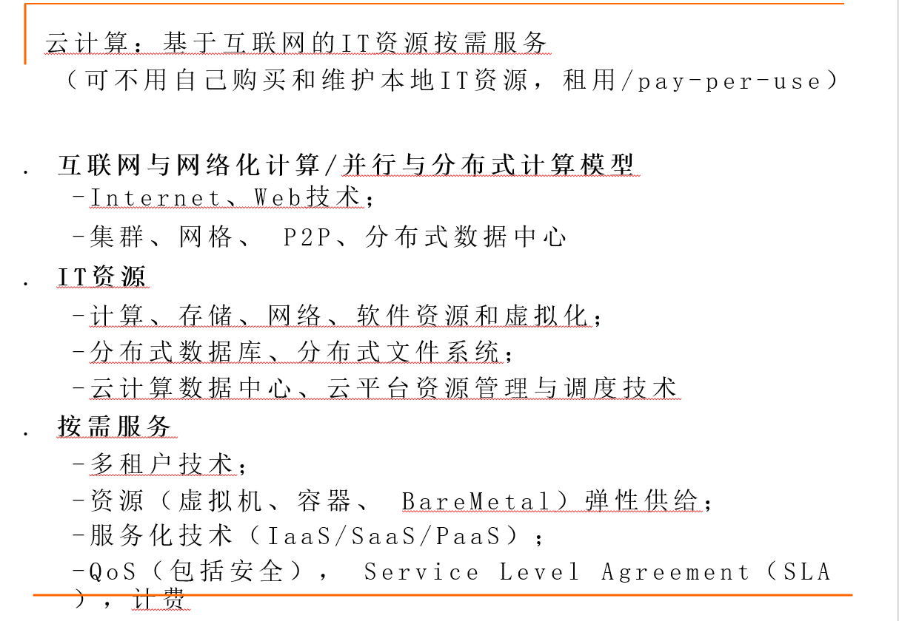

## 使能技术之一互联网基础

### 互联网快速发展

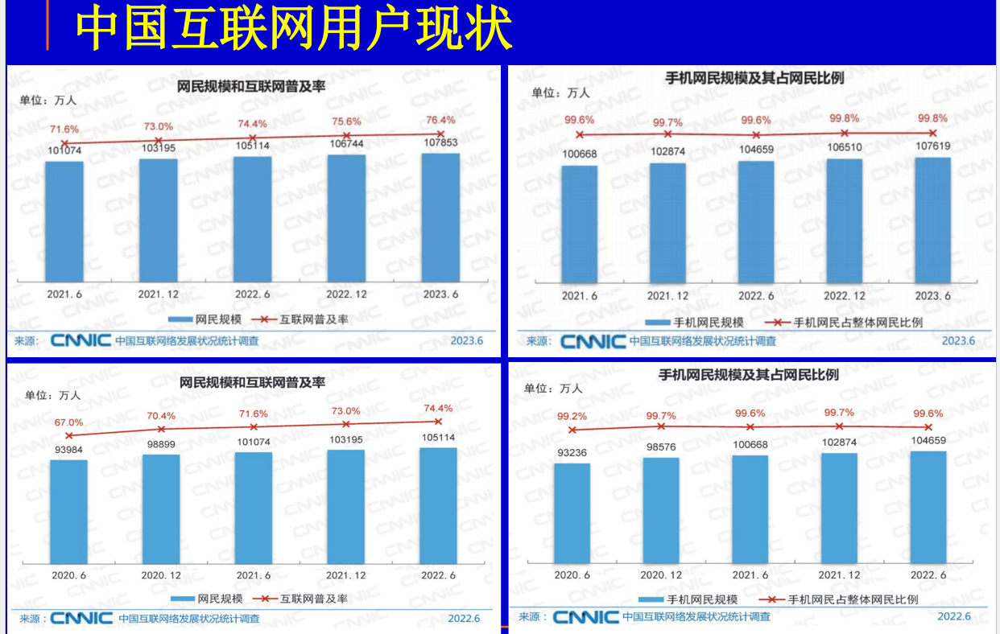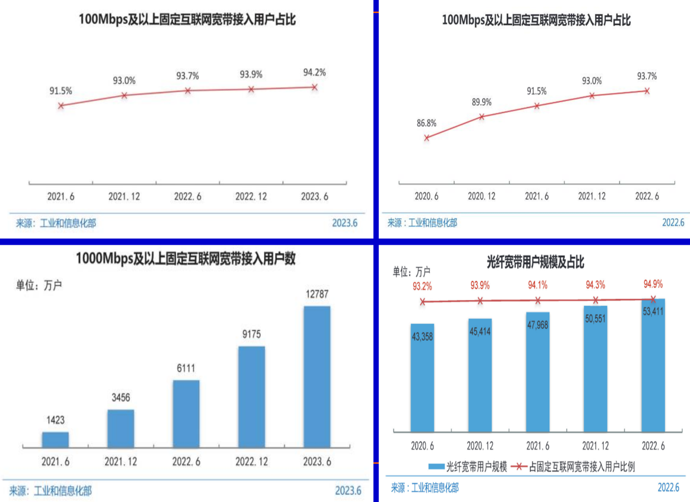

### Web技术

Web技术中具有很多容易呈现内容的组成部分。

Web技术有三层架构：

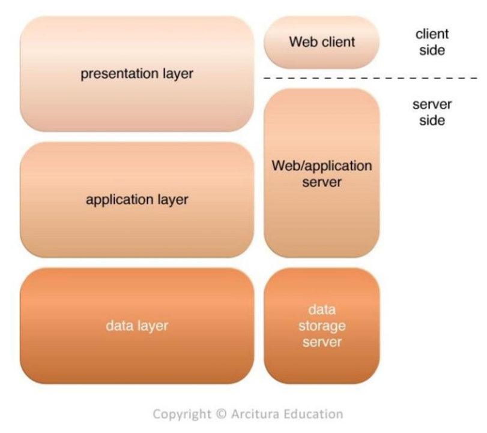

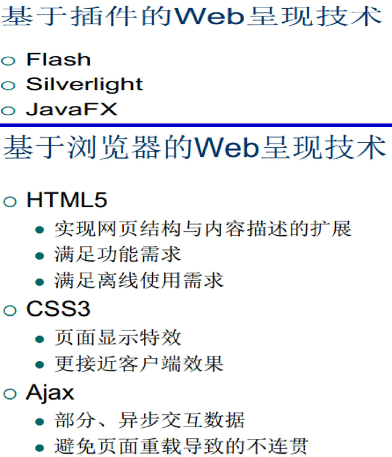

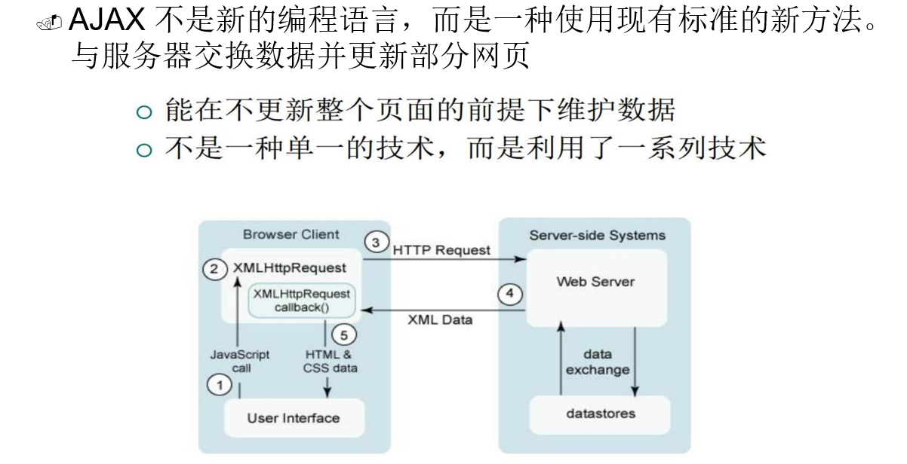

## 使能技术之二网络化计算**/**并行与分布式计算模型

在计算领域，互联网的兴起引领了计算平台的变革。从20世纪50年代开始，计算机的发展经历了多个阶段，包括大型机、小型机、个人计算机和便携式计算机。这些不同类型的计算机逐渐进入了人们的生活和工作中。一个并行的、分布式的计算系统使用大量的计算机 解决互联网上的大规模计算问题：

**高性能计算（HPC）：**

- 高性能计算系统强调计算机系统的原生速度和性能。这些系统通常用于处理需要大量计算资源的科学、工程和研究任务。HPC系统在处理复杂问题和模拟时具有出色的性能。

**高吞吐量计算（HTC）：**

- 高吞吐量计算主要应用于需要同时为数百万用户提供服务的互联网搜索和Web服务。它侧重于**处理大量的并发请求，确保用户能够快速获取所需的信息**。

**云计算（AI计算）：**

- 云计算是一种基于互联网的计算模型，允许用户通过网络访问和使用计算资源（例如服务器、存储、数据库等），而无需拥有或维护这些资源。云计算提供了高度的灵活性和可扩展性，已成为许多企业和个人在构建和运行应用程序时的首选选项。AI计算指的是在云计算环境中使用人工智能技术来进行数据分析、模型训练和预测等任务。

但是分布式计算也具有缺点：

- 对数据的敏感性，因为数据需要在多个计算节点之间传输和共享，可能会涉及到安全和隐私方面的问题。
- 另一个问题是网络中心化，即数据和计算都依赖于网络连接的可用性和性能，如果网络出现故障或瓶颈，可能会影响计算的效率和可靠性。

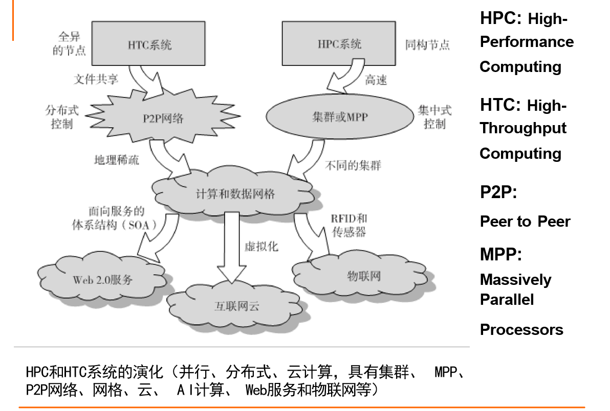

### 不同计算范式（集中式、并行、分布式、云计算....）

1. **集中式计算**：将所有计算资源集中在一个物理系统内，共享处理器、内存和存储，**紧耦合**于一个集成式的操作系统中。
2. **并行计算**：在并行计算中，处理器可以紧耦合共享内存，也可以松耦合于分布式内存。这意味着处理器之间可以共享数据或通过分布式内存进行通信。
3. **分布式计算**：分布式系统由多个自治的计算机组成，每个计算机拥有私有内存，并通过计算机网络通信。信息交换通常通过消息传递方式完成。
4. **云计算**：云计算可以采用分布式计算或并行计算，也可以兼具两者。云计算资源可以集中或分布在大规模数据中心中，可以是物理或虚拟的计算资源。
5. **普适计算**：普适计算指的是通过有线或无线网络，在任何地点和时间使用通用设备进行计算。它强调**计算的普遍性和无处不在性**。
6. **物联网**：物联网是将日常生活中的对象（包括计算机、传感器、人等）网络连接起来的概念。通过**互联网云**实现了**任何对象**在**任何地点和时间**的**普适计算**。

### 并行和分布式系统的分类

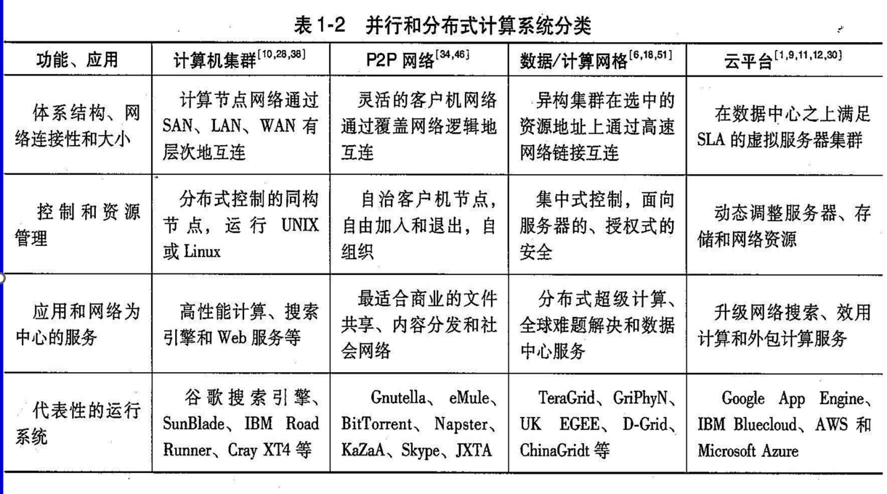

### 网格计算2个基础设施、代表系统（计算数据网络、P2P网络）

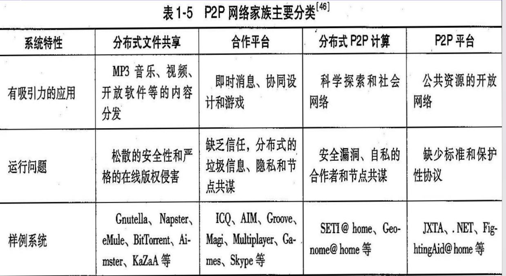

### 我国的网格、网络计算

#### 东数西算

2022年2月，国家发改委、中央网信办、工业和信息化部、 国家能源局四部委联合印发通知

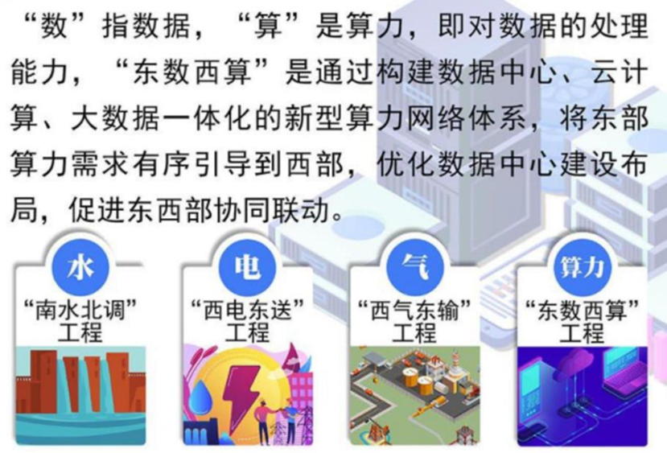

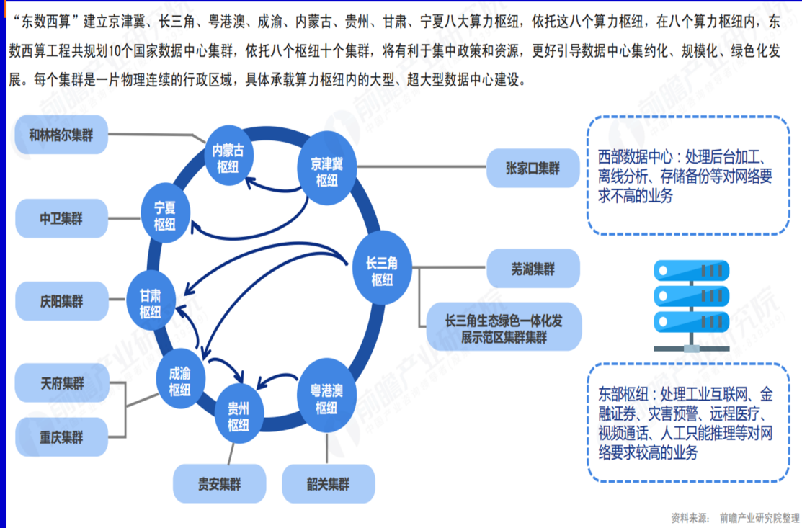

#### 超算互联网-2023

国家超算互联网将通过算力网络将全国众多超算中 心连接起来，用互联网思维运营超算，构建一体化 算力服务平台，实现算力资源统筹调度，降低超算 应用门槛，赋能千行百业

### 云计算基础设施

**数据中心基本资源**

1. 云化**/**虚拟化的服务器**/**计算集群
2. 硬件
    - 计算设备（标准化商用服务器）

    - 存储设备（磁盘阵列和存储虚拟化）

    - 网络设备（高速互联网络：以太网、光网等）

    - 配套设备（电源、散热 ……）
3. 软件

    - 操作系统

    - 系统软件

    - 数据库

    - 应用软件

## 使能技术之三IT资源

### CPU资源

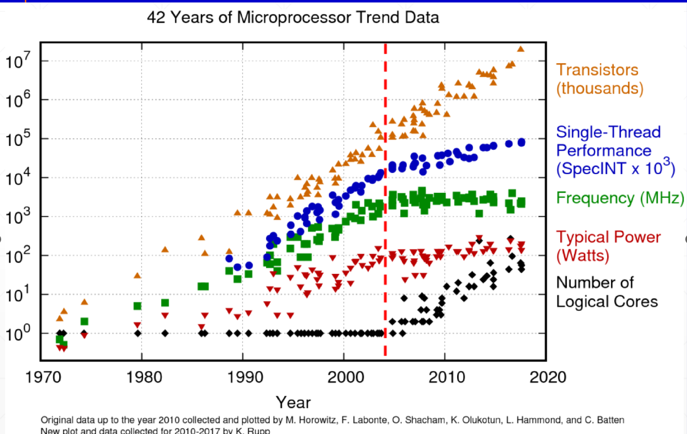

注：现在的CPU有三级Cache：

1. L1 cache是 每个核私有的
2. 片上L2 cache是共享的
3. L3 cache和DRAM是非片上的

数百或数千处理核心的海量并行处理中协同CPU的GPU使用

### 存储（内存、外存）

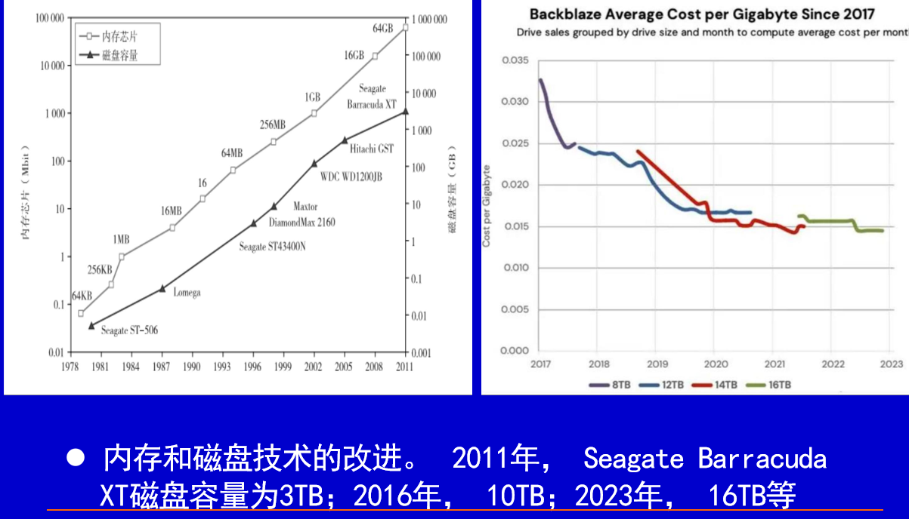

### 系统资源互联

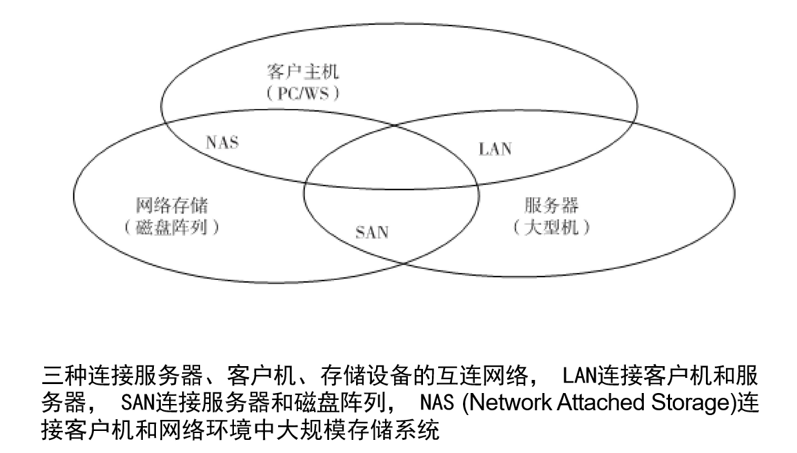

1. **LAN（Local Area Network）**：本地区域网络是一种用于连接位于相对较短距离内的计算机和设备的网络。LAN通常用于办公室、家庭或企业内部，连接客户机和服务器。
2. **SAN（Storage Area Network）**：存储区域网络是一种专门用于连接服务器和大规模存储设备（通常是磁盘阵列）的高性能网络。SAN提供了可靠的、高速的数据传输通道，用于存储和检索数据。它通常采用光纤通道（Fibre Channel）或以太网（iSCSI）协议来实现，允许服务器远程访问和管理存储资源。
3. **NAS（Network Attached Storage）**：网络附加存储是一种存储解决方案，它连接客户机和大规模存储系统，使客户机能够通过网络访问存储资源。NAS设备通常是独立的网络存储服务器，运行专门的操作系统，如NAS存储操作系统。

## 使能技术之四服务化软件和环境

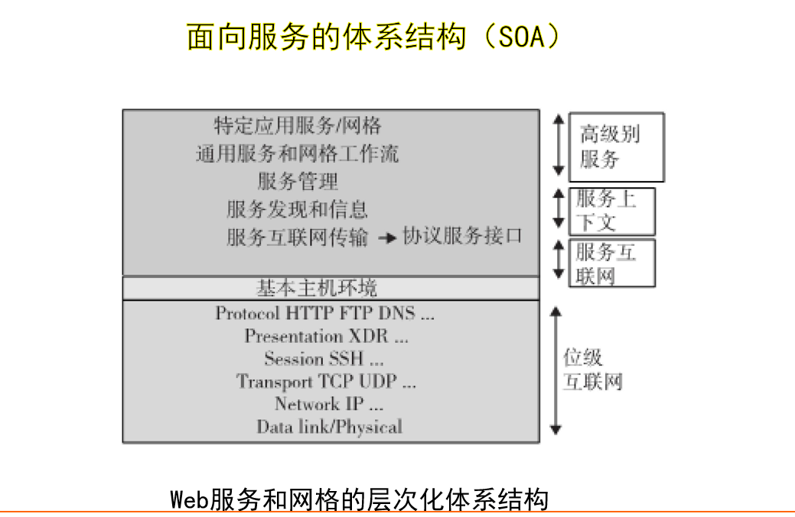

面向服务的计算（Service-Oriented Computing）是一种计算范式，它强调将计算任务分解成可重用的独立服务，并通过网络进行通信。以下是与面向服务的计算相关的基本技术和实现方式的解释：

**基本技术：**

1. **SOAP（Simple Object Access Protocol）**：SOAP是一种用于在网络上进行应用程序间通信的协议。它定义了一种XML编码方式，用于将结构化数据以消息的形式在不同的计算机之间传递。SOAP消息可以通过HTTP、SMTP等多种传输协议发送，使不同平台上的应用程序能够互相通信。
2. **WSDL（Web Service Description Language）**：WSDL是一种用于描述Web服务的XML语言。它定义了Web服务的接口、操作、消息格式以及如何访问服务的详细信息。WSDL文件充当了服务契约，使客户端能够了解如何与特定服务进行交互。
3. **UDDI（Uniform Description and Discovery Interface）**：UDDI是一种用于发布和发现Web服务的标准。它提供了一个中心化的注册表，允许提供者将其服务描述注册到该注册表中，并允许消费者通过查询来发现并访问这些服务。
4. **BPEL（Business Process Execution Language）**：BPEL是一种用于描述和执行业务流程的语言。它允许将多个Web服务组合成一个复杂的业务流程，并定义了流程中每个步骤的执行顺序和条件。BPEL有助于实现面向服务的企业级应用程序。

**实现方式：**

在Java环境中，面向服务的计算可以通过多种技术和工具来实现，其中包括：

- **Java AXIS2**：Apache Axis2是一个用于开发和部署Web服务的Java框架。它支持SOAP协议，允许开发者创建、部署和管理Web服务。Axis2提供了丰富的功能和工具，使Java开发者能够轻松构建面向服务的应用程序。
- **Tomcat**：Tomcat是一个流行的开源Servlet容器和Web服务器，可用于托管和运行Java Web服务。它与Java AXIS2等技术集成，为Web服务提供了一个可靠的运行环境。

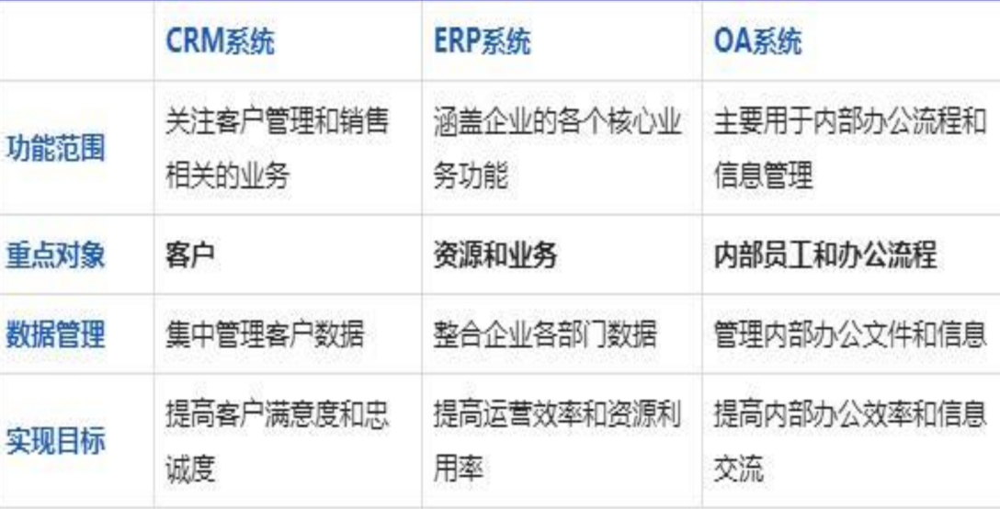

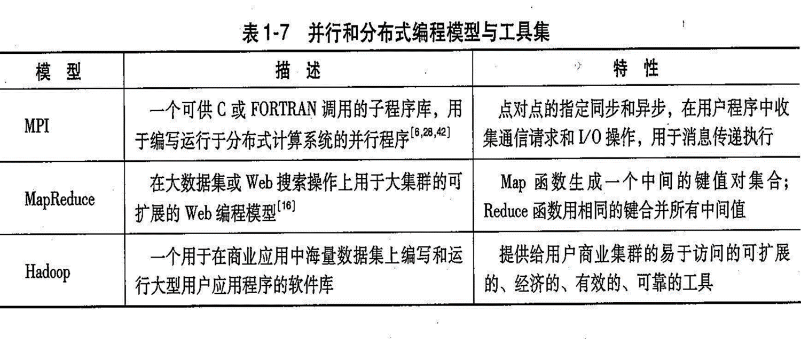