# 2.1-云计算使能技术

云计算：基于互联网的 IT 资源按需服务（可不用自己购买和维护本地 IT 资源，租用 /pay -per -use ）
 互联网与 网络化 计算 /并行与分布式计算模型
-InternetInternetInternetInternet InternetInternet 、Web 技术； 技术；
-集群、 网格P2P 、分布式数据中心 、分布式数据中心 、分布式数据中心 、分布式数据中心
 IT 资源
-计算、存储网络软件资源和 计算、存储网络软件资源和 计算、存储网络软件资源和 计算、存储网络软件资源和 计算、存储网络软件资源和 虚拟化 虚拟化 ；
-分布式数据库、文件系统； 分布式数据库、文件系统； 分布式数据库、文件系统； 分布式数据库、文件系统； 分布式数据库、文件系统；
-云计算数据中心、平台资源管理与调度技术 云计算数据中心、平台资源管理与调度技术 云计算数据中心、平台资源管理与调度技术 云计算数据中心、平台资源管理与调度技术 云计算数据中心、平台资源管理与调度技术 云计算数据中心、平台资源管理与调度技术
 按需 服务
-多租户技术；
-资源（虚拟机、 容器资源（虚拟机、 容器资源（虚拟机、 容器资源（虚拟机、 容器BareMetal BareMetal ）弹性供给；
-服务化 技术（ IaaS/SaaS/PaaSIaaS/SaaS/PaaSIaaS/SaaS/PaaS IaaS/SaaS/PaaS IaaS/SaaS/PaaS IaaS/SaaS/PaaS ）；
-QoS （包括安全）， （包括安全）， （包括安全）， Service Level Agreement Service Level Agreement Service Level Agreement Service Level Agreement Service Level Agreement Service Level Agreement Service Level Agreement Service Level Agreement （SLA ），计费 ），计费
8

## 云计算的使能技术

### 互联网基础

+ 网名规模和互联网普及率不断提高
+ 网速接入能力高
+ WEB的呈现方式十分多样（插件的Web呈现技术【Flash】，浏览器的Web呈现技术【HTML5，CSS3，Ajax】）
  AJAX（Asynchronous JavaScript and XML） 不是新的编程语言，而一种使用现有标准新方法 。

### 网络化计算 /并行与分布式计算模型

**概念**

一个并行的、分布式的计算系统使用大量的计算机解决互联网上的大规模计算问题

**互联网计算时代的不同计算方式：**

- 计算平台的变革:1950年代起大型机、小型机、个人计算机、便携式计算机
- 高性能计算（同构节点，高速传输）: HPC系统强调系统的原生速度和性能
- 高吞吐量计算（异构节点，通过文件共享传输）:HTC主要应用于被百万以上用户同时使用的互联网搜索和Web服务
- 云计算 (AI计算)
- 分布式计算：缺点是①数据敏感（数据敏感性变得更加重要，因为数据可能分布在不同的节点上，需要进行传输和处理）和②网终中心化（中心化可能会导致单点故障，如果中心节点发生故障或遭受攻击，整个分布式系统可能会受到影响）

**不同计算范式的区别**

- 集中式计算 ：这种计算范式是将所有资源集中在一 个物理系统之内。所有资源（处器、存储）是全部共享的，并且紧耦合在一个集成式操作系统中。
- 并行计算 ：在并行计算中 ，所有处理器或是紧耦合于心共享内存或是松耦合于分布式。
- 分布式计算： 一个分布式系统由众多自治的计算机组成， 各自拥有其**私有内存**，通过 计算机网络 通信。
- 云计算:①一个互联网云的资源可以是集中式的也可以是分布式的。②云采用分布式计算或并行计算，或两者兼有。③云可以在集中的或分布式的大规模数据中心之上，④由物理的或虚拟的计算资源构建。
- 普适计算是指在**任何地点和时间**通过有线或者无线**网络**使用**普遍的设备**进行计算。
- 物联网是一个日常生活对象 (包括计算机、传感器、人等网络化的连接。物联网通过互联网云实现任何对象在任何地点和时间的普适计算。
- 互联网计算这一术语几乎涵盖了所有和互联网相关的计算范式。

# 2.2-可扩展并行计算集群

## 计算机集群基本知识和分类

计算机集群（computer cluster）由相互联系的**多个计算机** 聚集组成，通过**高速网络互联**，这些计算机之间**相互联系并且  共同工作**，  并以**单一系统的模式加以管理**（集群管理软件）。

对于用户来说，计算机集群如同一个独立完整的计算资源池，  可实现作业级的大规模并行。

**优点**

1. **可扩展性（Scalability）**：
   - 计算机集群的可扩展性是指它可以根据需要轻松扩展计算和存储资源。当工作负载增加时，您可以简单地添加更多的计算节点来增加性能，而无需更改整个系统的基础架构。这使得集群非常适合处理大规模的计算任务，例如大数据分析和科学计算。

2. **高可用性（High Availability）**：
   - 高可用性是指系统可以持续提供服务而不中断或减少性能的能力。计算机集群通过在多个节点上复制数据和应用程序，以及使用负载均衡技术来确保即使某个节点发生故障，系统仍然可以继续工作。这提供了对故障的容忍性，从而提高了系统的可靠性。

3. **容错（Fault Tolerance）**：
   - 容错是指系统可以检测到并纠正或处理故障，以确保系统的连续运行。计算机集群通常具有内置的容错机制，例如数据冗余和自动故障切换。这意味着即使某个节点发生故障，系统仍然可以保持运行，从而减少了服务中断的风险。

4. **模块化增长（Modular Growth）**：
   - 计算机集群允许模块化增长，这意味着您可以根据需要逐步扩展系统。您可以开始只有少量的节点，并随着业务需求的增长逐渐添加更多的节点。这降低了初始成本，同时也更容易管理和维护。

5. **使用商用组件（Use of Commercial Off-The-Shelf Components）**：
   - 计算机集群通常使用商用组件，包括标准服务器硬件和操作系统。这降低了成本，因为您可以使用市场上可用的常规硬件和软件，而无需定制专用解决方案。此外，商用组件通常具有广泛的支持和可用性，使维护和更新更加容易。

**基础集群设计问题**

1. **可扩展性性能**：
   - 资源扩展（集群节点、内存容量、I/O带宽等）使性能成比例增长

2. **单系统镜像/环境**：
   - 考虑到集群作为一个单一独立的系统，这意味着集群中的各个节点应该具有相似的配置和环境，以确保一致性和可管理性。

3. **节点间通信**：
   - 包括网络拓扑、路由和流量控制。为了确保高性能和低延迟，需要考虑网络布局和拓扑结构，并确保适当的流量控制。集群内节点之间的物理网线长度一般比MPP（大规模并行处理）长

4. **集群资源管理与作业调度**：
   - 实现高系统利用率， 作 业管理调度软件需要提供批量、负载均衡和并行处 理等功能

5. **可用性支持**：
   - 集群能够利用处理器、内存、磁盘、 I/O设备、网络和操 作系统镜像的大量冗余提供低成本、高可用性的性能

6. **容错和恢复**：
   - 机器集群能够消除所有的单点失效。
     集群能在一定程度上容忍出错的情况。故障节点上运行的关键作业可以被转移到正常运行的节点上。回滚恢复机制通过周期性记录检查点 来恢复计算结果。


名词解释：

HA：高可用性

失效备援：通过在系统中引入冗余（冗余硬件、软件或网络组件），以便在主要组件失效时可以迅速切换到备用组件，从而保持系统的运行。

失效回退：是指在计算机系统或网络中，在修复故障后将系统或资源从备用状态切换回主要状态的操作。

回滚恢复：恢复到某一已知的一致性状态。

热交换：用于描述在运行状态下替换或添加硬件组件或模块的能力，而无需关闭整个系统或造成中断。

**单一系统映像（Single System Image）**：在计算机集群和分布式系统中，SSI 是一种概念，指的是将多个计算节点或服务器看作一个单一的虚拟系统，从而使用户无需关心底层的物理服务器或节点。SSI 的目标是提供透明的分布式计算体验。

DSM（分布式共享内存）是一种机制，允许多个计算机节点通过共享内存来进行数据交互，从而使它们可以协同工作。DSM 旨在提供高性能和方便的编程模型，使开发人员能够以类似于单一计算机的方式处理分布式环境中的数据。

**快速消息传递（Fast Message Passing）**：在 MPI 中，消息传递是一种用于在不同计算节点之间交换数据的通信模式。快速消息传递通常指的是一种优化技术，用于提高消息传递的性能和效率。这包括减少消息传输的延迟、提高带宽和降低通信开销。快速消息传递可以通过各种方式实现，例如利用硬件加速、网络拓扑优化、缓存和通信协议优化等。

**动态消息（Dynamic Messages）**：在 MPI 编程中，通常需要在编译时指定消息的大小。这在某些情况下可能会限制灵活性，因为消息大小在运行时可能会变化。动态消息是指在运行时动态分配消息大小的能力。这可以通过 MPI 库的一些功能实现，允许根据需要分配和释放消息内存，从而提供更灵活的消息处理。

**增强的 MPI 库（Enhanced MPI Library）**：增强的 MPI 库是指对标准 MPI 库进行扩展或优化的库或实现。这些扩展可以包括额外的功能、性能优化、更好的可伸缩性或与特定硬件体系结构的集成。增强的 MPI 库旨在提供更高级别的功能或更好的性能，以满足特定应用程序或环境的需求。

-------

**云计算数据中心大规模服务器集群**

1. 高可用和负载均衡集群（Web服务器/电子商务）	 
2. 高性能计算集群（slurm ，torque等）	 
3. 大数据集群（hadoop ，spark等）	
4.  数据库集群（Oracle, SqlServer）

**计算机集群分类**【在本小节需要介绍的】

1. 高可用性集群用于**容错和实现服务的高可用性**。高可用性集群中有很多冗 余节点以容忍故障或失效。（银行关键业务等）	 
2. 负载均衡集群通过使集群中所有节点的负载均衡而达到**更高的资源利用**。可以在不同机器间**平衡负载**，从而达到更高的资源利用或性能。  (Web服务器， Email服务器等）	 
3. 高性能计算集群(HPC)主要用于**单一大规模作业**的集体计算。当单一计算作业需要 集群中节点间的频繁通信，该集群必须共享一个专用网络，因  而这些节点大多是**同构和紧耦合**的。这种类型的集群也被称为  贝奥武夫（beowulf）集群。（科学与工程计算应用等）

## 高可用性集群（High Availability cluster）


功能：保障用户的应用程序持续、不间断 地提供服务

方法：当应用程序出现故障，或者系统硬件、网络出现故障时， 应用可以自动、快速地从一个节点切换到另一个节点，从 而保证应用持续、不间断地对外提供服务

#### 双机热备和双机互备

这类集群一般都由两个或两个以上节点组成。

多机互备是双机热备的技术升级，通过多台及其组 成一个集群，可以在多台机器之间设置灵活地接管 策略。


1. **双机热备（Active-Active）**：
   - 双机热备是一种高可用性配置，其中两台计算机（通常是服务器）都处于活动状态，并可以同时处理请求。
   - 这种配置通常涉及到负载均衡器，它会将请求分发到这两台计算机上，以实现负载分担。
   - 如果其中一台计算机发生故障，负载均衡器可以将流量路由到另一台仍然正常运行的计算机上，从而保持服务的可用性。
   - 双机热备通常用于需要高可用性和负载均衡的应用程序和服务，例如Web服务器、数据库集群等。
2. **双机互备（Active-Standby）**：
   - 双机互备是一种高可用性配置，其中一台计算机处于活动状态，而另一台处于待命状态。
   - 活动状态的计算机处理所有请求，而待命状态的计算机仅在活动状态的计算机发生故障时接管工作。
   - 当活动状态的计算机出现故障或需要维护时，系统会自动将工作切换到待命状态的计算机上，从而实现故障恢复和高可用性。
   - 双机互备通常用于关键应用程序和服务，以确保在主要计算机出现问题时能够快速切换到备用计算机上。

#### 高可用集群软件

在Linux下常用的高可用软件有Heartbeat ，Red Hat提  供的RHCS （Redhat Cluster Suite）,商业软件ROSE ，keepalived等

- Heartbeat：心跳检测、资源接管、监测系统服务，在集群的 节点间转移共享IP地址的所有者等HA软件所需基本功能；
  but：配置麻烦，双机之间的心跳线是一个瓶颈问题；
- keepalived：运行在LVS之上，主要实现故障隔离及负载均衡器之间的失败切换（Fail Over）
  名词解释：LVS（Linux Virtual Server）用于构建高性能和高可用性负载均衡集群的开源软件项目，它运行在 Linux 操作系统上，旨在将传入的网络流量分发到多个后端服务器，以确保负载均衡和高可用性。

## 负载均衡集群/高吞吐率集群（HTC）

负载均衡集群也是由两台或者两台以上的服务器组成。分为

1. 前端负载调度（把客户端的请求按照不同的策略分配给后端服务节点）
2. 后端服务（真正提供应用程序服务的部分。）

**与HA Cluster不同的是，负载均衡集群中， 所有的  后端节点都处于活动动态，它们都对外提供服务，  分摊系统的工作负载。**


| 主要的作用                                                   | 不足                                                         |
| ------------------------------------------------------------ | ------------------------------------------------------------ |
| 可以把一个高负荷的应用分散到多个 节点共同完成，适用于业务繁忙、大负荷访问的应 用系统。 | 当一个节点出现故障时，前端调度系统并不知道 此节点已经不能提供服务，仍然会把客户端的请求调度到故障 节点上来，这样访问会失败。<br />解决方法：引入了节点监控系统 |

###  节点监控系统

位于前端负载调度机上，负责监控下 面的服务节点。

1. 当某个节点出现故障后，节点监控系统会自动将故障节点  从集群中剔除；
2. 当此节点恢复正常后，节点监控系统又会自动 将其加入集群中，

而这一切，对用户来说是完全透明的。

### Web服务器介绍

LAMP(Linux, Apache, Mysql, Php)

Ng inx：Nginx 是一个高性能的开源 Web 服务器和反向代理服务器。


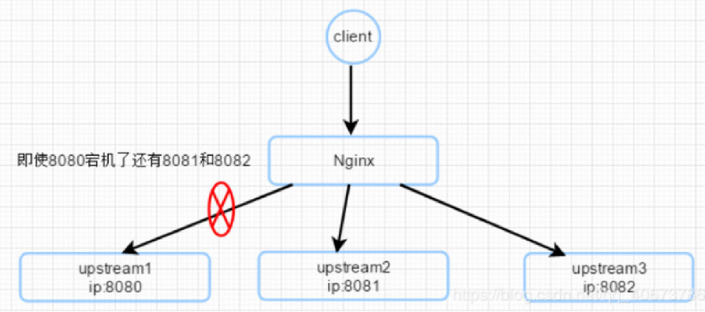

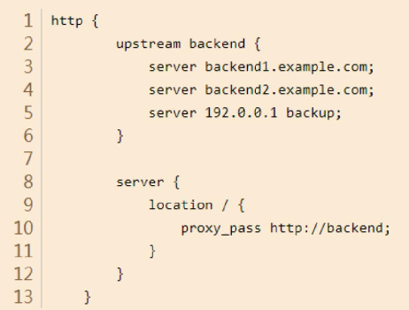

以下是一些经典的负载均衡路由算法：

1. **轮询（Round Robin）**：
   
   - 轮询算法是最简单的负载均衡算法之一。
   - 它按照服务器列表的顺序依次将每个请求分发到下一个服务器。
   - 当遍历完服务器列表后，算法重新开始分发请求。
   
2. **最少连接（Least Connections）**：
   - 最少连接算法会选择当前连接数最少的服务器来处理请求。
   - 这样可以确保请求被分发到负载较低的服务器，从而减少服务器的负载不均衡。

3. **IP Hash**：
   - IP Hash 算法将客户端的 IP 地址用于计算哈希值，然后使用该哈希值来选择服务器。
   - 这确保了特定客户端的请求始终被分发到相同的服务器，**适用于需要会话保持的应用程序**。

     > 可以保证用户的每一次会话 都只会发送到同一台特定的Tomcat(用于托管和运行Java Web应用程序)里面，它的session（用于跟踪用户状态的机制）不会跨 到其他的tomcat里面去的
   
4. **一致性 Hash（Consistent Hashing）**：
   - 一致性 Hash 算法将服务器和请求哈希到一个环状的空间中，然后根据请求的哈希值选择最接近的服务器。
   
   - 这种算法具有可伸缩性，因为添加或删除服务器时，只会影响到一小部分请求的路由。
   
     > 1. **哈希环（Hash Ring）**：一致性哈希算法使用一个虚拟的哈希环，通常是一个环形的数据结构，其中哈希值分布在环的不同位置。每个服务器被映射到环上的一个位置，通常使用服务器的哈希值或名称计算出这个位置。
     > 2. **请求路由**：当客户端发送请求时，一致性哈希算法会根据请求的哈希值在环上查找一个最接近的位置。通常，请求的哈希值是根据请求的关键信息（例如 URL、资源名称或会话标识符）计算得出的。
     > 3. **服务器选择**：一旦找到了最接近请求哈希值的位置，算法会选择这个位置所对应的服务器来处理请求。这意味着请求将路由到与请求哈希值最接近的服务器上。
     > 4. **可伸缩性**：一致性哈希算法具有很好的可伸缩性。当需要添加或删除服务器时，只有少量的请求会受到影响。这是因为只有那些映射到环上与新增或删除服务器相关的位置的请求才需要重新路由，而大多数请求仍然会映射到相同的位置上。
     > 5. **解决服务器失效问题**：当服务器失效或不可用时，一致性哈希算法可以通过在环上删除相应位置的方式来处理这种情况。这会导致一些请求需要重新路由到其他服务器上，但仍然保持了相对的平衡。
   
5. **随机（Random）**：
   - 随机算法通过随机选择一个服务器来处理请求。
   - 这种方法可以平衡负载，但不能保证每个服务器都获得相等的请求量，因为随机性导致分布不均匀。

1. 轮询和最少连接适用于基本的负载均衡需求
2. 而 IP Hash 和一致性 Hash 更适合需要会话保持或动态服务器添加/删除的情况
3. 随机算法可用于简单的负载均衡，但通常不适用于要求均匀分布的情况。

注：还可以自己指定负载均衡算法。

这是一个 Nginx 配置文件中用于负载均衡的块，以下是对配置的解释：

```nginx
upstream tomcats {
    ip_hash; # 使用ip_hash负载均衡策略
    server 172.17.99.109:8080 weight=1 max_fails=3 fail_timeout=15s; # 第一个服务器
    server 172.17.191.95:8080 weight=2 max_fails=3 fail_timeout=15s;   # 第二个服务器
    server 172.17.155.97:8080 weight=3 max_fails=3 fail_timeout=15s;    # 第三个服务器
    keepalive 32; # 保持长连接数
}
```

这个配置定义了一个名为 "tomcats" 的上游服务器组，用于负载均衡请求。以下是配置中的关键部分的解释：

- `ip_hash`：这是一种负载均衡策略，它会根据客户端的IP地址将请求路由到相同的后端服务器。这有助于确保来自同一IP地址的客户端会话被发送到相同的服务器，适用于需要会话保持的应用。

- `server`：每个 `server` 指令定义了一个后端服务器的地址和端口。
  - `weight`：指定了服务器的权重，用于控制服务器接收请求的比例。在这里，第一个服务器的权重为1，第二个服务器的权重为2，第三个服务器的权重为3，因此权重越高的服务器接收到的请求越多。
  - `max_fails`：指定了服务器被标记为暂时不可用的最大失败次数。在这里，每个服务器允许最多3次失败。
  - `fail_timeout`：指定了服务器被标记为暂时不可用的超时时间，这里设置为15秒。

- `keepalive`：指定了保持长连接的最大数量，以减少建立连接的开销。在这里，最大保持32个长连接。

### Linux Virtual Server（LVS）

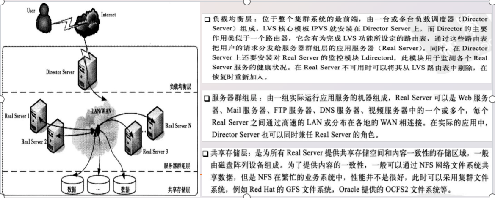

名词解释：

**NFS (Network File System)**:

- NFS 是一个网络文件系统协议，允许不同计算机之间共享文件和目录。
- 它是一种分布式文件系统协议，最初由Sun Microsystems开发。
- NFS允许客户端计算机通过网络透明地访问远程服务器上的文件和数据，就好像它们是本地文件一样。
- NFS通常用于Unix和Linux系统之间的文件共享，以及与网络存储设备的集成。

**OCFS2 (Oracle Cluster File System 2)**:

- OCFS2 是由Oracle开发的一种集群文件系统，旨在提供共享存储访问的高可用性和容错性。
- 它是为了支持Oracle数据库和其他应用程序的集群部署而设计的。
- OCFS2允许多台计算机共享相同的文件系统，以便它们可以同时访问数据，这对于实现高可用性和负载均衡非常有用。
- 除了Oracle数据库，OCFS2还可用于其他集群应用程序和存储需求。

### 弹性负载均衡（Elastic Load Balance ，ELB）

 弹性负载均衡是指通过动态调整**负载均衡器的配置**来适应**应用程序**的负载变化，从而实现高可用性和可伸 缩性。

工作方式：

增强型负载均衡算法，支持以下三种调度算法

- 加权轮询算法： 根据后端服务器的权重，按顺序依次将请求分发给不同 的服务器。它用相应的权重表示服务器的处理性能， 按照 **权重的高低以及轮询方式** 将请求分配给各服务器， 相同权重的服务器处理相同数目的连接数。 **常用于短连接服务**，例如HTTP等服务。
- 加权最少连接： 最少连接是通过当前活跃的连接数来估计服务器负载情 况的一种动态调度算法。加权最少连接就是在**最少连接数的基础上**，**根据服务器的不同处理能力**，给每个服务器分配不同的权重，使其能够接受相应权值数的服务请求。**常用于长连接服务**， 例如数据库连接等服务。
- 源IP算法：将请求的源IP地址进行Hash运算， 得到一个具体的数值，同 时对后端服务器进行编号，按照运算结果将请求分发到对应编号的服务器上 。这可以使得对不同源IP的访问进行负载分发，同时使得同一个客户端IP的 请求始终被派发至某特定的服务器。该方式适合**负载均衡无cookie功能的TCP协议**。

### 弹性伸缩（Auto Scaling，AS）

弹性伸缩（Auto Scaling）是**根据用户的业务需求**，通过策略自动**调整**其业务**资源**的服务。

- 优点：用户可以根据业务需求自行定义伸缩策略，从而降低人为反复调整资源，以应对业务变化和负载高峰的工作量，节约资源和人力运维成本。
- 支持类型：弹性伸缩支持自动调整弹性云服务器和带宽资源。

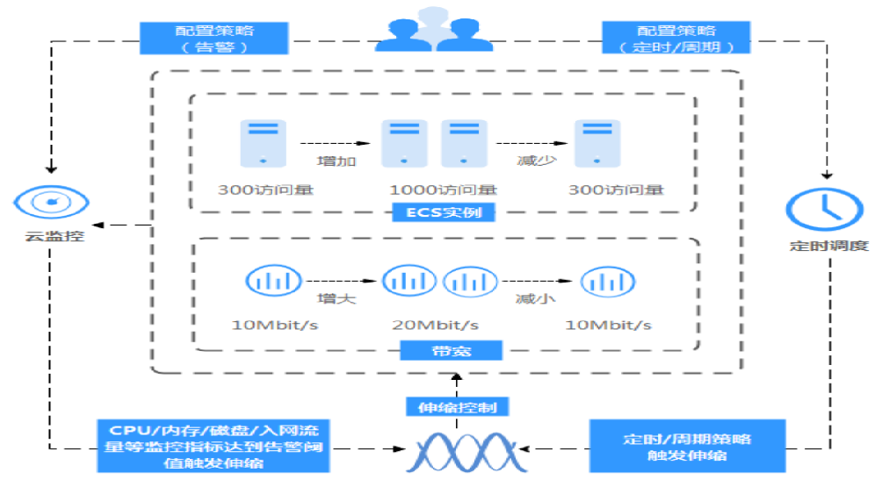

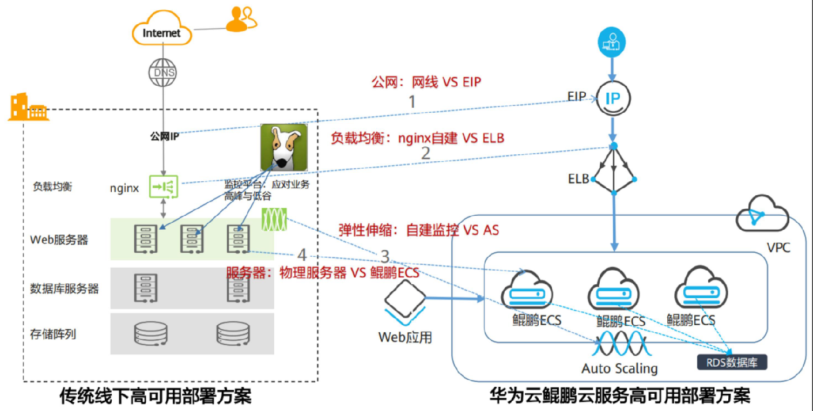

## 高性能计算集群（HPC）

| 前缀 | 缩写 | 基幂 | 含意        | 数值        |
| ---- | ---- | ---- | ----------- | ----------- |
| Kilo | K    | 103  | Thousand    | 千          |
| Mega | M    | 106  | Million     | 兆，百万    |
| Giga | G    | 109  | Billion     | 千兆， 10亿 |
| Tera | T    | 1012 | Trillion    | 垓，万亿    |
| Peta | P    | 1015 | Quadrillion | 千万亿      |
| Exa  | E    | 1018 | Quitillion  | 百亿亿      |

 Flops ：每秒所执行的浮点运算次数 (floating-point operations per second ) 

- 目前的PC机运算速度通常在GFlops量级。
- 高性能计算机运算速度则在TFlops  至PFlops量级。

HPC（高性能计算）集群的应用特征分类：

| 应用特征      | 描述                                                         |
| ------------- | ------------------------------------------------------------ |
| 计算密集型    | 这种类型的HPC集群用于处理需要大量计算资源的任务，例如**科学模拟、数值模拟和复杂的数学计算**。 |
| 内存密集型    | 内存密集型HPC集群侧重于处理需要大量内存的任务，例如**大规模数据分析**和**内存数据库**。 |
| 数据/IO密集型 | 数据/IO密集型HPC集群用于处理需要大量数据输入/输出（IO）操作的任务，例如**大规模数据处理和存储**。 |
| 通信密集型    | 通信密集型HPC集群专注于处理需要高带宽和低延迟通信的任务，例如**分布式计算和模拟**。 |

HPC集群的应用领域：有限元分析►分子模拟► 图像处理► 流体仿真► 油藏模拟► 地震分析	► 数值天气预报等

### Architectural share of the Top-500 systems：

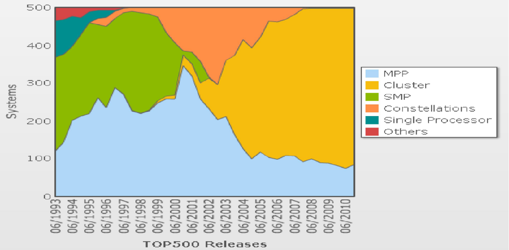

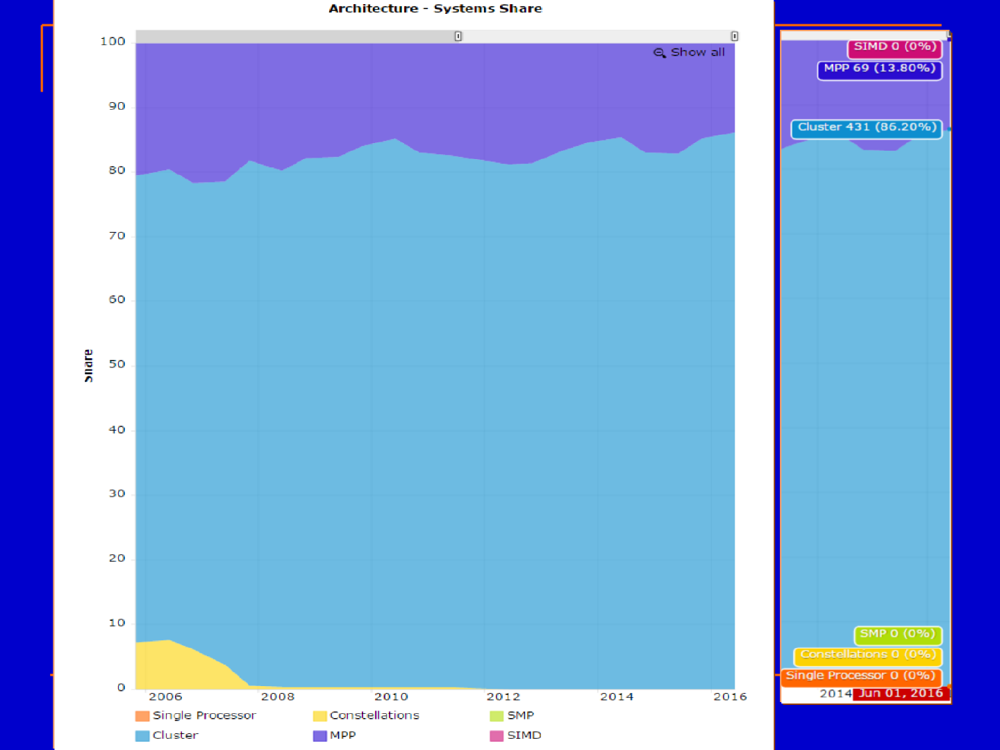

从上面的两个图可以看到，目前主要是集群多

参考，应该不考：

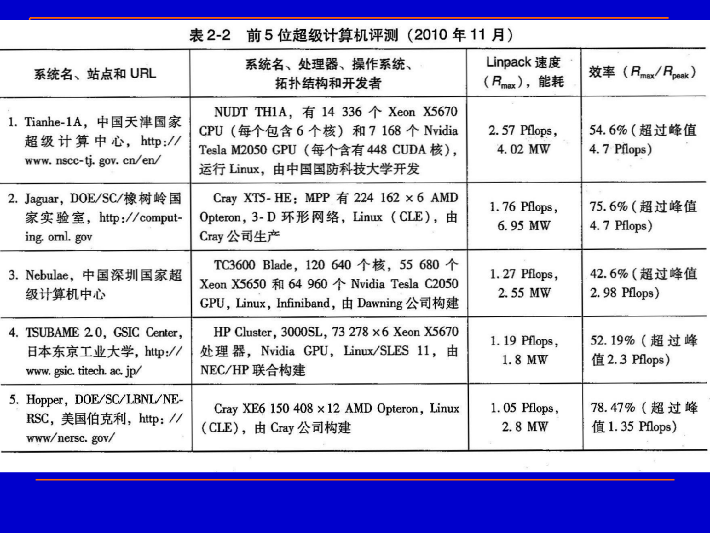

### 构建集群&HPC集群结构

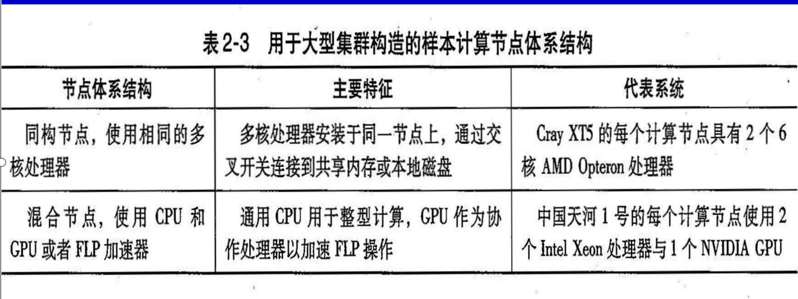

FLP没有明确的定义，可以认为是浮点加速器。

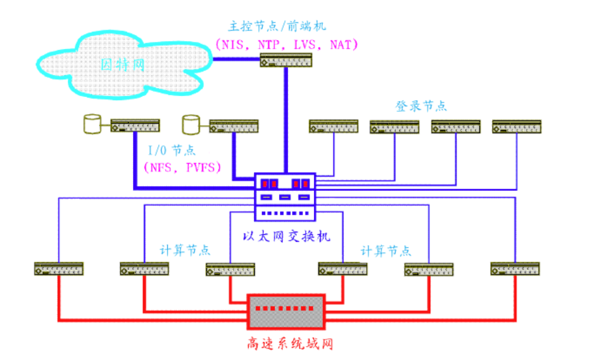

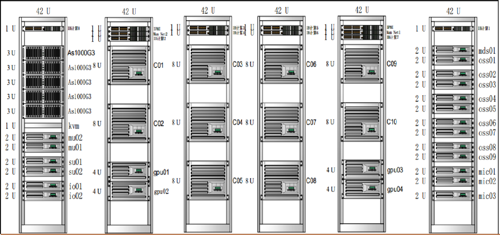

集群系统由 2 个管理节点、  2 个登陆节点，  2 个 io 节点、 153 个刀片计算节点组成，节点间通过 InfiniBand 网络互  连。 集群刀片系统理论峰值浮点计算性能达到 51TFlops， 光纤存储总容量 35TB ， lustre 存储总容量 110TB

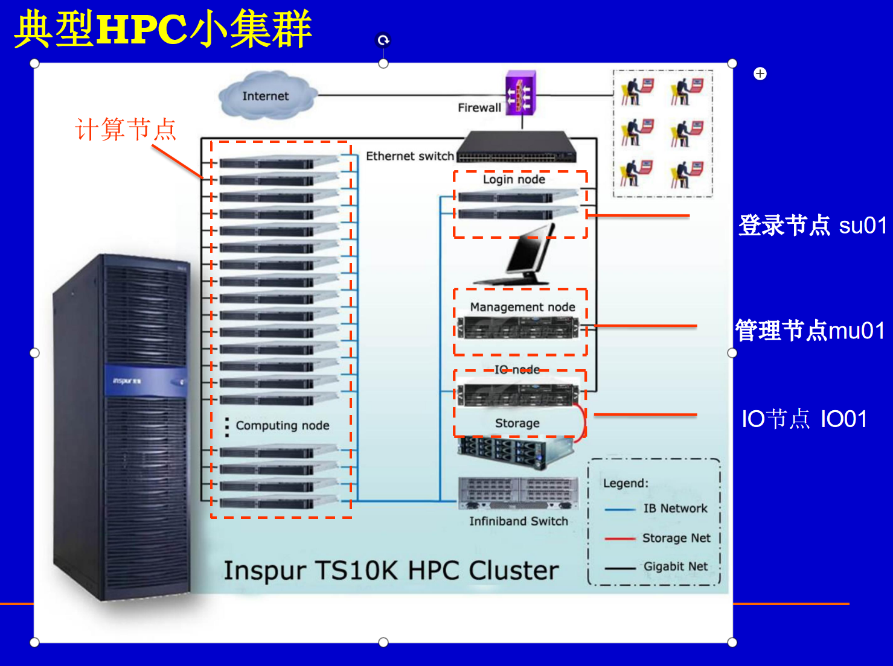

> 	Linux HPC 集群系统
>
> (6) 应用： CAD、CAE、CAM、（HPC）；BD/AI 等
> (5) 并行编程环境和工具：
> -并行编程环境：MPI/OpenMP，数学库/函数库等
> -开发环境： 编译器、调试器等。
> -性能分析和调整工具： 性能分析和调整工具： Vtune、Tau、Scalasca、PAPI
>
> (4) 集群中间件：
> SSI（文件系统，如 NFS、Lustre、GPFS）、SSH/rsh、NIS； -Resource Management and scheduling（资源管理和调度）：Resource Management、Resource Management、Resource Management、Resource Management。
> -资源管理和调度软件（RMS）
> (资源管理和调度（RMS）软件（如 LSF、PBS、Slurm、Condor
> (3) 操作系统：Linux，设备驱动，监控软件（例如 ganglia）等
>
> (2) 高性能网络/交换机和通信协议： 以太网、Infiniband 等
> (1) 硬件（节点）： CPU、内存、磁盘、GPU，存储等

## 基于Linux搭建和配置集群系统	 

**基本流程:**

1. 对头结点/管理结点:	(管理结点/登录结点/IO存储结点)
    - 操作系统安装	 （包括设备驱动、 CUDA、编译器等）
    - 集群服务配置
2. 对每个计算结点	 
    - 操作系统安装	 (包括设备驱动、 CUDA 、编译器等）
    - 集群服务配置	
3. 集群系统联调

### Linux HPC集群并行环境主要部署

**单一系统环境配置：**

1. **/etc/hosts**：
   - 在此配置文件中，定义了节点/主机的名称和IP地址的映射关系。这是为了确保集群中的各个节点可以相互识别和通信。

2. **rsh配置**：
   - Remote Shell (rsh) 允许在远程机器上执行命令。但出于安全考虑，通常不建议使用rsh，而是应该优先使用SSH (Secure Shell)。

3. **ssh配置**：
   - 配置SSH以确保集群节点之间的安全通信。SSH提供了加密和认证机制，用于保护远程访问和数据传输。

4. **NFS/并行文件系统配置**：
   - 配置共享文件系统，例如NFS（Network File System）或其他并行文件系统，以允许节点之间**共享文件和用户目录**。

5. **NIS配置**：
   - 配置NIS（Network Information Service），这是一种用于集中管理用户帐号、集群节点信息等的服务。它可以帮助集群中的节点**共享用户帐号和其他信息**。

6. **集群资源管理与调度软件/监控软件**：
   - 安装和配置集群资源管理和调度软件，例如LSF、PBS、Slurm或Condor，以便有效地分配和管理计算资源。
   - 部署监控软件，如ganglia，用于监视集群性能和资源利用情况。

**并行编程环境配置：**

1. **MPI**：
   - 安装和配置MPI（Message Passing Interface）以支持并行编程。MPI是一种常用的并行编程模型，用于在集群节点之间进行通信和协作。

2. **数学库**：
   - 安装数学库和函数库，以支持科学计算和数值模拟。这些库包括线性代数库（如BLAS和LAPACK）、数值库（如NumPy和SciPy）等。

3. **性能分析优化工具**：
   - 部署性能分析和优化工具，例如Vtune、Tau、Scalasca和PAPI，以帮助识别和解决性能问题，并优化并行应用程序的性能。

## 集群资源管理和作业调度

- 调度时机：集群作业可能在一个指定的时间（日历调度）， 或者在特定事件发生（事件调度）时被调度运行。
- 调度依据：根据提交时间、资源节点、执行时间、内存、磁 盘、作业类型及用户认证的优先级， 作业被调度。
- 静态优先级和动态优先级
  - 静态优先级指的是根据预定的方案， 作业被分配 的优先级。
  - 而作业的动态优先级 可能会随时间发生变化。

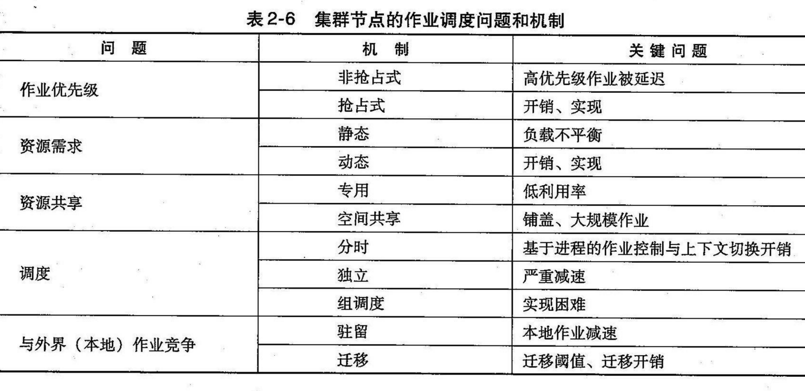

**调度策略：**

1. **分时调度（Time Sharing）**：
   - 分时调度是最常见的节点调度策略之一。它通过按时间片（通常以秒或分钟为单位）将计算资源分配给不同的用户或任务。每个用户或任务在其分配的时间片内可以独立使用计算节点。这种策略适用于多用户环境，允许多个用户共享集群资源。

2. **独立调度（Exclusive Scheduling）**：
   - 独立调度策略允许单个用户或任务独占集群中的一个或多个节点。在这种策略下，用户或任务可以获得完整的计算资源，而不必与其他用户共享。这对于需要**大量计算资源**的任务或需要**避免干扰**的任务非常有用。

3. **组调度（Group Scheduling）**：
   - 组调度策略将用户或任务分组，并为每个组分配计算资源。每个组内的用户或任务可以共享组内的资源，但不同组之间的资源是独立的。这种策略适用于组织内部的多个团队或项目，每个团队需要独立管理其资源。

**外界作业竞争相关的两种常见策略：**

1. **驻留（Backfilling）**：
   - 驻留是一种资源管理策略，允许在当前时间没有足够资源运行的较小作业（通常是短期任务）等待更长时间的作业完成后立即启动。这可以提高资源的利用率，并缩短短期任务的等待时间。
   - 通过驻留策略，集群管理器可以更有效地安排和分配资源，确保尽可能多的任务得以执行。这对于具有高度动态负载的集群非常有用。
2. **迁移（Job Migration）**：
   - 迁移策略涉及将正在运行的作业从一个节点迁移到另一个节点，以便为更高优先级或更重要的作业腾出资源。这种策略通常在作业的资源需求发生变化或紧急情况下使用。
   - 通过迁移，集群管理器可以灵活地重新分配资源，以确保高优先级的作业能够及时完成，同时最大程度地减少资源浪费。

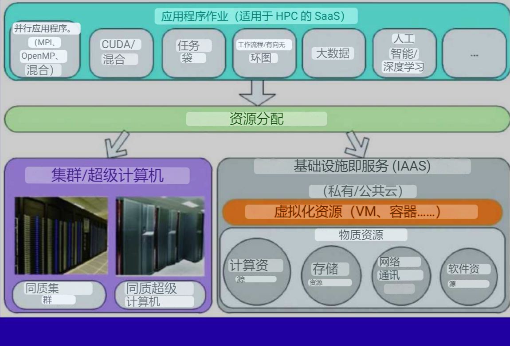

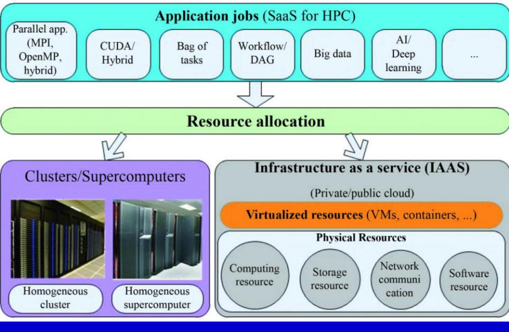

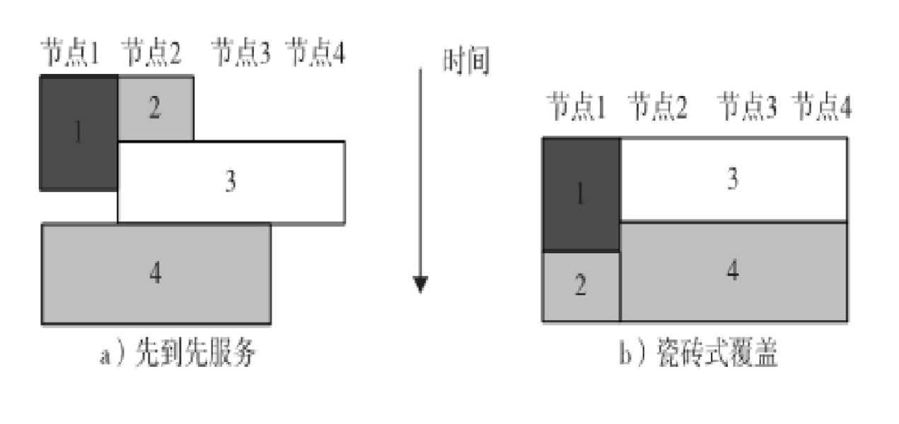

用于集群节点上作业调度的瓷砖式覆盖技术减少了 整体时间，因此增加了作业吞吐量

## 集群作业管理系统(Job Management System，JMS)

### 相关概念

名词是等价的：作业管理=负载管理=负载共享

JMS的三个组成部分

1. 用户服务器：提交用户作业至一个或多个队列，为每个作业指定资源需求，将作业从队列中删除，以及询问作业或队列的状态。	 
2. 作业调度器：根据作业类型、资源需求、资源可用性和调度策略，执行任务调度和排队。	 
3. 资源管理器：分配和监控资源，执行调度策略，以及收 集统计信息。

**集群作业管理系统的定义：**建立在操作系统与用户程序之间的一种系统中间件。

**主要的目的：**方便用户管理作业（Job），合理选择作业调度策略，统 一管理集群系统的各种软硬件资源，提高系统的整体资 源利用率和吞吐率。

**功能：**

1. 单一系统映象	 集群松散的结构的整合	 
2. 系统资源整合	 异构系统的整合	 
3. 多用户的管理	 用户提交的任务的统一安排，避免冲突	 
4. 用户权限的管理	 非授权用户的控制

### 典型系统介绍

1. LSF（Load Sharing Facility）
   负载共享软件LSF 是由加拿大平台计算公司研制与开发的，是一个成熟的机 群作业管理系统。在使用范围上， LSF不仅用于科学计算，也用于企业 的事务处理。功能上，除了一般的作业管理特性外， 它包括负载平衡、系统容错、检查点操作、进程迁移等功能。

   - LSF是平台计算中的**商用负载管理系统**。	 
   - 在并行作业和串行作业中， LSF强调作业管理和负载共享。	 
   - 它还支持检查点、可用性、负载迁移和单系统镜像。 	 
   - LSF具有高扩展性，并且能够支持上千个节点的集群。	
   - LSF服务于各种UNIX和Windows/NT平台。目前， LSF  不仅在集群中使用，也在网格和云中使用。

2. PBS（Portable Batch System）
   PBS 最初由NASA的Ames研究中心开发，为了提供一个能满足异构计算网络需要的软件包，特别是满足高性能计算的需要。 PBS的独立的调度模 块允许系统管理员定义资源和每个作业可使用的数量。调度模块存有各个 可用的排队作业、运行作 业和系统资源使用状况信息。调度策略可以很容 易被修改，以适应不同的计算需要和目标，即系统管理员可 以方便地实现 自己的调度策略。

3. Slurm (Simple Linux Utility for Resource Management)
   一种开源的，可用于大型计算节点集群的高度可伸缩和容错的集群管理器和作业调度系统，被世界范围内的超级计算机和计算集群广泛采用

   > Altair 是 HPC 和计算机辅助工程 (CAE) 云解决方案提供商
   >
   > 中的领军者和先驱者。 Altair 的云端 HPC 解决方案包括：
   >
   > [PBS Works](https://pbsworks.com.cn/PBSProduct.aspx?n=PBS-Works-Suite&c=Overview-and-Capabilities) 它是市场领先的负载管理套件，能够确保在云环 境中采用智能、策略驱动和拓扑感知的方式对作业进行调度 和管理。同时，它还能够通过简化的、基于 web 的方式对
   >
   > 作业进行提交、管理、监控和分析，并可以将结果可视化。  PBS Works 受到 Altair 私有云应用 HyperWorks Unlimited  的支持。

4. CONDOR
   CONDOR 是由威斯康星大学开发的集群作业管理系统。充分利用工作站的空闲时间是CONDOR的最显著特征。CONDOR管理的集群由网络  中的工作站组成。工作站可以自愿加入或退出。CONDOR监测网络中所 有工作站的状态， 一旦某台计算机被认为空闲，便把它纳入到资源池(  POOL）中。在资源池中的工作站被用 来执行作业。

   > . 一种可用于大型计算节点集群的高度可伸缩和容错的集群管理器 和作业调度系统，被世界范围内的超级计算机和计算集群采用
   >
   > . SLURM 维护着一个待处理工作的队列并管理此工作的整体资源 利用。它以一种共享或非共享的方式管理可用的计算节点（取决 于资源的需求），以供用户执行工作
   >
   > . SLURM 会为任务队列合理地分配资源，并监视作业至其完成

### Platform LSF(相关的命令是b打头的 bsub、bqueues....)

#### 定义

Load Sharing Facility (LSF)是一款**分布式异构**计算机环境的负载管理 系统，是对计算密集和数据密集应用程序的负载处理进行管理和加速 的软件。


#### 名词解释：集群、作业、队列、主机、LFS后台进程

集群： 集群就是一组共同工作的运行LSF的计算机（主机）， 并且综 合计算能力共享工作负载和资源的一个独立单元。 一个集群对于不同 的计算资源提供一个单一的系统映象。

作业： 运行在LSF系统上的一个工作单位。一个作业就是发送给LSF  要求执行的一个程序。 LSF来根据配置策略对作业进行调度、控制和 监控。作业的状态有： PEND 、RUN 、DONE ，EXIT等。

| 状态 | 描述                                         |
| ---- | -------------------------------------------- |
| PEND | 作业已提交但尚未开始执行，等待系统分配资源。 |
| RUN  | 作业正在执行中，占用了计算资源。             |
| DONE | 作业已成功完成其任务。                       |
| EXIT | 作业异常退出或遇到错误。                     |

队列： 包含多个作业的一个群体。

- 在队列中的所有作业等待被调度和分派给主机执行。

- 队列不关心任意一个独立的主机； 每一个队列都能 够使用集群中的所有服务主机。

主机：

集群中一个独立的计算机，每一个主机具有一个以上的处理器。  多处理器的主机用来运行并行的作业。

主机的分类：

> 注意：分类不是独立的，而是可以交叉的。

| 主机类型   | 描述                                                         |
| ---------- | ------------------------------------------------------------ |
| 提交主机   | 用来给集群提交作业的主机。客户端主机和服务器主机均可作为提交主机。 |
| 执行主机   | 运行作业的主机。所有的执行主机均是服务器主机。               |
| 服务器主机 | 可以提交和执行作业的主机。服务器主机运行`sbatchd`来执行服务器请求。 |
| 客户端主机 | 只能提交作业给集群的主机。客户端主机可以运行LSF指令并只能作为提交主机。客户端主机不能执行作业或运行LSF后台程序。 |
| 主控主机   | 执行master LIM和mbatchd。是在集群上作为总协调角色的一个LSF服务器主机。每个集群都有一个master主机来对所有工作进行调度和分派。如果master主机当机了则在集群上的另一个LSF服务器将成为master主机（容错性）。所有的LSF后台程序均运行在master主机上。在master主机上的LIM就是master LIM。 |

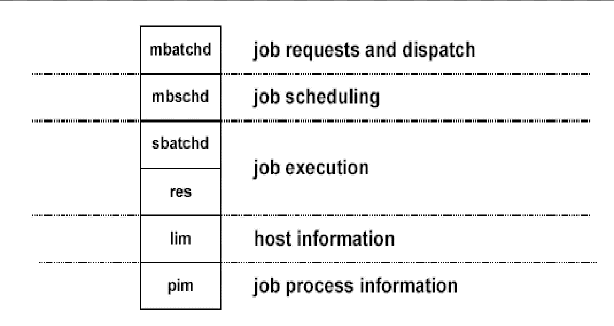

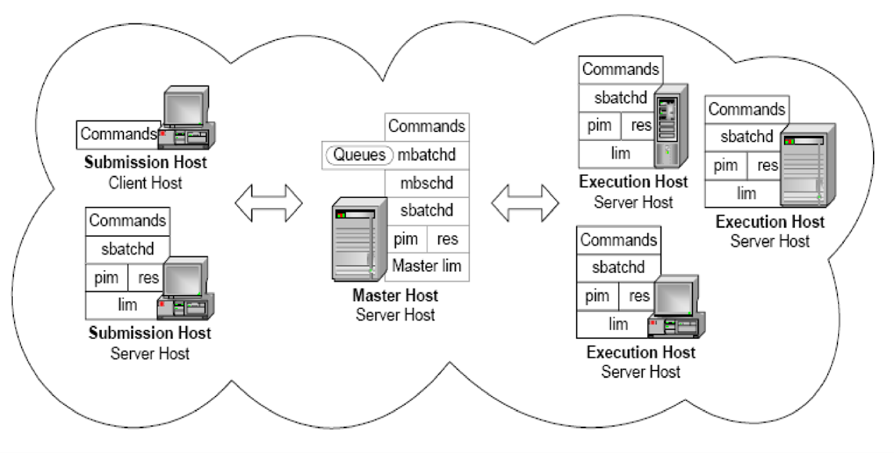

LFS后台进程：

| 程序名称 | 描述                                                         |
| -------- | ------------------------------------------------------------ |
| Mbatchd  | 运行在master主机上的批处理后台程序。负责整个系统中所有作业的状态，接收作业提交、队列信息请求。通过指令mbschd来给主机分派作业。 |
| Mbschd   | 运行在master主机上的master批处理后台调度程序。               |
| Sbatchd  | 运行在每一个服务器主机上的Slave并行后台程序。通过指令mbachd接收请求执行作业并且对本地执行的作业进行管理。负责执行本地调度策略并对主机上所执行作业的状态进行维护。 |
| Res      | 运行在每一个服务器主机上的远程执行服务器。接受远程执行请求来对作业和任务提供透明的执行。 |
| Lim      | 运行在每一个服务器主机上的负载信息管理器。采集主机负载和配置信息并将该信息反馈给运行在master主机上的master LIM。 |
| Pim      | 运行在每个服务器主机上的进程信息管理器。Pim采集主机上作业所使用的关于CPU和内存情况的作业运行信息并将这些信息发送给sbatchd。 |

作业生命周期

1. 提交作业
2. 调度作业
3. 分派作业
4. 运行作业
5. 返回输出
6. 发送Email给用户

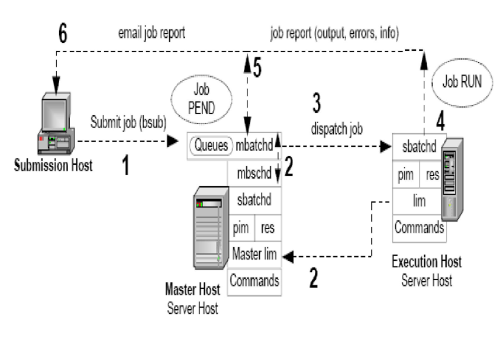

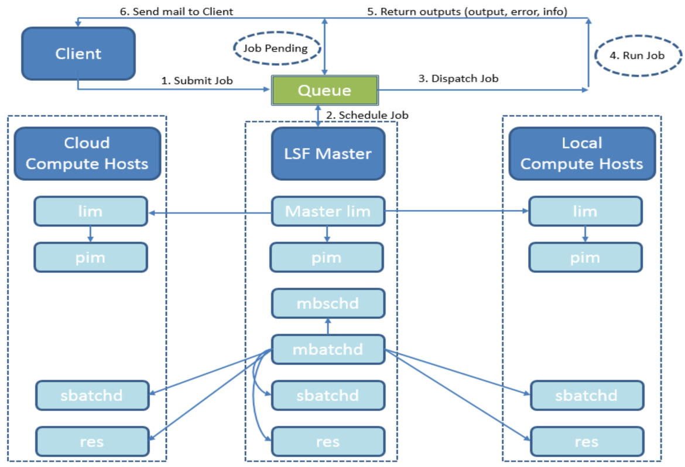

在混合云上如上图

指令说明：

还有bsub、bqueues、bhosts、bjobs、bkill、bhist、bacct，但是估计不考

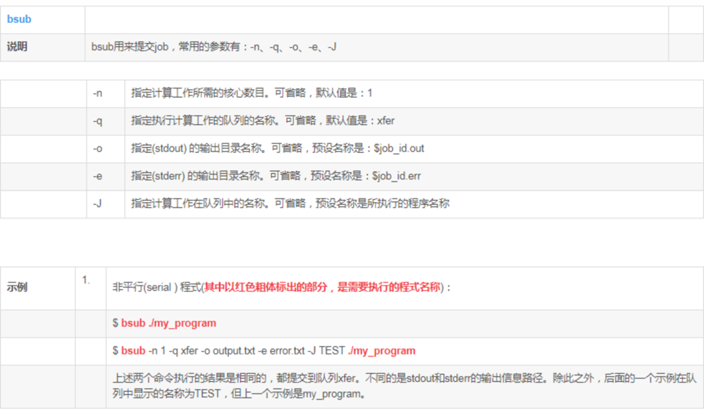

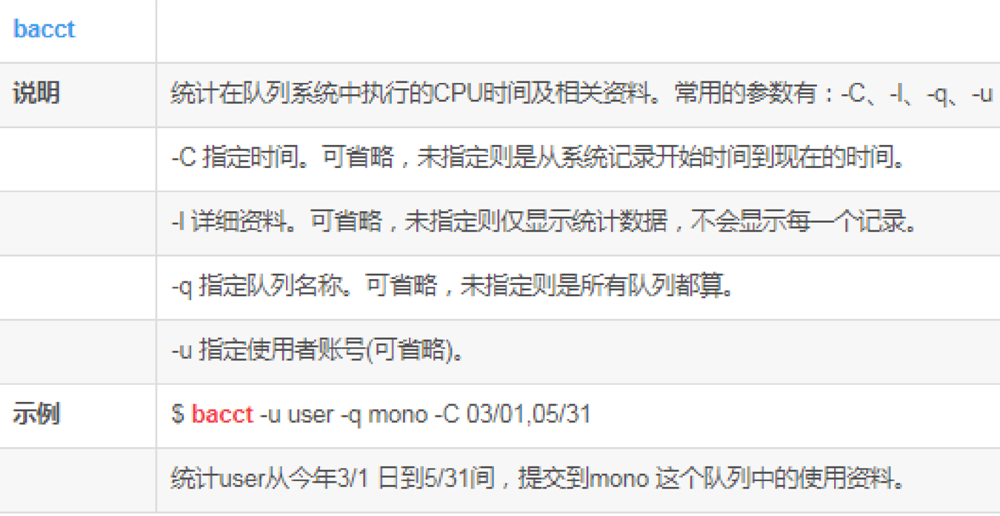

LSF Resource Connector：该特 性使得 LSF 能够根据集群的作业负载情况， 从各种外部计算资源管理系 统或者公有云平台**借用计算资源**

### PBS(相关的命令是q打头的qsub, qstat....)

#### 概念

PBS是一个广泛应用的本地集群调度器之一,PBS提供对批处理作业和分散的计算节点(Compute nodes)的控制.

 PBS包含

1. openPBS ， openPBS是最早的PBS系统；目前没有太多后续开发，
2. PBS Pro 是个商业版本，价格昂贵，功能最为丰富；
3. Torque。Torque是Clustering/Adaptivecomputing公司接过了   OpenPBS，并给与后续支持的一个开源版本。

#### 结构

**PBS**系统必须有一个**server**和至少一个**mom**, **server**负责作业的提 交、分发, **mom**接受**serve****r**的控制,负责作业的执行


#### 组成

1. **服务器 (pbs_server)**:
   - 主要管理节点，负责整个集群的协调和管理。
   - 维护作业、节点和资源信息，接受用户和作业请求。
2. **调度器 (pbs_sched)**:
   - 决定何时执行作业以及在哪些节点上执行，以最大程度地利用资源。
3. **执行器 (pbs_mom)**:
   - 运行在计算节点上，负责监控节点状态和执行作业。
4. **命令行**:
   - 用户与系统交互的方式，用于提交作业、管理队列和查看作业状态等。

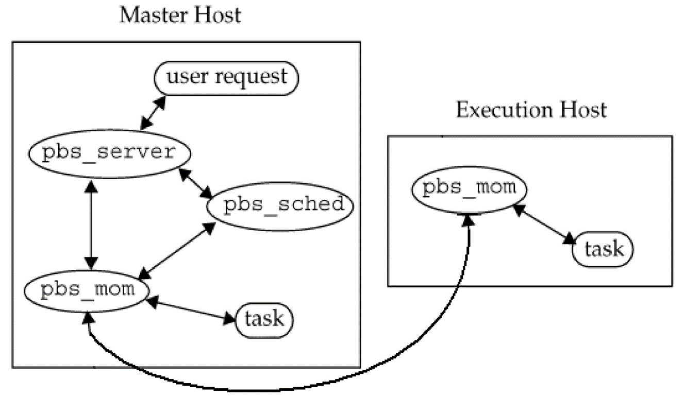

#### 功能

主要包括作业管理、作业调度、资源管理、系统监控、故障恢复、记帐等功能。

• 作业管理

  作业管理包括提交、查看、修改、删除、挂起/恢复、移动和传送作 业等。

• 作业调度

  由调度算法决定，常用的调度策略有FIFO、RESERVATION等。

• 资源管理

  管理的对象包括服务器、队列、结点等，管理方法是动态地增加、删 除对象，设置、修改对象的属性。

• 系统监控

  用户通过查看集群系统中各个结点的状态（如空闲、繁忙、作业独占 、脱机或故障），决定使用哪些结点来提交作业，实现负载平衡。

#### 基本命令

````shell
qsub提交作业
-l 指定作业所需要的资源
-o 指定输出文件名
-e 指定错误输出文件名

qstat查看状态
-q 显示已经配置的所有队列状态信息
-a 显示已经提交的作业状态信息
-f  [作业名] 显示指定作业的所有状态信息
-B 显示服务器的状态

qselect查询作业
	 -q [队列名]查询指定队列中的作业
	    [主机名]查询指定主机上的作业

qhold挂起作业
	 qhold [-h hold_list] 作业ID

qrls释放作业
	 qrls [-h hold_list] 作业ID(命令用于释放先前被挂起的作业，允许它们继续执行。)

pbsnodes [-{c|d|l|o|p|r}] [-s server] [-n] [-N "note"] [-
q] node

````


### **Slurm**

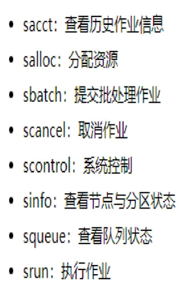

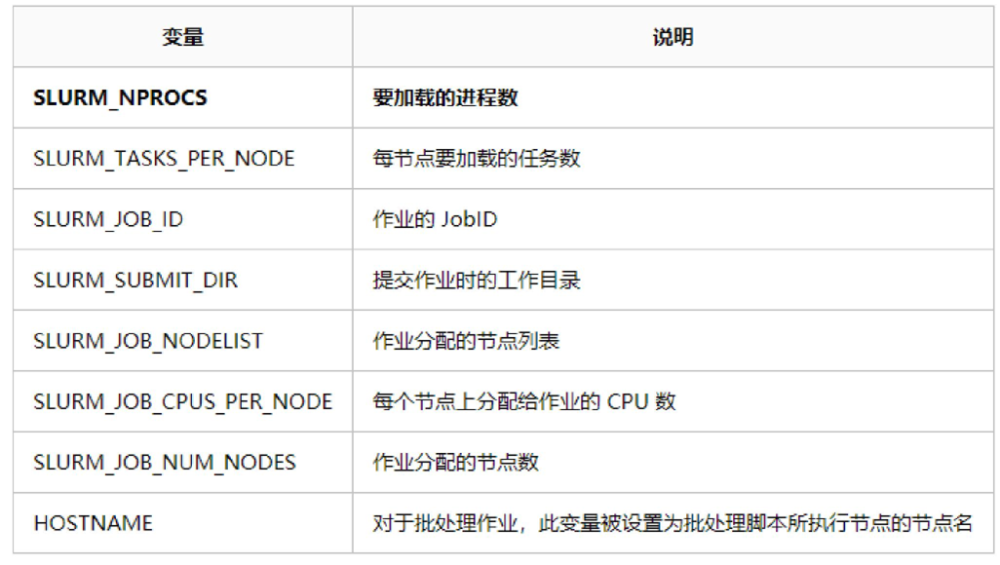

### 不同调度器的比较

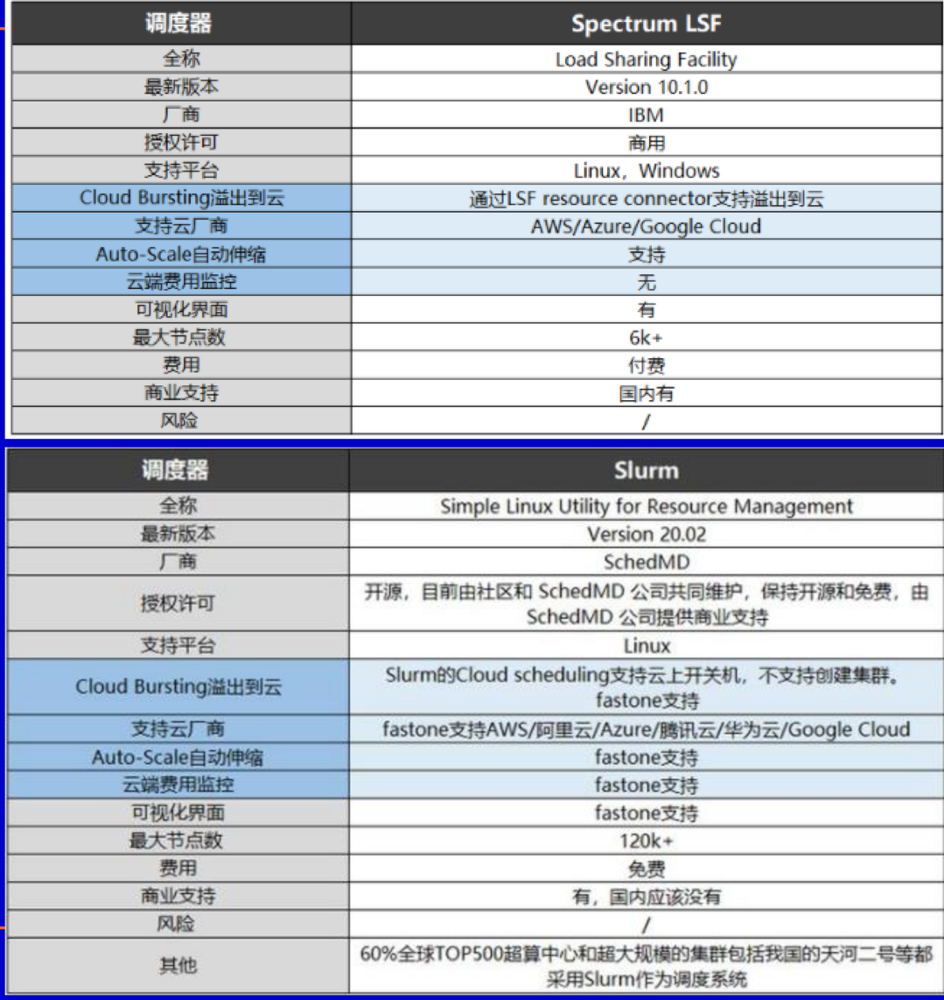

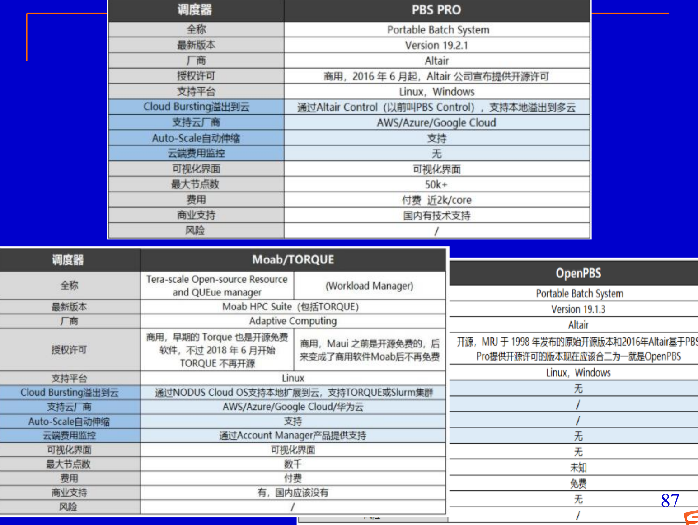