# 3.1虚拟化技术

> created by xjsc01

## 虚拟化技术介绍

### 云计算的技术特点

> 虚拟化技术是构建云计算平台的一项关键技术。

1. **虚拟化**:
   - 云计算使用虚拟化技术，允许多个虚拟计算机实例在单个物理服务器上运行。这提高了资源利用率和灵活性，使资源能够更好地共享和分配。
     同时虚拟化还可以把多个计算机虚拟为一个计算机。
2. **超大规模**:
   - 云计算平台通常能够支持大规模的计算、存储和网络资源，以满足不同规模和需求的用户。这意味着它可以扩展到处理数百万甚至数十亿的用户和工作负载。
3. **基于互联网**:
   - 云计算是通过互联网提供的，允许用户**从任何地方通过互联网访问云服务**。这种便捷性和全球性是云计算的一个重要特点。
4. **高可扩展性**:
   - 云计算平台具有高度可扩展性，可以根据需求**动态扩展或缩减计算资源**。这意味着用户可以根据工作负载的变化调整资源，避免资源浪费。
     （随时可以参加、缩减资源，避免浪费）
5. **按需服务**:
   - 云计算提供按需服务模型，用户只需支付他们实际使用的资源，而无需提前购买硬件或长期承诺。这降低了成本，并增加了灵活性。
6. **通用性**:
   - 云计算平台通常**提供多种不同类型的服务**，包括计算、存储、数据库、人工智能等。这使得它能够满足各种应用和工作负载的需求。
7. **高可靠性**:
   - 云计算提供高度可靠的基础设施，包括数据**冗余、备份和容错**机制，以确保数据的安全性和可用性。这使得云计算适用于关键业务应用。

### VM和物理机所需要的资源

#### Linux PC

1. CPU
2. 内存
3. 硬盘、网卡
4. 镜像

#### VM

1. 计算
2. 存储
3. 网络
4. 镜像

### 虚拟化技术

#### 定义

虚拟化技术的核心思想是利用**软件**或**固件管理程序**构成虚拟化层，把物理资源映射为虚拟资源。 在虚拟资源上可以安装和部署多个虚拟机， 实现多用户共享物理资源。

虚拟化，是资源的抽象：

- 单一物理资源的多个逻辑表示
- 多个物理资源的单一逻辑表示

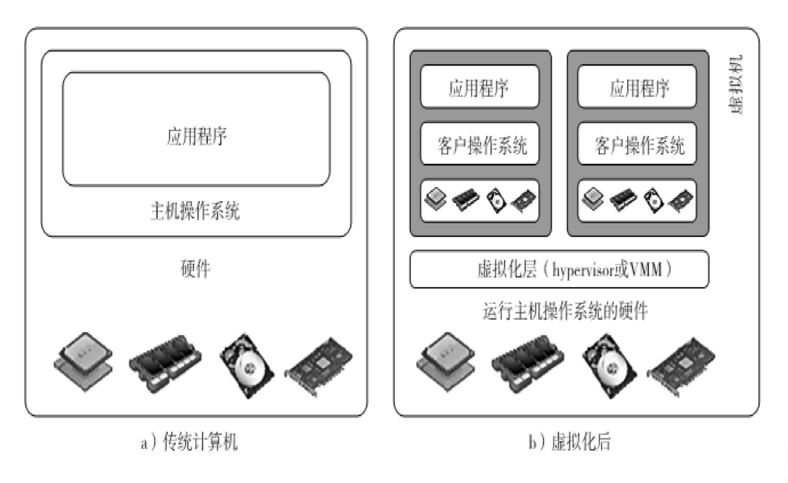

名词解释：

- **VMM（Virtual Machine Monitor）**是一种通用术语，用于描述虚拟机监视器，它负责创建、管理和监控虚拟机。
- **Hypervisor**是一种特殊类型的虚拟机监视器，通常是硬件虚拟化技术的一部分。它直接运行在物理硬件上，负责虚拟机的创建和管理。有两种类型：
  - Type 1（直接运行）
  - Type 2（运行在宿主操作系统上）

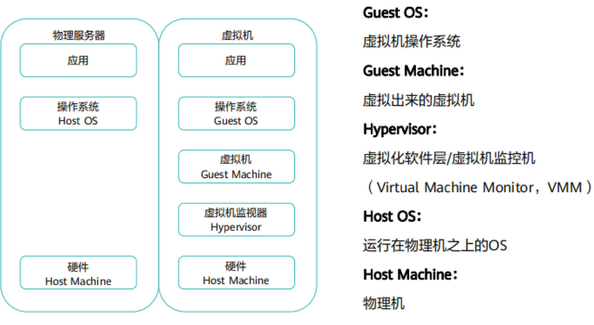

#### 虚拟化的特点

1. **分区 (Partitioning):** 虚拟化允许将物理计算资源（如CPU、内存、存储）分成多个虚拟部分，每个部分称为分区。每个分区可以被视为一个独立的虚拟计算机，拥有自己的操作系统和应用程序。这使得多个用户或应用程序能够共享同一台物理计算机，而不会相互干扰。
   （易于共享）
2. **隔离 (Isolation):** 隔离是虚拟化的关键特性之一。它确保在不同的虚拟环境中运行的操作系统和应用程序互不干扰。这意味着如果一个虚拟环境中的应用程序崩溃或发生故障，不会影响其他虚拟环境的稳定性。这提高了系统的可靠性和安全性。
   （一个崩溃了另一个还可以用）
3. **封装 (Encapsulation):** 封装指的是将一个虚拟环境的所有组件，包括操作系统、应用程序和配置信息，打包成一个单独的虚拟机镜像或容器。这使得虚拟机可以轻松地在不同的物理主机上迁移和部署，而不需要重新配置和安装软件。封装也有助于保持环境的一致性。
   （易于迁移、部署 eg. VMWARE可以导出虚拟机）
4. **独立 (Independence):** 虚拟化环境是相互独立的，它们彼此不受影响。这意味着一个虚拟环境的变化不会影响其他环境。每个虚拟环境都有自己的资源分配和运行环境，因此它们是相对独立的计算单元。
   （虚拟环境是独立的，不会互相影响）

#### 低级 VMM 操作 

1. **多路复用（Multiplexing - 复用）：** 多路复用是指在多个虚拟机（VM）之间共享物理资源，例如CPU或内存的过程。
2. **挂起（Suspend - 暂停）：** 挂起虚拟机涉及将其当前状态保存到磁盘上，并在当前执行点暂停它。
3. **恢复/供应（Resume/Provision - 恢复/供应）：** 恢复是指重新启动挂起的虚拟机，使其继续运行。虚拟机从挂起状态恢复后，可以继续执行其之前的任务。
4. **动态迁移（Migration ）**它允许将虚拟机（VM）从一个物理主机迁移到另一个物理主机，而不中断虚拟机的运行。

#### 为什么需要虚拟机

1. 资源利用率严重不足的情况（全球数据中心中包含的1180万台服务器其CPU平均利用率只有15%）
2. 因为当前操作系统的机制，**不能为当前应用的运行   行提供行之有效的隔离环境**，影响了资源共享，进而导致旧服务器计算能力没有完全利用， 新应用必须  购买新服务器
   - 文件系统隔离（依赖文件在磁盘的位置、内容、版本等，可能 与其它软件造成冲突）
   - 网络隔离（网卡、 协议栈、 IP地址、端口等等，这些依赖资源可能与其他 软件发生冲突）
   - 管理域隔离（应用的运行和维护往往需要高安全权限，难以对管理 员的管理范围进行限制，难以对应用使用的资源进行访 问控制）

> 随着云计算的发展，传统的数据中心逐渐过渡到虚拟化数据中心，即采用虚拟化技术将原来数据中心的物理资源进行抽 象整合。

#### 虚拟化的优势

1. 整合资源，提高资源的利用率（复用），实现资源的动态分配和调度,提高现有资源的利用率和服务可靠性
2. 简化资源使用的复杂度,更快、更方便部署系统（封装）
3. 简化资源管理,提供自动的资源分配、回收方式 
4. 提供统一的安全、备份、容灾方案
5. 方便系统升级、迁移和改造

## 虚拟化技术发展简史

- 虚拟机的第一次出现是用于分时操作系统，主要用于当时的IBM大型机的服务器虚拟化。分时系统要求软件通过操作系统暴露的接口访问硬件， 而不是直接访问、 完全控制，因此操作系统需要对软件屏蔽物理资源视图，提供虚拟资源视图	 

- Multics/Unix中的虚拟内存机制， VM 360/370里面的CP/CMS系 统，都属于虚拟机/虚拟化技术
  - 虚拟内存 -> 进程虚拟机（虚拟机中直接运行应用、封装为进程）       
  - CP/CMS VM -> 系统虚拟机（虚拟机中运行操作系统）
- 1970-2000这段时期，虚拟机在操作系统之外也得到大量应用  -Smalltalk/Java高级语言虚拟机、游戏机模拟器、 PC模拟器VirtualPC、VMWare

### x86虚拟化技术发展

2003年9月	 Intel公布新的研究: Vanderpool技术	 首次提出在CPU中内置对虚拟机的支持	 该技术最大的受益者：剑桥大学Xen

2004年	7月 微软发布Virtual Server 2005 R2	9月AMD也提出Pacifica技术回应Intel	9月 User-mode Linux正式纳入2.6.9内核  	12月Xen 2.0正式发布

2005年	3月 Novell SUSE Linux 9.2 正式包含Xen  	3月 Novell将Netware移植到Xen	6月 Fedora Core 4中正式包含Xen

 2005年4月	 Intel正式发布Virtualization Tech技术规范

 2005年5月	AMD正式发布Pacifica技术规范

 2005年12月	Xen 3.0发布、正式支持Intel VT技术

 2006年2月	VMWare Workspace/GSX Server免费

 2006年－2007年	 Intel、AMD支持VT的芯片全面上市	 微软Virtual Server 2005 R2 SP1发布，支持VT技术	 微软下一代操作系统Vista发布，内置Hypervisor

### 计算虚拟化发展史

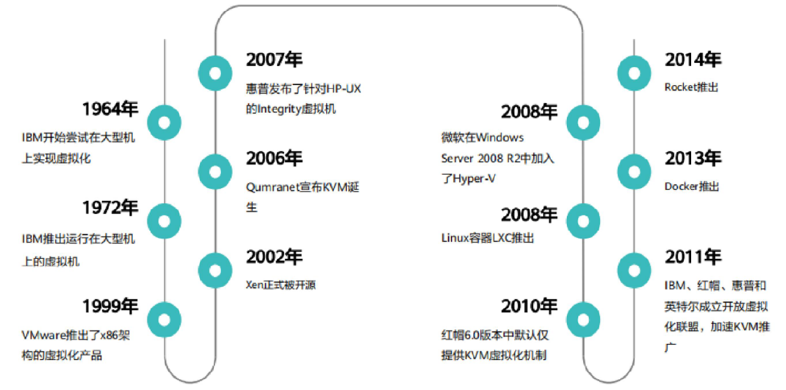

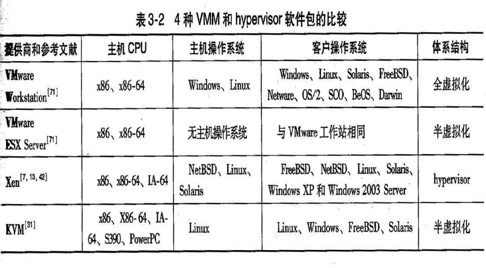

### 硬件级虚拟化

在真实硬件和传统操作系统之间插入一层软件，该层软件通常称为虚拟机监视器     （VMM）， 对VMM有三个需求：

- 第一，VMM应该为程序提供与原始硬件机器基本一致 的环境；
- 第二，运行在该环境中的程序的性能损失应较低；
- 第三，系统资源应处于VMM的完全控制之中         
  (1) VMM负责为应用程序分配硬件资源；
  (2) 程序不能访问任何未分配给它的资源；
  (3) 在某些情况下， VMM可以获得对已分配资源的控制权

### 虚拟机提供商

VMware ESXi Server. Hyper-V Server 2008 R2. Windows Virtual PC. IBM, Redhat. 华为、浪潮等 Xen. KVM. VirtualBox. z/VM. z LPARs

### 虚拟化技术分类

#### 分类(I)（裸机、宿主机）

裸机/裸金属型虚拟化 

寄居/宿主型虚拟化

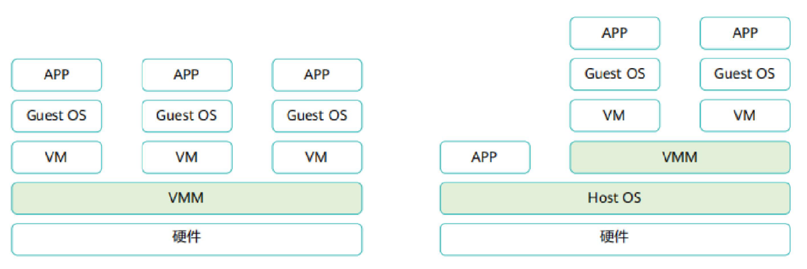

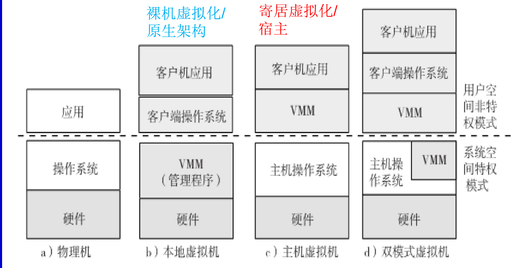

注：双模式虚拟机是一种创新的虚拟化技术，它允许虚拟机在硬件虚拟化模式和容器化模式之间灵活切换，以满足不同应用的需求，提供更好的性能和资源利用率。

#### 分类(2)（全虚拟化、半虚拟化）

硬件虚拟化可以分为：

1. 全虚拟化
   - 在全虚拟化中，虚拟机完全模拟物理硬件。这意味着虚拟机的操作系统不需要被修改，可以在虚拟环境中运行，就像在物理硬件上一样。
   - 它依赖于**二进制翻译**   来陷入和虚拟化一些敏感、不可虚拟化的指令的执行（客户操作系统和它们的应用由非临界和临界指令构成）
   - 复杂指令的间接执行，即使用VMM二进制翻译客户操作 系统请求，并在同一台主机上直接执行简单指令
   - 模拟物理硬件
2. 半虚拟化
   - 虚拟机操作系统需要被修改，虚拟机需要意识到自己在虚拟环境中运行，并通过特殊的API来与虚拟化层通信，而不需要完全模拟硬件因此减少了虚拟化层的复杂性。
   - 半虚拟化虚拟机在用户程序中提供了特殊的API，包括为执行虚拟化进程   而修改客户操作系统内核，
   - 将不可执行的指令（敏感指令等）替换为对hypervisor或VMM的超级调用
   - 半虚拟化的客户操作系统，由智能编译器辅助将不可 执行的操作系统指令替换为超级调用

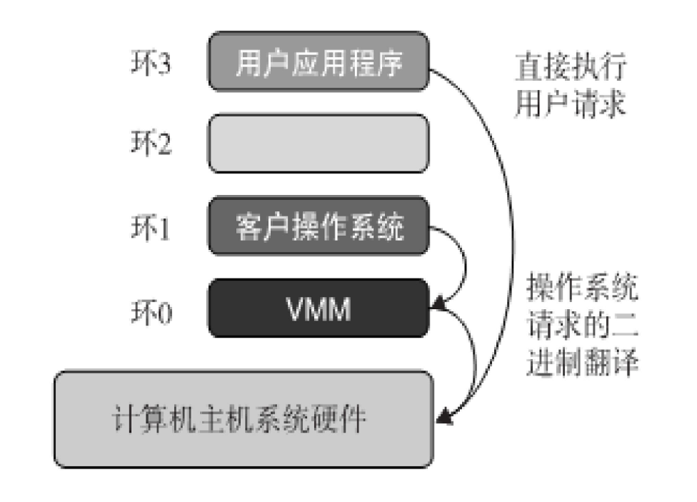

上图为全虚拟化

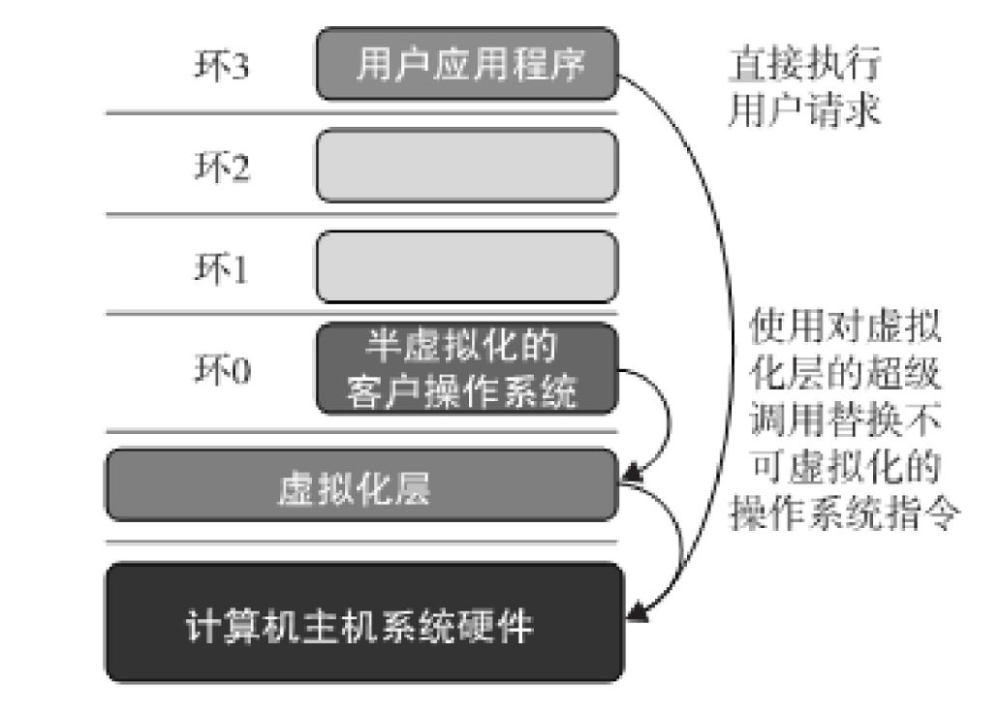

上图为半虚拟化

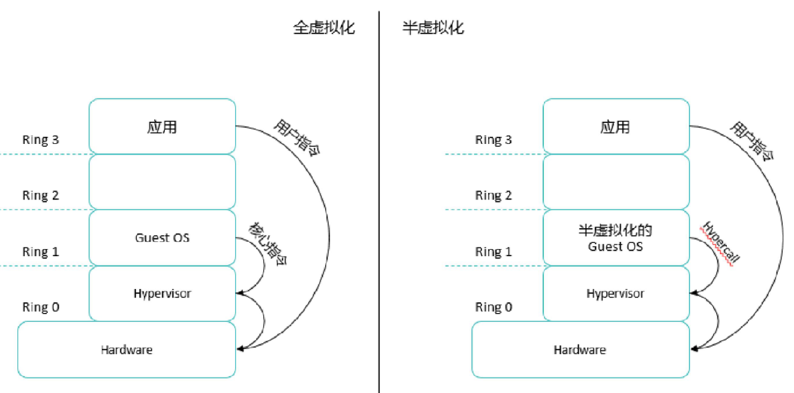

上图为X86的SB操作

| 特点       | 全虚拟化                                  | 半虚拟化                                                 |
| ---------- | ----------------------------------------- | -------------------------------------------------------- |
| 隔离性     | 高，虚拟机**完全**隔离，无需操作系统修改  | 高，虚拟机操作系统需要修改以与虚拟化层协同工作           |
| 性能开销   | 相对较高，需要模拟硬件，可能引入性能开销  | 相对较低，虚拟机操作系统与虚拟化层直接通信，减少性能开销 |
| 兼容性     | 高，支持运行未修改的操作系统              | 有限，需要支持半虚拟化的操作系统修改                     |
| 硬件依赖   | 依赖于硬件虚拟化扩展，如Intel VT-x和AMD-V | 不严重依赖硬件虚拟化扩展                                 |
| 部署复杂性 | 较高，需要虚拟机监视器（VMM）来模拟硬件   | 较低，虚拟机操作系统通过API直接与虚拟化层通信            |
| 示例技术   | VMware ESXi, Hyper-V                      | Xen                                                      |

#### 分类(3)从应用的角度进行分类

1. 系统、服务器虚拟化（CPU、IO、内存）：一台物理机虚拟成多台虚拟机（具有独立性）
   - 复用，隔离，独立，封装....许多优点
2. 存储虚拟化：统一整合管理整个云系统的存储资源，为用户提供一个统一的存储空间
3. 网络虚拟化：将网络资源和功能集中到一个软件中统一管控
4. 桌面虚拟化：桌面操作系统和应用程序与物理硬件分离

#### 分类(4)-实现层次

##### 指令集体系结构级虚拟化

通过主机上的指令集模拟一个给定的指令集（在指令集仿真的帮助下，MIPS二进制代码能够在基于x-86的主机上）典型的系统有： Bochs, Crusoe, Quemu, BIRD, Dynamo

优点：

1. 新的硬件主机上， 运行大量的为不同处理器写的遗留二进制代码
2. 具有最佳的应用灵活性

缺点

1. 一条源指令可能需要几十条或几百条目标指令来执行它的功能，这比较慢
2. 虚拟化指令集需要在编译器中增加一个特定处理器的软件翻译层

##### 硬件抽象级

虚拟化就在硬件上来执行，它为虚拟机生成虚拟的硬件环境，并通过虚拟化管理底层的硬件。

VMware, Virtual PC, Denali, Xen

有点

1. 具有高一点的性能
2. 良好的应用隔离性

缺点

1. 实现起来复杂
2. 很贵

##### 操作系统级的虚拟化

Jail / Virtual Environment / Ensim's VPS / FVM、容器、Linux    Vserver

在一个操作系统中插入一个虚拟化层来划分机器的物理资源。它使得在一个操作系统内核中可以  同时运行多个隔离的虚拟机。这种虚拟机也称为VEE（Virtual Execution Environment）、 VPS（Virtual     Private System，虚拟专用系统）或容器。

从用户的视角来看， VE就像真实服务器。 VE有自己的进程、  文件系统、用户账号、带有IP地址的网络接口、路由表、防火墙规则及其他个人设置。

尽管VE可为不同用户分别定制，但它们仍共享同一个操作  系统内核。因此，操作系统级虚拟化也称为单操作系统镜  像虚拟化。

优点：

1. 启动和关闭成本最小
2. 资源需求低
3. 可扩展性高
   - 不需要新增硬件
   - 可以快速地启动，关闭，易于应对流量洪峰

缺点：

应用灵活性和隔离性差（所有操作系统级的虚拟机/容器必须使用同一种客户操作系统）

##### 库支持级

它在一个平台上为运行外来的程序产生执行环境，而不是产生一个虚拟机来运行整个操作系统。它通过拦截和重新映射 API来完成。

Wine, WAB, LxRun, VisualMainWin

优点：具有很低的实现代价

缺点：应用灵活性和隔离性差

##### 用户应用程序级（编程语言）

它把一个应用虚拟化为一个虚拟机，这一层作为一个应用程序处于一个操作系统顶端，能够运行在一个特定的抽象的 机器定义中编写和编译的程序。

JVM ,  NET CLI ,  Panot

优点：具有最好的应用隔离性

缺点：

1. **性能低**：
   - 性能低是因为应用程序级虚拟化通常需要额外的软件层
2. **应用灵活性低**
3. **实现复杂度高**

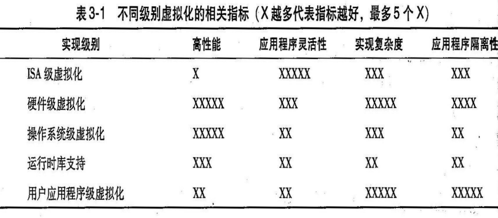

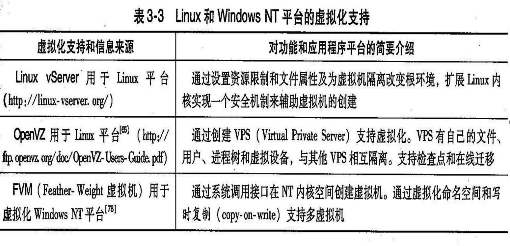

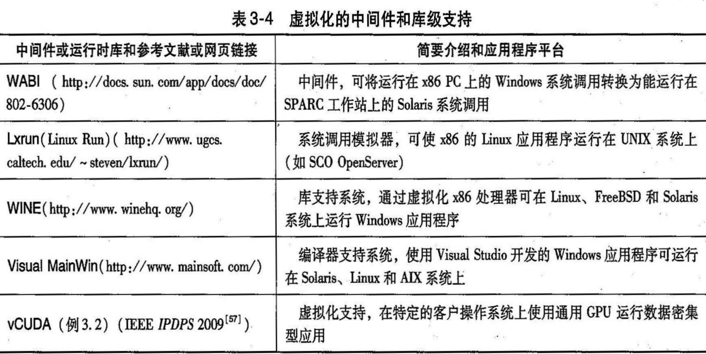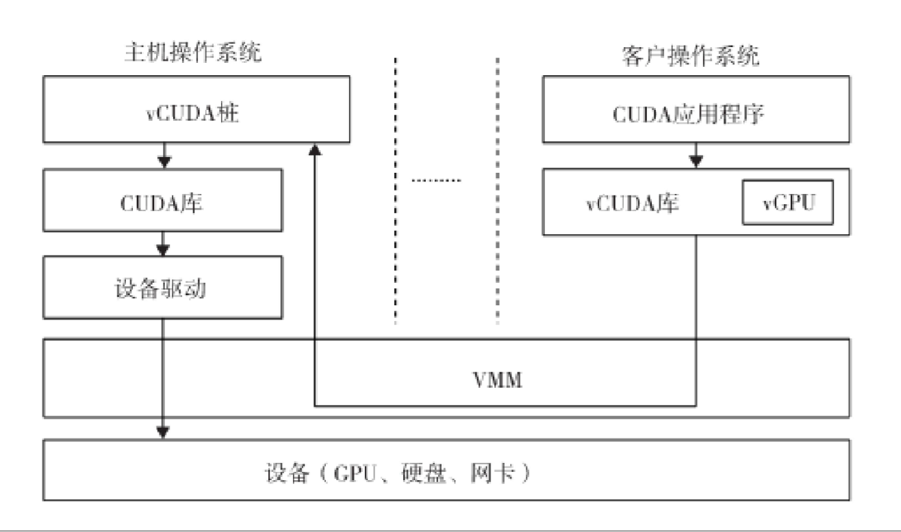