# 服务器-系统虚拟化技术

## 基本知识

### 定义

系统/服务器虚拟化是指将一台物理计算机系统虚 拟化为一台或者多台虚拟计算机系统。每个虚拟 的计算机系统（简称虚拟机）都拥有自己的虚拟 硬件（如CPU 、 内存和设备等） ，来提供一个独 立的虚拟机执行环境。虚拟化是在“硬件 ”和“软件 ”之间的一种抽象	 

核心：虚拟机监控器(VMM)

### 优点、好处、特性

- 封装性：以虚拟机为粒度封装（ 虚拟机快照(Snapshot)、克隆(Clone)、挂起、恢复）
- 隔离：互不干扰
  还有 分区、独立的概念
- 多实例：资源的使用、调度更为优化
- 硬件无关性： 不受物理限制	 
- 特权功能：虚拟化层具有更高特权

VMM对物理资源的虚拟可归结为	 

- 处理器虚拟化
- 内存虚拟化和
- I/O虚拟化

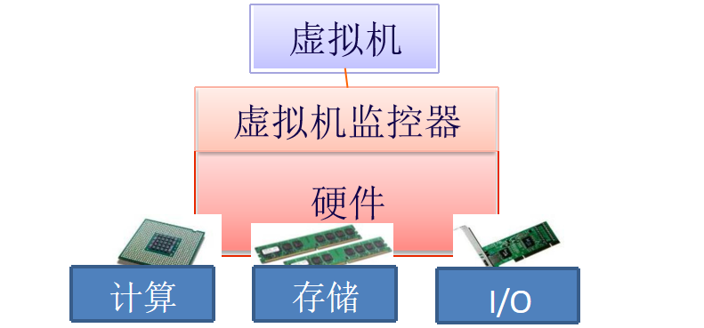

VMM需要完全控制系统资源

特权指令：操作和管理关键系统资源的指令（最高特权级/内核态）	 

敏感指令：操作全局资源的指令。例如修改虚拟机的运行模式获知 物理机的状态；读写敏感寄存器或者内存（时钟、中断寄存器）

- 特权解除：降低客户操作系统的特权级 别，而VMM运行在最高特权级	 

- 陷入-模拟	 当客户操作系统执行到特权 指令，才会陷入到最高特权 级的VMM模拟执行

虚拟化的要求：

1. 一致性：程序在虚拟机上的运行效果必须与物理机上的同程序的行为完全一  致。仅存在时间和可用资源带来的区别。
2. 高效性：机器指令中经常使用的那一部分应在没有VMM干预下执行。
3. 可控性：VMM对虚拟资源进行完全控制。

定理1：对于任何传统的第三代计算机，只要其敏 感指令是优先级指令的一个子集，就可以为其建  立VMM。
欲构造一个VMM，其充分条件是所有可能影响VMM正常工作的指令（即敏感指令）能够自陷并将控制  权移交给VMM。这就保证了资源控制；非特权指令则必  须（可以）被本地（物理机）执行——也就是更有效率地 执行。等价性也得到满足。

## 底层实现

硬件辅助虚拟化

- 引入一种特殊的运行模式和指令，使得VMM和客户操作系统可运行在不同模式中，客户操作系统及其应用程序的所有敏感指令会陷入到VMM中    
- 不需要二进制翻译或半虚拟化

### CPU虚拟化

1. 虚拟CPU的正确运行是要保证虚拟机指令正确运行，现有的实  现技术包括模拟执行和监控执行
2. 调度问题是指VMM决定当前哪个虚拟CPU在物理CPU上运行   ,要保证隔离性、公平性和性能。

对于不同类型指令的处理：

1. 非特权指令直接在物理主机中运行
2. 关键指令分为三类：
   - 特权指令需要在特权模式中执行，当在特权模式之外执行特权指令时会发生陷入。
   - 控制敏感指令尝试改变使用资源的配置。
   - 行为敏感指令根据资源的配置情况会有不同的行为，包括在虚拟内存中进行的负载和存储操作。

VMM运行在管理模式时， CPU支持在用户模式运行虚拟机的  特权指令和非特权指令，则该CPU体系结构是可虚拟化的。

RISC的所有控制敏感指令和行为敏感指令都是特权指令，因此，RISC 的CPU体系结构是天然可虚拟化的。

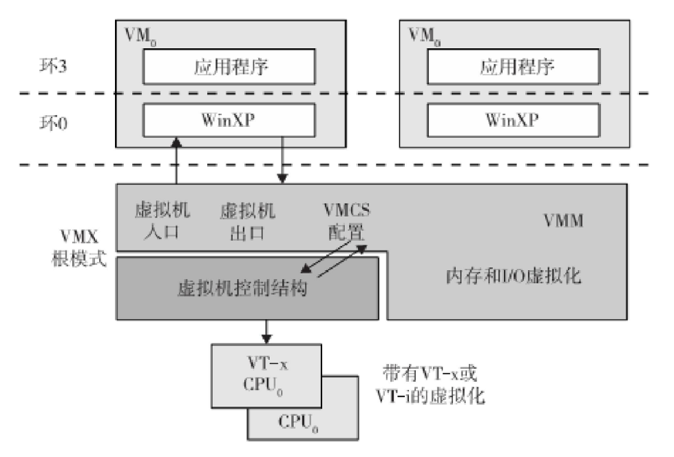

Intel为CPU引入了一种新的  模式，叫作VMX operation

- VMM执行的模式叫作VMX root operation模式
- VM执行的模式叫作VMX non-root operation模式

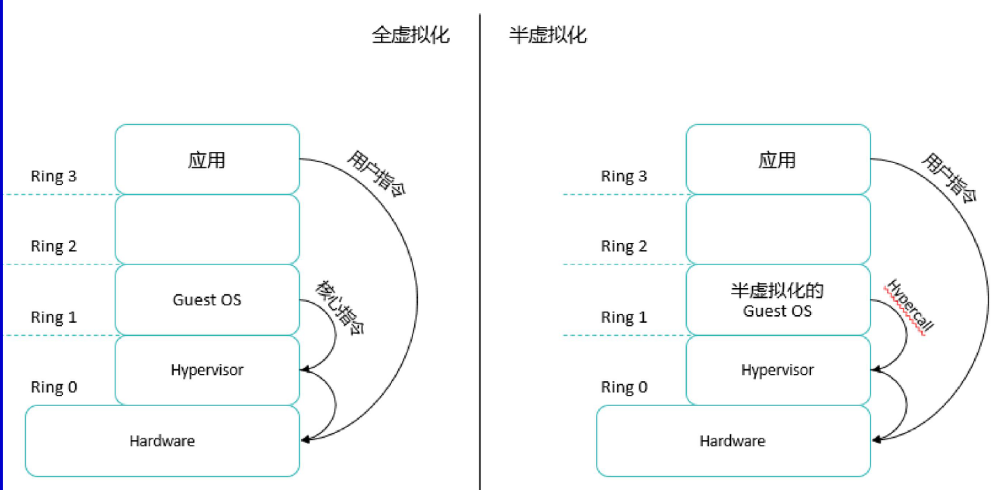

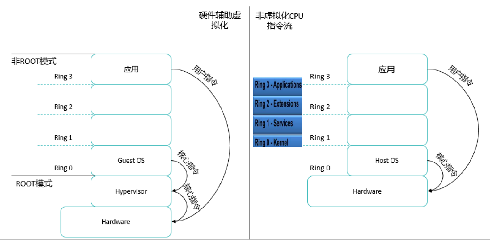

#### 多核CPU虚拟化

两个问题：一是应用程序编程者必须完全并行地使用 所有处理器核，二是软件必须明确地为处理器核分配任务。

在使用虚拟化的时候，可能实际用到的核比虚拟CPU少

| 物理核心                               | 虚拟核心                                       |
| -------------------------------------- | ---------------------------------------------- |
| 实际物理处理器核心                     | 一个操作系统可以看到比物理核心更多的虚拟核心。 |
| 负担更重，需要直接在核心上运行应用程序 | 硬件协助软件实现动态资源利用，软件设计更容易。 |
| 硬件不提供帮助，硬件设计更简单         | 硬件提供帮助，更复杂。                         |
| 资源管理较差                           | 资源管理更佳。                                 |
| 必须修改最低级别的系统软件             | 最低级别的系统软件无需修改。                   |

### 内存虚拟化

内存虚拟化技术把物理内存统一管理， 包装成多个虚拟的物理内存提供给若干虚拟机使用，每个虚拟机拥有各自独立的内存空间。

O.S.往往通过虚拟内存进行内存管理， 内存虚拟化需要对虚拟内存再进行虚拟化。

------

虚拟内存的管理包括3种地址：机器地址、物理地址、虚拟地址

两级映射：

- 客户操作系统仍旧负责从**虚拟地址**到虚拟机的**物理内存地址**的映 射
- VMM负责将**客户物理内存**映射到实际的**机器内存**上

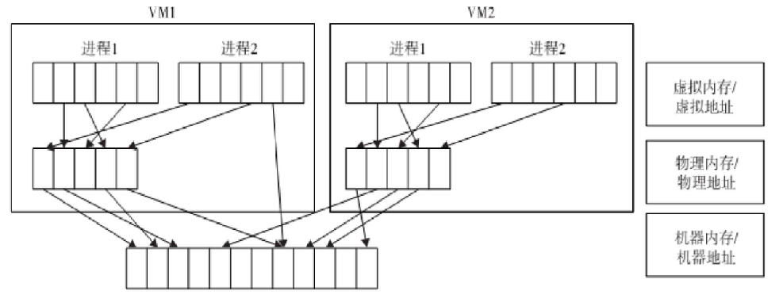

无虚拟机管理器：由MMU(Memory Management Unit)完成虚拟地址到物理地址的转换。

虚拟环境下：需要VMM再经过一次映射才能的得到机器地址。

解决办法：

1. VMM根据映射f和g生成的复合映射f.g，并直接将这个映射关系交给物理机器的MMU
   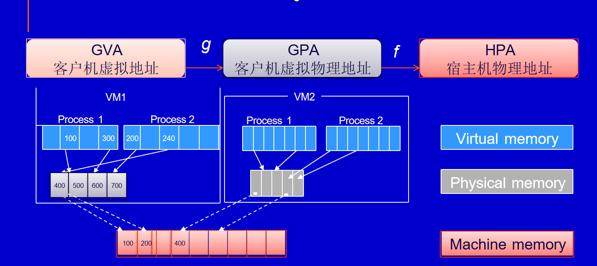
2. Intel采用EPT （扩  展页表） 的内存虚 拟化，在物理 MMU 中保存两个不同的页表，使得内存地址的两次映射 都在硬件中完成，进而达到提高性能的目的。

### I/O设备虚拟化

I/O设备虚拟化技术把真实的设备统一管理起来，包装成多个虚拟设备给若干个虚拟机使用，响应每个虚拟机的设备 访问请求和I/O请求。

需要实现：

1. 管理虚拟设备
2. 共享的物理硬件之   间I/O请求的路由选择

包含三种方式：

1. 全设备模拟: 一个设备的所有功能或总线结构（如设备    枚举、识别、中断和DMA）都可以在软件中复制。
2. 半虚拟化: 是Xen所采用的方法，是分离式驱动模型，由  前端驱动和后端驱动两部分构成。前端驱动运行在Domain U中，而后端驱动运行在Domain 0中，它们通过一块共享内存交互。
3. 直接I/O虚拟化: 让虚拟机直接访问设备硬件。它能获得  近乎本地的性能，并且CPU开销不高。

传统的IO访问：

1. I/O端口寄存器：被映射到I/O地址空间，通过IN/OUT指令访问
2. MMIO (Memory mapping I/O)寄存器：映射到物理地址空间，通过页表方式控制访问
3. 中断

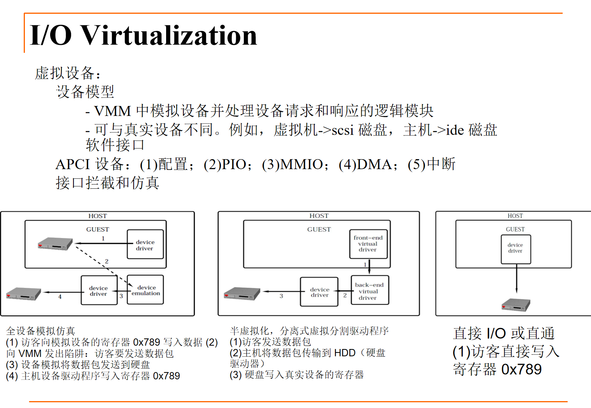

#### GPU虚拟化

当前可以商用的GPU虚拟化模式可以分为GPU直通模式、  GPU SR-IOV模式和GPU半虚拟化模式

- GPU直通模式， 没有对GPU功能性做任何限制，物理机的GPU驱动可以直接安装到 虚拟机内使用；缺点是不支持热迁移，在宿主机上不能操作设备，缺监控数据

- 当前只有AMD的两款GPU产品支持SRIOV(Single Root I/O Virtualization)  ,其本质是把一个PCI卡资源（PF/Physical Function/宿主机上的主设备）拆 分成多个小份（VF/Virtual Function），这些VF依然是符合PCI规范的endpoint设备

- GRID vGPU是NVIDIA的一项虚拟化技术，可以把一块GPU卡分片并分配 给虚拟机使用，和SR-IOV一样， 每个分片vGPU在物理上都是隔离的

下面是趋动科技的猎户座 （OrionX）AI 算力资源池化解决方案

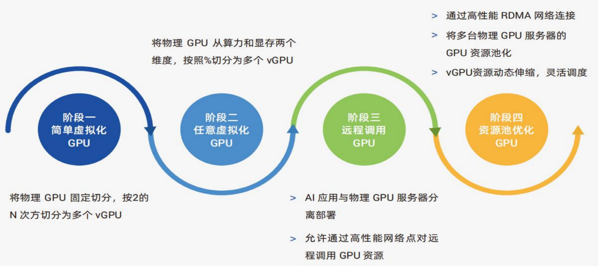

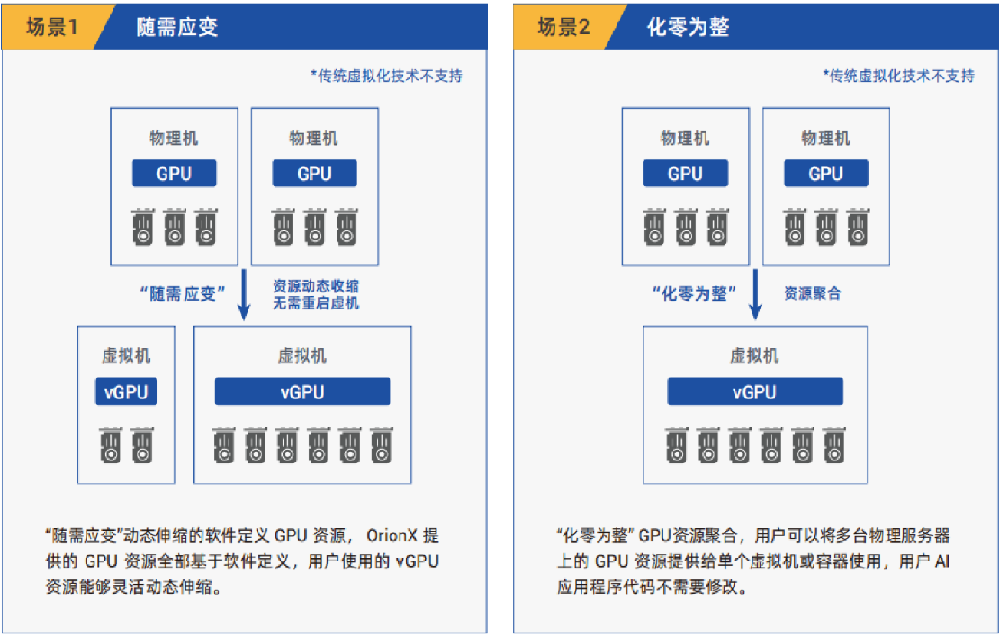

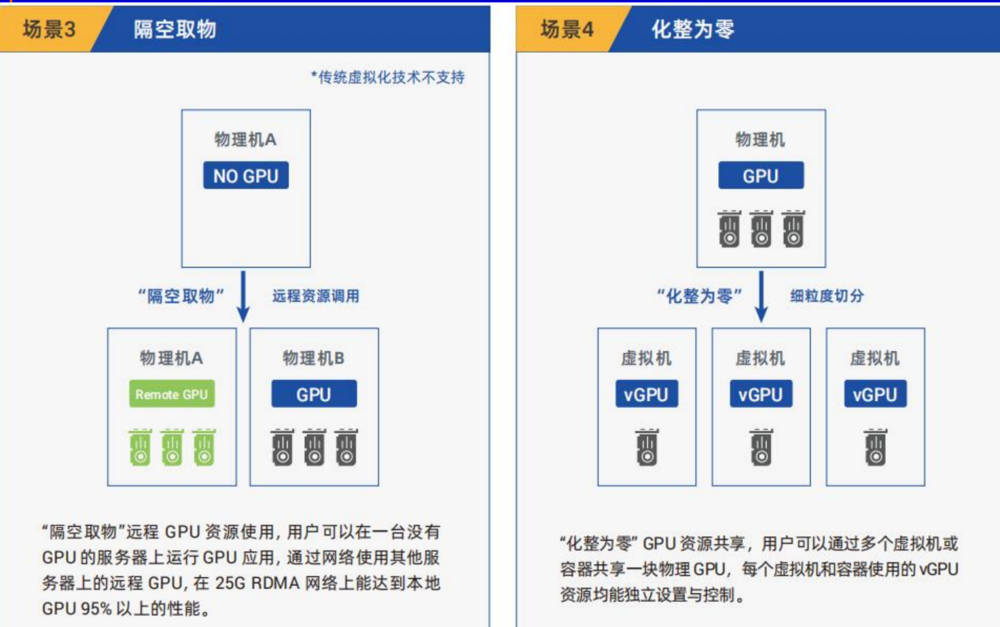

趋动科技的猎户座 （OrionX）AI 算力资源池化解决方案end

#### 网络适配器虚拟化

有三种虚拟化方法：

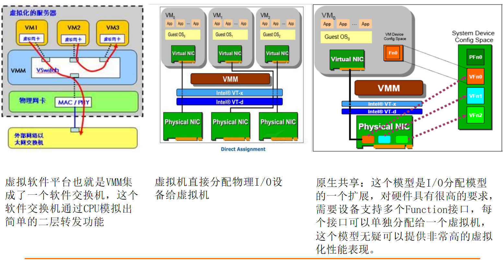

### 硬件辅助虚拟化（与上面3点无关）

硬件厂商不断开发新的硬件特性，旨在简化虚拟化技术，提高虚拟化性能和效率。第一代虚拟化技术包括Intel的VT-x和AMD的AMD-V，它们共同引入了一种特权模式，为虚拟机监视器（VMM）提供了更高的执行权限。此新模式使得特权和敏感调用可以直接进入虚拟化层，无需再进行二进制翻译或半虚拟化。

这些硬件特性还引入了一种重要的机制，用于保存虚拟机的状态，以便有效地进行虚拟化管理。在Intel的VT-x中，这个状态信息保存在虚拟机控制结构（VMCS）中，而在AMD的AMD-V中，它保存在虚拟机控制块（VMCB）中。

#### VT-x

VT-x
	   VMX 根操作：
	   完全权限，用于虚拟机监控器
	   VMX 非 root 操作：
	  非完全权限，用于客户软件
	   降低客户软件权限，不依赖环路
	   环路别名和环路压缩解决方案

虚拟机入口
- 从 VMM 过渡到虚拟机
- 进入 VMX 非 root 操作

从 VMCS 加载客户状态和退出标准
- 首次进入时使用 VMLAUNCH 指令 后续进入时使用 VMRESUME 指令

虚拟机退出
- 从客户机过渡到 VMM 时使用 VMEXIT 指令
- 进入 VMX 根操作
- 在 VMCS 中保存客户机状态
- 从 VMCS 加载 VMM 状态

-------------

虚拟机控制结构 (VMCS)

  VMCS 是内存中的控制结构
          - 每个处理器在任何时候都只有一个 VMCS 处于活动状态
    VMCS 有效载荷：

  - 虚拟机执行、虚拟机退出和虚拟机进入控制
  - 客户机和主机状态
  -  虚拟机退出信息字段
    VMCS 格式
  - VMPTRLD：建立指向所需 VMCS 的指针
  - VMREAD/VMWRITE：新的 VMCS 访问指令

> 相同： VMCS和虚拟寄存器的概念类似
>
> 不同：虚拟寄存器有软件控制， 而VMCS由CPU操作

几种Intel的IO虚拟化技术

1. Intel VT-d（直接I/O虚拟化技术）：
   - 增强虚拟机对物理设备的直接访问和控制。
   - 允许虚拟机直接与物理I/O设备通信，提高性能和效率。
2. Intel VMDq（虚拟设备队列）：
   - 提高多虚拟机环境中的网络性能。
   - 硬件级别管理和分发网络流量，实现带宽分配和隔离。
3. SR-IOV（单根I/O虚拟化）：
   - 允许物理I/O设备在多个虚拟机之间进行硬件级别的分区，每个虚拟机都可以获得直接而高效的访问。
   - SR-IOV通过创建虚拟功能（VFs）来实现，每个VF都表现为一个独立的物理设备，虚拟机可以直接与之通信，而无需经过VMM的干预。

## 虚拟化软件介绍

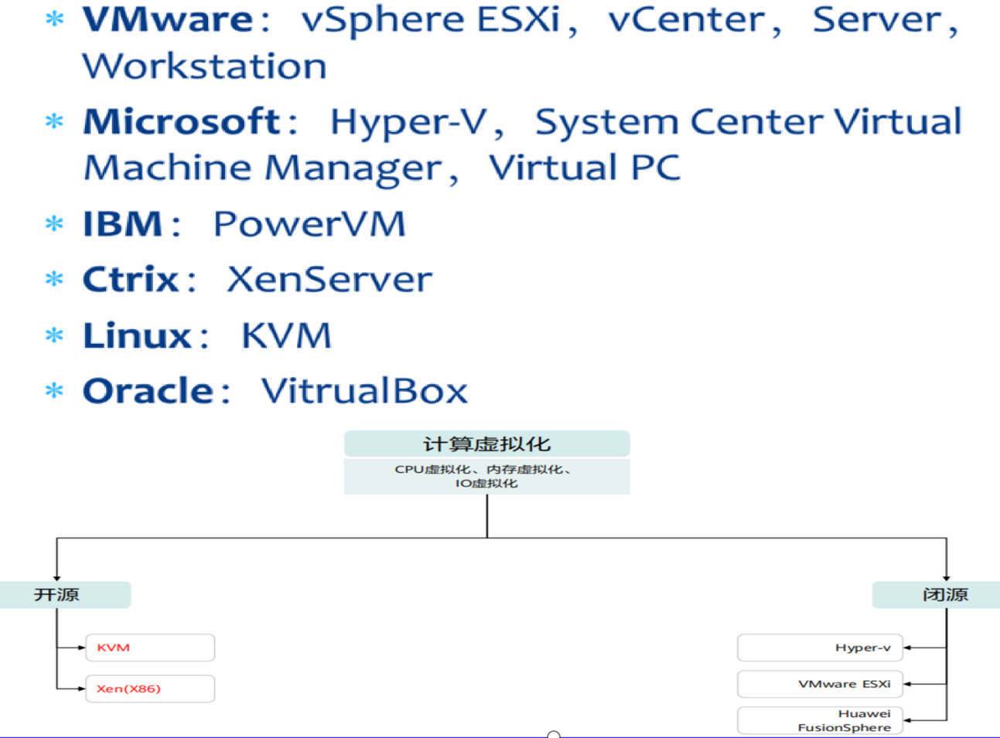

### XEN

- Xen是一个由剑桥大学开发的开源hypervisor程序。 
- Xen属于 微内核hypervisor  提供了一种客户操作系统可以直接访问物理设备的机制     	
- Xen提供了一个处于硬件和操作系统之间的虚拟环境 Xen系统的核心组件是hypervisor、内核和应用程序  
- 具有控制特权的客户操作系统称为Domain 0，其他客户操作 系统则称为Domain U 	
- Domain 0被首先启动。 Domain 0可以直接访问硬件和管理设 备。因此， Domain 0的一个任务是为所有Domain U分配和映射 硬件资源 

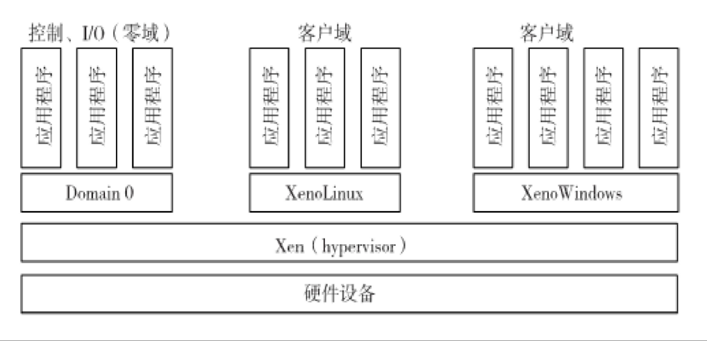

### KVM

不是从底层开始新写一个Hypervisor，而是基于Linux内核。

1. 通过加载新的模块使Linux内核变成一个Hypervisor。
2. 要求：x86架构及硬件支持虚拟化

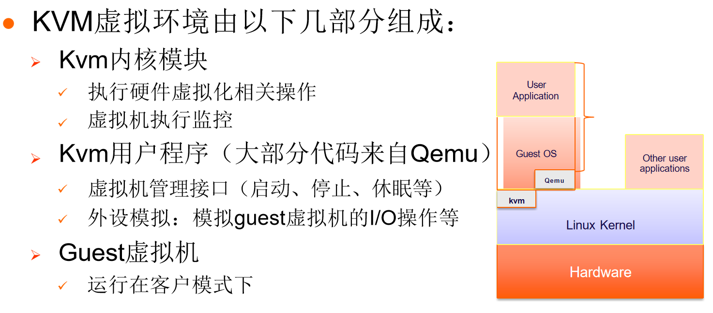

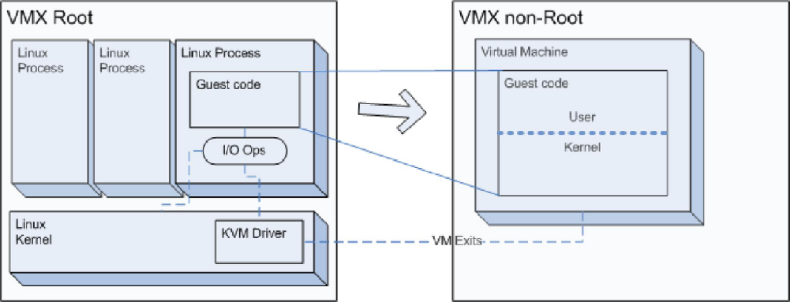

### Libvirt

Libvirt是用于管理虚拟化 平台的开源的API，后台  程序和管理工具。它可以 用于管理KVM、Xen、VMware ESX，QEMU和 其他虚拟化技术

### XEN和KVM的比较

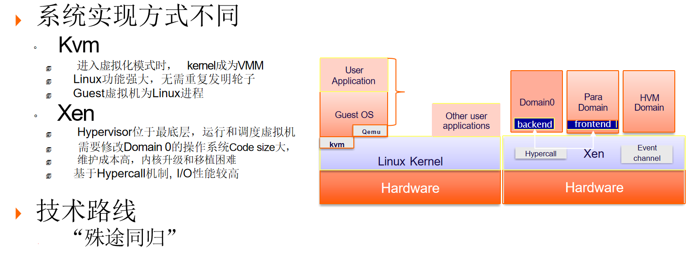

## 虚拟机迁移与隔离技术

### 迁移技术

> 虚拟机可以从一台物理机器在线迁移至另一台物理机器。  发生失效时， 一个虚拟机可被另一个虚拟机替代。

一台虚拟机可能处于如下四种状态之一：

1. **非活跃状态**：虚拟机未启动或已停止，不占用系统资源。这是虚拟机的初始状态或已关闭状态。
2. **活跃状态**：虚拟机正在运行并占用系统资源，可以正常执行任务和处理请求。
3. **中止状态**：虚拟机的执行被中止，可能是由于某种错误或故障引起的，需要重新启动虚拟机才能继续运行。
4. **挂起状态**：虚拟机的当前状态被保存到磁盘，暂停了其运行，但保留了虚拟机的状态信息。可以在需要时恢复虚拟机的运行，继续执行。

虚拟机在线迁移的评价指标：

1. 微小的停机时间	 
2. 最低的网络带宽消耗	 
3. 合理的总迁移时间

------------

内存的迁移是虚拟机迁移最困难的部分

- 第一阶段， Push阶段。
- 第二阶段， Stop-and-Copy阶段。
- 第三阶段， Pull阶段。

实际上，迁移内存没有必要同时包含上述三个阶段， 目前大部分的迁移策略只包含其中的一个或者两个阶段。

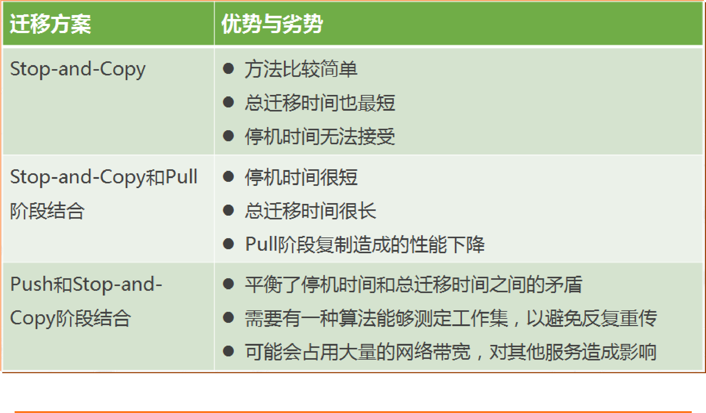

需要迁移的内容：

1. 内存迁移：将虚拟机的内存实例从一个物理节点迁 移至另一个物理节点	

2. 文件系统迁移：为每个虚拟机提供一个一致的、位置无关的、在所有物理主机上都可访问的文件系统
   （迁移存储设备的最大障碍在于需要占用大量时间和网络带宽，通常的解决办法是以共享的方式共享数据和文件系统， 而非真正迁移。）
   目前大多数集群使用NAS（Network Attached Storage，网络连接存储） 作为存储设备共享数据。	 NAS实际上是一个带有瘦服务器的存储设备，其作用类似于一个专用的  文件服务器。	 在局域网环境下， NAS已经完全可以实现异构平台之间，如NT、UNIX    等的数据级共享。	 基于以上的考虑， Xen并没有实现存储设备的迁移，实时迁移的对象必须共享文件系统。

3. 网络迁移：迁移虚拟机时应**维持所有开放的网络连 接**，不应依赖原始主机转发或者依赖移动性或重定  向机制的支持。	 
（在局域网内,可以通过发送ARP重定向 包,将VM的IP地址与目的机器的MAC 地址相绑定,之后的所有包就可以发送 到目的机器上）

在线迁移机制主要使用预复制的方法，首先传输所有的内存页，然后迭代地只传输上次传输过程中被修改的内存页

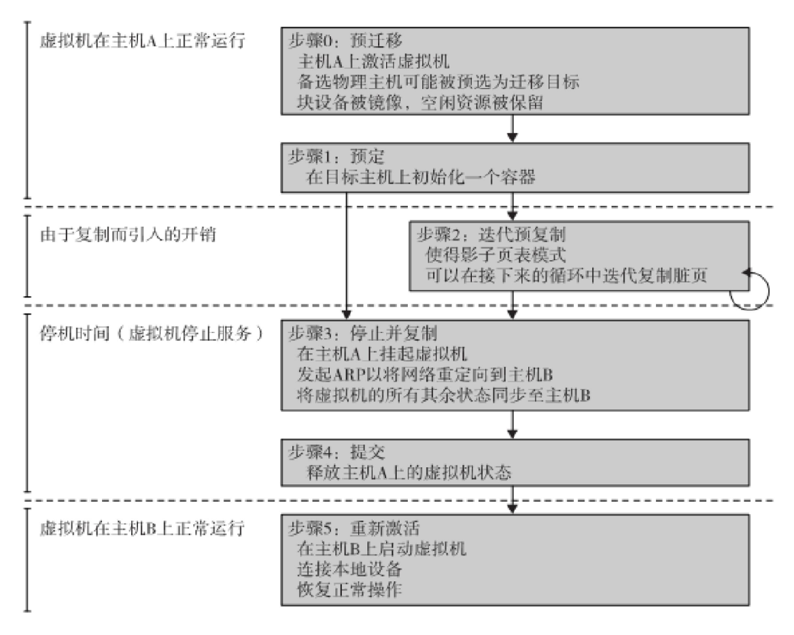

### 隔离技术

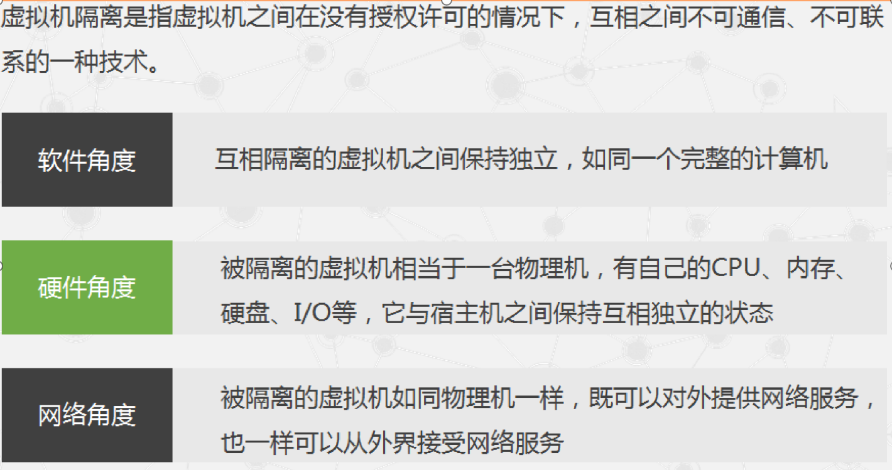

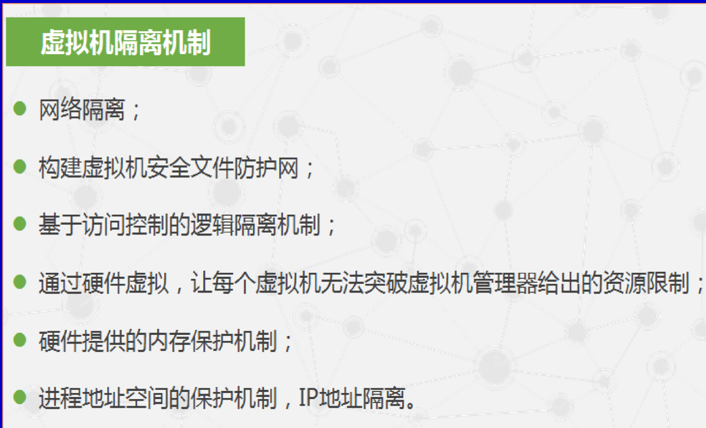

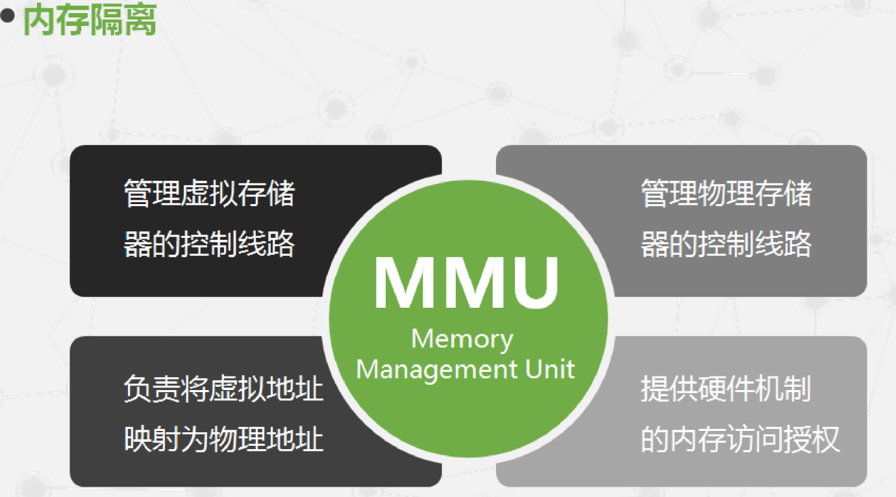

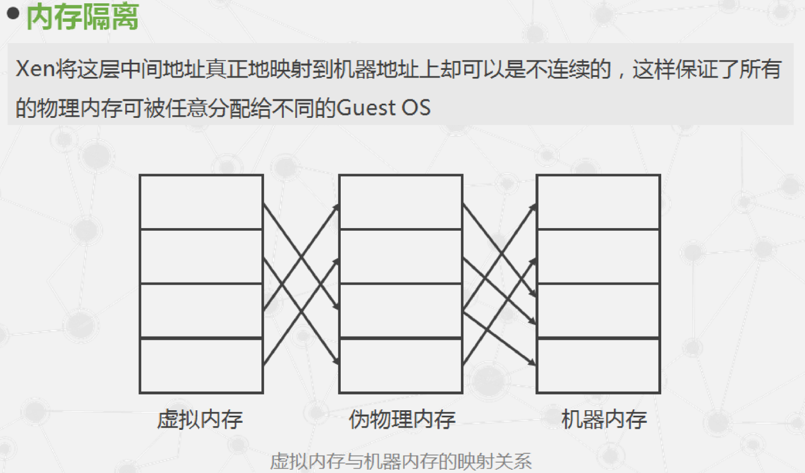

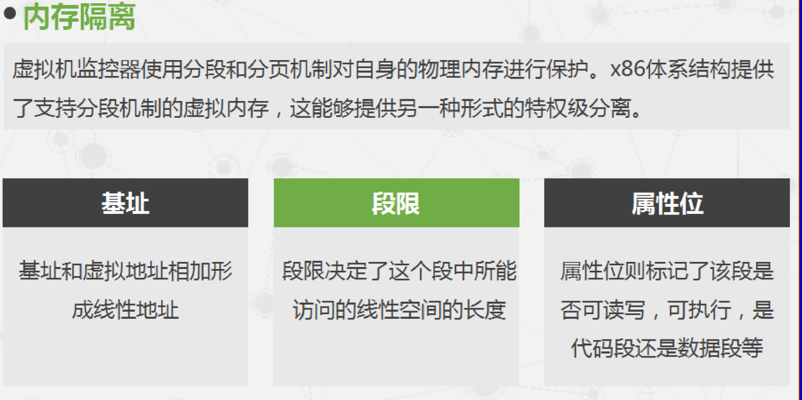

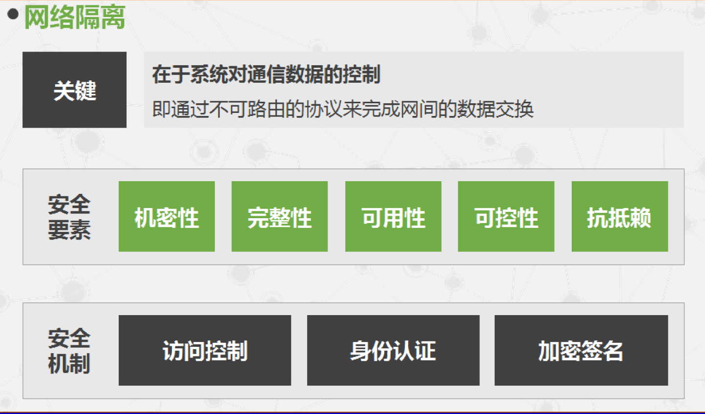

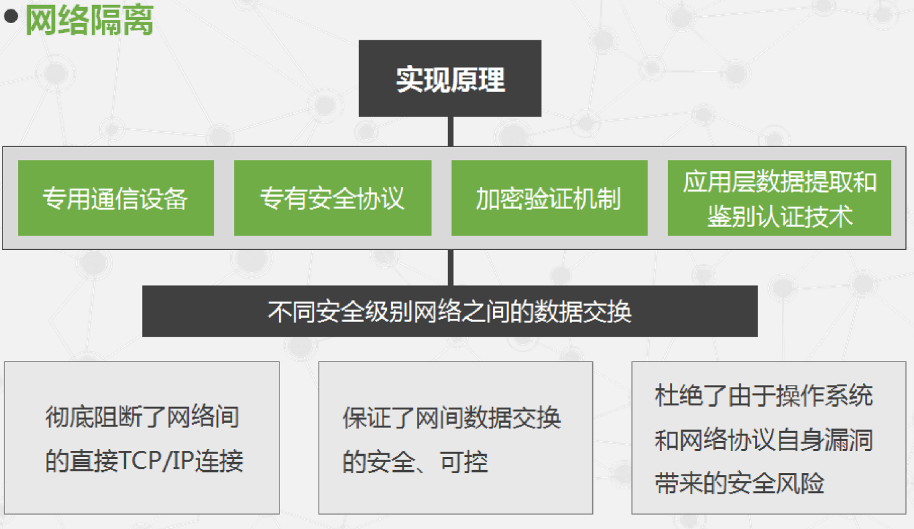

# 系统虚拟化技术应用