# 3.3-容器技术

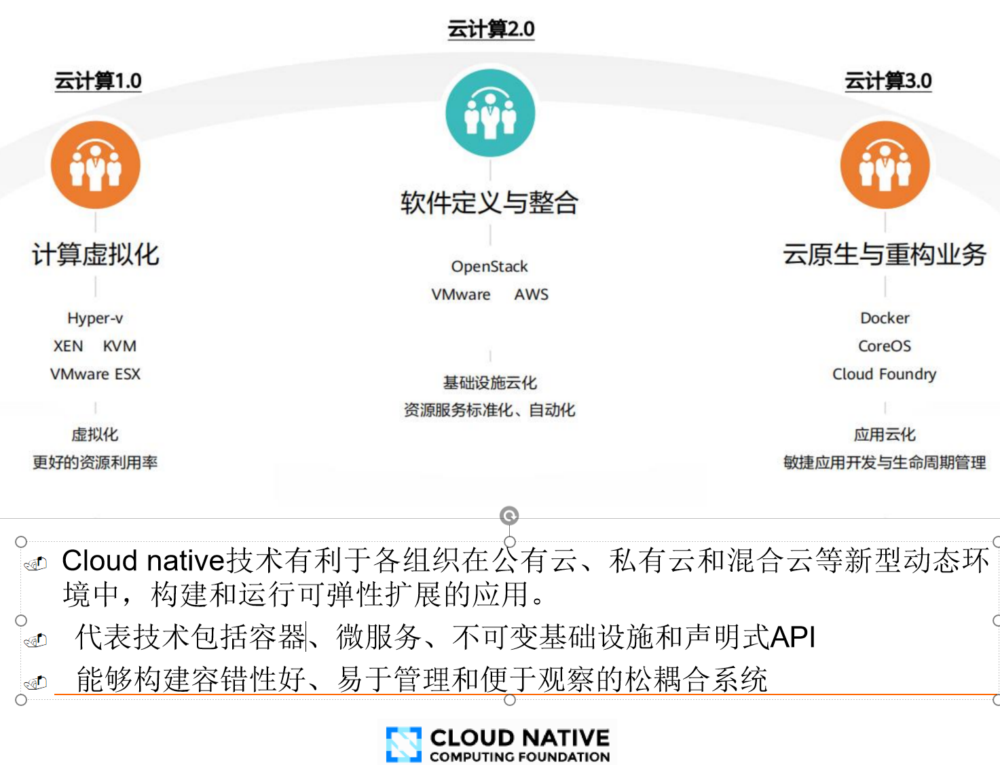

## 容器虚拟化技术相关概念

### 容器虚拟化技术的定义

容器虚拟化技术定义：是一种操作系统级的虚拟化方法，允许多个独立的容器在同一物理主机上运行，共享主机操作系统的内核资源。每个容器看起来像一个独立的虚拟机，但它们实际上共享相同的操作系统内核，这使得容器相对于传统虚拟化方法更轻量级和高效。

容器的定义：容器是容器image运行时的实例。（具有隔离、封装）

------

操作系统的内核可以提供多个相互隔离的用户实例（容器 image运行时的实例），这些用户态实例被称为容器。容器是操作系统层面的轻量级虚拟化技术

从应用程序的角度来说就是一台真实的计算机，因为容器具有：

- 文件系统
- 网络
- 系统设置
- 库函数

（本质上）容器技术是云计算操作系统的一种虚拟化信息技术。

### 容器与传统虚拟化的比较

#### 特性的比较

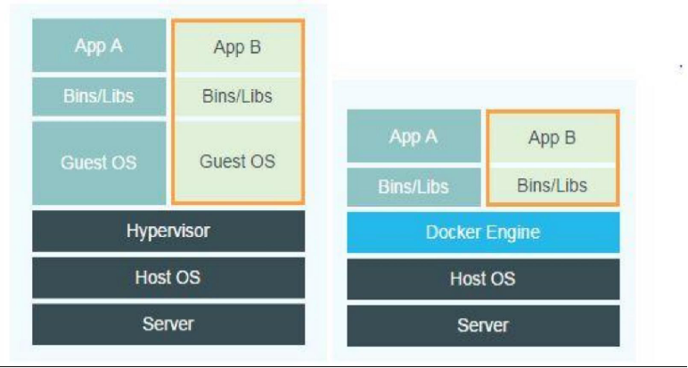

在解决的核心问题上：

| 对比项目       | 服务器虚拟化  | 容器                 |
| -------------- | ------------- | -------------------- |
| 解决的核心问题 | 资源划分/调配 | 应用开发、测试和部署 |

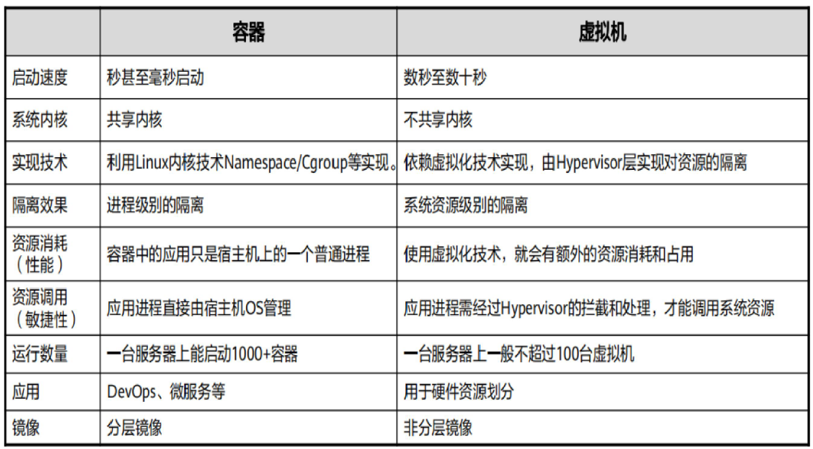

注：

- 分层镜像：它们由多个层次组成，每个层次都代表了一个文件系统的一部分。这些层次是只读的，它们可以被共享和重用，以便在多个镜像之间共享常见的文件和组件。
- 一种整体构建的镜像，它们没有由多个层次组成。

#### 性能比较

- docker运行效率和直接运行相比较没有区别
- 虚拟机会让效率减一半

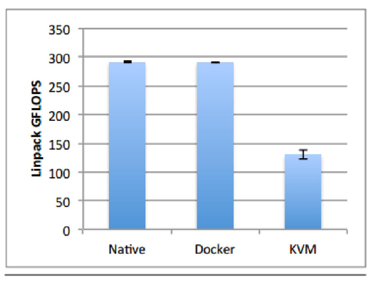

我认为引起性能差异的原因：

1. Docker应用归宿主机管理，可以直接发起系统调用，而在虚拟机中，必须通过VMM拦截并代替执行。
2. Docker无需操作系统，而VM需要安装操作系统。

### 容器技术的必要性（传统技术的挑战）

1. 一个应用可能由多个服务组成，每个服务都有其独特的依赖（依赖多）
2. 应用可能会需要部署到多种不同的环境中

这使得一个应用在“开发-测试-部署-运维”的过程中需要进 行大量的运行环境适配工作。同时还可能会有依赖的冲突

### 容器的创新、意义、优点

1. 打包了应用及其依赖（包含完整操作系统的所有文件和目录），妈妈再也不用担心部署环境了
2. 只需在隔离的“沙盒”中 运行该镜像
   - 无需进行任何修改和配置即可运行应用
   - 不会与现有的服务冲突
3. 实现应用及其运行环境整体打包以及打包格式统一。 实现本地环境与云端环境的高一致性。

### 容器技术的发展历史

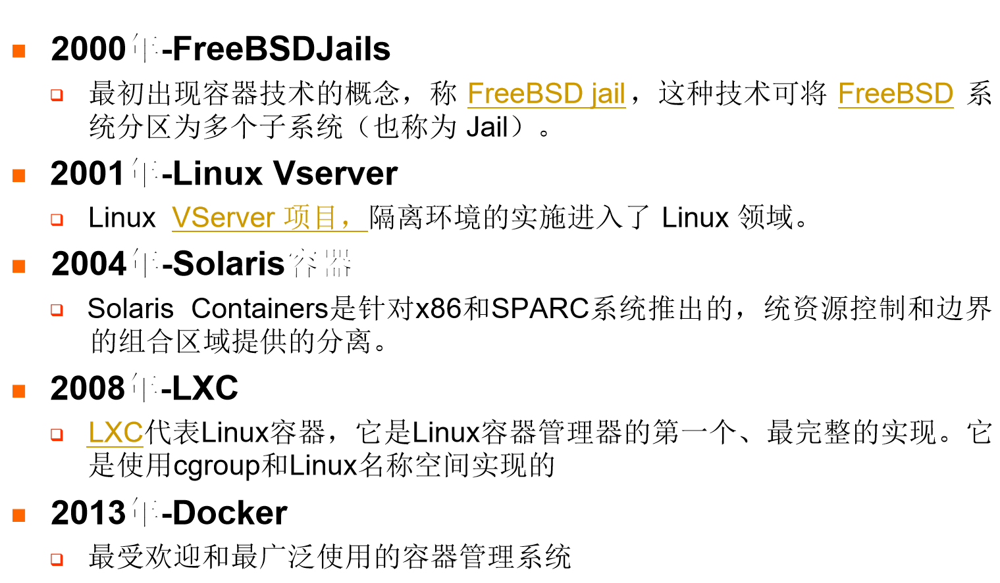

## Docker容器

### 基本常识

1. docker是由dotcloud公司开源
2. 使用go语言编写
3. 可以为任意应用创建一个轻量的、可移植的、自给自足的容器
4. 有CE版（社区版）和EE版（企业版）

### 定义

Docker是一个开源的应用容器引擎（基于Go语言 ) -可以将开发环境、代码、配置文件等一并打包到这个轻 量级、可移植的容器中，并发布和应用到任意平台中(Linux+windows）。

### Docker架构

Docker 使用客户端-服务器 (C/S) **架构模式**，使用远程API来管理和创建Docker容器。

1. 后台守护进程（Daemon）：Docker 后台守护进程是在计算机上运行的服务，它负责管理容器的生命周期和执行容器的操作。它监听来自 Docker 客户端的请求，并根据这些请求创建、管理和监控容器。守护进程还负责与容器运行时进行通信，以确保容器的正常运行。它在操作系统启动时自动启动，并持续运行以提供 Docker 服务。
2. 一组远程服务（Remote Services）：Docker 服务器包括一组远程服务，这些服务提供了一种方式，让 Docker 客户端可以从远程位置与 Docker 守护进程进行通信。这些服务包括 Docker REST API、Docker Compose 等。Docker 客户端可以通过使用 REST API 发送 HTTP 请求来与 Docker 服务器进行通信，从而实现容器的创建和管理。
3. 命令行程序（Command Line Interface - CLI）：Docker 客户端是一个命令行程序，允许用户与 Docker 服务进行交互。CLI 是用户与 Docker 交互的主要方式，它将用户的请求传递给 Docker 服务器。

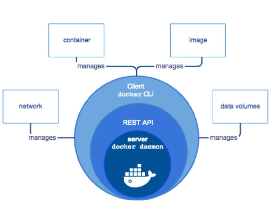


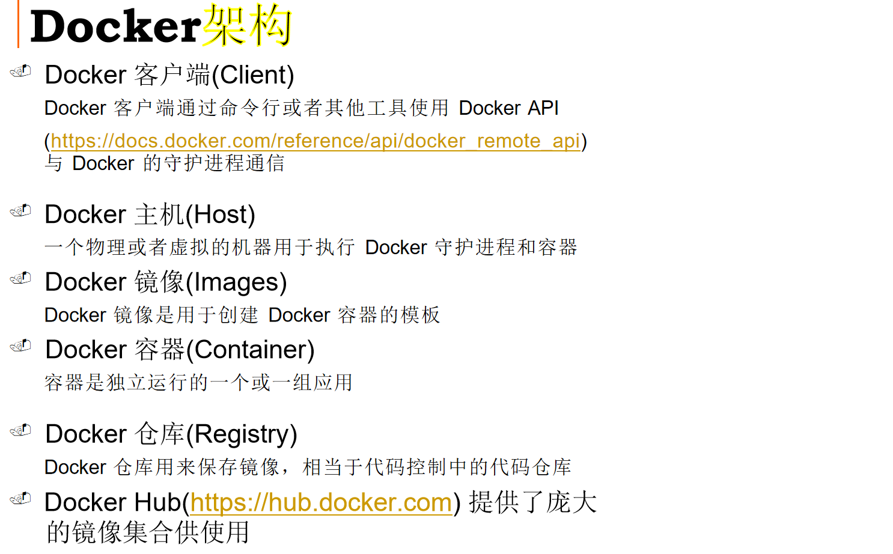

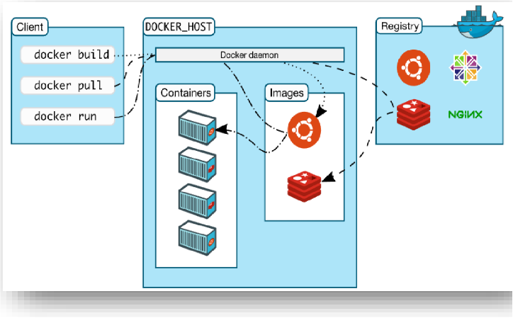

### Docker工作方式

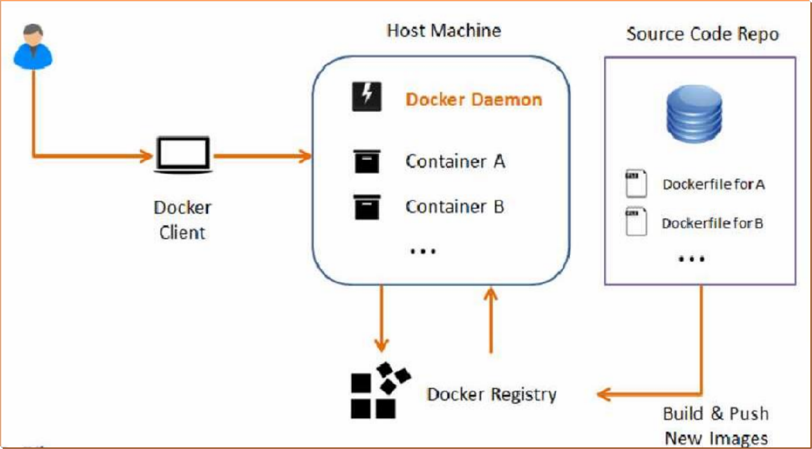

升级方式

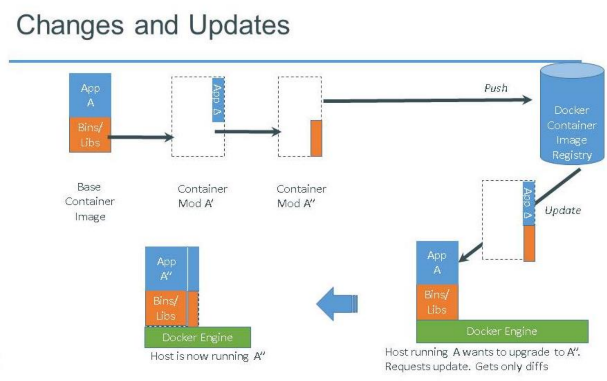

### docker 镜像

Docker 镜像是一个**只读**的 **docker 容器模板**（用于创建容器）。含有启 动 docker 容器所需的文件系统结构及其内容，因此  是启动一个 docker 容器的基础。

启动方式如下：

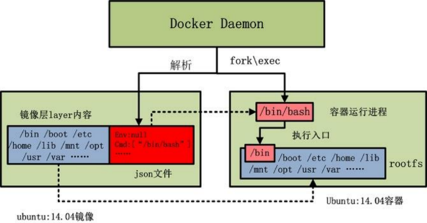

rootfs 是 docker 容器在启动时内部进程可见的文件系统，即 docker 容器 的根目录。 rootfs 通常包含一个操作系统运行所需的文件系统，例如可能 包含典型的类 Unix 操作系统中的目录系统， 如 /dev、/proc 、/bin、/etc、 /lib、/usr、/tmp 及运行 docker 容器所需的配置文件、工具等

### Dockerfile

Dockerfile 分为四部分：基础镜像信息、维护者信息、镜像操作指令、容器启动执行指令	

1. 基础镜像信息（Base Image Information）：Dockerfile的第一部分通常指定了用作基础镜像的基础操作系统或其他镜像。
2. 维护者信息（Maintainer Information）：这是一个可选的部分，通常包含有关Dockerfile的维护者或创建者的信息。这个字段用于提供联系信息或其他相关信息。
3. 镜像操作指令（Image Build Instructions）：这部分包含一系列指令，用于定义如何构建Docker镜像。这些指令可以包括安装软件包、复制文件、设置环境变量、运行命令等。每个指令都会在构建过程中创建一个新的镜像层，这些层按顺序堆叠在一起，构成最终的镜像。
4. 容器启动执行指令（Container Startup Execution Instructions）：最后一部分包含Docker容器启动时要执行的命令。这些命令定义了容器的初始行为，例如启动一个特定的应用程序或服务。

> Dockerfile可以构建出 一个新的镜像，每一条命令会和一个镜像层对应，镜像之间会存在  父子关系

常用指令如下：

`````
. FROM 指定基础镜像
. MAINTAINER 指定维护者信息，可以没有
. RUN 在命令前面加上RUN即可
. ADD COPY文件，会自动解压
. WORKDIR 设置当前工作目录
. VOLUME 设置卷，挂载主机目录
. EXPOSE 指定对外的端口
. CMD 指定容器启动后的要干的事情
. COPY 复制文件
. ENV 环境变量
. ENTRYPOINT 容器启动后执行的命令
`````


### Docker构建的基本流程

1. 查找、获取可用镜像
   从Docker Hub查找有哪些公共的可用镜像时，可以使用 如下命令
   - docker search keywords (例如centos)
   - docker pull : 从镜像仓库中拉取或者更新指定镜像
   - docker push : 将本地的镜像上传到镜像仓库,要先登陆到镜像仓库
2. 构建镜像
   - 从当前运行的容器创建
     docker commit :从容器创建一个新的镜像。
   - 使用dockerfile创建
     - 创建dockerfile（具体的内容见Dockerfile）
     -  使用docker build

然后就可以交付、发布这一个镜像，然后基于镜像，即可构建容器，完成部署。

### dockerfile、docker镜像、容器的比较

#### 概述

- Dockerfile 是软件的原材料（用于构建Docker images）
- Docker 镜像是软件的交付品（分发）
- Docker 容器则可以认为是软件的运行态（通过镜像创建容器，进而完成特定的功能）

#### Docker镜像和容器的关系

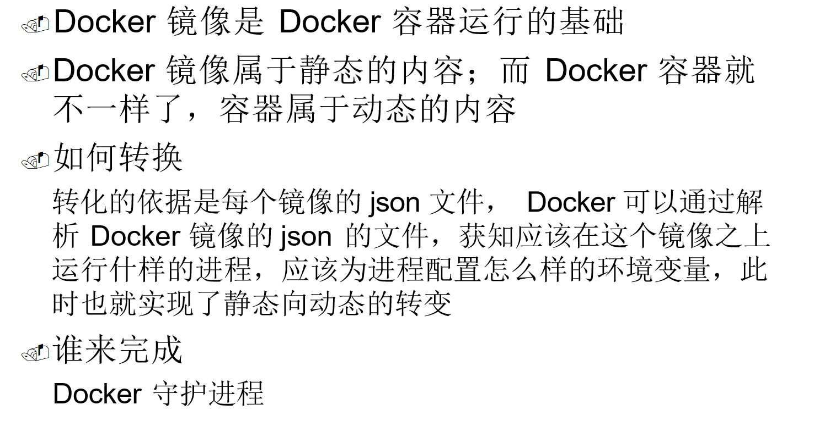

### docker的底层实现（核心技术）

基于两个技术：

- linux namespce：linux的namespce机制提供了一种资源隔离方案
- CGroup控制一个进程群组的资源

#### linux namespace

可以实现以下资源的隔离：

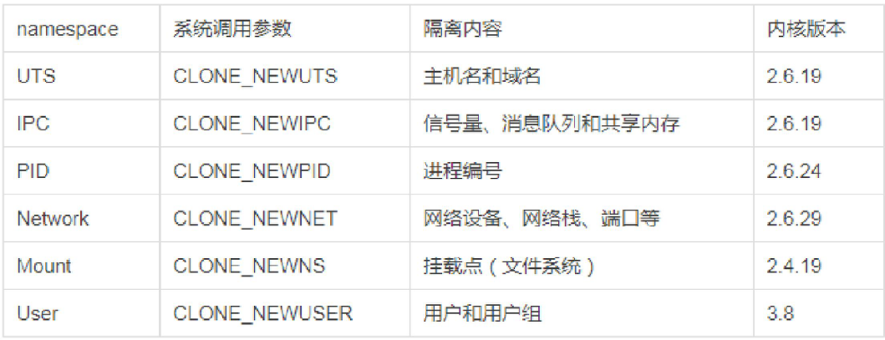

#### Cgroup（Linux Control Group ）

是Linux内核的一个功能。

用来限制，**控制与分离**一个进程组群的资源(  如CPU、内存、磁盘输入输出等）

功能如下：

- 资源限制：比如**内存使用上限**以及文件系统的缓存限制
- 优先级控制：不同的组有不同的优先级， 例如CPU利用和磁盘IO吞吐
- 审计：审计或统计资源使用情况， 主要目的是为了计费
- 控制：挂起进程，恢复执行进程

含有的子系统如下：

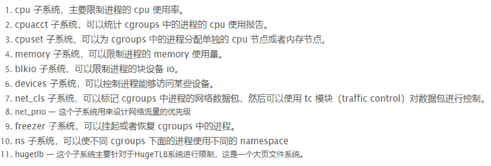