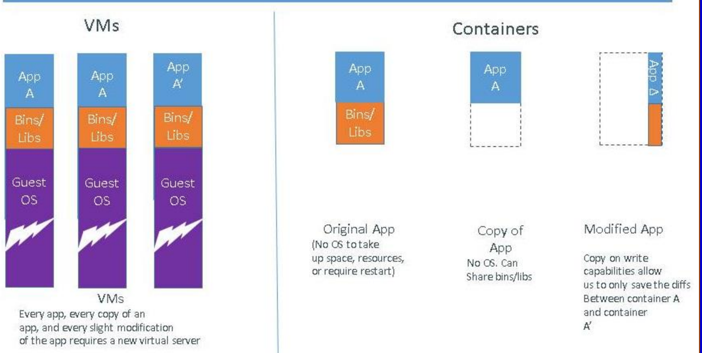
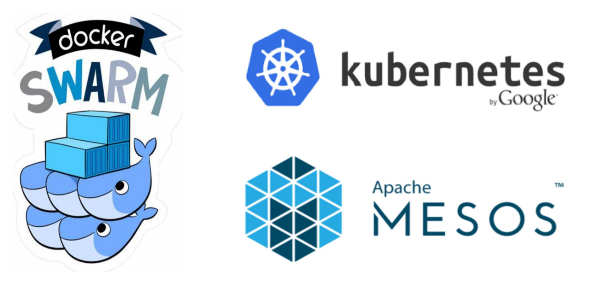
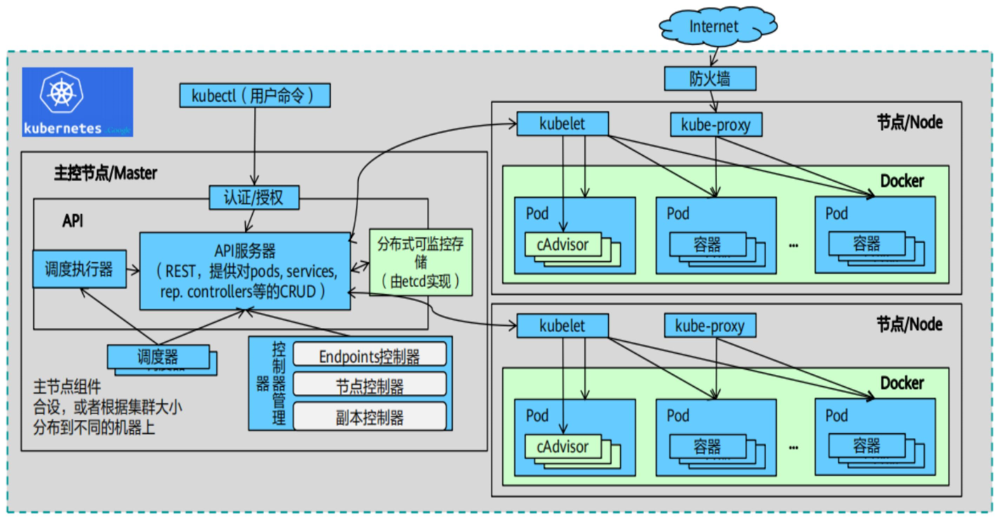
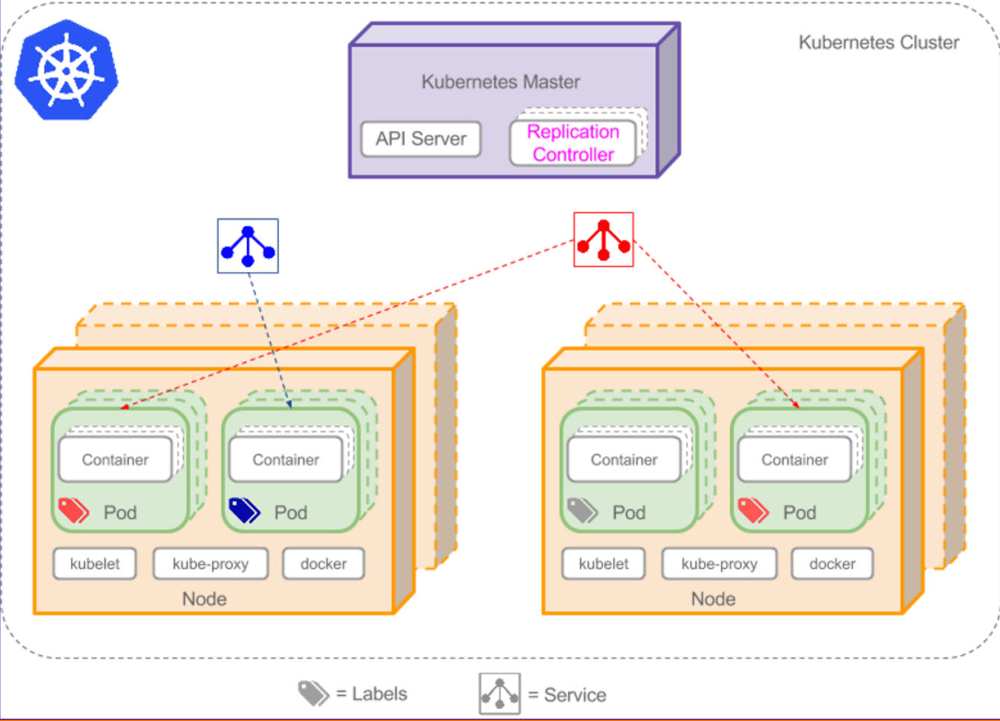
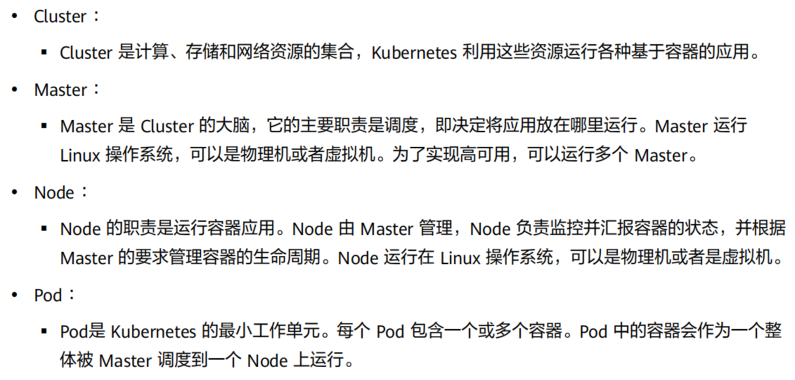
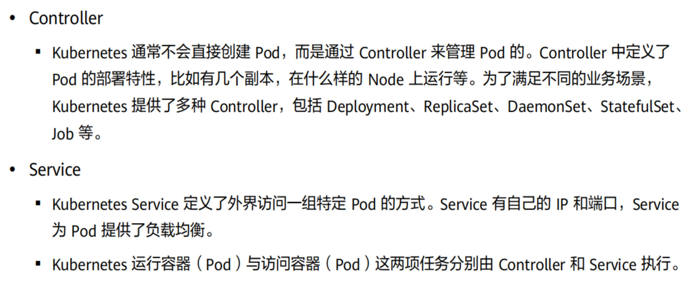
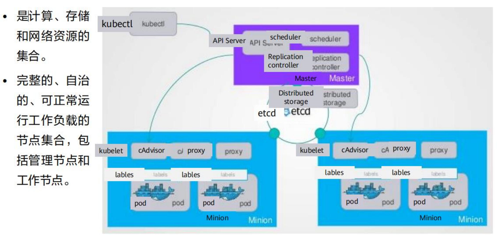
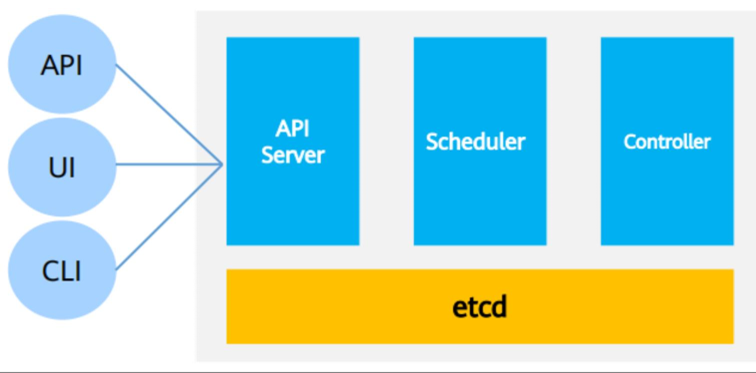
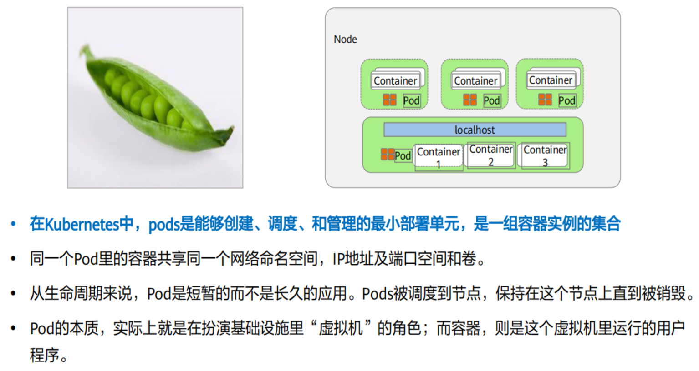
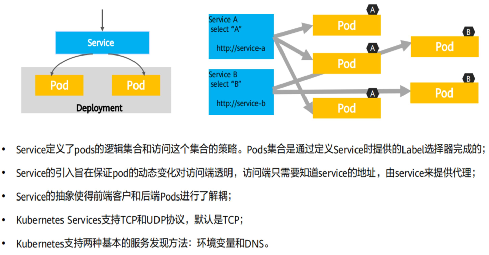

# 3.3-容器技术


## 容器虚拟化技术相关概念

### 容器虚拟化技术的定义

容器虚拟化技术定义：是一种操作系统级的虚拟化方法，允许多个独立的容器在同一物理主机上运行，共享主机操作系统的内核资源。每个容器看起来像一个独立的虚拟机，但它们实际上共享相同的操作系统内核，这使得容器相对于传统虚拟化方法更轻量级和高效。

容器的定义：容器是容器image运行时的实例。（具有隔离、封装）

------

操作系统的内核可以提供多个相互隔离的用户实例（容器 image运行时的实例），这些用户态实例被称为容器。容器是操作系统层面的轻量级虚拟化技术

从应用程序的角度来说就是一台真实的计算机，因为容器具有：

- 文件系统
- 网络
- 系统设置
- 库函数

（本质上）容器技术是云计算操作系统的一种虚拟化信息技术。

### 容器与传统虚拟化的比较

#### 特性的比较


在解决的核心问题上：

| 对比项目       | 服务器虚拟化  | 容器                 |
| -------------- | ------------- | -------------------- |
| 解决的核心问题 | 资源划分/调配 | 应用开发、测试和部署 |


注：

- 分层镜像：它们由多个层次组成，每个层次都代表了一个文件系统的一部分。这些层次是只读的，它们可以被共享和重用，以便在多个镜像之间共享常见的文件和组件。
- 一种整体构建的镜像，它们没有由多个层次组成。

#### 性能比较

- docker运行效率和直接运行相比较没有区别
- 虚拟机会让效率减一半


#### 我认为引起性能差异的原因

1. Docker应用归宿主机管理，可以直接发起系统调用，而在虚拟机中，必须通过VMM拦截并代替执行。
2. Docker无需操作系统，而VM需要安装操作系统。

### 容器技术的必要性（传统技术的挑战）

1. 一个应用可能由多个服务组成，每个服务都有其独特的依赖（依赖多）
2. 应用可能会需要部署到多种不同的环境中

这使得一个应用在“开发-测试-部署-运维”的过程中需要进 行大量的运行环境适配工作。同时还可能会有依赖的冲突

### 容器的创新、意义、优点

1. 打包了应用及其依赖（包含完整操作系统的所有文件和目录），妈妈再也不用担心部署环境了
2. 只需在隔离的“沙盒”中 运行该镜像
   - 无需进行任何修改和配置即可运行应用
   - 不会与现有的服务冲突
3. 实现应用及其运行环境整体打包以及打包格式统一。 实现本地环境与云端环境的高一致性。

> 具体的Docker容器内容见Docker容器--Docker容器的特点、优点

### 容器技术的发展历史


## Docker容器

### 基本常识

1. docker是由dotcloud公司开源
2. 使用go语言编写
3. 可以为任意应用创建一个轻量的、可移植的、自给自足的容器
4. 有CE版（社区版）和EE版（企业版）

### 定义

Docker是一个开源的应用容器引擎（基于Go语言 ) -可以将开发环境、代码、配置文件等一并打包到这个轻 量级、可移植的容器中，并发布和应用到任意平台中(Linux+windows）。

### Docker架构

Docker 使用客户端-服务器 (C/S) **架构模式**，使用远程API来管理和创建Docker容器。

1. 后台守护进程（Daemon）：Docker 后台守护进程是在计算机上运行的服务，它负责管理容器的生命周期和执行容器的操作。它监听来自 Docker 客户端的请求，并根据这些请求创建、管理和监控容器。守护进程还负责与容器运行时进行通信，以确保容器的正常运行。它在操作系统启动时自动启动，并持续运行以提供 Docker 服务。
2. 一组远程服务（Remote Services）：Docker 服务器包括一组远程服务，这些服务提供了一种方式，让 Docker 客户端可以从远程位置与 Docker 守护进程进行通信。这些服务包括 Docker REST API、Docker Compose 等。Docker 客户端可以通过使用 REST API 发送 HTTP 请求来与 Docker 服务器进行通信，从而实现容器的创建和管理。
3. 命令行程序（Command Line Interface - CLI）：Docker 客户端是一个命令行程序，允许用户与 Docker 服务进行交互。CLI 是用户与 Docker 交互的主要方式，它将用户的请求传递给 Docker 服务器。


### Docker工作方式


升级方式


### docker 镜像

Docker 镜像是一个**只读**的 **docker 容器模板**（用于创建容器）。含有启 动 docker 容器所需的文件系统结构及其内容，因此  是启动一个 docker 容器的基础。

启动方式如下：


rootfs 是 docker 容器在启动时内部进程可见的文件系统，即 docker 容器 的根目录。 rootfs 通常包含一个操作系统运行所需的文件系统，例如可能 包含典型的类 Unix 操作系统中的目录系统， 如 /dev、/proc 、/bin、/etc、 /lib、/usr、/tmp 及运行 docker 容器所需的配置文件、工具等

### Dockerfile

Dockerfile 分为四部分：基础镜像信息、维护者信息、镜像操作指令、容器启动执行指令	

1. 基础镜像信息（Base Image Information）：Dockerfile的第一部分通常指定了用作基础镜像的基础操作系统或其他镜像。
2. 维护者信息（Maintainer Information）：这是一个可选的部分，通常包含有关Dockerfile的维护者或创建者的信息。这个字段用于提供联系信息或其他相关信息。
3. 镜像操作指令（Image Build Instructions）：这部分包含一系列指令，用于定义如何构建Docker镜像。这些指令可以包括安装软件包、复制文件、设置环境变量、运行命令等。每个指令都会在构建过程中创建一个新的镜像层，这些层按顺序堆叠在一起，构成最终的镜像。
4. 容器启动执行指令（Container Startup Execution Instructions）：最后一部分包含Docker容器启动时要执行的命令。这些命令定义了容器的初始行为，例如启动一个特定的应用程序或服务。

> Dockerfile可以构建出 一个新的镜像，每一条命令会和一个镜像层对应，镜像之间会存在  父子关系

常用指令如下：

`````
. FROM 指定基础镜像
. MAINTAINER 指定维护者信息，可以没有
. RUN 在命令前面加上RUN即可
. ADD COPY文件，会自动解压
. WORKDIR 设置当前工作目录
. VOLUME 设置卷，挂载主机目录
. EXPOSE 指定对外的端口
. CMD 指定容器启动后的要干的事情
. COPY 复制文件
. ENV 环境变量
. ENTRYPOINT 容器启动后执行的命令
`````


### Docker构建的基本流程

1. 查找、获取可用镜像
   从Docker Hub查找有哪些公共的可用镜像时，可以使用 如下命令
   - docker search keywords (例如centos)
   - docker pull : 从镜像仓库中拉取或者更新指定镜像
   - docker push : 将本地的镜像上传到镜像仓库,要先登陆到镜像仓库
2. 构建镜像
   - 从当前运行的容器创建
     docker commit :从容器创建一个新的镜像。
   - 使用dockerfile创建
     - 创建dockerfile（具体的内容见Dockerfile）
     -  使用docker build

然后就可以交付、发布这一个镜像，然后基于镜像，即可构建容器，完成部署。

### dockerfile、docker镜像、容器的比较

#### 概述

- Dockerfile 是软件的原材料（用于构建Docker images）
- Docker 镜像是软件的交付品（分发）
- Docker 容器则可以认为是软件的运行态（通过镜像创建容器，进而完成特定的功能）

#### Docker镜像和容器的关系


### docker的底层实现（核心技术）

基于两个技术：

- linux namespce：linux的namespce机制提供了一种资源隔离方案
- CGroup控制一个进程群组的资源

#### linux namespace

可以实现以下资源的隔离：


#### Cgroup（Linux Control Group ）

是Linux内核的一个功能。

用来限制，**控制与分离**一个进程组群的资源(  如CPU、内存、磁盘输入输出等）

功能如下：

- 资源限制：比如**内存使用上限**以及文件系统的缓存限制
- 优先级控制：不同的组有不同的优先级， 例如CPU利用和磁盘IO吞吐
- 审计：审计或统计资源使用情况， 主要目的是为了计费
- 控制：挂起进程，恢复执行进程

含有的子系统如下：


内核使用 cgroup 结构体来表示对一个或多个 cgroups 子系统的资源限制。这些 cgroup 结构体可以组织成一种树状结构，每一棵由 cgroup 结构体组成的树都被称为一个 cgroups 层级结构。

- 一个 cgroups 层级结构可以附加一个或多个 cgroups 子系统，当前层级结构可以对其附加的 cgroups 子系统进行资源限制。
- 每个 cgroups 子系统只能附加到一个 CPU 层级结构中。

### **Docker**容器的基本操作

`````
docker run ：创建一个新的容器并运行一个命令
docker run  [OPTIONS]  IMAGE  [COMMAND]  [ARG...]     Example：
docker run ubuntu echo “Helloworld!”
进入容器方法
docker run –i –t centos /bin/bash
退出/离开容器
Ctr+p ctr+q
docker attach containerID
docker exec –it centos /bin/bash
docker start :启动一个或多个已经被停止的容器          docker stop :停止一个运行中的容器
docker restart :重启容器
docker  rm :删除停止的容
. 常用的容器操作
docker -help
docker ps : 列出容器，查看正在运行的容器
docker inspect : 获取容器/镜像的元数据。
docker top :查看容器中运行的进程信息，支持 ps 命令参数
docker attach :连接到正在运行中的容器。
docker logs : 获取容器的日志
`````

### Docker的特点、优点

1. 标准化交付物
   Docker在软件工程领域扮演着标准化交付组件的角色，可以将其比作物流中的集装箱。集装箱的标准化设计显著提高了物流效率。

2. 一次构建，多次交付
   Docker镜像具备“一次构建，多次交付”的特点。这意味着无论是多副本部署还是应用程序迁移，都能够极大地简化操作，充分展现了Docker的价值。

3. 应用隔离
   Docker可以有效实现不同应用程序之间的隔离，减少相互影响，而与虚拟机相比，开销更小。

4. 简化程序
   Docker 让开发者可以打包他们的应用以及依赖包到一个可移植的容器中， 然 后发布到任何流行的 Linux 机器上，便可以实现虚拟化。 Docker改变了虚拟化 的方式，使开发者可以直接将自己的成果放入Docker中进行管理。方便快捷已 经是 Docker的最大优势， 过去需要用数天乃至数周的 任务，在Docker容器的 处理下，只需要数秒就能完成

5. 简化选择
   Docker 镜像中包含了运行环境和配置， 所以 Docker 可以简化部署多种应用实 例工作。

6. 节省开支
   - 不必为了追求效果而配置高额的硬件。Docker 改变了高性能必然高价格的思维定势。 
   - Docker 与云的结合，让云空间 得到更充分的利用。不仅解决了硬件管理的问题，也改变了虚拟化的方式

### Docker应用场景

- Web 应用的自动化打包和发布

- 自动化测试和持续集成、发布

- 在服务型环境中部署和调整数据库或其他的后台应用

- 从头编译或者扩展现有的OpenShift或Cloud Foundry 平台来搭建自己的PaaS环境

### Docker轻量化



### Docker与LXC的区别

下表总结了Docker与LXC之间的区别：

| 特征       | Docker                                 | LXC                           |
| ---------- | -------------------------------------- | ----------------------------- |
| 虚拟化类型 | 容器虚拟化                             | 系统容器虚拟化                |
| 用户体验   | 提供出色的开发人员和用户体验           | 用户体验较差                  |
| 功能       | 提供多项功能，包括构建、传输和版本控制 | 主要用于轻量级虚拟化          |
| 进程管理   | 鼓励应用程序各自独立运行进程           | 使用init系统管理多种进程      |
| 资源隔离   | 通过容器隔离资源                       | 通过Linux系统容器隔离资源     |
| 应用隔离   | 应用程序可以独立运行进程               | 应用程序通常作为整体运行      |
| 镜像管理   | 使用Docker镜像管理容器                 | 镜像管理通常依赖于Linux发行版 |
| 生态系统   | 具有广泛的生态系统和支持               | 生态系统相对较小，支持有限    |
| 开发者社区 | 拥有活跃的开发者社区                   | 社区支持较少                  |

. 轻量级 虚拟化 这一功能来看， **LXC** 非常有用， 但它无法提供出色的开发人员或用户体验。

. 除了运行容器之外， Docker 技术还具备其他多项功能，包括 简化用于构建容器、传输镜像以及控制镜像版本的流程

. 传统的 Linux 容器使用 init 系统来管理多种进程。所有应用程 序都作为一个整体运行；与此相反， Docker 技术鼓励应用程 序各自独立运行其进程，并提供相应工具以实现这一功能

## 容器编排技术

容器编排是指通过**容器编排工具**来支持应用程序的容器化部署和组织。这些工具能够自动化管理容器的部署、调度和组织，以提供高效的应用程序管理和运行环境。

容器编排工具具有的典型特征：

1. 调度
2. 资源管理
3. 服务发现（在分布式环境中识别、定位和访问各种网络服务和资源的能力）
4. 健康检查
5. 自动伸缩
6. 更新与升级

### 三大巨头

1. Kubernetes (k8s): Kubernetes 是一个开源的容器编排和容器管理工具，最初由 **Google 开发并开源**。它提供了强大的容器编排功能，允许用户轻松地管理大规模容器化应用程序。Kubernetes 提供了自动化部署、扩展、负载均衡、自愈能力等功能，使得应用程序在容器环境中更加稳定和可靠。Kubernetes 的生态系统也非常丰富，有大量的扩展和工具可供使用。
2. Docker Swarm (Swarm): Docker Swarm 是 **Docker** 公司推出的容器编排工具，它专注于简化容器集群的管理。与 Kubernetes 相比，Swarm **更容易上手**，适用于小型和中型应用程序的容器编排需求。Swarm 支持多节点集群的管理，提供负载均衡和自动扩展等功能。虽然 Swarm 功能较为基础，但对于初学者或小规模项目来说是一个不错的选择。
3. Apache Mesos 是一个分布式系统内核，它提供了高效的资源管理和集群编排的功能。与之前提到的容器编排工具不同，Mesos 更侧重于通用的资源调度和管理，而不仅仅限于容器。



### Kubenetus/k8s

Kubernetes（通常简称为K8s）是当前广泛认可的**容器编排技术**的**分布式**解决方案。这个开源项目具有高度活跃的社区支持，并于2014年由Google根据其长达15年的大规模集群管理经验结合Docker技术而开源。Kubernetes是一个自动化容器操作的开源平台，其开放的生态系统吸引了业界顶级公司如Redhat、VMware、华为等的积极参与，共同推动了容器编排技术的发展，使其成为行业事实标准。在2015年，这些顶级公司联合成立了CNCF云原生基金会，将其确立为云计算领域的顶级开源组织。





### 重要概念





#### cluster



#### Master

Kubernetes体系中的核心组件包括API Server、Scheduler、Controller和etcd。

- API Server负责接收请求并执行认证和鉴权等工作
  提供了 **Http Rest**接口的关键服务进程，是**Kubernetes**里所有资源的 增、删、改、查等操作的唯一入口， 也是集群控制的入口进程
- Scheduler负责任务调度
  负责资源调度(Pod调度)的进程， 相当于公交公司的“调度室”
- 而Controller则负责策略引擎，根据不同的工作负载执行不同的策略，如处理无状态或有状态应用程序。
  **Kubernetes**里所有资源对象的自动化控制中心，可以理解为资源对象 的**“**大总管”
- etcd是负责存储Kubernetes集群配置信息以及各种资源状态信息的关键组件。这些核心组件协同工作，使Kubernetes能够有效地管理容器化应用程序。
  Kubernetes里的所有资源对象的数据全部是保存在etcd中的



#### **Node**节点

- Kubelet
  1. 负责Pod对应的容器的创建、启停等任务，
  2. 同时与 Master节  点密切协作，实现集群管理的基本功能

- kube-proxy
  实现 Kubernetes Service 的通信与负载均衡机制的重要组件

- Docker Engine( docker)

  Docker引擎，负责本机的容器创建和管理工作

#### Pod节点



#### Service



