# 4.1-云计算数据中心

> 云计算数据中心——支撑云计算服务的数据中心。
>
> 数据中心往往是用大量服务器通过巨大的互连网络构建而成
>
> 

## 云数据中心设计与特征

### 相关概念

- 资源池 resource pool
  云计算数据中心提供的**物理或虚拟资源的聚合**。内部各资源池之间相互依赖相互支撑
- 弹性 elasticity
  云计算数据中心的**场地、设施和资源池按需分配、回收和调整**的能力
- 数据中心 data center
  由计算机场地、配套基础设施、信息系统硬件(物理和虚拟资源)、信息系统软件、信息资源(数据)和人员以及相应的规章制度组成的组织。
- 云计算数据中心 cloud computing data center
  支撑云计算服务的数据中心。

#### 资源池详细介绍

#### 电能使用效率

### 云计算数据中心规模巨大

数据中心通常由大量服务器通过庞大的互连网络构建而成，云计算的基础之一就是大规模的数据中心。

典型情况下，数据中心可以容纳从40万台到100万台不等的服务器。这种规模化的结构带来了成本效益，因为较大规模的数据中心通常拥有更低的单位成本。

**总结而言，数据中心的规模越大，单位成本越低。**

数据中心规模范围从“边缘”设施到超大规模（100K 到 1M 服务器）

同时，国内新建立的数据中心以大型和超大型为主。

### 云数据中心的几个特征

1. **高设备利用率**

   采用**虚拟化技术**进行系统和数据中心整合,优化资源利用率、简化管理。

2. **绿色节能**

   通过先进的**供电和散热技术**，降低数据中心的能耗。

3. **高可用性**

   当网络扩展或升级时，网络能够正常运行，对网络的性能影响不大。

4. **自动化管理**

   云数据中心应是24×7小时，无人值守并可远程管理的。

### 云计算数据中心的关键要素

### 云存储系统

在云中存储的主要类型有三种：

1. 文件存储
2. 块存储
3. 对象存储、key-value存储

#### 常见的存储软件

• Ceph（分布式存储）对象存储、块存储和文件存储 -C++

• Redis（key-value数据库） -NoSQL支持每秒十几万次的读/写操作 -C语言

• Mongodb（内存数据库）-基于分布式文件存储的开源NoSQL数据库系统， C++

### 我国概括

## 云数据中心网络部署

### 需要满足的要求

数据中心关键的核心设计是数据中心集群中所有服 务器之间的互连网络，其中的网络设计必须满足5个特 殊要求：

1. 低延迟
2. 高带宽
3. 低成本
4. 消息传递接口（MP I） 通信支持
5. 容错

同时要满足：所有服务器节点之间的

- 点对点通信模式：在这种模式下，一个服务器节点直接与另一个服务器节点进行通信，就像两个节点之间建立了一个直接的连接。
- 群通信模式：在这种模式下，一个服务器节点可以同时与多个其他节点进行通信，形成一个群组或广播。

### 传统架构

### 不同的网络体系结构对比

### 新型的网络部署架构

#### 改进型树结构--FatTree胖树

胖树结构在上层增加了通信链路，使通往上层支 干结点和根结点的线路变胖，解决了二叉树中的 瓶颈问题

#### 递归层次结构

#### 光交换网络

#### 无线数据中心网络

1. 优点：无线技术可以在不必进行重新布线的情况下灵活调整拓扑，省去了复杂的布线工作
2. 缺点、不足：
3. 但无线技术在提供足  够带宽的前提下，其传输距离是有限的，因而限制了其在大规模数据中心的部署。

#### 软件定义网络

分离控制平面和数据转发平面。传统网络中，网络设备（如交换机和路由器）通常集成了控制逻辑和数据处理功能，这使得网络管理和配置相对固定和复杂。SDN将这两个平面分离开来，控制平面负责网络管理和控制，而数据转发平面负责实际的数据包转发。
优点（Advantages）：

1. 灵活性：SDN允许网络管理员根据需要轻松配置和调整网络，以满足不同的应用需求。
2. 集中化管理：中心化的管理使网络更容易监控和维护。
3. 自动化：SDN能够自动响应流量和需求变化，提高网络效率。
4. **可编程性**：管理员可以使用软件定义网络的控制器来自定义网络行为。
5. 流量工程：SDN可实现流量工程以优化数据包的路由和传输。

缺点（Disadvantages）：

1. 安全风险：中心控制器成为攻击目标可能导致安全问题。
2. 高成本：部署SDN可能需要更高的初期投资。
3. 可扩展性：对于大规模网络，SDN可能需要更多的资源和规划。
4. 标准化问题：SDN标准仍在发展中，可能存在互操作性问题。
5. 服务器的处理性能可能制约其规模的发展。
6. 存在单点故障。

Google 在其广域网数据中心已经大规模使用基于  OpenFlow的SDN技术，通过10G网络链接分布全球的12个数据中心， 实现了  数据中心的流量工程和实  时管控功能， 使其数据中  心的核心网络带宽利用率  提高到了100% ，谷歌将自  己的SDN网络命名为为B4， 其网络结构图如图所示。

## 绿色节能技术

### 现状、电力消耗的计算公式

能耗分布

**如何进行电力成本估算：**

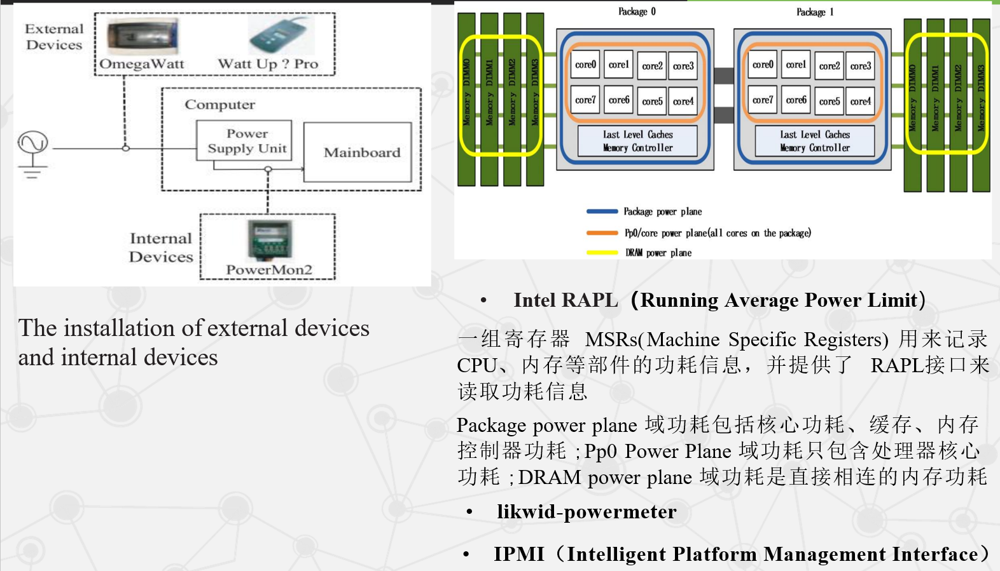

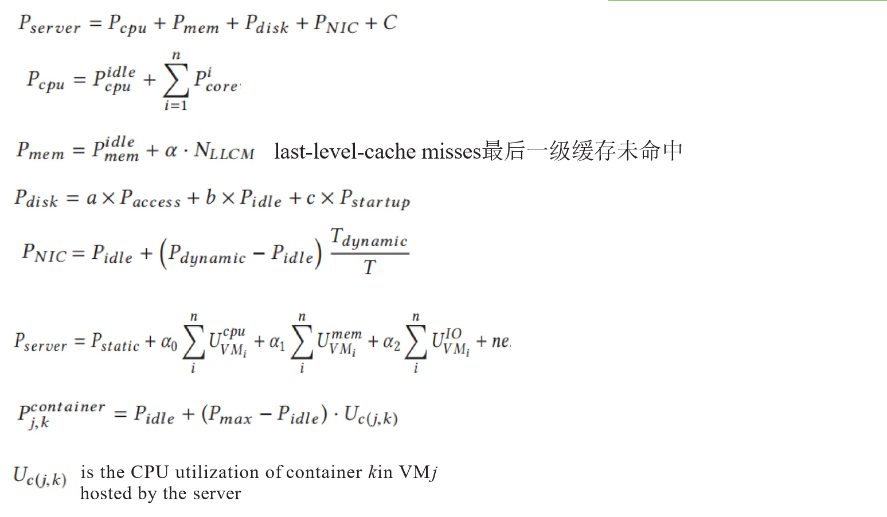

1. 能效比（EER）： 能效比是用来衡量制冷系统的效率的参数，它表示每消耗一单位电能，制冷系统能够移除多少热量。EER通常以以下公式表示：

   EER = 制冷量（BTU/h） / 功耗（瓦特）

2. PUE（Power Usage Effectiveness）： PUE是用来衡量数据中心的能效性能的参数，它表示数据中心的总能耗与计算设备的能耗之间的比值。PUE通常以以下公式表示：

   PUE = 总能耗 / 计算能耗

   这里的总能耗是数据中心的总电能消耗，包括冷却系统、照明、UPS等，而计算能耗是数据中心中用于运行计算设备的电能消耗。

3. SPUE（Site Power Usage Effectiveness）： SPUE是一种数据中心能效参数，考虑了数据中心的外部能源因素，例如供电系统的损耗。SPUE通常以以下公式表示：

   SPUE = 总能耗 / (计算能耗 + 非计算能耗)

   非计算能耗包括了数据中心运行所需的其他电能，但不包括计算设备本身的电能消耗。

4. 计算能耗（computation energy）： 计算能耗是指数据中心中用于运行计算设备的电能消耗，通常以瓦特（W）为单位表示。计算能耗直接影响数据中心的性能和能效。

5. 总能耗（Total Energy）： 总能耗是数据中心的总电能消耗，包括了计算能耗、冷却系统的电能消耗以及其他非计算设备的电能消耗。它是数据中心运行的总能量消耗。

### PUE - Power Usage Effectiveness

2006年ChristianBelady提出了数据中心能源利用率（PUE）的概念，如今， PUE已发展成为一个全球性的评价数据中心能源效率的指标。

基准是2，比值越接近1，表示数据中心的能源效率越高。

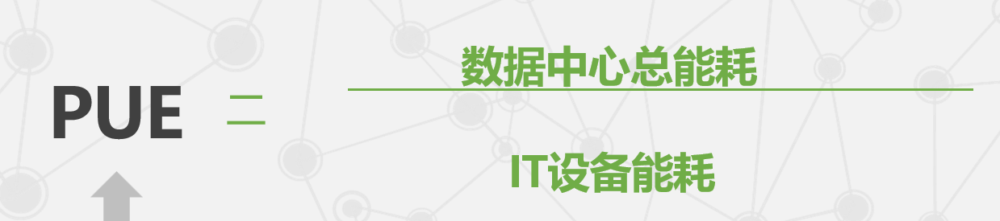

### 绿色节能技术

#### 配电系统节能技术

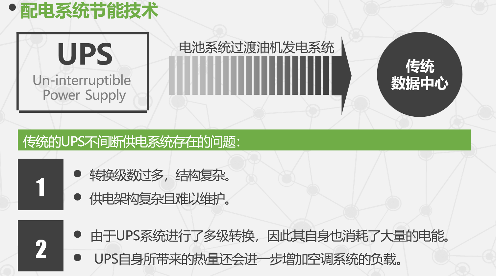

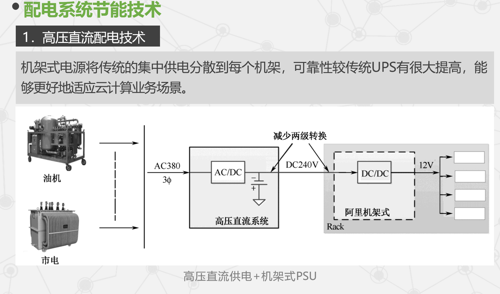

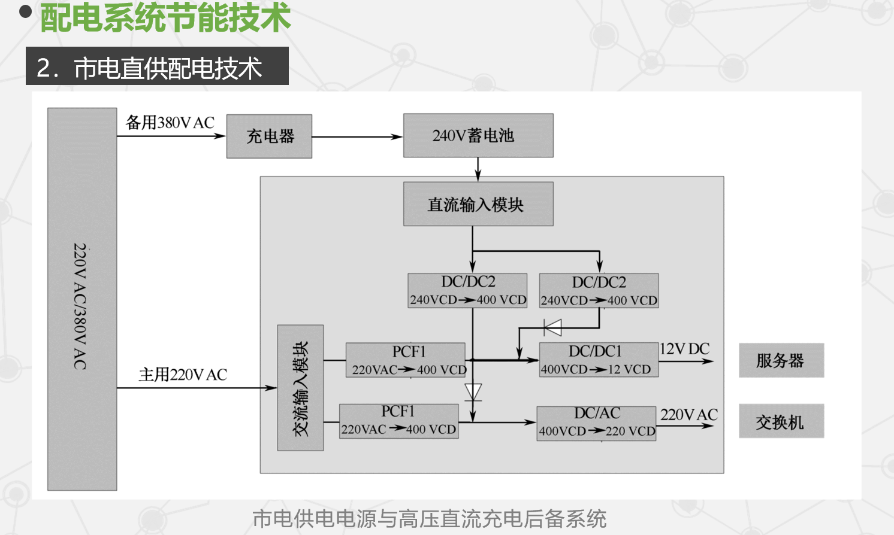

#### 空调系统节能技术

在数据中心运行过程中，服务器节点、网络设备、办公环境等时刻产生着热量，如果不能及时散发热量，数据中心将无法运行。

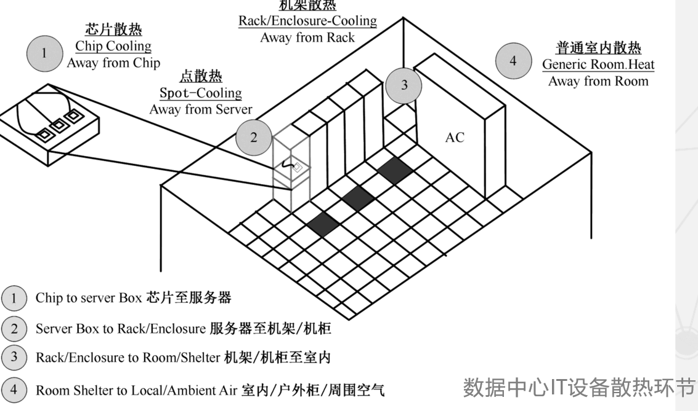

**解决的核心理念：注重IT设备的温湿度要求，高效解决区域化的制冷。——是机架级别甚至是IT设备级别的制冷解决方案，而非着眼机房环境温湿度控制。**

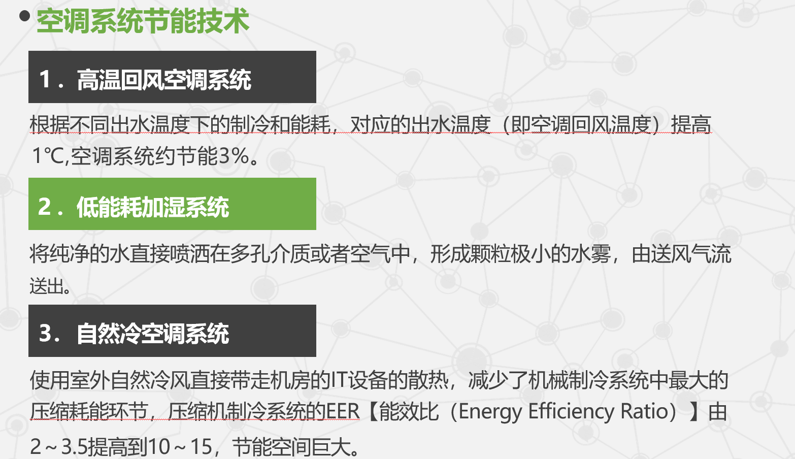

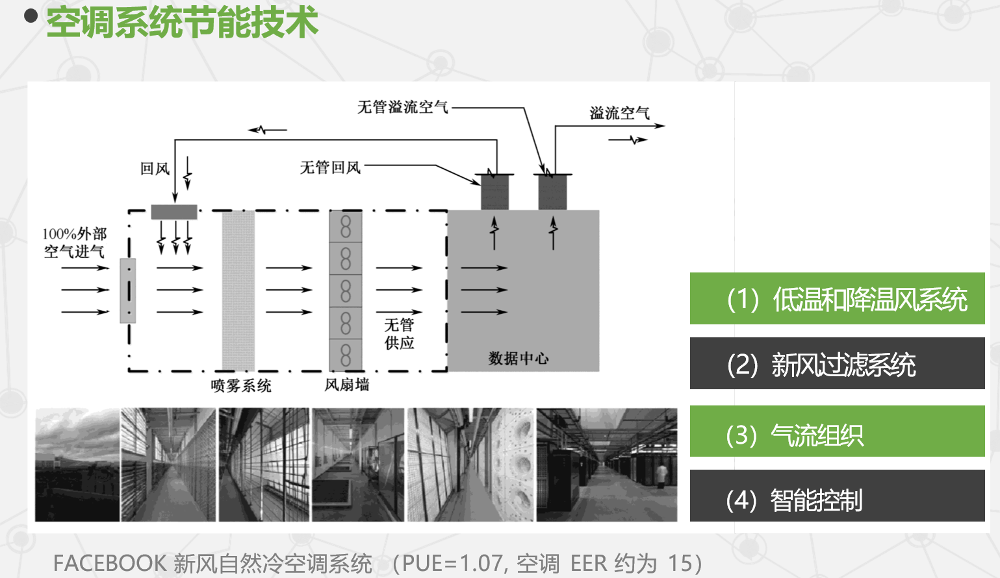

#### 集装箱数据中心节能技术

将数据中心的**服务器设备、网络设备、空调设备、供电设备**等**高密度**地装入**固定尺寸**的集装箱中，使其成为数据中心的**标准构建模块**，进而通过若干**集装箱模块网络和电力的互连互通**构建完整的数据中心。

目前有：

- Microsoft芝加哥数据中心
- Google俄勒冈州Dalles 数据中心
- Amazon俄勒冈州 Perdix数据中心

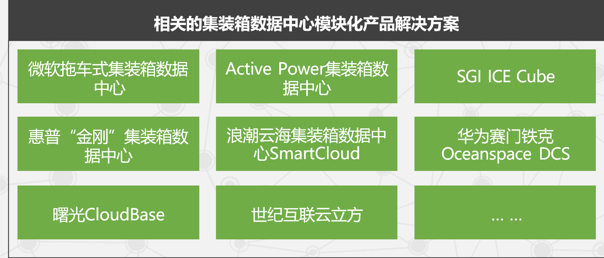

##### 优点、特色

1. 高密度
   集装箱数据中心模块可容纳高密度计算设备，相同空间内可容纳六倍于传 统数据中心的机柜数量。
2. 模块化
   建立一个最优的数据中心生态系统，具有恰如所需的供电、冷却和计算能 力等。
3. 按需快速部署
   集装箱数据中心不需要企业再经过空间租用、土地申请、机房建设、硬件 部署等周期，可大大缩短部署周期。
4. 移动便携
   集装箱数据中心的安装非常容易，只需要提供电源连接、水源连接（用于 冷却）和数据连接即可。

##### 在节能方面的优点

1. 缩短送风距离
2. 提高冷通道温度
3. 冷/热通道完全隔离
4. 隔热保温材料
5. Free Cooling功能

#### 数据中心节能策略和算法研究

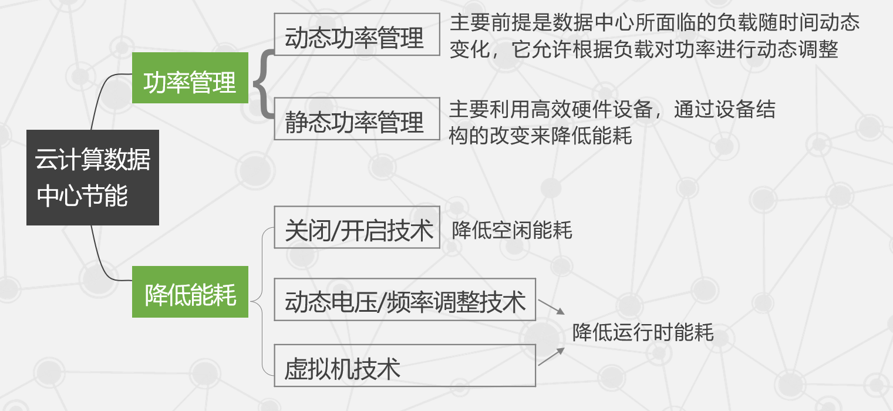

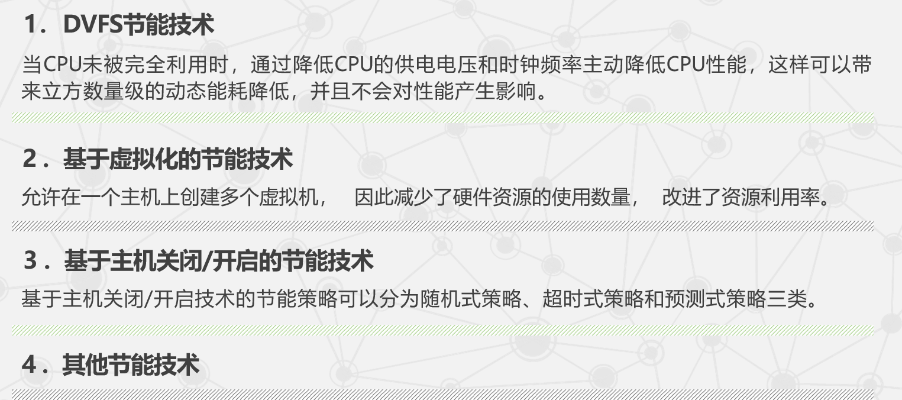

#### 新能源的应用

绿色和平组织（GreenPeace）定义实现**绿色** **IT** 的方式是:**高能效+新能源**

为了减少能耗开销和碳排放量以实现绿色计算，充分利用**新能源**才是根本途径。

目前有：

- 谷歌海上数据中心
- Facebook太阳能数据中心
- 谷歌风能数据中心

##### CUE碳使用效率   （Carbon Usage Effectiveness）

表示每千瓦时用电产生的碳排 放密集程序。

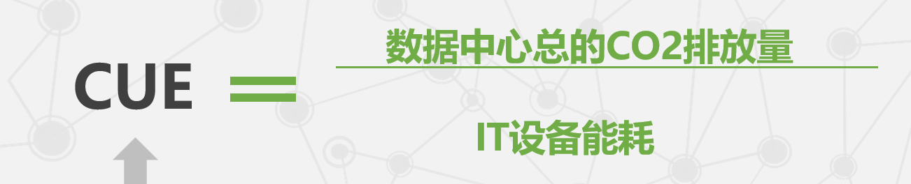

#### 典型的绿色节能数据中心

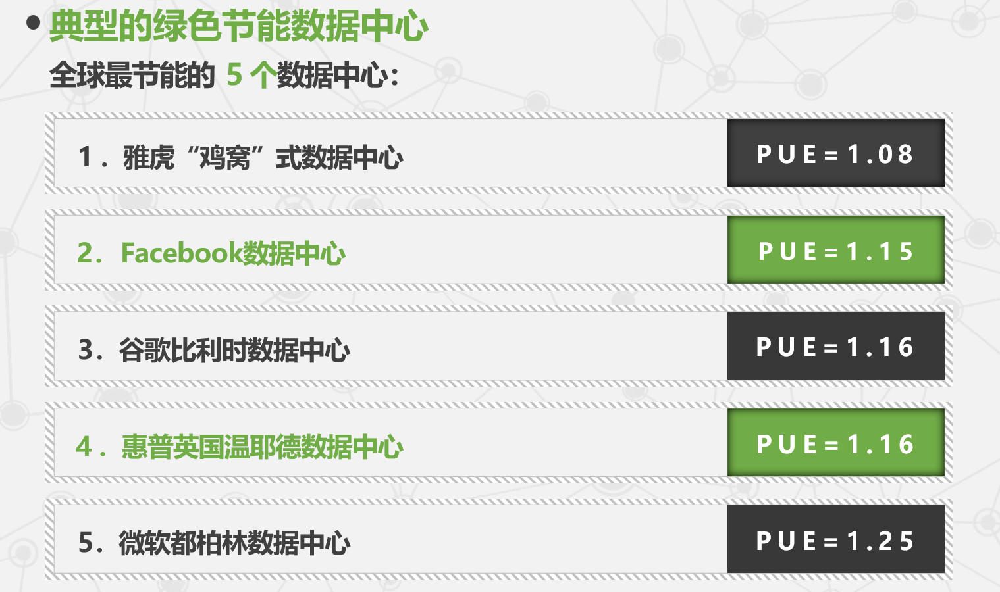

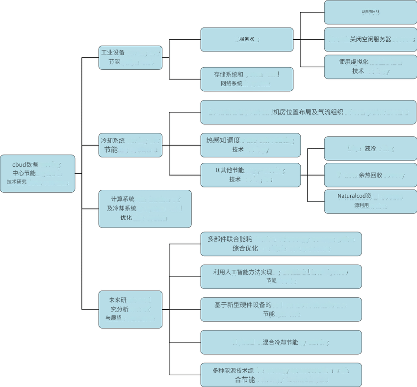

## 自动化管理

云计算数据中心的自动化管理使得在**规模较大**的情况下，实现**较少工作人员**对数据中心的**高度智能管理**。

### 自动化管理的特征

**按需分配和收回服务器、存储、网络、应用程序**——数据中心的管理需要资源的自动化调度和对业务的灵活响应，即需要单个业务能自治管理，也需要一个负责全局控制和协  调的中心，对业务和资源进行统一监控、管理和调度。

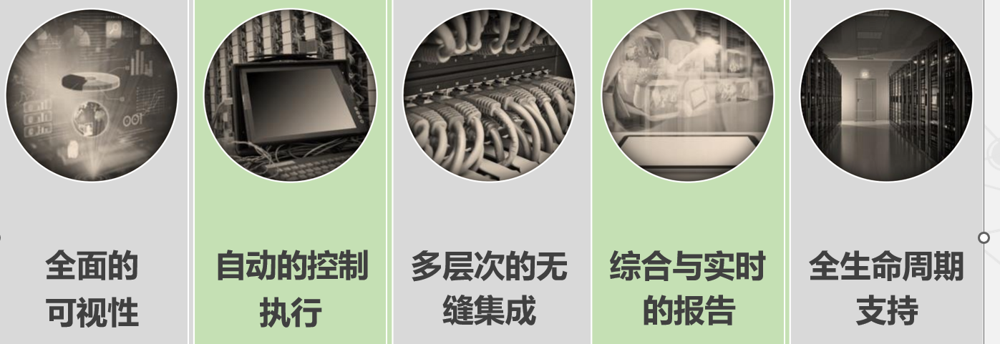

- 环境设备（如供配电系统、冷却系统、消防系   统等）的智能监控
- 统一的资源可视化管理虚拟化网络
- 自动监测虚拟机的创建和迁移

#### 数据中心服务器的合并

服务器合并采用减少物理服务器数量的方法，是改进硬件资源低利用效率的有效途径。在许多服务器合并技术中，基于**虚拟化**的服务器合并被认为是最有效的方式。

数据中心需要优化其资源管理，但是这些服务器合并技术通常是在服务器整机级别进行的，这在**某些情况**下可能很难实现有效的资源管理优化。然而，通过采用服务器合并，可以实现以下重要好处：

1. 增强了硬件利用效率：通过减少物理服务器数量，服务器合并可以更充分地利用每台服务器的计算和存储资源。这可以降低硬件资源的浪费，提高资源的使用效率。

2. 使资源得到更灵活的配置和调度：基于虚拟化的服务器合并允许将不同的虚拟机部署在同一台物理服务器上。这意味着资源可以根据需求进行灵活配置和重新调度，以满足不同应用程序和工作负载的需求。这种灵活性可以提高资源利用率和性能。

3. 降低总体拥有成本：减少物理服务器数量可以降低硬件采购和维护成本。此外，通过更有效地利用资源，还可以减少能源消耗和数据中心的运营成本。这有助于降低数据中心的总体拥有成本。

4. 改进可用性和业务连续性：通过服务器合并，可以提高可用性和业务连续性。虚拟化技术允许在物理服务器发生故障时将虚拟机迁移到其他可用服务器上，从而减少了因硬件故障而导致的服务中断时间。

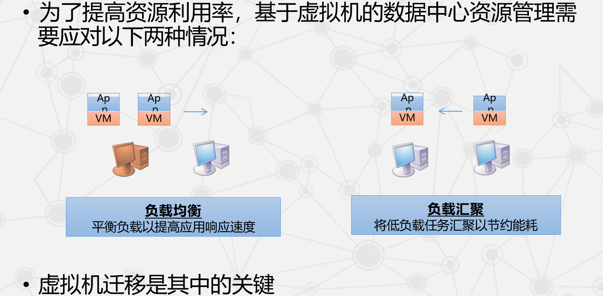

### 自动化管理实现阶段

由于资金、效率等问题，实现自动化管理不可能一蹴而就，自动化管理通常须经历 三个阶段。

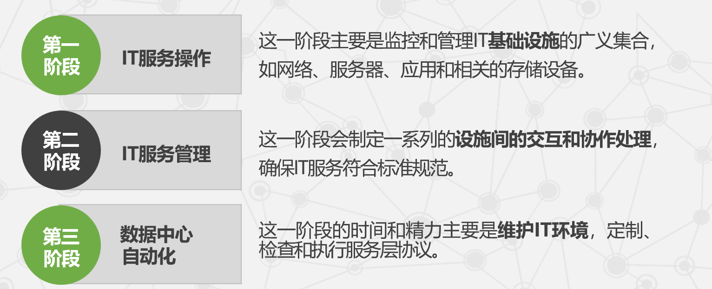

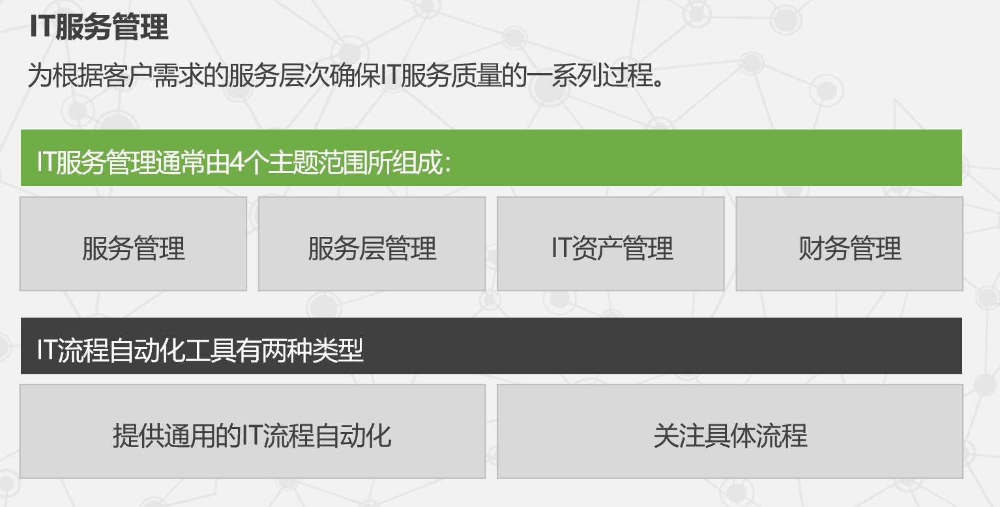

在最低限度上， 一个公司想要采用数据中心自动化工具必须具备下列条件。

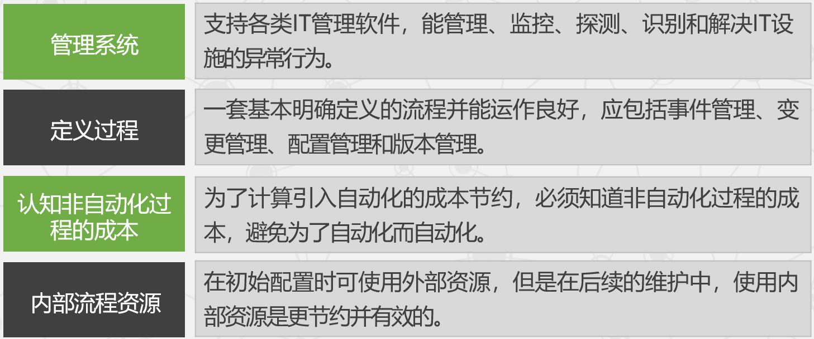

### Facebook 自动化管理

每个Facebook数据中心的运维工作人员管理了至少20,000台服务器，其中部分员工会管理数量高达26,000多个的系统。

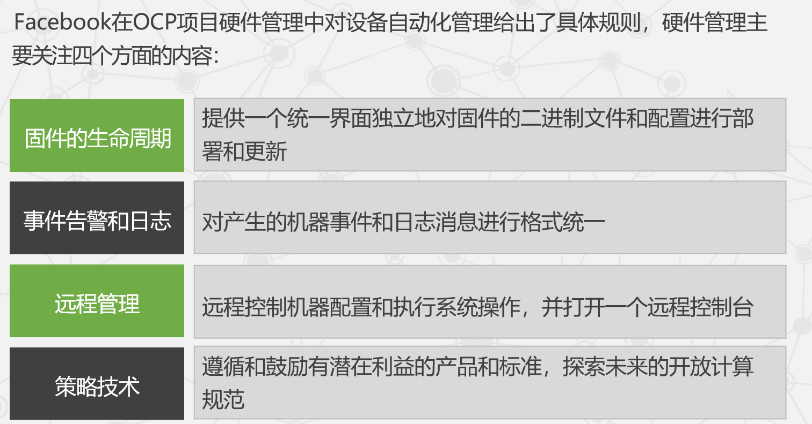

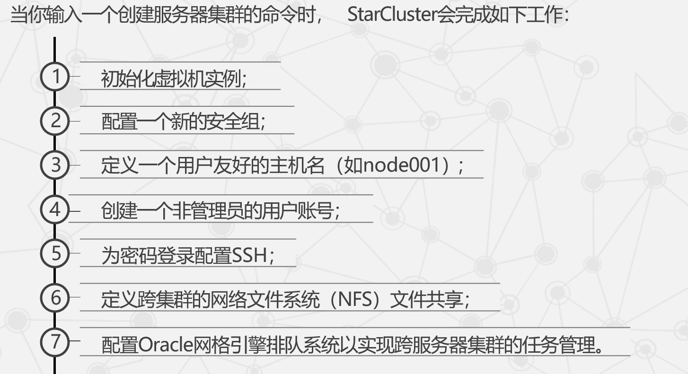

### 软件交付模型

> 瀑布、敏捷开发、DevOps

**传统的：**

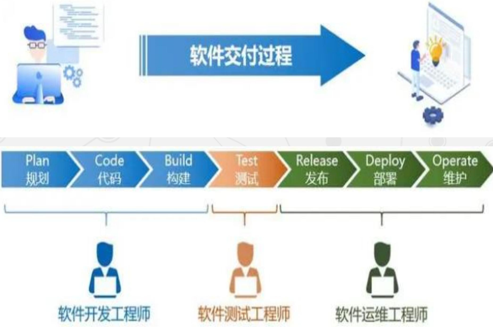

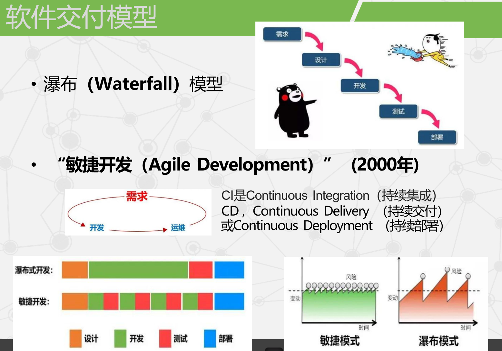

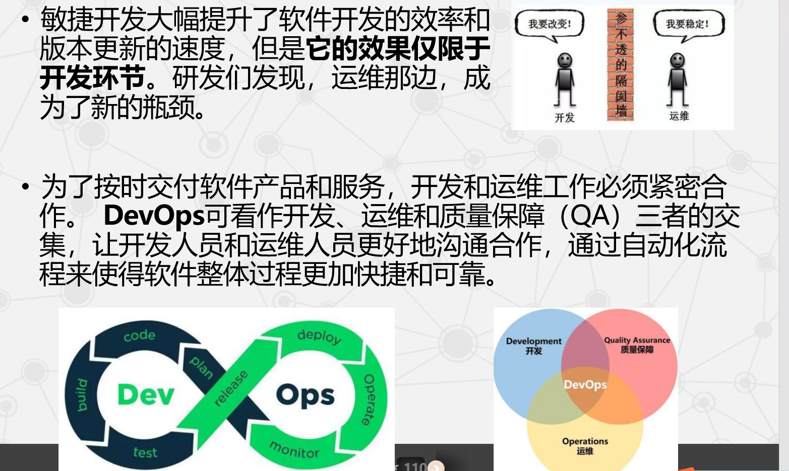

瀑布、敏捷开发和DevOps是软件开发领域中常见的三种不同开发方法和流程。以下是它们的阐释：

1. 瀑布模型（Waterfall Model）：
   瀑布模型是一种传统的软件开发方法，采用线性和顺序的开发流程。它包括一系列明确定义的阶段，每个阶段都依赖于前一个阶段的完成。通常包括以下阶段：
   - 需求分析：明确定义项目需求。
   - 系统设计：设计软件系统的架构和组件。
   - 编码：实现软件代码。
   - 测试：验证和测试软件功能。
   - 集成和部署：将软件部署到生产环境。
   - 维护：维护和升级已发布的软件。

瀑布模型的优点包括清晰的项目计划和文档，但它通常较为刚性，不适用于需求频繁变化的项目。

2. 敏捷开发（Agile Development）：
   敏捷开发是一种迭代和增量的软件开发方法，注重灵活性和快速响应需求变化。敏捷方法包括多种实践，如Scrum、Kanban、Extreme Programming（XP）等。主要特点包括：
   - 需求不断变化：敏捷方法允许在项目进行中灵活调整需求。
   - 迭代开发：软件功能按照短周期的迭代进行开发和测试。
   - 用户参与：用户参与开发过程，提供反馈和优先级。
   - 团队协作：开发团队紧密协作，强调自组织和交付价值。

敏捷开发适用于快速变化的市场和需求，能够更快地交付有价值的软件，并提高客户满意度。

3. DevOps（Development and Operations）：
   DevOps是一种软件开发和运维的协同方法，旨在实现持续交付和自动化。它强调开发和运维团队之间的协作和集成。关键特点包括：
   - 自动化：自动化软件构建、测试和部署过程，减少手动干预。
   - 持续集成和持续交付（CI/CD）：将代码频繁集成并自动交付到生产环境。
   - 合并开发和运维：开发团队和运维团队密切合作，共同负责软件的全生命周期管理。
   - 反馈循环：通过监测和反馈，不断改进软件质量和性能。

DevOps的目标是加快软件交付速度、提高稳定性和可靠性，以及降低操作成本。

总结，瀑布模型强调计划和文档，适用于稳定需求的项目；敏捷开发注重快速响应需求变化，适用于快速发展的市场；DevOps强调开发和运维协同，实现持续交付和自动化，适用于追求高效运维的项目。选择哪种方法取决于项目的需求、复杂性和团队文化。

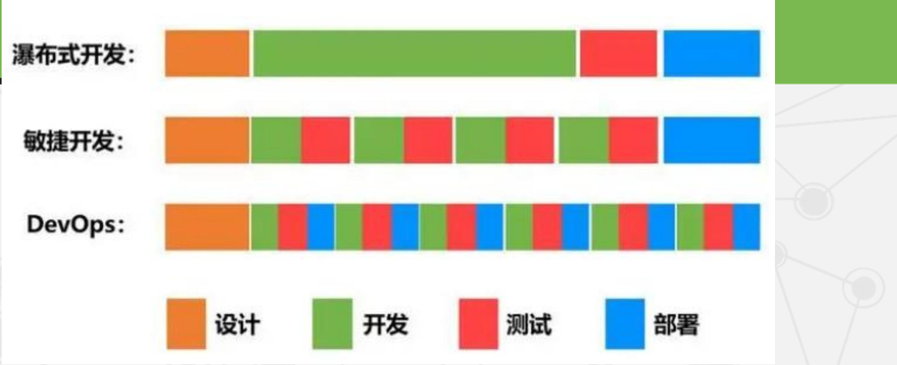

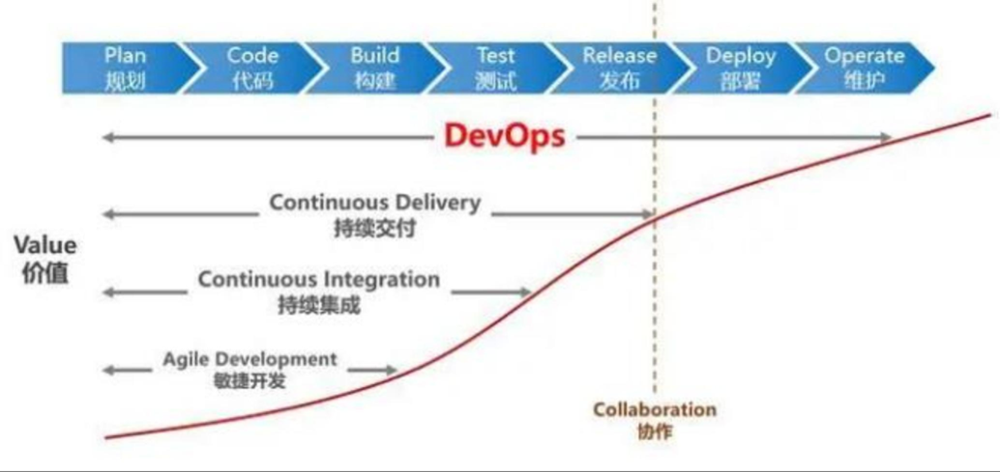

1. 持续集成（Continuous Integration，CI）： 持续集成是一种软件开发实践，它强调将代码频繁地集成到共享代码库中，通常是版本控制系统（如Git）中。关键特点包括：
   - 频繁集成：开发人员在本地开发完成后，将代码提交到共享仓库。
   - 自动化构建和测试：一旦代码提交，自动触发构建和测试过程，以验证新代码与现有代码的兼容性。
   - 快速反馈：如果构建或测试失败，开发人员会迅速收到反馈，可以快速修复问题。

持续集成的目标是确保团队的代码始终是可集成和可测试的，以减少集成问题和提高代码质量。

1. 持续交付（Continuous Delivery，CD）： 持续交付是在持续集成的基础上构建的，它更进一步关注将应用程序交付到生产环境的自动化过程。关键特点包括：
   - 自动化部署：自动化部署流程，包括应用程序构建、配置管理、环境部署等。
   - 可重复性：确保每次部署都是可重复的，以减少人为错误。
   - 随时可发布：在任何时候都可以选择将已构建和测试的应用程序部署到生产环境，而不需要复杂的手动步骤。

持续交付的目标是确保软件随时都处于可发布状态，以便在需要时快速交付新功能或修复问题，减少交付周期，降低风险，提高部署质量。

#### DevOps生态圈

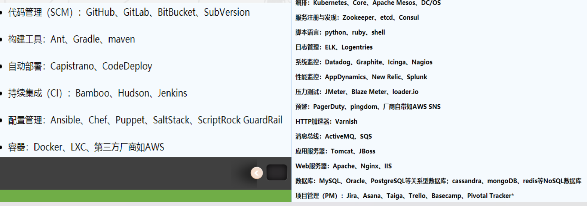

## 容灾备份

容灾备份是通过在**异地**建立和维护一个备份存储系统，利用**地理上的分离**来保证系统和数据对灾难性事件的抵御能力。

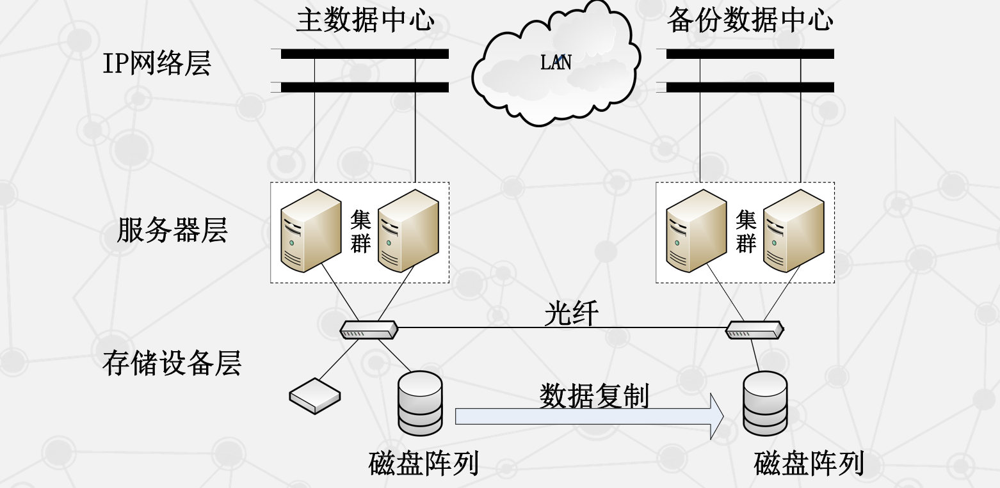

根据**容灾系统对灾难的抵抗程度**可以分为以下两个：

1. 数据级容灾：

   数据级容灾只保证数据的完整性、可靠性和安全性，但提供实时服务的请求在灾难中会中断。

2. 应用级容灾：

   应用级容灾系统能够提供不间断的应用服务，让服务请求能够透明地继续运行，保证数据    中心提供的服务完整、可靠、安全。

**两个技术指标：**

1. 数据恢复点目标（Recovery Point Objective ， RPO）：
   业务系统所能容忍的数据丢失量
2. 恢复时间目标（Recovery Time Objective ， RTO）：
   所能容忍的业务停止服务的最长时间

### 容灾系统的等级标准

|SHARE78 |  |
| -------------- | ------------------------------------------------------------ |
| **Tier-0**     | 在异地没有备份数据                                           |
| Tier-1     | 异地有备份数据，没有备份系统，没有网络                       |
| Tier-2    | 异地有备份数据 ，有备份系统 ，没有网络                       |
| Tier-3 | 异地有备份数据 ，有备份系统 ，有网络支持                     |
| Tier-4     | 主备两个中心的数据相互备份 ，关键应用恢复  时间达到小时级    |
| Tier-5     | 数据同时写向主备中心 ，实现双重在线存储，  关键应用恢复时间达到分钟级 |
| Tier-6     | 主备中心同时向外提供服务 ，可实现负载均衡，  数据丢失率为零  |

| GB/T 20988—2007 |                                                              |
| --------------- | ------------------------------------------------------------ |
| 第一级          | 异地有备份数据 ，没有备份系统 ，没有网络                     |
| 第二级          | 异地有备份数据 ，备份系统和网络在预定时间  内可以安装好      |
| 第三级          | 异地有备份数据，有备份系统 ，部分网络支持                    |
| 第四级          | 异地有备份数据 ，有备份系统 ，完整网络支持， 关键应用恢复时间达到小时级 |
| 第五级          | 数据同时写向主备中心 ，关键应用恢复时间达  到分钟级          |
| 第六级          | 主备中心同时向外提供服务 ，应用远程集群，  数据丢失率为零    |

### 容灾备份的关键技术

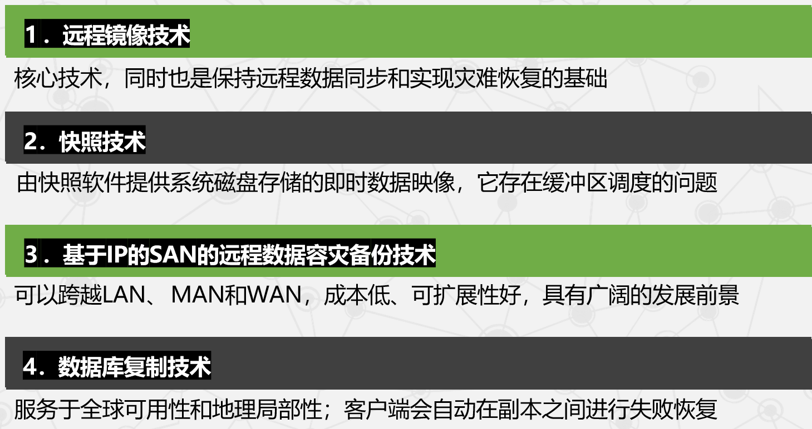

### 云存储在容灾备份中的应用

Google的所有在线应用（包括Gmail ，Google Calendar ，Google Docs，以及Google Sites等）均采用了数据同步复制技术

1. Google的一个数据中心支撑着数百万用户，因此，每个用户分摊的成本相对低很多。
2. Google的备用数据中心并不是在灾难发生时才启用，而是一直在使用中， Google始终在这些数据中心之间进行平衡，保证没有资源浪费。
3. Google的数据中心之间有自己的高度连接网络，保证数据快速传送。
