# 4.3-云平台资源管理与调度

## 资源调度简介

### 资源调度属于NP问题

 资源调度问题**-NP**问题

. **N**任务**/**作业**-M**资源的调度

. 调度优化目标：最小化运行时间或者成本； 提高 资源利用率等

举例：多处理机调度问题**(NP)**

-有 n 个独立的任务，分配给 m 个相同的处理机进行处理， 每个任务 所花费的时间为 t[i], i = 1..n，每个任务独立，不可分割，不可中断。问 题：这些处理机要处理完这些任务，所需要花费的最短时间是多少？

----

注：NP(Nondeterministic Polynomially，非确定性多项式)类问题是指一个复杂问题**不能确定是否在[多项式](https://baike.baidu.com/item/多项式/10660961?fromModule=lemma_inlink)时间内找到答案**，但是可以在**多项式时间内验证答案是否正确**。NP类问题数量很大，如完全子图问题、[图着色问题](https://baike.baidu.com/item/图着色问题/0?fromModule=lemma_inlink)、旅行商([TSP](https://baike.baidu.com/item/TSP/2905216?fromModule=lemma_inlink))问题等。在P和NP问题中，P的难度最低，NP由于只对验证答案的时间作了限定，从而有可能包含某些无法在多项式时间内找到答案的问题，即NP是比P更困难的问题。

### 调度目标

调度目标：最小跨度、最大资源利用率、最大吞吐量、满足最后期限要求、最小能源成本。
多目标：最大限度地提高资源利用率的同时，最小化单个任务的完成时间

### 资源调度通用关键技术问题

- 物理/虚拟资源监控
- 物理/虚拟资源调度
- 任务/作业管理

### 帕累托最优的理论（Pareto Optimal Solution）

在多目标决策中，通常存在多个决策变量和多个目标函数，每个目标函数都代表着不同的目标或优化标准。Pareto Optimal Solution 意味着在没有损害任何一个目标的情况下，无法通过调整决策变量来改进任何一个目标的解决方案。换句话说，对于 Pareto Optimal Solution，没有一种方式可以使得一个目标更好，而不损害其他目标。

## 分布式资源管理与作业调度分类

### 按照资源进行分类

- **异质性（Heterogeneity）**：考虑资源的异质性，即资源的性能和特性不同。可以分为两种情况：
  1. **同质的（Homogeneous）**：资源具有相似的性能和特性。
  2. **异质的（Heterogeneous）**：资源具有不同的性能和特性，需要考虑如何有效地利用它们。
- **规模调整（Scaling）**：这关注了资源的规模调整问题，包括：
  1. **静态（Static）**：资源规模在短时间内保持不变。
  2. **动态电压频率调整（DVFS）**：资源的电压和频率可以根据需求动态调整以节省能源。
  3. **外包（Outsourcing）**：资源可以在外部提供商处获得，而不是在本地部署。
  4. **机器关闭（Machine shutdown）**：在不使用资源时将其关闭以降低能源消耗。
- **共享（Sharing）**：这考虑了资源的共享方式，包括：
  1. **专用（Dedicated）**：资源完全专用于单个任务或作业。
  2. **专用虚拟机（Dedicated VMs）**：资源通过虚拟机分配，但每个虚拟机是专用的。
  3. **专用容器（Dedicated containers）**：资源通过容器分配，但每个容器是专用的。
  4. **共享虚拟机（Shared VMs）**：多个任务或作业共享同一虚拟机。
  5. **操作系统共享（OS sharing）**：多个任务或作业共享同一操作系统实例。
- **地理覆盖（Geographical coverage）**：这涉及资源的地理位置和分布，包括：
  1. **本地（Local）**：资源集中在一个地理位置。
  2. **广泛（Wide）**：资源分布在多个地理位置。
- **联合（Federation）**：这考虑了资源管理在多个域之间的情况，包括：
  1. **联邦的（Federated）**：多个域合作管理资源。
  2. **单一域（Single domain）**：资源管理在单一域内进行。

### 按照负载分类

- **来源（Source）**：这部分涉及工作负载的来源和用户类型，包括：
  1. **单用户/单任务（Single-user/Single-job）**：工作负载来自单个用户和单个任务。
  2. **单用户/多任务（Single-user/Multi-job）**：工作负载来自单个用户，但包含多个任务。
  3. **多用户/多任务（Multi-users/Multi-job）**：工作负载来自多个用户，每个用户有多个任务。

- **任务结构（Job structure）**：这考虑了工作负载中任务之间的关系和特性，包括：
  1. **单任务（Single-task）**：工作负载包含独立的单个任务。
  2. **依赖同质任务（Dependent homogeneous tasks）**：工作负载包含**相互依赖**的**同质任务**。
  3. **独立同质任务（Independent homogeneous tasks）**：工作负载包含**相互独立**的**同质任务**。
  4. **依赖异质任务（Dependent heterogeneous tasks）**：工作负载包含相互依赖的异质任务。
  5. **独立异质任务（Independent heterogeneous tasks）**：工作负载包含相互独立的异质任务。

- **任务灵活性（Job flexibility）**：这描述了任务的可调整性和可变性，包括：
  1. **刚性（Rigid）**：任务的特性不可调整，是固定的。
  2. **可塑性（Moldable）**：任务的一些特性可以在一定范围内调整。
  3. **可延展（Malleable）**：任务的特性可以在更大的范围内调整。
  4. **进化中（Evolving）**：任务的特性是动态变化的。

- **到达过程（Arrival process）**：这关注工作负载任务到达的过程，包括：
  1. **开放（Open）**：任务可以在任何时间到达，没有固定的到达模式。
  2. **封闭（Closed）**：任务的到达模式是固定的，只在特定时间到达。

- **工作负载组成（Workload composition）**：这考虑了工作负载中任务的多样性和模型，包括：
  1. **异质（Heterogeneous）**：工作负载包含不同类型的任务和模型。
  2. **同模型/同质（Same model/Homogeneous）**：工作负载中的任务具有相同的模型和特性。
  3. **同模型/同结构（Same model/Same structure）**：工作负载中的任务具有相同的模型和结构。
  4. **同模型/多样（Same model/Diverse）**：工作负载中的任务具有相同的模型，但有多样的特性。

- **服务质量（Quality of service）**：这涉及工作负载对服务质量的要求，包括：
  1. **最大努力（Best effort）**：工作负载没有特定的服务质量要求，尽力提供服务。
  2. **了解服务水平目标（SLOs aware）**：工作负载对服务水平目标有明确的要求，需要满足特定的服务质量标准。

- **实时性（Real time）**：这考虑了工作负载中任务对实时性的需求，包括：
  1. **非实时（No real time）**：任务没有实时性需求。
  2. **硬实时/非周期性（Hard real time/Aperiodic）**：任务对实时性有硬性要求，但没有固定的周期性。
  3. **软实时/非周期性（Soft real time/Aperiodic）**：任务对实时性有软性要求，但没有固定的周期性。
  4. **硬实时/周期性（Hard real time/Periodic）**：任务对实时性有硬性要求，并且具有固定的周期性。
  5. **软实时周期性（Soft real time/Periodic）**：任务对实时性有软性要求，并且具有固定的周期性。

### 按照要求分类

- **调度目标（Scheduling goal）**：这是关于任务调度的最终目标或优化标准的部分。
  1. 优化标准（Optimization criteria）：这表示在任务调度中所追求的优化目标，可能包括最小化执行时间、最大化资源利用率等。
  
- **层次（Level）**：这一部分讨论了任务调度的层次结构，即在不同层次上对任务进行调度的可能性。
1. 工作级别（Job-level）：在这个层次上，任务调度是以工作为单位进行的，可能包括一组相关任务的调度。
  
2. 任务级别（Task-level）：在这个层次上，任务调度是以单个任务为单位进行的。
  
3. 工作和任务级别（Job and task-level）：在这个层次上，任务调度可以同时考虑工作和任务，具有更高的灵活性。

- **数据局部性（Data locality）**：这一部分涉及任务和数据的亲和性，即任务调度如何考虑任务和数据之间的关系。
    1. 无亲和性（No affinity）：表示任务调度不考虑任务和数据之间的关联性。

    2. 集群亲和性（Cluster affinity）：表示任务调度会考虑将任务调度到同一集群内，以提高数据局部性。

    3. 机架亲和性（Rack affinity）：表示任务调度会考虑将任务调度到同一机架内，以降低数据传输延迟。

    4. 节点亲和性（Node affinity）：表示任务调度会考虑将任务调度到同一节点内，以最大程度地减少数据传输。

    5. 核心亲和性（Core affinity）：表示任务调度会考虑将任务调度到同一核心或处理器内，以进一步提高数据局部性。

- **失败模型（Failure model）**：这部分涉及任务调度在面对系统故障时的响应和处理方式。
    1. 非故障感知（Non failure aware）：表示任务调度不考虑系统可能出现的故障情况。

    2. 故障感知（Failure aware）：表示任务调度会考虑系统可能出现的故障情况，并采取相应措施来应对。

- **可适应性（Adaptability）**：这一部分讨论了任务调度策略是否具有适应性，即能否根据环境和需求变化进行调整。
    1. 静态（Static）：表示任务调度策略是固定的，不会根据变化的情况进行调整。

    2. 可适应的（Adaptable）：表示任务调度策略具有适应性，可以根据变化的需求和环境来做出调整。

### 调度方法的静态属性划分

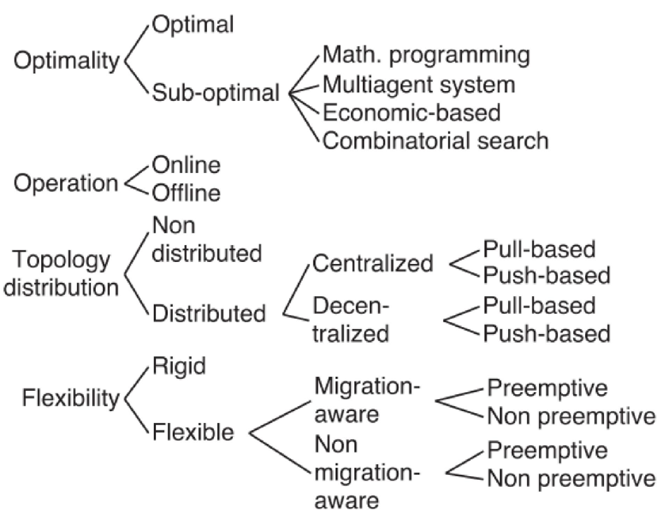

## “网格”资源管理和资源中介

### 网格资源简介

当今用户希望在分布式和自治环境中有效地彼此**共享和合作**，而网格计算为此提供了有前途的解决方案。除了志愿者网格，大多数大规模网格是由公共机构资助的国家或者国际项目。

#### 国家网格和国际项目

与超级计算机相同，国家网格主要通过使用政府资源建立。这些国家网格的发展推动了网格应用中的研究发现、中间件产品和效用计算。在过去10年中，很多数据网格、信息网格或计算网格在世界各地被构建。

特点和作用

- 国家网格主要由政府支持和资助，以促进科研和合作。
- 这些网格的发展推动了网格计算领域的研究和中间件产品的创新。
- 国家网格在信息、计算和数据网格方面发挥了关键作用，为各种领域的合作提供了支持。

#### 志愿者网格

与国家网格不同，志愿者网格通常是由志愿者共同参与和建立的分布式计算环境。志愿者网格通常用于科学研究和计算密集型任务。

特点和作用

- 志愿者网格是由个人或组织志愿者提供计算资源，用于各种研究项目。
- 这些网格通常用于处理需要大量计算资源的任务，如分子模拟、气象学模拟等。
- 志愿者网格的成功在于社区的合作和共享精神。

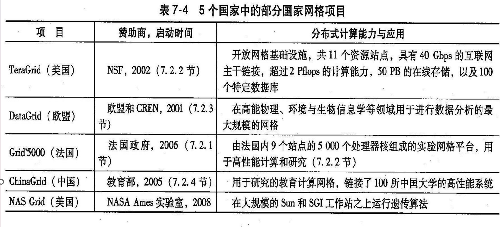

### 网格资源调度

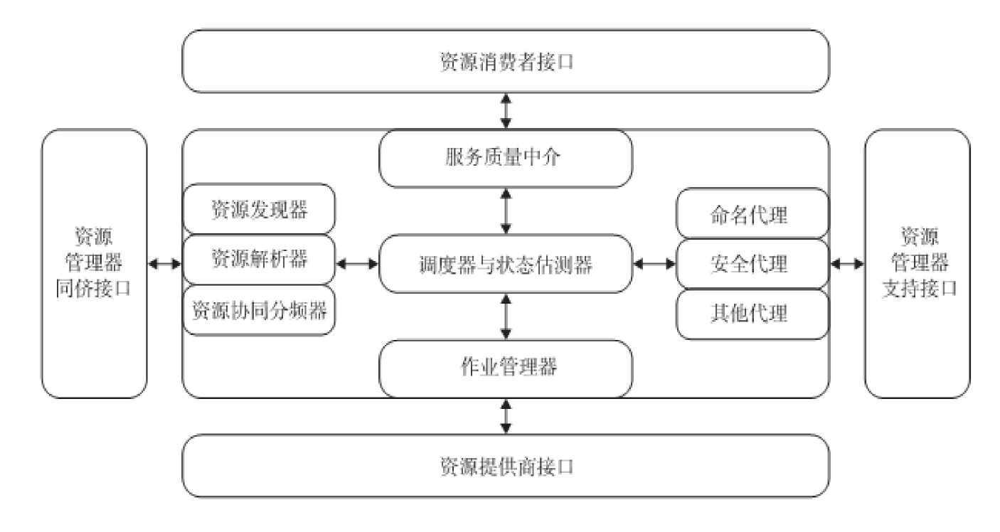

在网格系统中， 资源通常是自主的。每个组织可能有自己 的资源管理策略。为每个组织设立单独的资源管理系统是较 为合理与适用的。

为了有效地协调和利用这些分散的资源，引入了一种多层次的资源管理系统（RMS）模型，其中上层RMS可以被视为资源消费者，而下层RMS可以被视为资源提供商。这个模型的核心是RMS抽象模型，它定义了四个主要的对外接口，以支持多RMS结构的协同工作：

1. 资源消费者接口用于访问上层 RMS或用户应用程序。
2. 资源发现器通过该接口主动搜索符合的 资源。
3. 资源传播器广播本地资源信息至其他RMS。
4. 资源交易器在基于市场的网格系统中的RMS间交换资源。
5. 资源解析器路由 作业至远程的RMS。
6. 资源协同分频器为一个作业同时分配多个 资源。

### 调度方法的层次分类

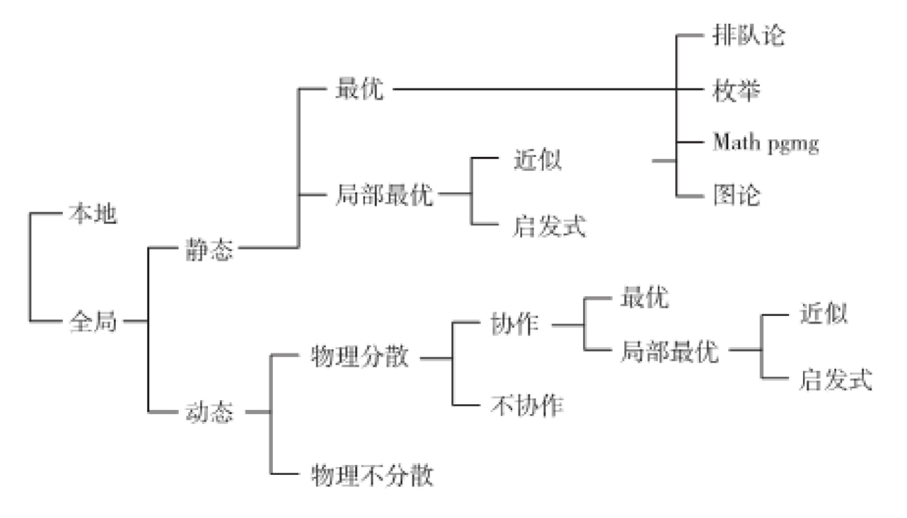

### 近似算法和启发式算法

#### . 近似算法

有一些最优化问题**很难求出最优解**，至少在多项式时间内很难求解，比如NP-hard问题。为了解决这类问题，就有了用 **近似最优解（用近似方法找出）代替最优解**的思想

-近似算法通常能得到一个**有质量保证**的解。

#### . 启发式算法

通常可在**传统解决问题的经验**中找到寻求一种**面向问题的策略**，之后用这种策略来在**可行时间内寻找一个相对比较好的 解**，但**对解的质量没有保证。**

-确定性启发式算法或者启发式搜索

-非确定性的启发式算法

#### 其他算法&对比

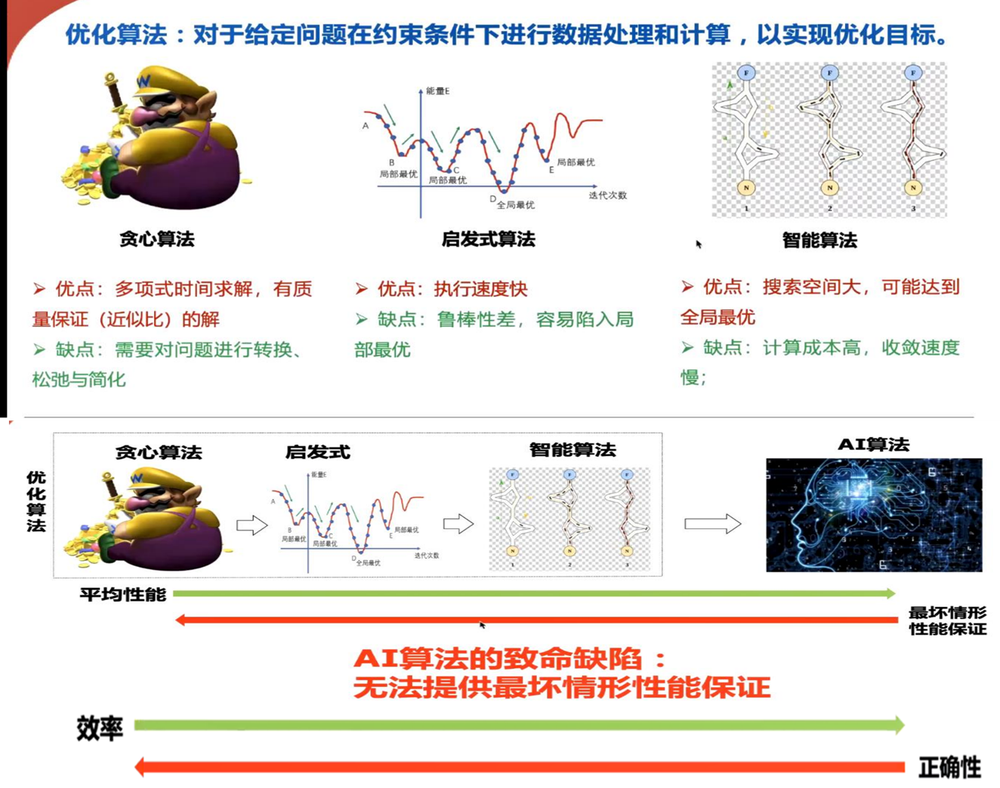

### 服务记账和经济模型

基于经济原则的资源交易是分配网格资源的有效  方法

首先，资源提供商在网格市场中登记他们共享资源的信息。 资源信息可能包括硬件容量、软件配置和价格策略

然后，资源消费者向资源中介提交他们的作业及其特殊需  求。这些需求可能包括硬件容量、软件配置、服务质量和预算。 接下来，中介在网格市场中为每个作业搜索和分配合适的资源。 当顺利完成作业时，消费者要为所分配的资源付费。

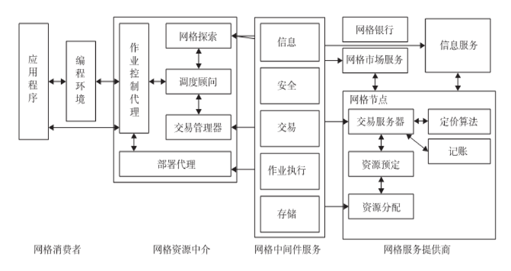

评估网格计算服务的经济模型，部署于墨尔本大学（上图）

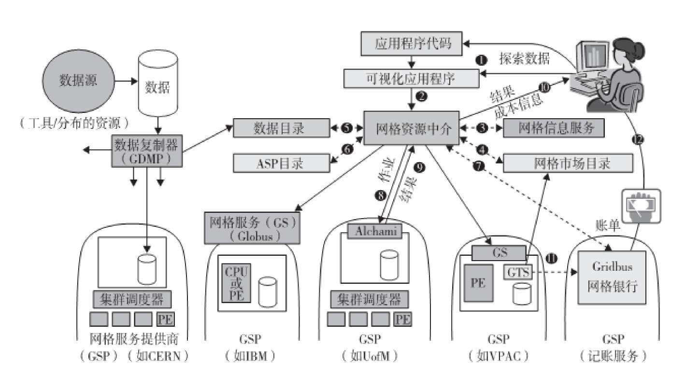

网格资源中介管理作业调度与执行（上图）

## 云计算资源调度（虚拟机和容器）

### 含义

**高性能计算集群的作业调度**，是从排队作业中如何 选择一个作业来执行；

**资源调度**，是将作业调度到 哪个计算节点上运行？

**云计算数据中心的资源调度**是将虚拟机或者容器调 度/放置到哪个物理机上运行？

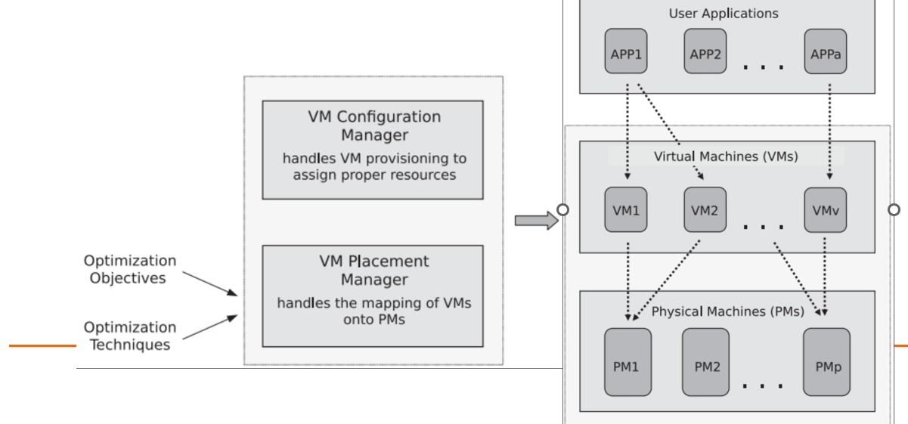

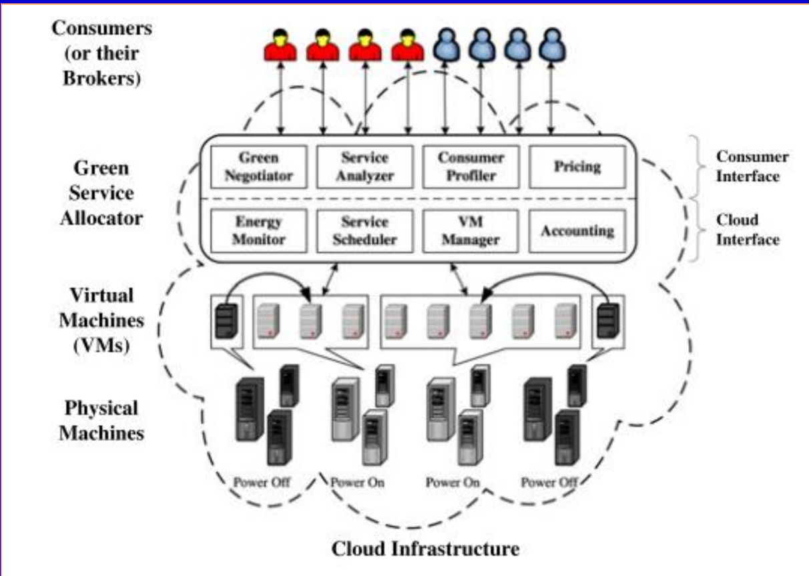

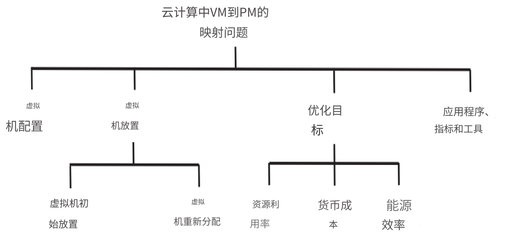

### 云计算资源调度优化目标

云计算资源调度的优化目标可以归纳为以下几个方面：

1. **性能优先**
   - 追求在云计算环境中提供高性能的计算资源，以确保用户获得快速的计算体验。

2. **负载均衡，高可靠性**
   - 实现负载均衡，确保各个服务器的工作负荷分布均匀，同时提高系统的可靠性，以应对可能的故障。

3. **降低能耗**
   - 通过动态电压频率调整（DVFS）和关闭不需要的服务器资源等技术，降低云计算数据中心的能耗，以节省能源和降低成本。

4. **提高资源利用率**
   - 将多个虚拟机尽量放置在同一个物理机上，以最大程度地提高硬件资源的利用率，减少资源浪费。

5. **最大化利润**
   - 基于经济学原理，追求最大化云计算提供商的收益，同时提供高质量的服务。

6. **多目标优化**
   - 在资源调度中进行多目标优化，平衡能耗与资源利用率、性能与服务质量（QoS），以满足不同用户和应用的需求，实现用户花费与响应时间的折中。

### 具体的调度方式

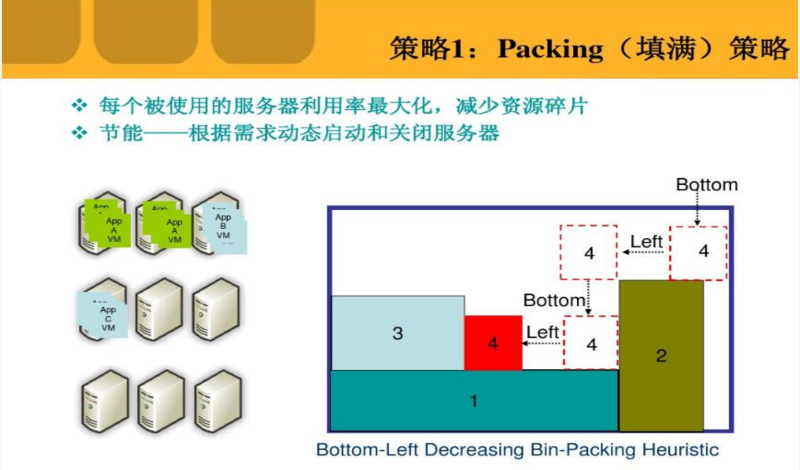

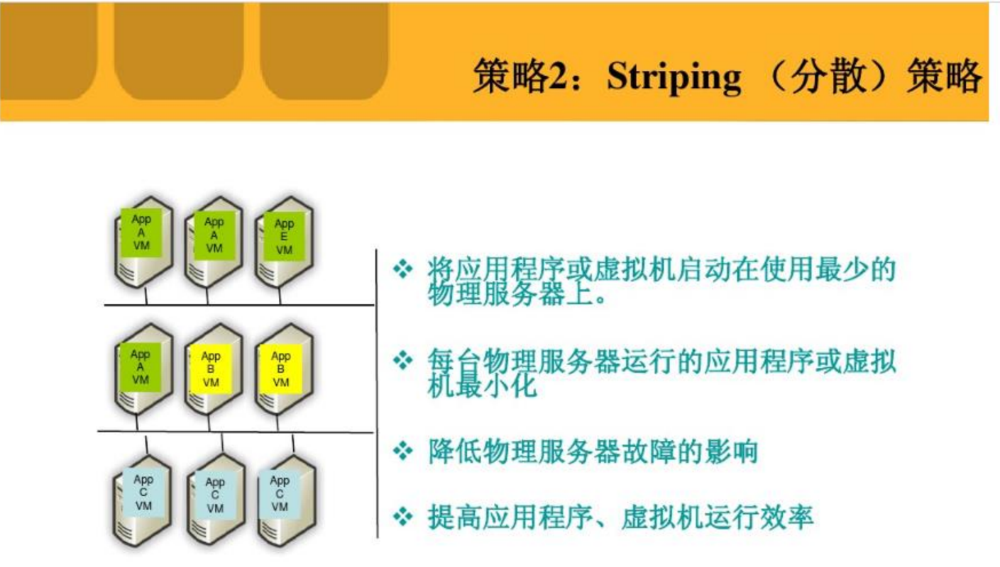

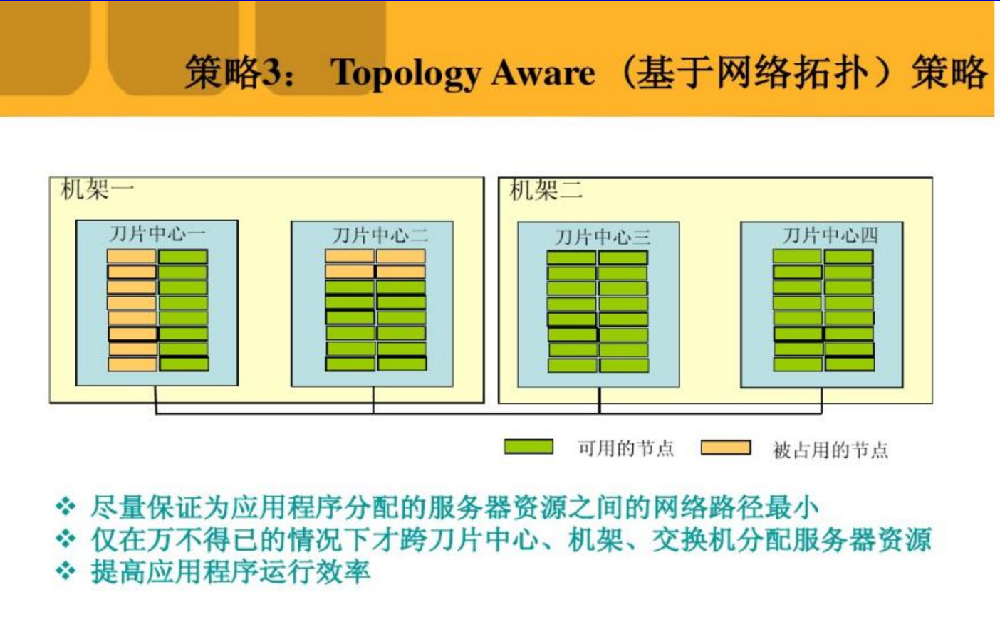

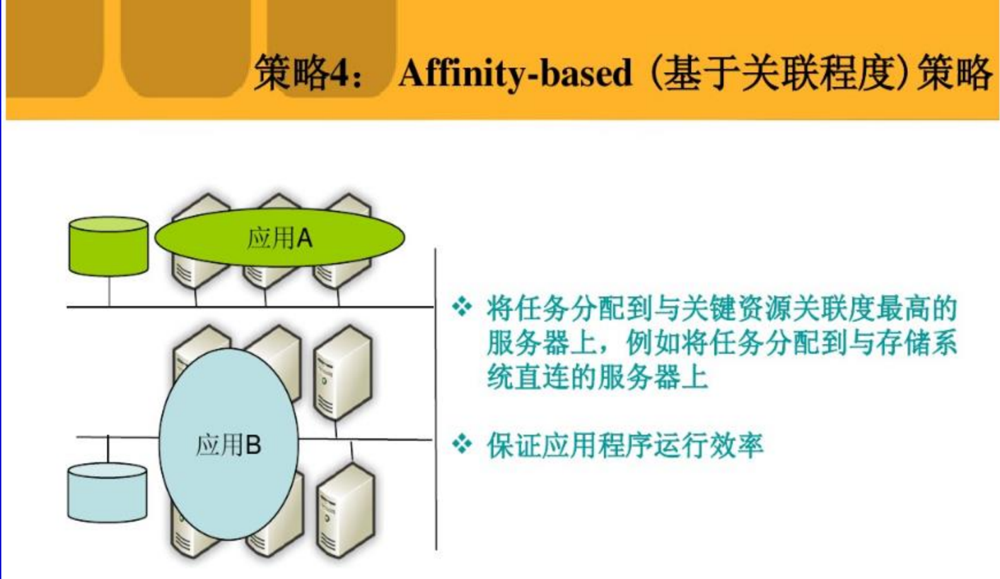

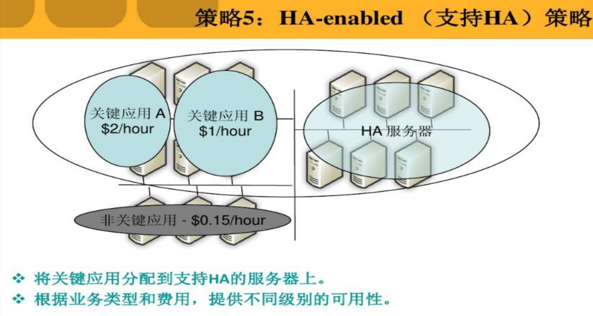

注：HA服务器：高可用性服务器

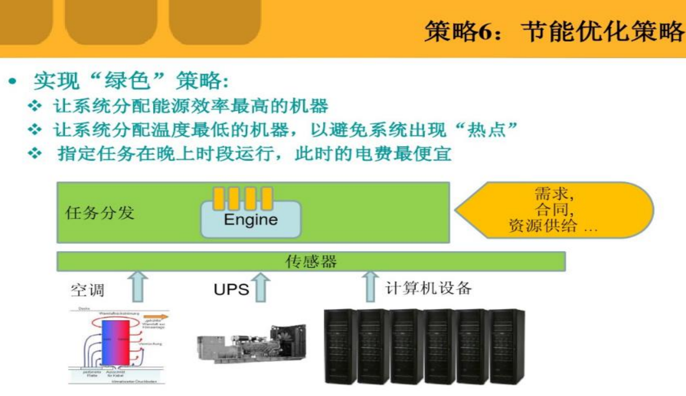

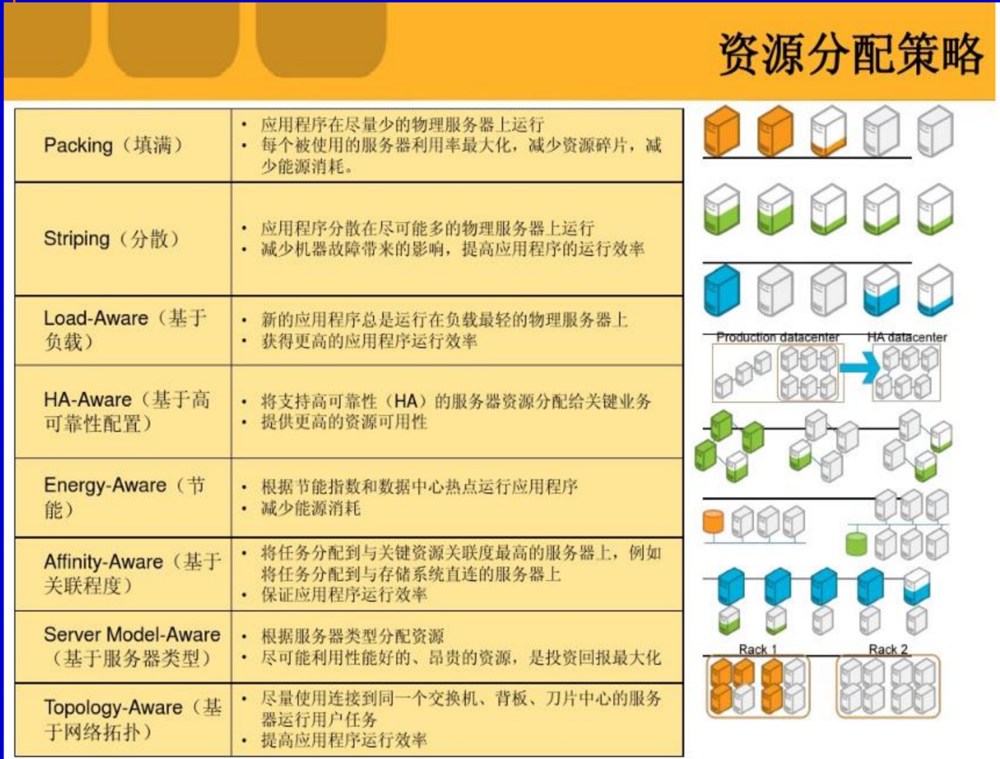

### 服务异常管理

□ 多种虚拟机管理器和操作系统同步运行

□ 服务能在各计算机之间“浮 动”,即使整个网络都瘫痪, 任务数据也不会丢失。

□ 所有事件记录在指定文件系统 中,零停机时间、零数据损失。 

□ 当第一台机器恢复正常时,机 群服务就可恢复并继续运行。 

□ 整个过程对用户来说是透明的, 感觉不到远程集群的存在

### 资源拓展管理

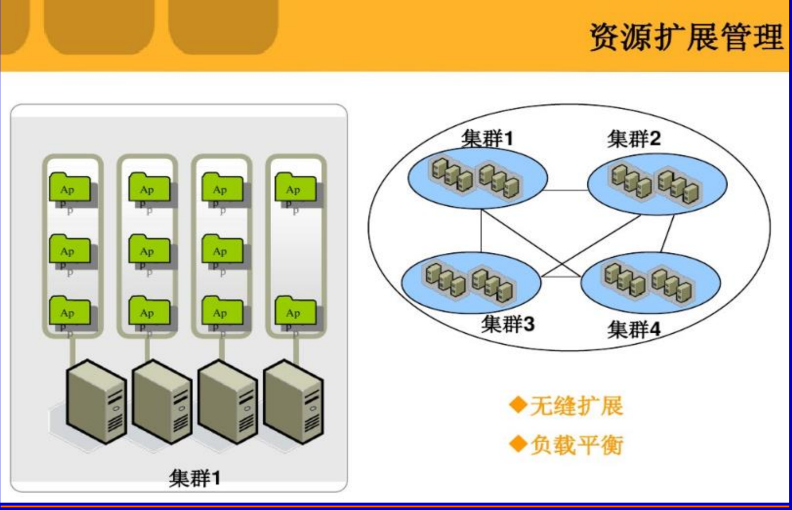

### 不同产品的调度方式举例

#### Openstack-nova-scheduler

nova/nova/scheduler/filter_scheduler.py

虚拟机调度算法的四个步骤

- 获取可用的计算节点列表

(1) hosts =

self.host_manager.get_all_host_states(elevated)

(2) self.host_manager.get_filtered_hosts

(hosts, filter_properties)

- 计算可用计算节点的权值

get_Meighed_hosts(self，hosts，weight_properties)

- 从权值最高的

scheduler_host_subset_size个计算节点 中随机选择一个计算节点作为创建虚拟机的节点

- 更新选择的计算节点的硬件资源信息， 为虚拟机预留资源

#### K8S的细粒度容器调度

kube-scheduler是Kubernetes中的关键模块，为Pod提供调度服务，例如基于资源的公平调度、调度Pod到指定节点、或者通信频繁的Pod调度到同一节点等。
**容器调度比较复杂，要确保以下几个目标**

- 公平性：在调度Pod时需要公平的进行决策， 每个节点都有被分配资 源的机会，调度器需要对不同节点的使用作出平衡决策。
- 资源高效利用：最大化群集所有资源的利用率， 使有限的CPU、内  存等资源服务尽可能更多的Pod。
- 效率问题：能快速的完成对大批量Pod的调度工作， 在集群规模扩增 的情况下，依然保证调度过程的性能。
- 灵活性：在实际运作中，用户往往希望Pod的调度策略是可控的， 从 而处理大量复杂的实际问题。因此平台要允许多个调度器并行工作，同  时支持自定义调度器。

**调度的实现方式**

1. 预选（Predicates）：输入是所有节点，输出是**满足预选条件**的节点 。
   根据预选策略过滤掉不满足策略的Nodes。例如，如果某节点的资源不 足或者不满足预选策略的条件如“Node的label必须与Pod的Selector一致 ”时则无法通过预选
   1. **CheckNodeConditionPred**：此策略用于检查节点是否处于就绪状态，以确保只有可用的节点被考虑为潜在的调度目标。

    2. **GeneralPred**：这个策略用于检查节点上的Pod资源对象数量是否达到上限，并验证CPU、内存、GPU等资源是否符合Pod的要求。

    3. **CheckNodeMemoryPressure**：此策略用于检查Pod是否可以调度到可用内存过低的节点上，以避免过度占用节点资源。

    4. **PodToleratesNodeTaints**：如果当前节点被标记为Taints（节点标记），这个策略检查Pod资源对象是否具备容忍这些Node Taints的能力，以决定是否将Pod调度到该节点上。

    5. **MatchInterPodAffinity**：这个策略用于检查节点是否能够满足Pod的亲和性或反亲和性规则，以确保Pod的调度遵循亲和性策略。

    6. **CheckNodeLabelPresence**：此策略用于检查指定的标签是否存在于目标节点上，以验证节点是否符合特定的标签要求。
   
2. 优选（Priorities）：输入是预选阶段筛选出的节点，优选会根据优先 策略为通过预选的Nodes进行打分排名， 选择得分最高的Node。例如，
   资源越富裕、负载越小的Node可能具有越高的排名
   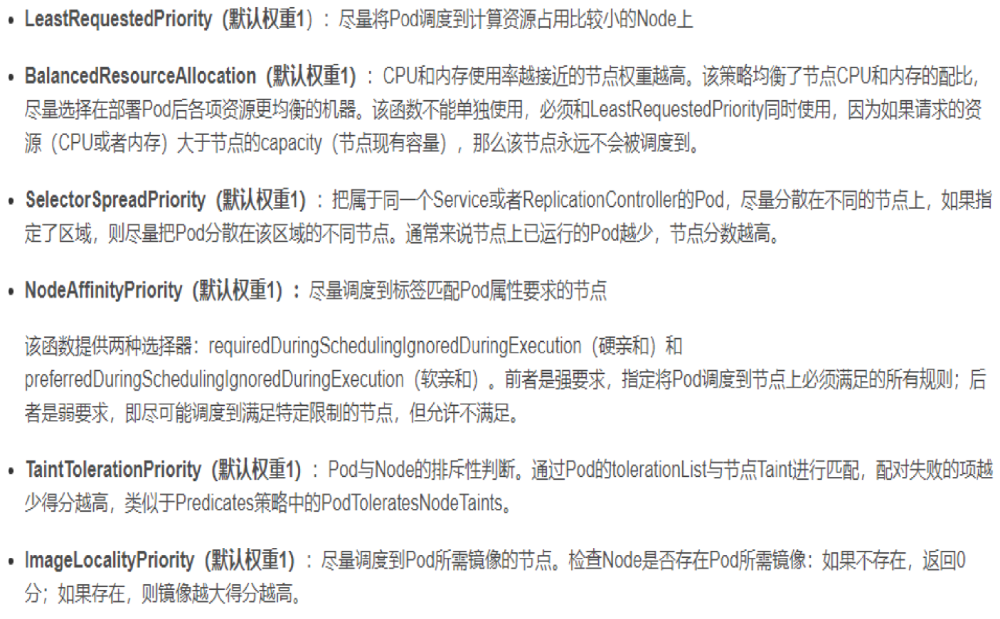

总体的流程图

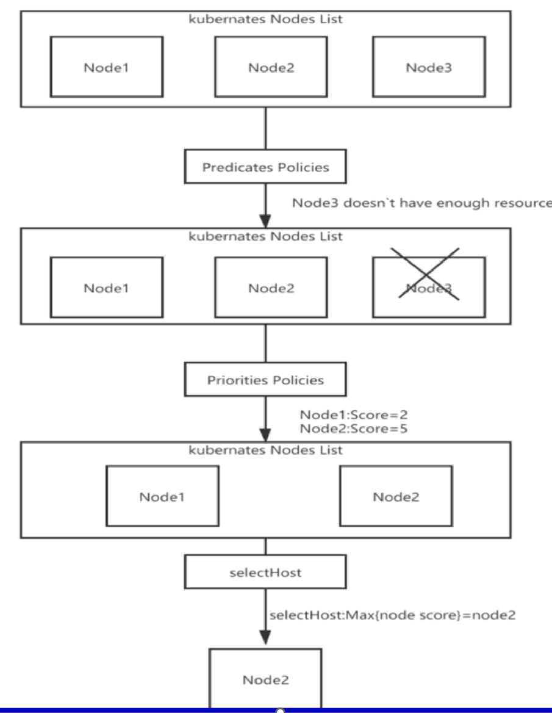

**Pod**定向调度

. 基于nodeName标签，让pod运行在指定的节点上

### 混合云上的调度

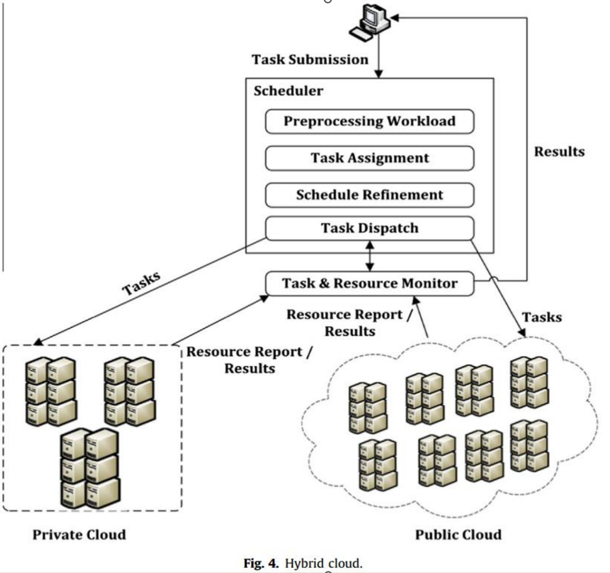

## 无服务器计算（IaaS、FAAS）

. 无服务器计算是在**无需最终用户管理的基础设施上托管应用程序的新方式**，是**IaaS(基础设施即服 务)演进的下一个阶段**

. FAAS（功能即服务） /函数计算，用户将业务逻 辑抽象为函数（微服务），平台负责管理服务器 等基础设施，可靠地执行函数

-根据函数负载动态分配计算资源、函数/用户级别的资源隔离、底层计算环境安全补丁升级等

. 企业可以专注于业务层的创新，无需管理服务器 等IT基础设施

| 项目                      | Serverless                                                   | Serverful                                                    |
| ------------------------- | ------------------------------------------------------------ | ------------------------------------------------------------ |
| 资源水位规划和伸缩        | 由平台负责                                                   | 用户负责预估资源需求,并以对资源的  扩/缩容应对负载的动态变化 |
| 服务器等IT基础设 施的运维 | 由平台负责                                                   | 用户负责操作系统安装、网络配置、多  全补丁升级、故障机器下线等运维工作 |
| 监控报警                  | 基础设施的监控由平台负责,并提供了 开箱即用的应用维度监控报警 | 用户负责搭建监控报警系统,对基础设  施和应用进行监控          |
| 开发测试成本              | 用户专注于应用层的架构和开发,不需  要考虑底层基础设施的容错、弹性伸 缩等 | 用户需要同时开发测试基础设施和应用  层的功能                 |
| 功能上线速度              | 快,平台提供了灰度发布等功能                                  | 「慢,用户需自行搭建版本发布系统                              |

## 云间/多云/混合云/云联盟的资源管理

### 三种云成员

从软件厂商的角度来看，一个给定的云平台的应用性能是最重要的。 

从供应商的角度来看， 云计算基础设施性能最重要。

从终端用户的角度 来看，服务质量（包括安全性） 是最重要的。

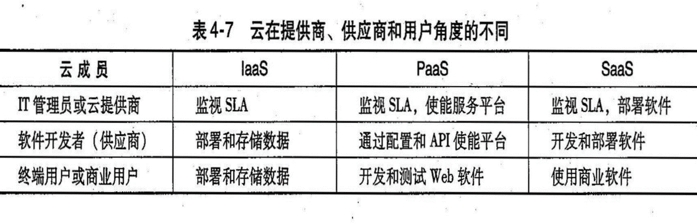

### 云资源非弹性配置出现的问题

云资源非弹性配置的三种情况： a）由于过量配置而引起的极度浪费；b） 配置不足；c）配置不足到过量配置

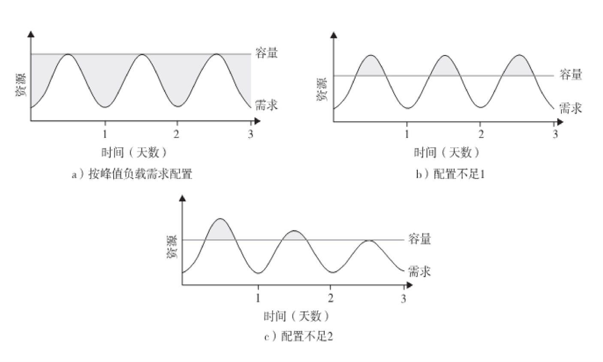

### 需求、事件、人气驱动资源配置

#### 需求驱动的资源配置

这种方法基于**已分配资源**的**利用水平**来添加或移除资源配置量。

例如：当用户使用一个Xeon处理器超过持续期时间的60%  时，需求驱动方法自动为用户的应用程序分配两个Xeon处理器。

一般情况下，当资源已超过某一时间阈值时，该方案将根 据需求增加资源。当资源低于某一时间阈值时，资源也可相 应减少。

亚马逊在其 EC2 平台实现了这种自动缩放功能。这种方  法比较容易实现。如果工作负载突然改变，本方法无法实现。

#### 事件驱动的资源配置

这种方法用于添加或删除基于**特定时间事件**（现实中的事件）的机器实例。

- 该方案对季节性事件或预测事件（如在西方的圣诞节和东 方的农历新年）效果更好。在这些特殊事件发生期间，用户数 的增长与减少是可以预测的。这种方法预测事件发生前的流量 高峰。

- 如果事件的预测正确，这种方法会导致最少量的服务质量 损失；
- 否则，由于不遵循一种固定模式的事件，浪费的资源可 能更大。

#### 人气驱动资源配置

利用这种方法，互联网搜索某些应用程序的**受 欢迎程度， 并按人气需求创建实例**

-该方法期望负载根据受欢迎程度来增减。如果预测的受欢迎程度正确，该方案会最小化QoS的损 失。如果没有出现预期的流量，那么可能会浪费资 源。

### 云资源的全球交易

为了支持一大批来自世界各地的应用服务消费者，云基础设施提供商 （即IaaS提供商）在各个地方建立了数据中心，  以提供冗余性，并确保站点故障情况下的可靠性。
没有单一的云计算基础设施提供商能够在世界各地所有可  能的位置建立它的数据中心。
想要利用多个云基础设施服务提供商的服务来为其特定消  费者的需求提供更好的支持。

通过实现InterCloud体系结构原理与分配机制，云提供商  将可以根据从其他云提供商租用的可用计算和存储容量峰   值来动态扩大或调整其资源配置容量。

## 资源管理性能评价指标

## 产业界分布式资源管理与调度系统