# **Google** 云计算技术

总的来说，有google app engine，还有谷歌三宝（GFS，MapReduce，BigTable）

## **Google**云计算平台技术架构

o文件存储， Google Distributed File System，GFS

o并行数据处理MapReduce

o分布式结构化数据表BigTable

o分布式锁Chubby

o分布式存储系统Megastore

o分布式监控系统Dapper

o内存大数据分析系统PowerDrill

## Google App Engine

Google App Engine是一个由**Python应用服务器群**、 **Bigtable数据库**及**GFS数据存储服务**组成的平台，它 能为开发者提供一体化的**可自动升级**的**在线应用服务**。是一个用于在现有Google基础架构中托管Web  应用程序的云计算平台

- Google App Engine可以让开发人员在Google的基础架构 上运行网络应用程序

- 在Google App Engine中，用户可以使用appspot.com域上 的免费域名为应用程序提供服务，也可以使用Google企业 应用套件从自己的域为它提供服务

- 可以免费使用Google App Engine。注册一个免费账户即可 开发和发布应用程序，而且不需要承担任何费用和责任

### 主要特征

- 客户端环境包括一个Java 的Eclipse插件，允许你在本地机 器上调试自己的GAE。

- 对于Java Web应用程序开发者来说，还有一个GWT（谷歌 Web工具集）可用。开发者可以使用它，或其他任何借助于 基于JVM的解释器或编译器的语言，如JavaScript或Ruby。

- Python会经常和Django或者CherryPy之类的框架一起使用 ,但是谷歌也提供一个内置的webapp Python环境。


## 谷歌技术"三宝"概述

2006年的OSDI有两篇google的论文，分别是    BigTable和Chubby。

. Chubby是一个分布式锁服务，基于Paxos[算法](http://lib.csdn.net/base/datastructure)；

. **BigTable**是一个用于管理结构化数据的分布式存储系统，构建在GFS、Chubby 、SSTable等google技 术之上。相当多的google应用使用了BigTable ，比如 Google Earth和Google Analytics

. 因此BigTable和GFS、MapReduce并称为谷歌技术" 三宝"。

## 网络文件系统NFS(Network File System) （传统）

- 通过局域网络(TCP/IP)让不同的主机系统之间可以 共享文件或目录等资源

-  本地NFS的客户端应用可以透明地读写位于远端  NFS服务器上的文件，就像访问本地文件一样


### 应用场景

. 在高性能计算集群应用场景下， NFS网络通常被 用来存储共享用户目录和文件数据等。

. 在企业集群的应用场景下， NFS网络文件系统被 用来存储共享视频、图片等静态资源文件。

### 与RPC、XDR的关系、调用栈

NFS 利用远程过程调用 (RPC) 层实现服务器与客户端之间的通信。
打包 - 将参数打包为 XDR（内部数据表示）格式。
XDR 格式与平台无关
RPC 允许一台主机上的应用程序调用另一台远程主机上的程序（函数 RPC 允许服务器同时响应多个版本的协议（NFS 3 或 NFS 2））。


### 服务器上的实现形式

NFS 定义了**虚拟文件系统**

实际上**不管理服务器上的本地磁盘布局**

- 服务器在本地文件系统之上实例化 NFS 卷

- 本地硬盘由具体的文件系统（EXT、ReiserFS......）管理


#### 常见的底层文件系统介绍


 FAT(File Allocation Table)文件分配表，就是用来记录文件 所在位置的表格

- FAT16每一个分区的容量只有2GB

- FAT32采用32位的文件分配表（单个文件小于4GB），且性能不佳，易产生磁盘碎片

- NTFS对FAT作了若干改进，如支持元数据，使用高级数据结构，以便于改 善性能、可靠性和磁盘空间利用率，并提供了若干附加扩展功能。

- Linux操作系统文件系统类型主要有EXT3、EXT4、XFS等

- XFS是一种高性能的64位日志文件系统（2000年），特别擅长处理大文件， 同时提供平滑的数据传输

 NFS v4 支持对文件进行有状态锁定

- 客户端通知服务器锁定意图
- 服务器可通知客户端尚未处理的锁定请求
- 锁定是基于租期的：客户端必须在超时前不断更新锁
- 与服务器失去联系会放弃锁定

 允许 NFS 客户端缓存远程文件副本，以便后续访问
- 支持从关闭到打开的缓存一致性
- 客户端 A 关闭文件时，文件内容会与主服务器同步，时间戳也会改变
- 客户端 B 打开文件时，会检查本地时间戳是否与服务器时间戳一致。如果不一致，则丢弃本地副本。
- 并发读写器必须使用标记来禁用缓存

### 优点和缺点

#### 优点

- NFS文件系统**简单易用**、方便部署、数据可靠、服务稳 定、满足中小企业需求。

- NFS文件系统内存放的数据都在文件系统之上，所有**数据都是能看得见**。

#### 缺点

- 存在单点故障, 如果构建高可用维护麻烦。             
- NFS数据明文, 并不对数据做任何校验。
- 客户端挂载无需账户密码, 安全性一般(内网使用)

## 谷歌文件系统（GFS）

GFS主要是为谷歌搜索引擎的**基础存储服务**建立的。谷歌需要一 个**分布式文件系统**，在**廉价、不可靠**的计算机上存储 **大量的冗余数据**（**GFS的研究目的**）。

另外， GFS是为谷歌应用程序设计的，并且谷歌应用程 序是为谷歌而建立。在传统的文件系统设计中，这种 观念不会有吸引力，因为在应用程序和文件系统之间 应该有一个清晰的接口， 比如POSIX 接口。

### 设计动机

- 谷歌需要一 个**分布式文件系统**，在**廉价、不可靠**的计算机上存储 **大量的冗余数据**，现有的文件系统办不到
- 谷歌的问题与其他任何人的问题都不同
- 工作负载和设计优先级不同
- GFS 专为 Google 应用程序和工作负载设计
- 谷歌应用程序是为 GFS 设计的

### 体系架构

#### 特殊决策

- 64MB块大小。

- 使用复制来达到可靠性 。

- 单个主服务器可以协调访问以及保管元数据。

- GFS中没有数据高速缓存，因为大规模流读取和写入既不 代表时间也不代表空间的近邻性。

- GFS提供了相似但不相同的POSIX文件系统访问接口。其中 明显的区别是应用程序甚至能够看到文件块的物理位置


GFS包括一个master结点（元数据服务器） ，多个chunkserver （数据服务器）和多个client（运行各种应用的客户端）

#### Chunkserver
- Chunkserver用于提供存储服务。
- GFS将文件划分为定长数据块，每个数据块都有一个全局唯一不可变的ID（称为chunk_handle）。
- 数据块以普通Linux文件的形式存储在chunkserver上。
- 出于可靠性考虑，每个数据块会存储多个副本，这些副本分布在不同的chunkserver上。

#### GFS Master
- GFS Master是GFS的元数据服务器。
- 它负责维护文件系统的元数据，包括命名空间、访问控制、文件-块映射、块地址等。
- GFS Master还负责控制系统级活动，如垃圾回收和负载均衡。
- GFS Master会定期与Chunkserver交流（心跳），以获取Chunkserver的状态并发送指令。

#### 客户端（Client）
- 应用程序需要链接客户端的代码，然后客户端充当代理与GFS Master和Chunkserver进行交互。

### 容错机制


### 数据的布局

GFS（Google文件系统）的文件条带化

- GFS采用文件条带化策略，类似于RAID0，用于提高聚合带宽。这意味着文件会被切分成多个数据块，并以类似RAID0的方式进行存储。
- 大多数分布式存储系统也采用类似的策略，以提高性能和可用带宽。

数据块的管理

- GFS将文件按固定长度切分为数据块。
- 当GFS Master创建一个新的数据块时，它会为每个数据块分配一个全局唯一且不可变的64位ID（chunk_handle）。
- 每个数据块以Linux文件的形式存储在chunkserver的本地文件系统中。这些数据块可以有多个副本，以提高可靠性和容错性。

### RAID


- RAID5 最少3块磁盘，容忍一个磁盘问题
- RAID6 最少4块磁盘，容忍两个磁盘问题

### 数据块大 的优点和缺点

GFS采用了64MB的数据块大小，这个决策带来了一些利与弊。下面是关于这一决策的说明：

#### 好处：

1. **减少交互次数**：较大的数据块大小减少了客户端（client）和主服务器（master）之间的交互次数。因为在读写同一个块时，只需要一次交互，这在GFS所假设的顺序读写负载场景下非常有用。
2. **降低网络开销**：较大的数据块减少了客户端和块服务器（chunkserver）之间的网络交互次数，因此降低了TCP/IP连接等网络开销。
3. **减小元数据规模**：由于每个文件需要的数据块数量减少，元数据的规模也减小。这使得主服务器（master）更容易将元数据**完全放入内存中**，提高了文件系统的性能。

#### 缺点：

1. **内部碎片**：较大的数据块大小可能导致内部碎片，尤其是在文件的最后一个数据块中。这意味着如果一个文件不刚好占满最后一个数据块，那么这个块内部的未使用空间将浪费掉。
2. **热点文件问题**：对于小文件，它们可能只包含少量数据块，有时甚至只有一个数据块。如果某个小文件是热点文件（经常被访问），那么存储该文件数据块的块服务器可能会负载过重，因为它需要频繁地响应客户端请求。

### 元数据服务

#### 集中式元数据服务

- GFS采用典型的**集中式**元数据服务模型，其中所有的元数据都集中存放在一个称为Master的节点内。
- 这个Master节点负责维护**整个文件系统的元数据信息**。

#### 元数据的三种主要类型

GFS的元数据主要分为三种类型：

1. **文件和数据块的命名空间**：这部分元数据包括文件和数据块的命名信息，用于标识文件和数据块的唯一性和层次结构。
2. **文件-数据块映射表**：这部分元数据记录了文件和其对应的数据块之间的映射关系，使系统能够定位和检索数据块。
3. **数据块的副本位置**：这部分元数据用于跟踪数据块的副本位置，以保证数据的可靠性和容错性。

#### 内存中存储元数据

- 所有的元数据都存储在内存中，这有助于提高元数据的访问速度和系统的性能，更快速地响应客户端的元数据请求。

### 缓存和预取

缓存和预取在Google文件系统（GFS）中发挥重要作用，特别是在面对大文件和减少元数据服务器负担方面。

#### 缓存策略：

1. **客户端和chunkserver不缓存数据**：在GFS中，客户端和块服务器（chunkserver）都不会缓存数据。这是因为GFS的典型应用场景是顺序访问大文件，不存在时间局部性。此外，数据集通常非常大，因此没有足够的空间来缓存整个文件。

2. **元数据缓存**：为了减少客户端与元数据服务器的交互，GFS引入了**元数据缓存**。当客户端需要访问数据时，首先向主服务器（master）询问数据的位置，然后将这些数据的地址信息缓存起来。随后，客户端对该数据块的操作都只需直接与块服务器联系。
   然而，这些缓存的信息具有时限，会在一段时间后过期，从而确保缓存信息的实时性。

#### 预取策略：

3. **元数据预取**：由于存在空间局部性，主服务器（master）可以将逻辑上连续的多个数据块的地址信息一并发给客户端。客户端可以缓存这些元数据信息，从而减少对主服务器的频繁查询。这有助于提高访问数据的效率，特别是对于大规模的数据访问。

总的来说：

|        | 缓存 | 预取 |
| ------ | ---- | ---- |
| 数据   | 否   | 否   |
| 元数据 | 是   | 是   |

### 一致性

#### 数据块副本和一致性：

1. **多个数据块副本**：为了提高数据的可靠性和并发性，GFS会为每个数据块创建多个副本。这些副本存储在不同的块服务器（chunkserver）上，以防止数据丢失或损坏。

2. **一致性要求**：一致性指的是在GFS中确保数据块**副本之间的一致性**。这意味着所有副本应该包含相同的数据，以确保数据的完整性和可用性。

#### 元数据和一致性：

3. **元数据一致性**：一致性还涉及到GFS主服务器（master）的元数据和块服务器的数据之间的一致性。主服务器负责维护文件系统的元数据信息，包括文件-数据块映射、数据块的副本位置等。这些元数据必须与实际的数据块副本一致，以确保文件系统的正确运行。

#### 多个客户端和一致性：

4. **多个客户端之间的一致性**：一致性还涉及到多个客户端之间的数据一致性。这意味着多个客户端同时访问相同的数据块时，它们应该看到相同的数据。这种一致性是确保数据在并发访问时不会出现冲突或混乱的关键。

#### GFS中的数据变异序列


1. **客户端查询块服务器**：客户端首先向主服务器（master）查询当前发行版本的数据块以及其他副本的位置。如果没有发行版本，主服务器会授权客户端使用其中一个副本（通常是主要版本）。

2. **主服务器响应**：主服务器回复客户端主要版本的身份以及其他（第二级）副本的位置。客户端会缓存这些信息，以备将来的变异操作。只有在主要版本不可达或不再拥有发行版本时，客户端才需要重新联系主服务器。

3. **数据推送**：客户端将数据推送到所有副本。客户端可以按任意顺序推送数据。每个块服务器将数据存储在内部LRU缓存区，直到数据被使用或失效。这样的分离控制流和数据流有助于提高性能。

4. **写请求发送至主要版本**：一旦所有副本都确认接收数据，客户端将写请求发送到主要版本。这个请求可以区分之前推送到所有副本的数据。主要版本为收到的所有变异分配连续的序列号。

5. **主要版本转发请求**：主要版本将写请求转发给所有二级副本。每个二级副本按照主要版本分配的相同序列号来应用变异。

6. **二级副本回复主要版本**：每个二级副本都回复主要版本，表示操作已完成。

7. **主要版本回复客户端**：主要版本回复客户端，报告任何副本遇到的错误。如果发生错误，客户端将请求视为失败，并且所影响的区域将保持不一致状态。客户端代码会尝试处理错误，通常通过重试失败的变异操作，以确保最终一致性。

这些步骤确保了GFS中数据的一致性和可靠性，即使在面对错误或故障时，系统也能够处理和恢复数据。这种方法适用于大规模分布式文件系统，特别是在处理大文件和高并发性能要求的情况下。

## MapReduce

**MapReduce**

- *数据并行*语言日益受到广泛关注，这种语言主要的目的在于在不同数据样本上执行松耦合的计算。
- 语言和运行时产生和提供了“多任务”问题的有效执行，著名的成功案例就是网格应用。
- 与传统方法相比，下表中总结的MapReduce对于多任务问题的实现有一些优点，因为它支持动态执行、强容错性以及一个容易使用的高层接口。主要的开源/商用 MapReduce 实现是 Hadoop 和 Dryad，其执行可能用到或者不用虚拟机。

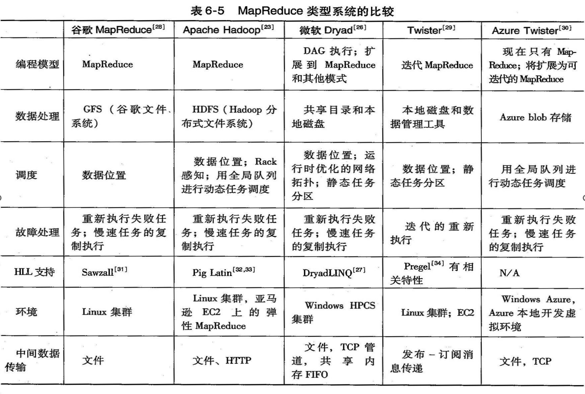

-----

MapReduce软件框架向用户提供了一个具有数据 流和控制流的抽象层，并隐藏了所有数据流实 现的步骤， 比如，数据分块、映射、同步、通 信和调度。抽象层还提供两个定义完善的接口， 这两个接口的形式就是Map和Reduce这两个函数。 这两个主函数能由用户重载以达到特定目标。

### 定义

MapReduce 是一种处理海量数据的**并行编程模式**，用于**大规模数据集**（通常大于1TB）的并行运算。概念和主要思想，都是从函数式编程语言和矢量编程语言借鉴。

- **Map（映射）：** MapReduce 中的 "Map" 阶段将输入数据集划分成多个小块，并将这些小块分配给不同的处理节点。每个节点独立地执行**相同的函数**，将输入数据映射成一系列的键值对。

- **Reduce（化简）：** "Reduce" 阶段接收来自 "Map" 阶段的中间结果，然后对这些中间结果进行汇总和归约，最终生成最终的输出结果。这个阶段通常用于对数据进行聚合和汇总操作。

MapReduce 模式的灵感来源于函数式编程语言（适合非结构化和结构化的 海量数据的搜索、挖掘、 分析与机器智能学习等）和矢量编程语言，它允许高度并行化的处理大规模数据，从而有效地处理海量数据集。

### 产生背景

1. **计算问题简单，但求解困难：** 很多计算问题可能在个体层面上是简单的，但是当涉及大规模数据时，处理和求解变得复杂和耗时。MapReduce 提供了一种将**问题分解成小块并并行处理**的方法，从而加速问题的求解。
2. **待处理数据量巨大（PB级）：** 当涉及到处理大规模数据集，例如千兆字节或者更大的数据时，传统的计算方法可能无法在合理的时间内完成。MapReduce 可以将数据分布在成百上千个节点上，使得数据处理能够在可接受的时间内完成。
3. **并行分布式计算需求：** 大规模数据处理需要并行计算，这意味着多个计算节点需要协同工作。MapReduce 提供了一个框架，使得并行分布式计算变得容易管理和执行。
4. **数据分发和处理：** MapReduce 模型不仅处理了数据的分布，还提供了一种方法来分发待处理数据到不同的计算节点上，并在节点间协调数据的处理。
5. **容错性：** 大规模分布式计算系统必须处理节点故障或者其他异常情况。MapReduce 提供了容错机制，使得即使在节点失败的情况下，计算仍然可以继续进行。

Jeffery Dean 设计的MapReduce 模型提供了一个抽象层，封装了并行处理、容错处理、本地化计算以及负载均衡的细节。这个模型还提供了一个简单而强大的接口，使得开发者能够更容易地处理大规模数据和复杂计算问题。MapReduce 已经被广泛应用于处理海量数据的任务，例如搜索引擎的索引构建、数据分析和机器学习等领域。

### 编程模型

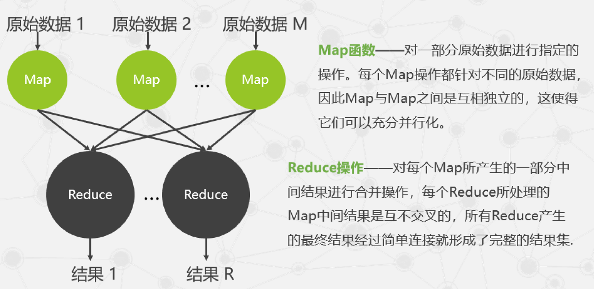

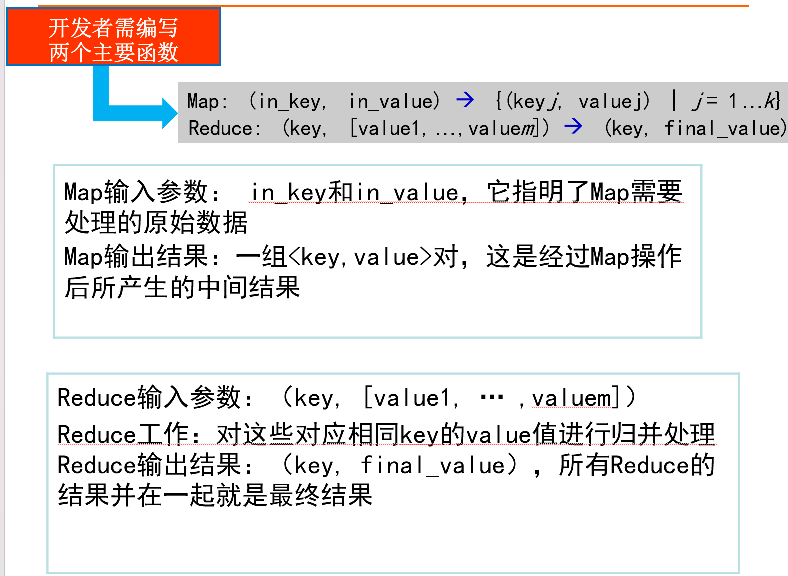

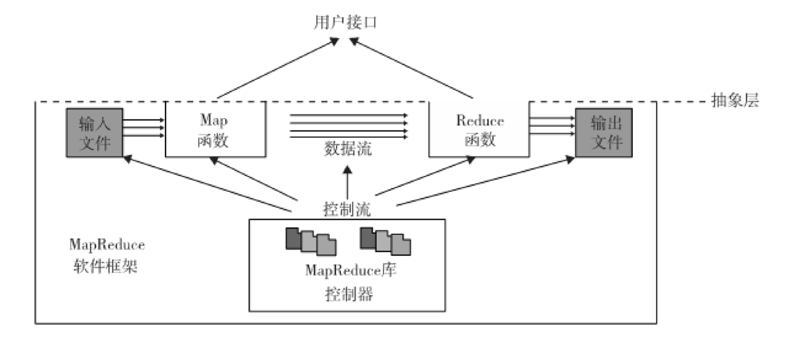

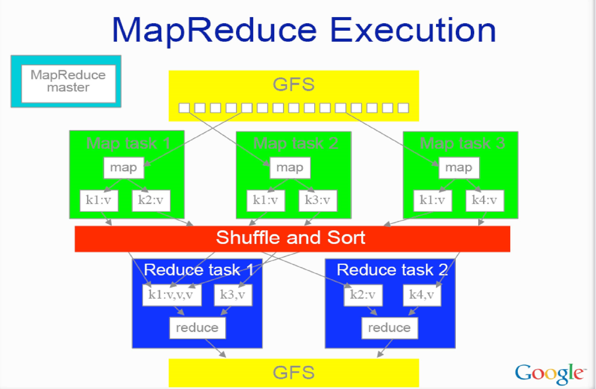 

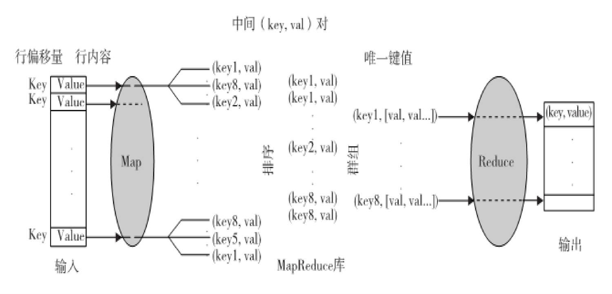

数据需要经过的过程：**（Map，Sort，Group和Reduce）**

MapReduce框架： 输入数据流经Map和Reduce函数， 在使用

MapReduce软件库的控制流下产生输出结果。使用特别的用户接口来访 问Map和Reduce资源

#### 编程、运行过程

1. MapReduce软件框架向用户提供了一个具有数据 流和控制流的抽象层，并隐藏了所有数据流实 现的步骤， 比如，数据分块、映射、同步、通 信和调度。抽象层还提供两个定义完善的接口， 这两个接口的形式就是Map和Reduce这两个函数。 这两个主函数能由用户重载以达到特定目标。
2. **初始化规范对象 'Spec'：** 用户程序首先初始化 'Spec' 对象，然后填入输入和输出文件名以及其他可选的参数。此对象还包含了Map和Reduce函数的名称，以便识别用户定义的函数和MapReduce库提供的函数。
3. **重载Map和Reduce函数：** 用户需要编写自己的Map和Reduce函数，并在程序中重载它们。这些函数是执行实际数据处理和计算的关键部分。
4. **调用MapReduce函数：** 一旦Map和Reduce函数已经重载和初始化了 'Spec' 对象，用户可以调用MapReduce函数并传递规范对象 'Spec' 和结果对象 '&Results'，以启动数据流处理。

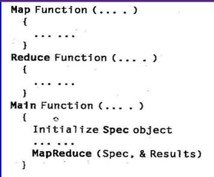

````python
def Map(data):
    # 用户重载的Map函数，执行数据映射操作
    # 可以在这里处理输入数据并产生键值对

def Reduce(key, values):
    # 用户重载的Reduce函数，执行数据归约和汇总操作
    # 可以在这里对映射结果进行处理

def Main():
    # 主程序入口
    # 初始化规范对象 'Spec'
    Spec = InitializeSpec()

    # 填写 'Spec' 对象的输入和输出文件名等信息
    Spec.InputFile = "input.txt"
    Spec.OutputFile = "output.txt"

    # 填写规范对象 'Spec' 的Map和Reduce函数名称
    Spec.MapFunction = Map
    Spec.ReduceFunction = Reduce

    # 调用MapReduce函数开始数据流处理
    Results = MapReduce(Spec)

# 主程序入口
if __name__ == "__main__":
    Main()
````


#### MapReduce、Twister和迭代MapReduce的比较

**MapReduce**：

- MapReduce 是一个软件框架，用于支持大规模数据集上的并行和分布式计算。
- 它提供了两个主要的用户接口：Map（映射）和Reduce（化简），用户可以根据自己的需求定制这两个函数。
- 在MapReduce框架中，数据流被抽象化，用户通过重载Map和Reduce函数来定义数据流的处理逻辑。
- MapReduce框架将数据分为键值对（key，value），其中key部分通常被用来控制数据流，而value部分包含实际的数据。

**Twister**：

- Twister 是另一个大规模数据处理和分布式计算的框架，类似于MapReduce。
- 与MapReduce不同，**Twister更加通用化，支持更多复杂的计算模型，而不仅仅是Map和Reduce。**
- Twister提供了更灵活的数据处理方式，使得用户可以更自由地定义计算任务。
- Twister也能够处理大规模数据集，并且具有一定程度的容错性和性能优化。

**迭代MapReduce**：

- 迭代MapReduce是一种在MapReduce框架上进行迭代计算的扩展。
- 它允许在同一数据集上**多次执行Map和Reduce阶段**，用于解决迭代计算问题，例如图算法或机器学习中的迭代训练。
- 迭代MapReduce优化了计算的效率，**避免了在每次迭代中重新加载和处理数据**，从而提高了性能。

#### 解决问题策略示例

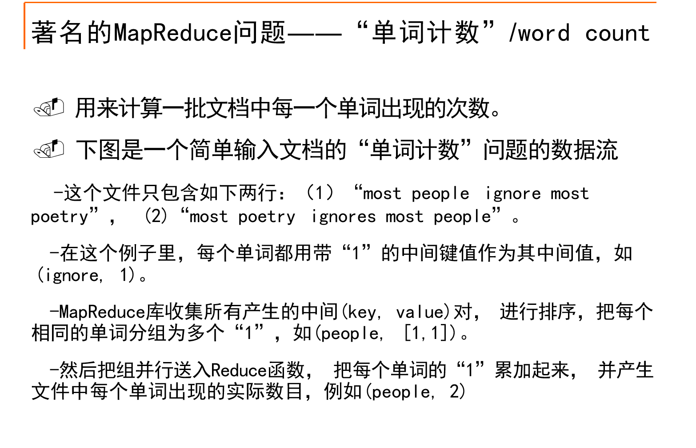


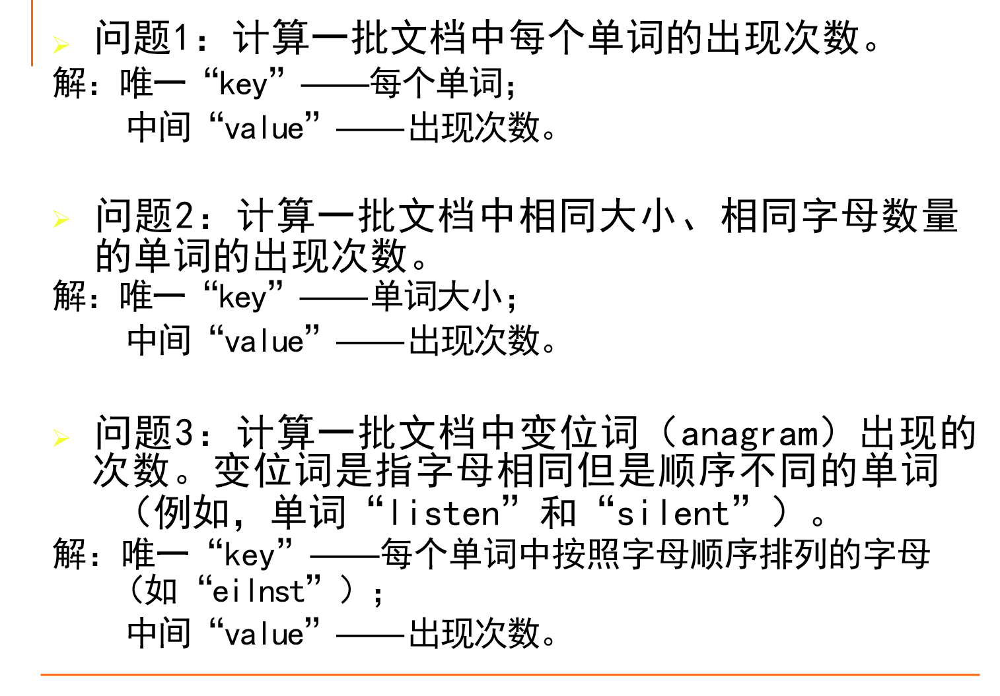

### 实现机制

#### 操作过程

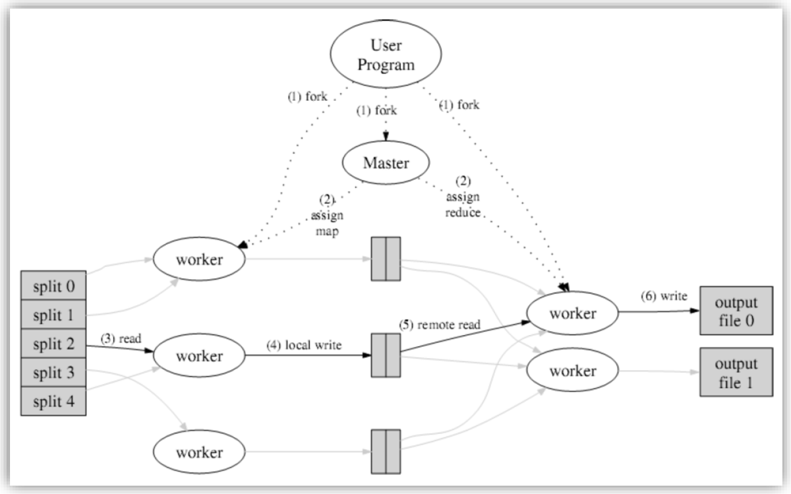

1. **文件分块：** 输入文件首先被分成多个块，每个块的大小通常在16MB到64MB之间。这个块大小可以通过参数进行调整。
2. **分配任务：** MapReduce框架需要分派M个Map任务和R个Reduce任务。Master节点负责选择空闲的Worker节点，并将这些任务分配给它们。
3. **Map任务执行：** 每个Worker节点负责执行一个或多个Map任务。Map函数处理相关输入块，生成中间结果<key, value>对，并将它们暂时缓存在内存中。
4. **中间结果写入硬盘：** 定期，中间结果会被写入本地硬盘，并根据分区函数分成R个区。此时，中间结果在本地硬盘的位置信息将被发送回Master节点，然后Master节点负责将这些信息传递给Reduce Worker节点。
5. **Reduce任务执行：** 当Master通知执行Reduce的Worker节点关于中间<key, value>对的位置时，Worker节点通过远程过程调用从Map Worker节点的本地硬盘上读取缓冲的中间数据。然后，它根据key对中间数据进行排序，确保相同key的数据在一起。
6. **Reduce函数执行：** Reduce Worker节点根据每个唯一中间key遍历所有排序后的中间数据，并将key和相关的中间结果值集合传递给用户定义的Reduce函数。Reduce函数的结果通常会被写入最终的输出文件。
7. **任务完成和结果返回：** 当所有的Map任务和Reduce任务都完成时，Master节点激活用户程序，并MapReduce框架返回用户程序的调用点，允许用户获取计算结果。

#### 容错机制

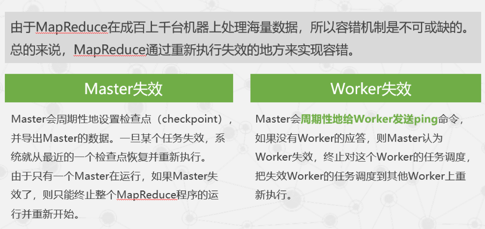

### 案例分析

假设有一批海量的数据，每个数据都是由26个字母组成的字符 串，原始的数据集合是完全无序的，怎样通过MapReduce完成  排序工作，使其有序（字典序）呢？

#### 解答

1. 对原始的数据进行分割（Split），得到N个不同  的数据分块

2. 每一个数据分  块都启动一个  Map进行处理。

   采用桶排序的  方法，每个Map 中按照首字母  将字符串分配  到26个不同的桶中

3. 按照首字母将

   Map中不同桶中  的字符串集合放 置到相应的

   Reduce中进行处 理。

   具体来说就是首字母为a的字符  串全部放在Reduce1中处理，  首字母为b的字  符串全部放在Reduce2中处理

4. 然后Reduce对相同首字母的进行排序。

5. 把Reduce处理的结果进行简单连接就好

## BigTable——谷歌的NOSQL系统

BigTable是一个用于**存储和检索结构化和半结构化数据**的**分布式数据管理系统**，常用于存储各种类型的数据，包括网页数据、每个用户的个人数据以及地理位置数据。

### 设计动力

为什么需要重新构建数据管理系统以支持类似BigTable的应用呢？以下是一些关键原因：

1. **规模问题：** 大规模数据存储和检索需要一个高度可扩展的系统。商用数据库系统通常无法轻松扩展以支持如此大规模的数据。BigTable等分布式系统允许数据水平扩展，以适应不断增长的存储需求。

2. **成本问题：** 使用传统商用数据库系统来处理大规模结构化或半结构化数据的成本可能是不可行的。这些系统通常需要昂贵的硬件和许可证费用。BigTable等分布式系统可以在相对较低的成本下构建和维护。

3. **性能问题：** 低级存储优化可以显著提升数据管理系统的性能，但如果在传统数据库层之上运行，优化变得更加困难。分布式数据管理系统（如BigTable）可以直接管理底层存储，以更好地实现性能优化。

4. **灵活性问题：** 大规模数据管理需要灵活性，以适应不同类型的数据和查询需求。传统数据库系统可能过于刚性，无法满足这种需求。BigTable等分布式系统通常提供更多的自定义和配置选项，以适应各种不同的用例。

### 设计目标

1. **异步处理：** 应用程序需要异步处理来连续更新不同的数据块， 并且需要在任意时间访问大部分的当前数据
2. **高读/写速率：** BigTable被设计用于处理大规模数据和高吞吐量的工作负载。它可以轻松地处理每秒数百万次的读写操作，使其非常适合需要高度响应性能的应用程序。
3. **高效扫描和连接：** BigTable支持高效的数据扫描，可以在大规模数据集上执行有效的查询操作。它还允许在不同数据子集之间进行高效的连接操作，适用于复杂的数据关联和分析需求。
4. **容错性和持续数据访问：** BigTable作为一个分布式多层映射系统，具备容错能力，可以在节点故障时保持数据的可用性。它提供了持续的数据访问，允许应用程序在任何时间访问大部分当前的数据。

### 构建模块

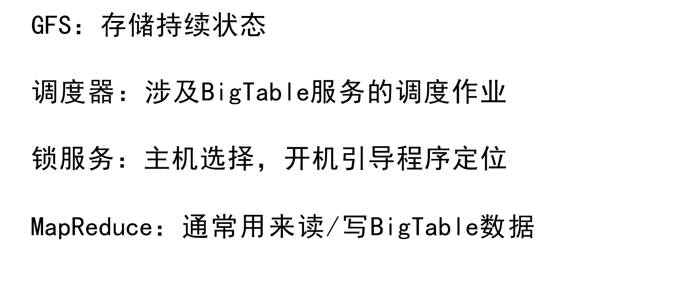

### 数据的存储格式

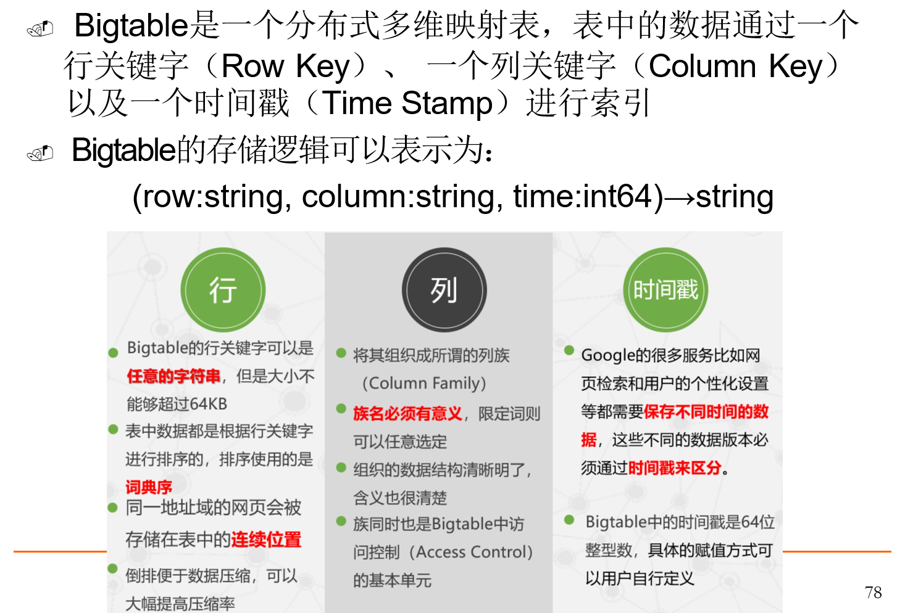

### BigTable数据模型和系统结构

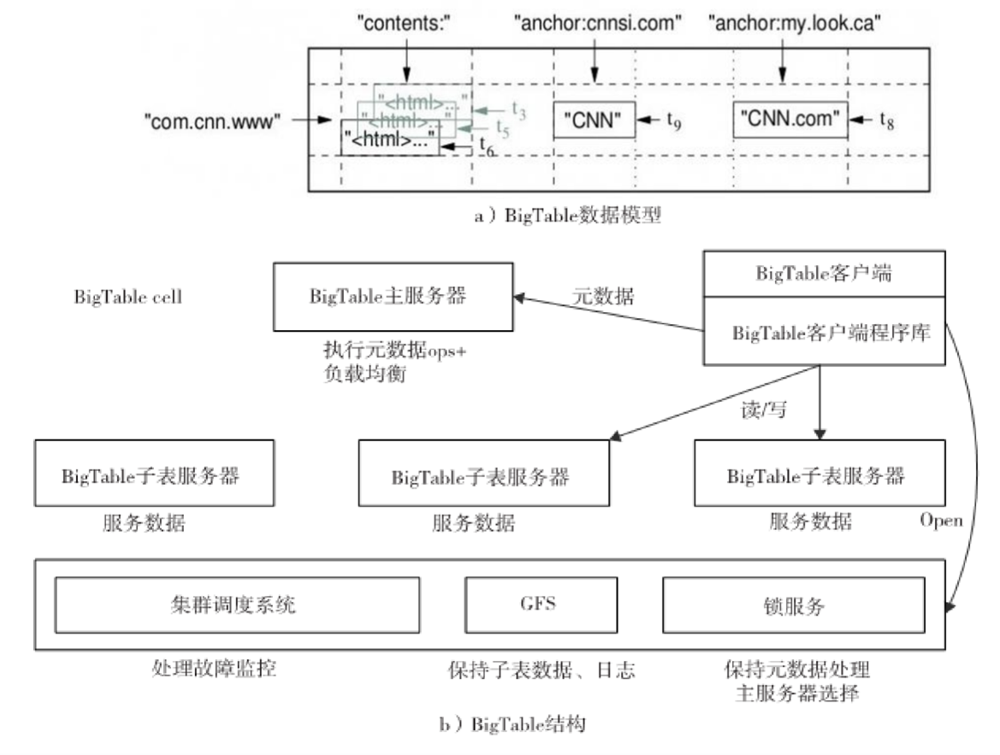