# **Google** 云计算技术

总的来说，有google app engine，还有谷歌三宝（GFS，MapReduce，BigTable）

## **Google**云计算平台技术架构

o文件存储， Google Distributed File System，GFS

o并行数据处理MapReduce

o分布式结构化数据表BigTable

o分布式锁Chubby

o分布式存储系统Megastore

o分布式监控系统Dapper

o内存大数据分析系统PowerDrill

## Google App Engine

Google App Engine是一个由**Python应用服务器群**、 **Bigtable数据库**及**GFS数据存储服务**组成的平台，它 能为开发者提供一体化的**可自动升级**的**在线应用服务**。是一个用于在现有Google基础架构中托管Web  应用程序的云计算平台

- Google App Engine可以让开发人员在Google的基础架构 上运行网络应用程序

- 在Google App Engine中，用户可以使用appspot.com域上 的免费域名为应用程序提供服务，也可以使用Google企业 应用套件从自己的域为它提供服务

- 可以免费使用Google App Engine。注册一个免费账户即可 开发和发布应用程序，而且不需要承担任何费用和责任

### 主要特征

- 客户端环境包括一个Java 的Eclipse插件，允许你在本地机 器上调试自己的GAE。

- 对于Java Web应用程序开发者来说，还有一个GWT（谷歌 Web工具集）可用。开发者可以使用它，或其他任何借助于 基于JVM的解释器或编译器的语言，如JavaScript或Ruby。

- Python会经常和Django或者CherryPy之类的框架一起使用 ,但是谷歌也提供一个内置的webapp Python环境。

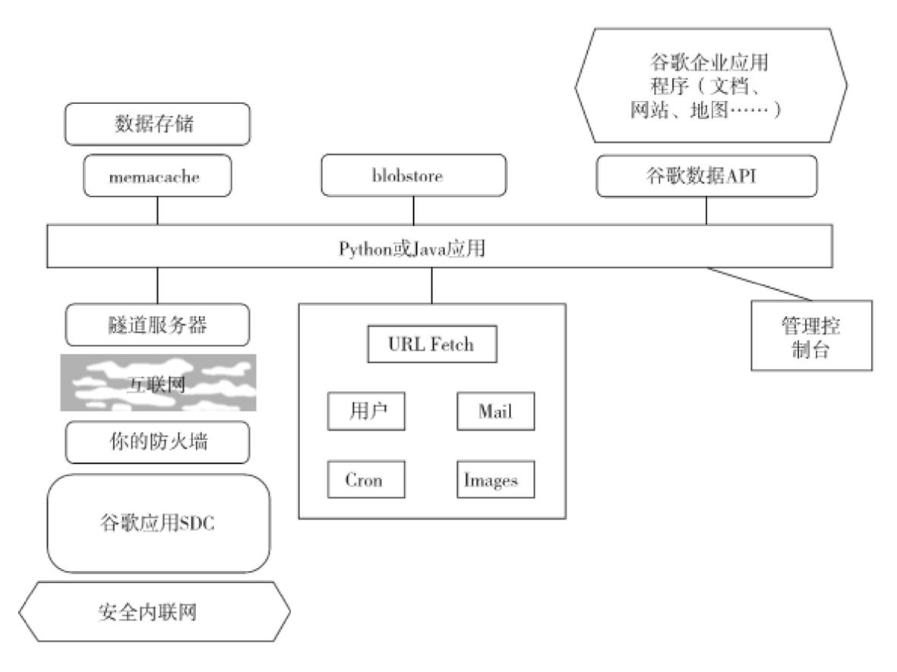

## 谷歌技术"三宝"概述

2006年的OSDI有两篇google的论文，分别是    BigTable和Chubby。

. Chubby是一个分布式锁服务，基于Paxos[算法](http://lib.csdn.net/base/datastructure)；

. **BigTable**是一个用于管理结构化数据的分布式存储系统，构建在GFS、Chubby 、SSTable等google技 术之上。相当多的google应用使用了BigTable ，比如 Google Earth和Google Analytics

. 因此BigTable和GFS、MapReduce并称为谷歌技术" 三宝"。

## 网络文件系统NFS(Network File System) （传统）

- 通过局域网络(TCP/IP)让不同的主机系统之间可以 共享文件或目录等资源

-  本地NFS的客户端应用可以透明地读写位于远端  NFS服务器上的文件，就像访问本地文件一样

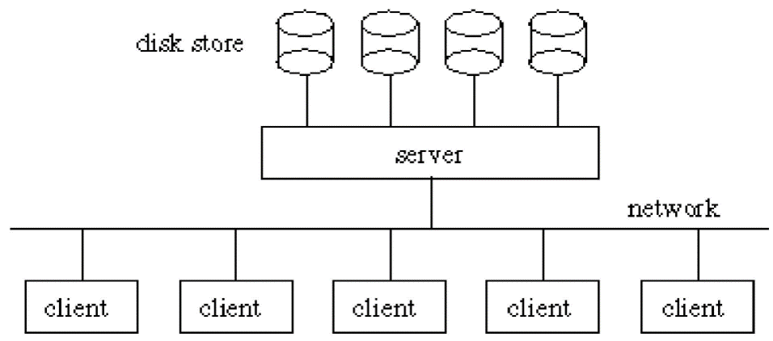

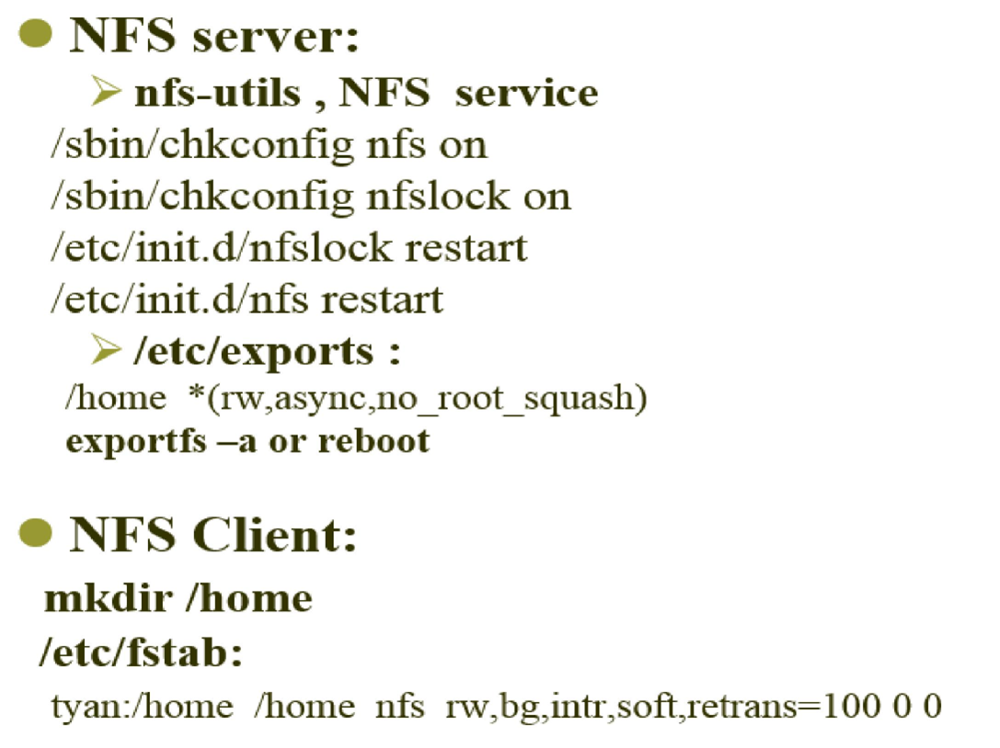

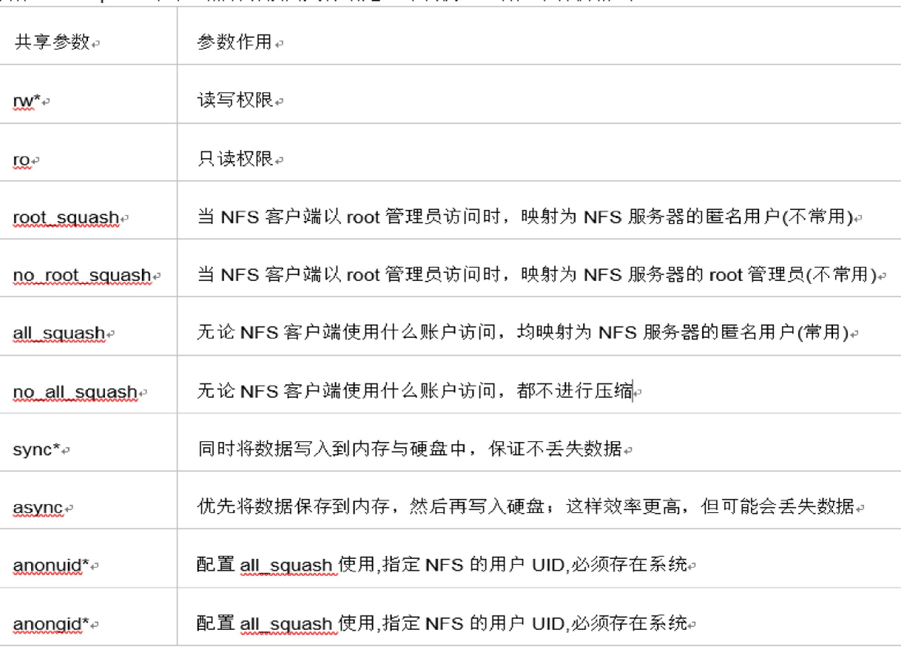

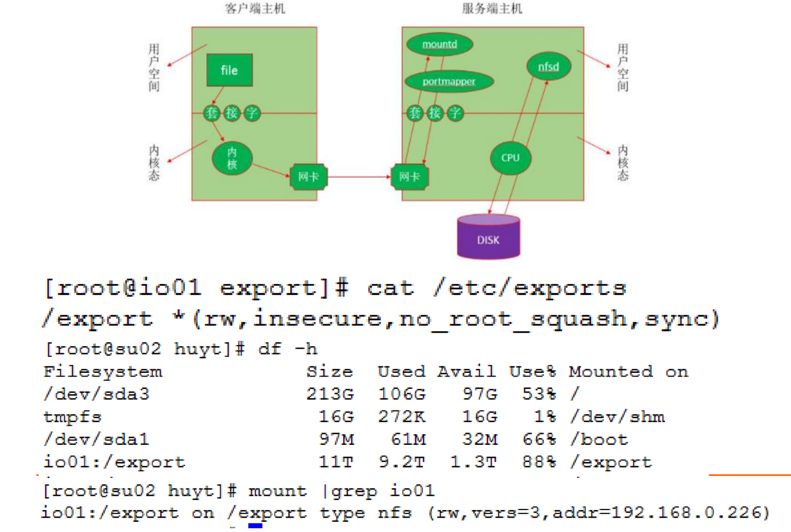

### 应用场景

. 在高性能计算集群应用场景下， NFS网络通常被 用来存储共享用户目录和文件数据等。

. 在企业集群的应用场景下， NFS网络文件系统被 用来存储共享视频、图片等静态资源文件。

### 与RPC、XDR的关系、调用栈

NFS 利用远程过程调用 (RPC) 层实现服务器与客户端之间的通信。
打包 - 将参数打包为 XDR（内部数据表示）格式。
XDR 格式与平台无关
RPC 允许一台主机上的应用程序调用另一台远程主机上的程序（函数 RPC 允许服务器同时响应多个版本的协议（NFS 3 或 NFS 2））。

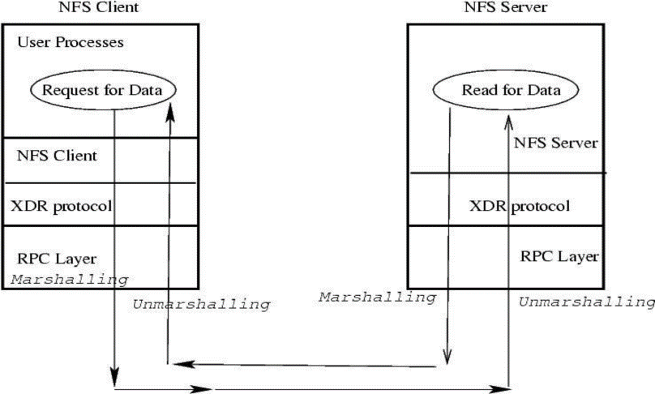

### 服务器上的实现形式

NFS 定义了**虚拟文件系统**

实际上**不管理服务器上的本地磁盘布局**

- 服务器在本地文件系统之上实例化 NFS 卷

- 本地硬盘由具体的文件系统（EXT、ReiserFS......）管理

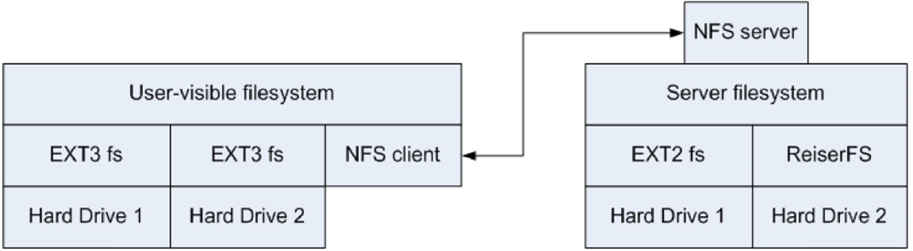

#### 常见的底层文件系统介绍

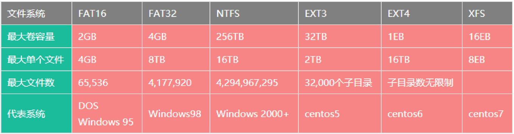

 FAT(File Allocation Table)文件分配表，就是用来记录文件 所在位置的表格

- FAT16每一个分区的容量只有2GB

- FAT32采用32位的文件分配表（单个文件小于4GB），且性能不佳，易产生磁盘碎片

- NTFS对FAT作了若干改进，如支持元数据，使用高级数据结构，以便于改 善性能、可靠性和磁盘空间利用率，并提供了若干附加扩展功能。

- Linux操作系统文件系统类型主要有EXT3、EXT4、XFS等

- XFS是一种高性能的64位日志文件系统（2000年），特别擅长处理大文件， 同时提供平滑的数据传输

 NFS v4 支持对文件进行有状态锁定

- 客户端通知服务器锁定意图
- 服务器可通知客户端尚未处理的锁定请求
- 锁定是基于租期的：客户端必须在超时前不断更新锁
- 与服务器失去联系会放弃锁定

 允许 NFS 客户端缓存远程文件副本，以便后续访问
- 支持从关闭到打开的缓存一致性
- 客户端 A 关闭文件时，文件内容会与主服务器同步，时间戳也会改变
- 客户端 B 打开文件时，会检查本地时间戳是否与服务器时间戳一致。如果不一致，则丢弃本地副本。
- 并发读写器必须使用标记来禁用缓存

### 优点和缺点

#### 优点

- NFS文件系统**简单易用**、方便部署、数据可靠、服务稳 定、满足中小企业需求。

- NFS文件系统内存放的数据都在文件系统之上，所有**数据都是能看得见**。

#### 缺点

- 存在单点故障, 如果构建高可用维护麻烦。             
- NFS数据明文, 并不对数据做任何校验。
- 客户端挂载无需账户密码, 安全性一般(内网使用)

## 谷歌文件系统（GFS）

GFS主要是为谷歌搜索引擎的**基础存储服务**建立的。谷歌需要一 个**分布式文件系统**，在**廉价、不可靠**的计算机上存储 **大量的冗余数据**（**GFS的研究目的**）。

另外， GFS是为谷歌应用程序设计的，并且谷歌应用程 序是为谷歌而建立。在传统的文件系统设计中，这种 观念不会有吸引力，因为在应用程序和文件系统之间 应该有一个清晰的接口， 比如POSIX 接口。

### 设计动机

- 谷歌需要一 个**分布式文件系统**，在**廉价、不可靠**的计算机上存储 **大量的冗余数据**，现有的文件系统办不到
- 谷歌的问题与其他任何人的问题都不同
- 工作负载和设计优先级不同
- GFS 专为 Google 应用程序和工作负载设计
- 谷歌应用程序是为 GFS 设计的

### 体系架构

#### 特殊决策

- 64MB块大小。

- 使用复制来达到可靠性 。

- 单个主服务器可以协调访问以及保管元数据。

- GFS中没有数据高速缓存，因为大规模流读取和写入既不 代表时间也不代表空间的近邻性。

- GFS提供了相似但不相同的POSIX文件系统访问接口。其中 明显的区别是应用程序甚至能够看到文件块的物理位置

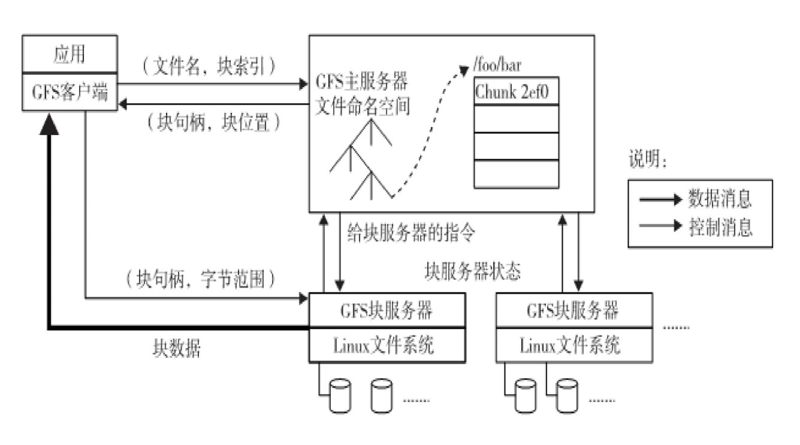

GFS包括一个master结点（元数据服务器） ，多个chunkserver （数据服务器）和多个client（运行各种应用的客户端）

#### Chunkserver
- Chunkserver用于提供存储服务。
- GFS将文件划分为定长数据块，每个数据块都有一个全局唯一不可变的ID（称为chunk_handle）。
- 数据块以普通Linux文件的形式存储在chunkserver上。
- 出于可靠性考虑，每个数据块会存储多个副本，这些副本分布在不同的chunkserver上。

#### GFS Master
- GFS Master是GFS的元数据服务器。
- 它负责维护文件系统的元数据，包括命名空间、访问控制、文件-块映射、块地址等。
- GFS Master还负责控制系统级活动，如垃圾回收和负载均衡。
- GFS Master会定期与Chunkserver交流（心跳），以获取Chunkserver的状态并发送指令。

#### 客户端（Client）
- 应用程序需要链接客户端的代码，然后客户端充当代理与GFS Master和Chunkserver进行交互。

### 容错机制

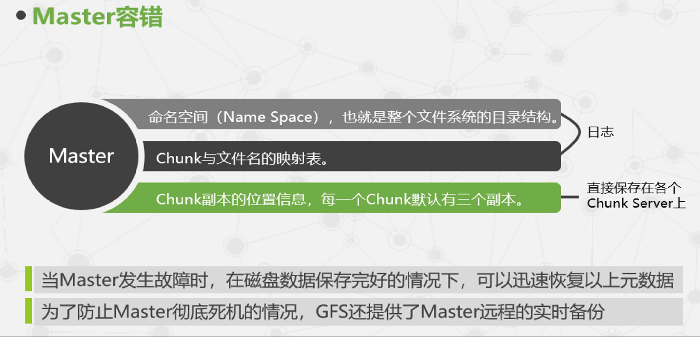

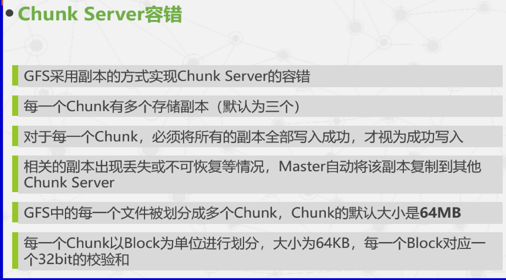

### 数据的布局

GFS（Google文件系统）的文件条带化

- GFS采用文件条带化策略，类似于RAID0，用于提高聚合带宽。这意味着文件会被切分成多个数据块，并以类似RAID0的方式进行存储。
- 大多数分布式存储系统也采用类似的策略，以提高性能和可用带宽。

数据块的管理

- GFS将文件按固定长度切分为数据块。
- 当GFS Master创建一个新的数据块时，它会为每个数据块分配一个全局唯一且不可变的64位ID（chunk_handle）。
- 每个数据块以Linux文件的形式存储在chunkserver的本地文件系统中。这些数据块可以有多个副本，以提高可靠性和容错性。

### RAID

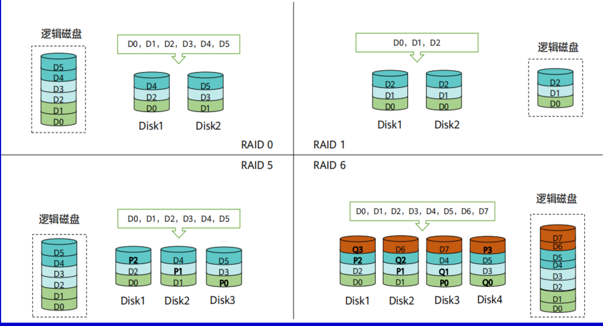

- RAID5 最少3块磁盘，容忍一个磁盘问题
- RAID6 最少4块磁盘，容忍两个磁盘问题

### 数据块大 的优点和缺点

GFS采用了64MB的数据块大小，这个决策带来了一些利与弊。下面是关于这一决策的说明：

#### 好处：

1. **减少交互次数**：较大的数据块大小减少了客户端（client）和主服务器（master）之间的交互次数。因为在读写同一个块时，只需要一次交互，这在GFS所假设的顺序读写负载场景下非常有用。
2. **降低网络开销**：较大的数据块减少了客户端和块服务器（chunkserver）之间的网络交互次数，因此降低了TCP/IP连接等网络开销。
3. **减小元数据规模**：由于每个文件需要的数据块数量减少，元数据的规模也减小。这使得主服务器（master）更容易将元数据**完全放入内存中**，提高了文件系统的性能。

#### 缺点：

1. **内部碎片**：较大的数据块大小可能导致内部碎片，尤其是在文件的最后一个数据块中。这意味着如果一个文件不刚好占满最后一个数据块，那么这个块内部的未使用空间将浪费掉。
2. **热点文件问题**：对于小文件，它们可能只包含少量数据块，有时甚至只有一个数据块。如果某个小文件是热点文件（经常被访问），那么存储该文件数据块的块服务器可能会负载过重，因为它需要频繁地响应客户端请求。

### 元数据服务

#### 集中式元数据服务

- GFS采用典型的**集中式**元数据服务模型，其中所有的元数据都集中存放在一个称为Master的节点内。
- 这个Master节点负责维护**整个文件系统的元数据信息**。

#### 元数据的三种主要类型

GFS的元数据主要分为三种类型：

1. **文件和数据块的命名空间**：这部分元数据包括文件和数据块的命名信息，用于标识文件和数据块的唯一性和层次结构。
2. **文件-数据块映射表**：这部分元数据记录了文件和其对应的数据块之间的映射关系，使系统能够定位和检索数据块。
3. **数据块的副本位置**：这部分元数据用于跟踪数据块的副本位置，以保证数据的可靠性和容错性。

#### 内存中存储元数据

- 所有的元数据都存储在内存中，这有助于提高元数据的访问速度和系统的性能，更快速地响应客户端的元数据请求。

### 缓存和预取

缓存和预取在Google文件系统（GFS）中发挥重要作用，特别是在面对大文件和减少元数据服务器负担方面。

#### 缓存策略：

1. **客户端和chunkserver不缓存数据**：在GFS中，客户端和块服务器（chunkserver）都不会缓存数据。这是因为GFS的典型应用场景是顺序访问大文件，不存在时间局部性。此外，数据集通常非常大，因此没有足够的空间来缓存整个文件。

2. **元数据缓存**：为了减少客户端与元数据服务器的交互，GFS引入了**元数据缓存**。当客户端需要访问数据时，首先向主服务器（master）询问数据的位置，然后将这些数据的地址信息缓存起来。随后，客户端对该数据块的操作都只需直接与块服务器联系。
   然而，这些缓存的信息具有时限，会在一段时间后过期，从而确保缓存信息的实时性。

#### 预取策略：

3. **元数据预取**：由于存在空间局部性，主服务器（master）可以将逻辑上连续的多个数据块的地址信息一并发给客户端。客户端可以缓存这些元数据信息，从而减少对主服务器的频繁查询。这有助于提高访问数据的效率，特别是对于大规模的数据访问。

总的来说：

|        | 缓存 | 预取 |
| ------ | ---- | ---- |
| 数据   | 否   | 否   |
| 元数据 | 是   | 是   |

### 一致性

#### 数据块副本和一致性：

1. **多个数据块副本**：为了提高数据的可靠性和并发性，GFS会为每个数据块创建多个副本。这些副本存储在不同的块服务器（chunkserver）上，以防止数据丢失或损坏。

2. **一致性要求**：一致性指的是在GFS中确保数据块**副本之间的一致性**。这意味着所有副本应该包含相同的数据，以确保数据的完整性和可用性。

#### 元数据和一致性：

3. **元数据一致性**：一致性还涉及到GFS主服务器（master）的元数据和块服务器的数据之间的一致性。主服务器负责维护文件系统的元数据信息，包括文件-数据块映射、数据块的副本位置等。这些元数据必须与实际的数据块副本一致，以确保文件系统的正确运行。

#### 多个客户端和一致性：

4. **多个客户端之间的一致性**：一致性还涉及到多个客户端之间的数据一致性。这意味着多个客户端同时访问相同的数据块时，它们应该看到相同的数据。这种一致性是确保数据在并发访问时不会出现冲突或混乱的关键。

#### GFS中的数据变异序列

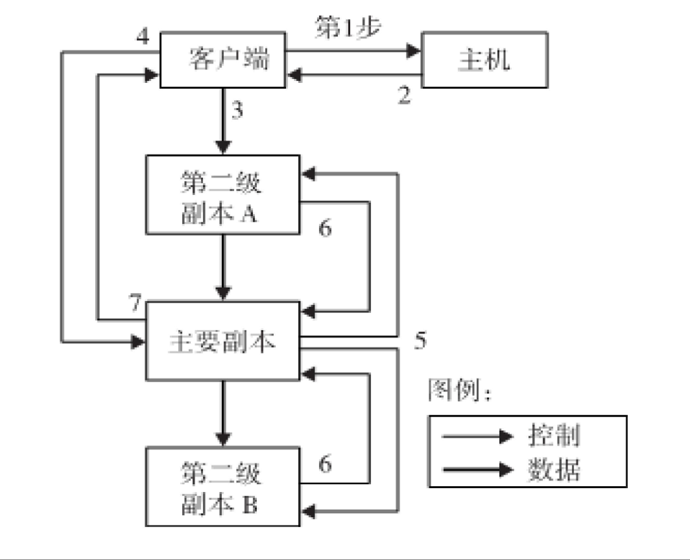

1. **客户端查询块服务器**：客户端首先向主服务器（master）查询当前发行版本的数据块以及其他副本的位置。如果没有发行版本，主服务器会授权客户端使用其中一个副本（通常是主要版本）。

2. **主服务器响应**：主服务器回复客户端主要版本的身份以及其他（第二级）副本的位置。客户端会缓存这些信息，以备将来的变异操作。只有在主要版本不可达或不再拥有发行版本时，客户端才需要重新联系主服务器。

3. **数据推送**：客户端将数据推送到所有副本。客户端可以按任意顺序推送数据。每个块服务器将数据存储在内部LRU缓存区，直到数据被使用或失效。这样的分离控制流和数据流有助于提高性能。

4. **写请求发送至主要版本**：一旦所有副本都确认接收数据，客户端将写请求发送到主要版本。这个请求可以区分之前推送到所有副本的数据。主要版本为收到的所有变异分配连续的序列号。

5. **主要版本转发请求**：主要版本将写请求转发给所有二级副本。每个二级副本按照主要版本分配的相同序列号来应用变异。

6. **二级副本回复主要版本**：每个二级副本都回复主要版本，表示操作已完成。

7. **主要版本回复客户端**：主要版本回复客户端，报告任何副本遇到的错误。如果发生错误，客户端将请求视为失败，并且所影响的区域将保持不一致状态。客户端代码会尝试处理错误，通常通过重试失败的变异操作，以确保最终一致性。

这些步骤确保了GFS中数据的一致性和可靠性，即使在面对错误或故障时，系统也能够处理和恢复数据。这种方法适用于大规模分布式文件系统，特别是在处理大文件和高并发性能要求的情况下。

## MapReduce