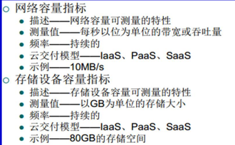
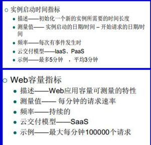
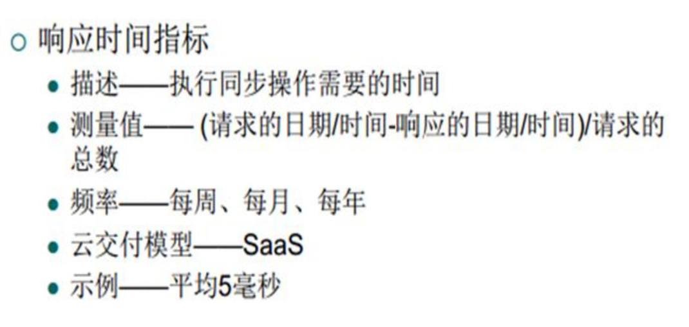

# 7.1-云平台的QoS计费和仿真

## 云计算服务平台的QoS（Quality of   Service）评价指标

### SLA (Service Level Agreement) 

其是云提供者与其客户之间的合同，其中规定了服务质量（Quality of Service, QoS）特性、保证以及云计算资源的限制。SLA 是一份重要的文件，它确保了客户在使用云服务时能够得到符合他们期望的性能和可用性。

### 衡量指标应该具有的特性

可量化的(quantifiable)

 可重复的(repeatable)

 可比较的(comparable)

 容易获得的(easily obtainable)

### SLA管理系统

其有两个任务：

1. 周期性测量QoS指标来验证是否与SLA保证相符合  
2. 收集与SLA相关的数据，用于各种类型的统计分析

### Qos的衡量指标介绍

1. 性能 (Performance): 性能是指系统或服务的执行速度和效率。在云计算中，性能通常用来衡量计算、存储和网络资源的速度和响应时间。
2. 可扩展性 (Scalability): 可扩展性是指系统能够在需要时进行水平或垂直扩展，以应对不断增长的工作负载。云计算平台通常提供弹性的资源分配，使用户能够根据需求增加或减少计算能力，以确保系统保持高性能。
3. 可用性 (Availability): 可用性是指系统或服务可供使用的时间比例。高可用性意味着系统几乎无中断地运行，而低可用性可能导致服务中断和停机时间。
4. 可靠性 (Reliability): 可靠性表示系统或服务在运行时的稳定性和一致性。可靠的系统能够在不出现故障或数据损坏的情况下持续提供服务。云计算平台通常采取备份和容错措施，以提高可靠性。
5. 弹性 (Resiliency): 弹性是指系统在面对故障或异常情况时能够快速恢复正常运行的能力。弹性系统能够自动检测并应对问题，减少服务中断的影响。云计算中的弹性包括自动扩展和故障转移功能。

#### 性能度量

1. 性能度量指标：
   - 系统吞吐量通常用MIPS（每秒钟能够执行的百万条指令数）、Tflops（每秒T浮点运算次数）或TPS（每秒事务数）来衡量。
   - 作业响应时间和网络延迟也是重要的性能度量。
2. 系统开销：
   - 系统开销包括操作系统启动时间、编译时间、I/O数据速率和运行时支持系统消耗。
3. HPC/HTC系统的性能指标：
   - 过去常用的性能指标包括Gflops和Tflops，但现在更常用的是Pflops和将来的Eflops。
   - 评估HPC系统性能的常见基准程序包括Linpack Benchmark、NAS、Splash和Parkbench等。
4. 商用服务器、集群、数据中心和云系统上的HTC性能测试：
   - HTC系统的性能受多个因素影响，包括用户数量、资源共享等。
   - 大量独立用户同时使用云或数据中心的共享资源，这增加了性能测试的复杂性。

#### 可拓展性

  **规模可扩展性**

指通过增加机器数量来获取更高的性能和更多的功能

  **软件可扩展性**

指升级操作系统或编译器，增加数学和工程库，移植新的应 用软件，安装更多的用户友好的编程环境

  **应用可扩展性**

指问题的规模扩展与机器的大小扩展相匹配

  **技术可扩展性**

指系统可以适应构建技术的变化

## 云计算服务平台的计费

## 云计算平台的仿真(Cloudsim)