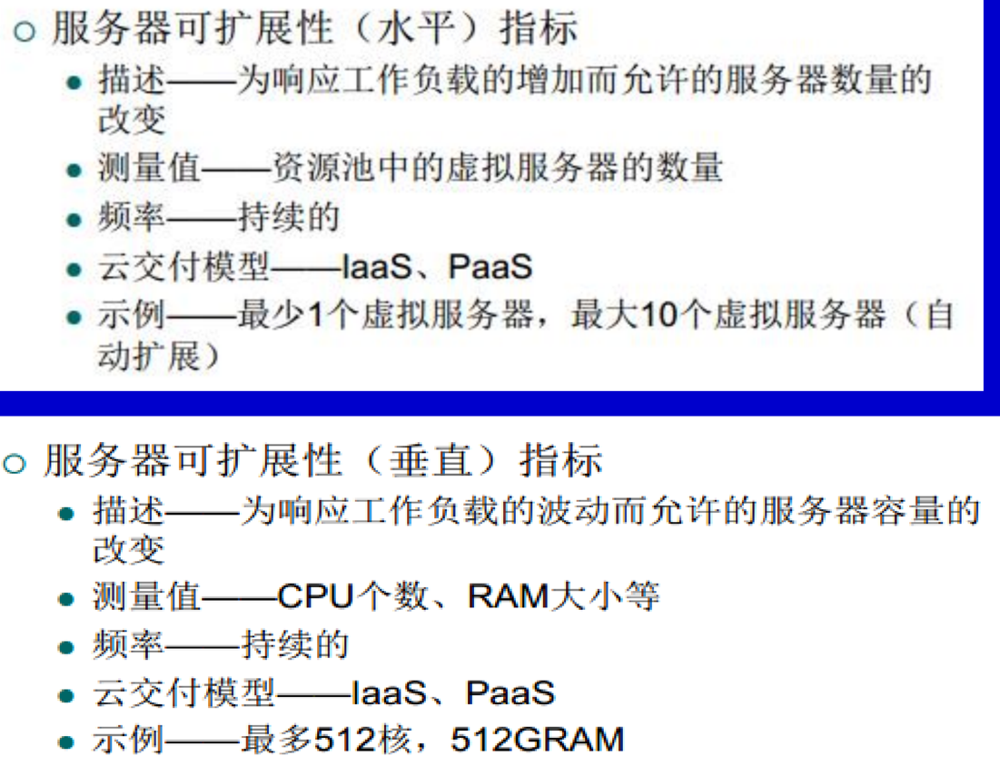
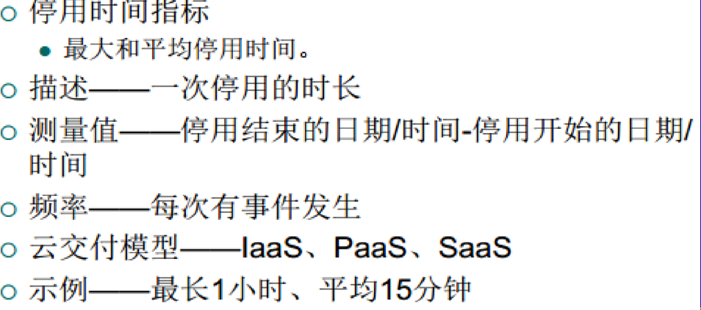
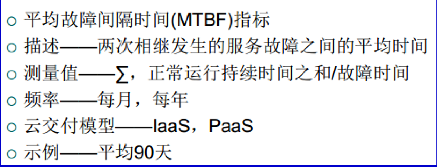
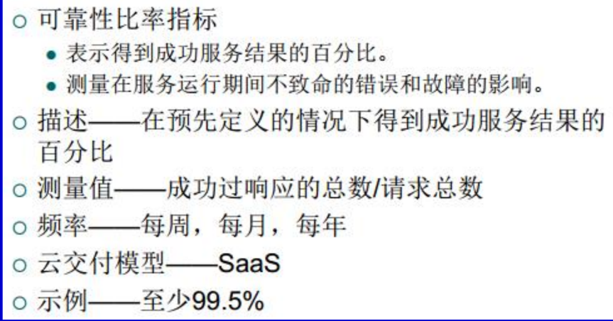
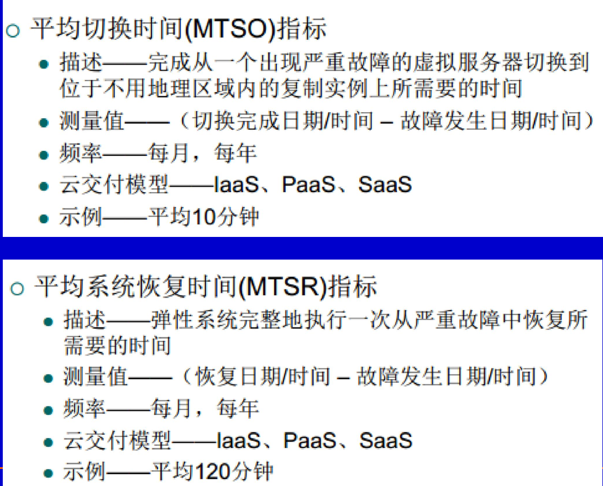
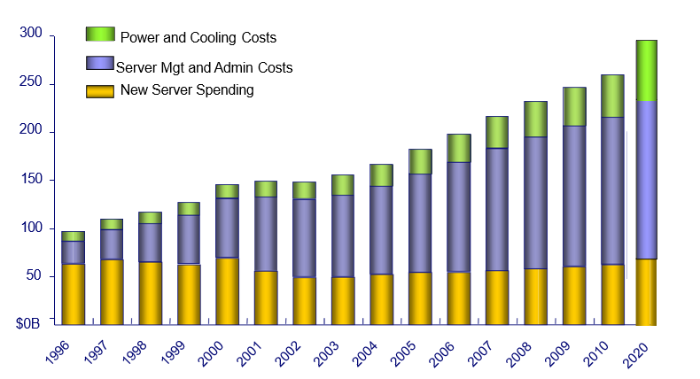
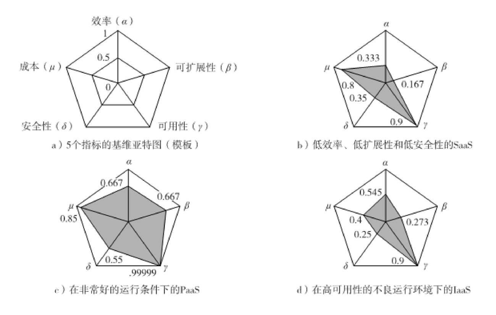
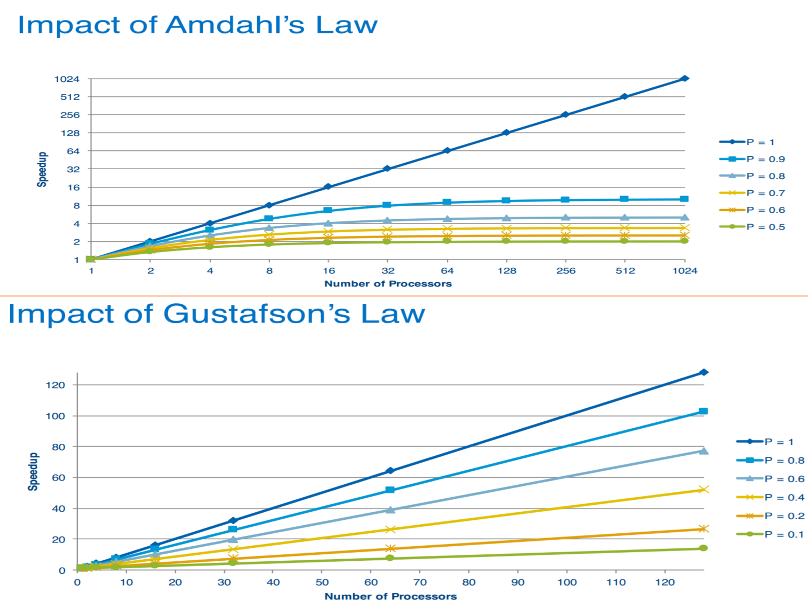
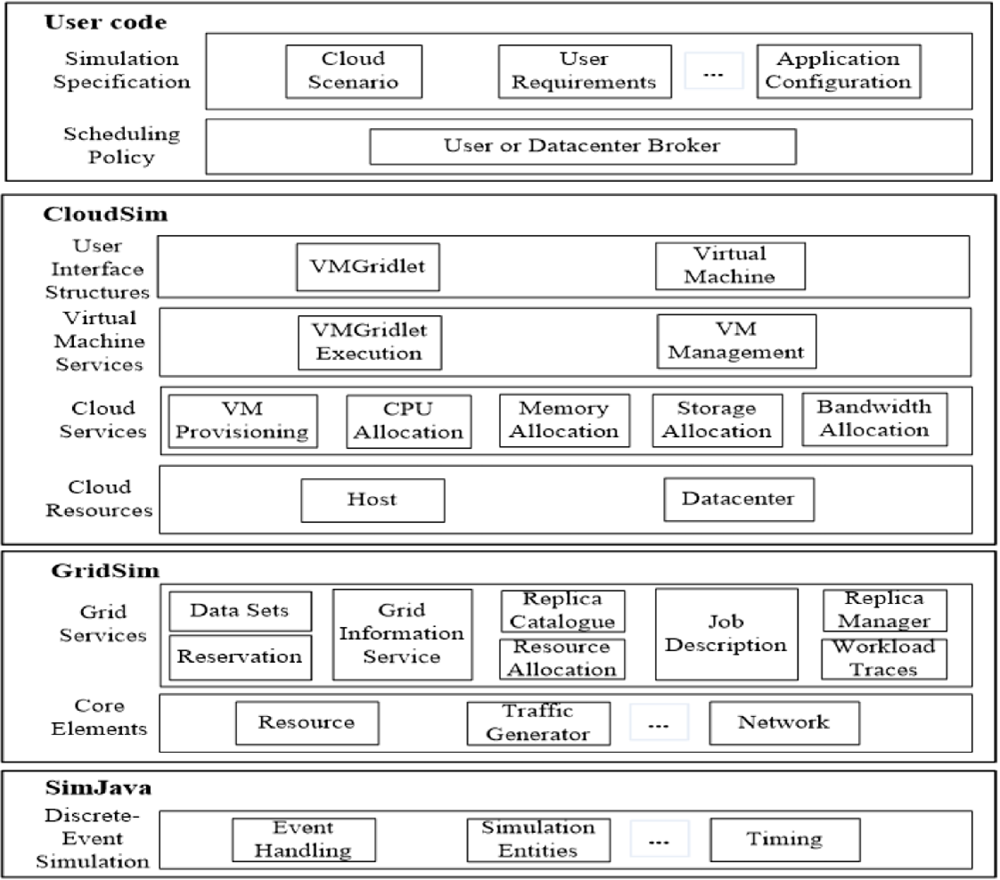
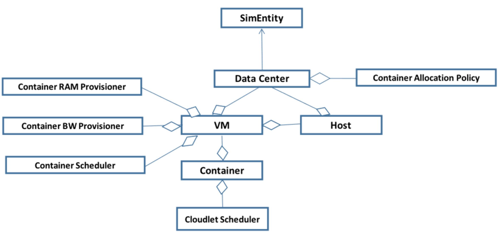

# 7.1-云平台的QoS计费和仿真

## 云计算服务平台的QoS（Quality of   Service）评价指标

### SLA (Service Level Agreement) 

其是云提供者与其客户之间的合同，其中规定了服务质量（Quality of Service, QoS）特性、保证以及云计算资源的限制。SLA 是一份重要的文件，它确保了客户在使用云服务时能够得到符合他们期望的性能和可用性。

### 衡量指标应该具有的特性

可量化的(quantifiable)

 可重复的(repeatable)

 可比较的(comparable)

 容易获得的(easily obtainable)

### SLA管理系统

其有两个任务：

1. 周期性测量QoS指标来验证是否与SLA保证相符合  
2. 收集与SLA相关的数据，用于各种类型的统计分析

### Qos的衡量指标介绍

1. 性能 (Performance): 性能是指系统或服务的执行速度和效率。在云计算中，性能通常用来衡量计算、存储和网络资源的速度和响应时间。
2. 可扩展性 (Scalability): 可扩展性是指系统能够在需要时进行水平或垂直扩展，以应对不断增长的工作负载。云计算平台通常提供弹性的资源分配，使用户能够根据需求增加或减少计算能力，以确保系统保持高性能。
3. 可用性 (Availability): 可用性是指系统或服务可供使用的时间比例。高可用性意味着系统几乎无中断地运行，而低可用性可能导致服务中断和停机时间。
4. 可靠性 (Reliability): 可靠性表示系统或服务在运行时的稳定性和一致性。可靠的系统能够在不出现故障或数据损坏的情况下持续提供服务。云计算平台通常采取备份和容错措施，以提高可靠性。
5. 弹性 (Resiliency): 弹性是指系统在面对故障或异常情况时能够快速恢复正常运行的能力。弹性系统能够自动检测并应对问题，减少服务中断的影响。云计算中的弹性包括自动扩展和故障转移功能。
6. 安全指数

#### 性能度量

1. 性能度量指标：
   - 系统吞吐量通常用MIPS（每秒钟能够执行的百万条指令数）、Tflops（每秒T浮点运算次数）或TPS（每秒事务数）来衡量。
   - 作业响应时间和网络延迟也是重要的性能度量。
2. 系统开销：
   - 系统开销包括操作系统启动时间、编译时间、I/O数据速率和运行时支持系统消耗。
3. HPC/HTC系统的性能指标：
   - 过去常用的性能指标包括Gflops和Tflops，但现在更常用的是Pflops和将来的Eflops。
   - 评估HPC系统性能的常见基准程序包括Linpack Benchmark、NAS、Splash和Parkbench等。
4. 商用服务器、集群、数据中心和云系统上的HTC性能测试：
   - HTC系统的性能受多个因素影响，包括用户数量、资源共享等。
   - 大量独立用户同时使用云或数据中心的共享资源，这增加了性能测试的复杂性。

#### 可拓展性

  **规模可扩展性**

指通过增加机器数量来获取更高的性能和更多的功能

  **软件可扩展性**

指升级操作系统或编译器，增加数学和工程库，移植新的应 用软件，安装更多的用户友好的编程环境

  **应用可扩展性**

指问题的规模扩展与机器的大小扩展相匹配

  **技术可扩展性**

指系统可以适应构建技术的变化

相关的衡量指标：

#### 系统可用性

- **MTBF (Mean Time Between Failures)**平均故障间隔时间
- **MTTF (Mean Time To Failure)** 平均故障时间
- **MTTR (Mean Time To Repair)** 平均修复时间

**衡量指标：**

**可用性比率**：运行时间的百分比   例如，至少99.5%的运行时间

. 描述——服务运行时间的百分比

. 测量值——全部运行时间

. 频率——每周、每月、每年

. 云交付模型—— IaaS 、PaaS 、SaaS

#### 系统可靠性

是一个与可用性紧密相关的特性

是IT资源在预先定义的条件下执行它说所期望的功能而**不发生故障的概率**

可靠性意在描述服务能够多久按照预期执行，这 要求服务保持在运行和可用的状态。

#### 弹性指标

#### 安全指数

可用性受到平台体系结构、所使用的服务模型、 系统脆弱性和对网络攻击抵御能力的影响。云安 全受到多个因素的影响：用户保密性、数据完整性、访问控制、防火墙、 IDS（入侵 检测系统）、抵御病毒或蠕虫攻击的能力、信誉系统、版 权保护、数据锁定、 API、数据中心安全策略、可信协商和 安全审计服务。

#### 商业成本指标（云服务提供方）

1. 前期成本up-front cost
   获得IT资源的成本、部署及管理这些资源的开销

2. 持续成本on-going cost
   运行IT资源的开销（软件（执照）  费用、电费、人力开销等）
   保持IT资源的开销（硬件费用、宽 带费用、人力开销等）

3. 附加成本

   资金成本（Cost of Capital）： 资金成本是企业或投资者使用资金（通常是借款或股权）的成本，以支持其运营、投资或扩张活动。它通常由利息、股权成本和其他金融成本构成。资金成本对于投资决策和资本预算非常重要，因为它反映了使用资金的成本，并影响着项目的盈利能力。

   已支付成本（Sunk Cost）： 已支付成本是指已经在过去用于某项决策或项目的支出，无论决策或项目的结果如何，这些成本都无法收回或改变。已支付成本不应该影响当前或未来的决策，因为它们已经"沉没"，不应作为决策的依据。

   集成成本（Integration Cost）： 集成成本是指与将不同系统、技术或业务流程整合到一起相关的成本。这些成本可能包括软件开发、数据迁移、培训、人员调整和其他与整合相关的费用。在企业整合、并购或技术升级时，集成成本是需要考虑的重要因素。

   锁定成本（Locked-in Cost）： 锁定成本是指企业或投资者因与特定供应商或合同达成协议而陷入的长期承诺或费用。这些成本可能包括合同期内的固定价格、无法取消的合同条款或退出成本。锁定成本可能会影响企业的灵活性，因为它们通常难以改变或终止。

### 总体拥有成本（TCO）

**初期费用**

Ø 硬件采购成本

Ø 软件使用授权成本

Ø 培训费用

**后继费用**

Ø 管理 Ø 运维 Ø 维护 Ø 电能

管理的成本最大，接下来是维护其运行的成本。

### 基维亚特图--QOS的表示方法

### Amdahl定律和Gustafson定律

**Amdahl定律（固定负载加速比）:**它适用于情况，其中只有一部分任务可以并行处理，而其余部分必须串行执行。

加速比 S 可以使用LaTeX语法表示如下：

$$
S = \frac{T}{\alpha T + (1- \alpha)\frac{T}{n}} = \frac{1}{\alpha + \frac{1- \alpha}{n}} 
$$

其中，S表示加速比，T表示总的执行时间，α表示并行部分所占的比例，n表示并行处理的处理器数量。效率 E 如下：
$$
E = \frac{S}{n} = \frac{1}{\alpha n + 1 - \alpha}
$$

通常情况下，系统效率较低，尤其是当集群规模非常大时。

**解释：** Amdahl's Law告诉我们，当只有一部分任务可以并行处理时，性能提升受到限制。加速比S表示性能提升的倍数，但随着并行处理器数量的增加，性能提升会逐渐减小，因为串行部分的执行时间仍然存在。这意味着在固定工作负载下，无法无限地提高性能。

**Gustafson定律（扩展负载加速比）:**

S' 表示扩展负载加速比：
$$
S' = \frac{W'}{W} = \frac{\alpha W + (1- \alpha)nW}{W} = \alpha + (1- \alpha)n
$$

其中，W表示工作负载的大小，α表示并行部分所占的比例，n表示并行处理的处理器数量。效率 E' 可以使用LaTeX语法表示如下：
$$
E' = \frac{S'}{n} = \frac{\alpha}{n} + (1 - \alpha)
$$
**解释：** Gustafson's Law告诉我们，随着工作负载的增加，可以增加并行处理器数量来提高性能，因为任务规模变大，可以并行处理的部分也会增加。这意味着系统可以通过适应性地调整并行处理器数量来应对不同大小的工作负载，以实现性能提升。

### 名词解释

1. **Service Response Time (服务响应时间):** 这是指从用户发出请求到服务完成处理并返回响应的时间。较短的服务响应时间通常表示更快的服务性能，对于用户体验和系统效率至关重要。
2. **Sustainability (可持续性):** 这指的是一个服务在长期内能够持续地提供所需的功能和性能，而不会出现过度耗费资源或无法维护的情况。可持续性考虑了服务的长期可用性和可维护性。
3. **Suitability (适用性):** 适用性涉及服务是否满足了用户的特定需求和期望。一个服务应该具备适当的功能和性能，以满足不同用户的需求。
4. **Accuracy (准确性):** 这表示服务提供的结果或响应的准确性。在许多应用中，特别是科学、金融和医疗领域，准确性是至关重要的。
5. **Transparency (透明度):** 透明度指的是服务的操作和决策是否能够被用户或其他系统理解和追踪。透明度有助于建立信任和可追溯性。
6. **Interoperability (互操作性):** 互操作性表示一个服务是否能够与其他不同的服务或系统进行有效地互相通信和协作。这对于建立复杂的分布式系统至关重要。
7. **Stability (稳定性):** 稳定性表示服务是否能够在不出现故障或崩溃的情况下稳定地运行。一个稳定的服务对于保持连续性非常重要。
8. **Cost (成本):** 成本涉及使用和维护服务所需的资源、时间和金钱。了解服务的成本是管理和优化资源的关键因素。
9. **Adaptability (适应性):** 适应性表示一个服务是否能够适应变化的需求和环境。在不断变化的市场和技术条件下，适应性是一个重要的优势。
10. **Throughput and Efficiency (吞吐量和效率):** 吞吐量指的是服务每单位时间内能够处理的请求数量。效率表示在资源消耗下提供服务的程度。这两个指标关注服务的性能和资源利用率。

### 服务测量指标 Service Measurement Index

 Service Measurement Index（服务测量指标）是一个综合的度量系统，用于评估和监控服务的质量、性能和效能。它是一个包含多个指标的集合，旨在提供全面的服务评估，以确保服务符合用户和业务需求。

## 云计算服务平台的计费

### 对四类内容进行计费

#### 计算资源（CPU机时）

| 指标                       | 描述                       | 测量值                             | 频率                                       | 模型         | 示例                                                 |
| -------------------------- | -------------------------- | ---------------------------------- | ------------------------------------------ | ------------ | ---------------------------------------------------- |
| 按需使用   的虚拟机   实例 | 实例的正 常运行时   间     | Σ,启动时 间到停止   时间           | 在预订的时  间段内，连  续计算并进  行累计 | IaaS ， PaaS | 小型$0.10/小时，  中型$0.20/小时，  大型$0.90/小时   |
| 预留的虚   拟机实例        | 预留一个 实例的前   期成本 | Σ,预留开 始时间到   预留结束  时间 | 每天，每月，  每年                         | 同上         | 小型$55.10/小时， 中型$99.90/小时， 大型$249.90/小时 |

#### 存储资源（存储大小GB）

|                            | 描述                                                | 测量值                                                       | 频率 | 模型                | 示例                                       |
| -------------------------- | --------------------------------------------------- | ------------------------------------------------------------ | ---- | ------------------- | ------------------------------------------ |
| 按需使用  的存储空  间指标 | 以字节为单位 的按需使用的 存储空间分配 的时间与大小 | Σ,存储空间释 放/重分配时间   到存储空间分  配时间（当存  储空间大小改  变时清零） | 连续 | IaaS ， PaaS， SaaS | 每小时费用为   $0.01/GB(通常  表示为GB/月) |
| I/O数据传   输指标         | 传输I/O数据  总量                                   | Σ,按字节计量 I/O数据                                         | 连续 | IaaS ， PaaS        | $0.10/TB                                   |

#### 网络资源（网络流量）

|           | 描述                                           | 测量值         | 频率                                     | 模型                 | 示例                                                         |
| --------- | ---------------------------------------------- | -------------- | ---------------------------------------- | -------------------- | ------------------------------------------------------------ |
| 流入      | 流入网络  流量                                 | Σ,按字节  计算 | 在预订的时  间段内连续  计算并进行  累计 | IaaS ， PaaS ， SaaS | 1GB以下免费； 10TB以下，  一个月为$0.001/GB                  |
| 流出      | 流出网络  流量                                 | 同上           | 同上                                     | 同上                 | 1GB以下免费一个月； 10TB   以下， 一个月为$0.01/GB           |
| 云内  WAN | 同一云内  不同地理  位置的IT  资源的网  络流量 | 同上           | 同上                                     | 同上                 | 每天小于500M免费； 500M   到1TB之间每月$0.01/GB；    超过1TB为每月$0.005GB |

#### 软件资源（SaaS，软件许可， Price+）

|                            | 描述                       | 测量值                           | 频率              | 模型         | 示例                            |
| -------------------------- | -------------------------- | -------------------------------- | ----------------- | ------------ | ------------------------------- |
| 应用订购   持续时间   指标 | 云服务使用 订购的期限      | Σ,订购期  限开始时间 到结束时间  | 每天，每 月，每年 | SaaS         | 每月费用为$69.90                |
| 制定用户   数量指标        | 进行合法访 问的注册用 户数 | 用户数量                         | 每月，每 年       | SaaS         | 每月每增加一个用  户费用为$0.90 |
| 用户事务   数量指标        | 云服务提供 的事务数量      | 事务数量  （交换请求 -响应消息） | 连续              | PaaS ， SaaS | 每1000个事务的费 用$0.05        |

### 定价模型

**价格模板**是用于定义定价模型的结构的工具，它通过设置各种计量、使用配额、折扣以及其他费用的单位来构建定价策略。一个定价模型可以包括多个价格模板，而这些模板的具体内容取决于以下因素：

1. **成本指标和相关价格（Cost Metric And Associated Price）：** 这一部分确定了定价模型中使用的成本指标以及与这些指标相关联的价格。

2. **固定费用和浮动费用的定义（Fixed And Variable Rates Definition）：** 它定义了哪些费用是固定的，即不随使用量或其他因素而变化，以及哪些费用是浮动的，即根据使用情况而变化。这有助于建立灵活的定价策略。

3. **使用量折扣（Volume Discount）：** 使用量折扣部分规定了在客户达到一定的使用量阈值时，可以享受到的折扣或优惠。这鼓励客户增加使用量，同时也可以影响定价模型。

4. **成本与价格定制选项（Cost And Price Customization Option）：** 这一部分提供了定制定价选项的设置，允许根据客户的需求或特殊情况进行个性化的定价。这可以包括额外的服务或定制的价格计划。

### 云上资源付费方式（预付费、后付费）

**后付费：**

-按量付费（按需实例）。对云服务提供商的账单系统、计 量计费系统的实时性、精准性都提出了很高的要求（秒级）

-抢占式实例（竞价型实例）。适用于无状态的应用场景， 可以中断和续算

**预付费**

-包年包月（专用主机）

-预留实例劵（灵活性）

32 vCPU 64GB资源==4台 8vCPU 16GB资源

### 实例的分类

1. 按需实例：您只需要按小时支付计算容量费用 ,无需签订长期合同或交纳预付款。

   - 具有短期、难应付或无法预测且不能中断的工作负载的应 用程序
   - 首次在 Amazon EC2 上开发或测试的应用程序
   - 并且无法 支付预付款或签订长期合同的用户

2. 竞价型实例：对空闲 AmazonEC2计算容量进行竞价，与按需实例的价格相比，这 类实例最多可以节省 90% 的成本。

   - 开始时间和结束时间灵活的应用程序
   - 只能承受极低的计算价格的应用程序
   - 具有紧急计算需要，需要获取大量附加容量的用户

3. 预留实例：可以提供容量预留，让您更相信自己能够按需启动实例。 对于使用率稳定或可以预测的应用程序，与使用按需实例相比，预留实例可节省大量成本。
   使用率稳定的应用程序
   可能需要预留容量的应用程序
   愿意使用 EC2 1 年或 3 年以上来降低总计算成本的客户

4. 专用主机：物理 EC2 服务器

   可按需购买 (按小时)。

     可作为预留实例购买，与按需实例的价格相比，最多可以 节省 70% 的成本。

## 云计算平台的仿真(Cloudsim)

澳大利亚墨尔本大学推出的云计算仿真软件，是一 种通用的和可扩展的模拟框架，支持模拟新兴的云 计算基础设施和管理服务。有如下功能：

1. 可对云数据中心、服务代理， 调度和分配策略进行建模。
1. 支持动态插入仿真元素、停止和恢复仿真
1. 支持用户定义的虚拟机主机分配策略和虚拟机主机资源分配策略

### 优点

1. 允许用户反复测试他们的服务，而 不需要大量资金耗费，并能够在部署之前调节性能 瓶颈
2. 帮助服务提供者优化资源访问耗费以便  提高收益
3. 利用现有的模拟库GridSim和SimJava来解决系统的底层需求，可以轻松地重用，节省了测试时间。

### 体系结构

CloudS im仿 真器采用分 层的结构， 自底向上由 SimJava，GridSim，CloudSim，用户代码四 个层次组成

#### (1) SimJava

最底层的是**离散事件模拟引擎SimJava**，它负责执行高层模拟框架的**核心功能**，比如： 查询和处理   事件，系统组件的创建(服务、客户端、数据中心、 代理和虚拟机)，在不同组件之间的通信，模拟时  钟的管理。

#### (2) GridSim

支持高层软件组件，建模多个网格基础设施，包括网络和网络流量文 件，基础的网格组件诸如资源、数据集、负载测 量和信息服务。

#### (3)CloudSim

CloudS im提供了对基于云的虚拟数据中心环境的建模与仿真的支持，包括 对虚拟机、内存、存储、带宽的专用管理接口管理。 CloudS im层在模拟  阶段管理核心实体(比如VM，客户端，数据中心， 应用)的实例和执行。这 一层能够并发地实例化和透明地管理大规模云基础设施包括数以千计的系 统组件。

对其中的两个层次进行介绍：

**1、虚拟机服务层**

- 虚拟机运行在一个客户端内，和其它VM共享资源

- VM管理能够定义一系列和VM相关的操作：给主机提供VM , VM创建、启动、停止、重启、迁移/合并和销毁

**2、云服务层**

- VM Provisioner(虚拟机提供组件)：给客户端分配基于特定应用的VM。这个组件给研究者提供一定数量的用户方法， 能够有助于基于一定的优化目标(以用户为中心、或以系统 为中心)执行新的VM提供策略（虚拟机分配到主机的调度）
-  CPU Allocation：对于每个客户端组件，给VM分配处理内  核的过程是在客户端分配器上完成的。该策略考虑了多少  个处理内核会授权给每个VM
- Memory Allocation, Storage Allocation, Bandwidth    Allocation功能类似。

#### **(4)** 用户代码层

负责提供基本的云实体，包括与主机（多台机器、多规格） 、应用（任务及其需求）、虚拟机、大量用户及其应用类型 和代理的调度策略的配置相关功能的用户代码

云应用开发人员可在本层开发各种用户需求分布、应用的配 置请求和云可用场景，进行可靠性测试，从而实现自定义的 云应用调度算法

### 自定义策略

其实是有预先配置好的策略的，这里可以加入用户自己的策略。

- 定义容器分配策略
- 定义虚拟机分配策略，当一台主机被定义过载时，确定应 选择哪台虚拟机进行迁移
- 定义主机选择策略，确定哪些主机作为迁移目的地
- 定义迁移阈值
- 如何将虚拟机放置在数据中心的主机(host)中
- ........

## ContainerCloudSim仿真器

CloudSim项目自4.0版本加入容器特性后，迎来了新成员ContainerCloudSim仿真器

主要功能：

1. 容器化云环境的建模和仿真
2. 对容器化虚拟机进行建模和仿真，可自定义为容器配置虚拟机资源的策略
3. 支持用户定义的将虚拟机分配给容器的策略和将主机分配给虚拟机的策略，以及将虚拟机/主机资源分配给容器的策略，虚拟机/主机资源分配给容器/虚拟机的策略

