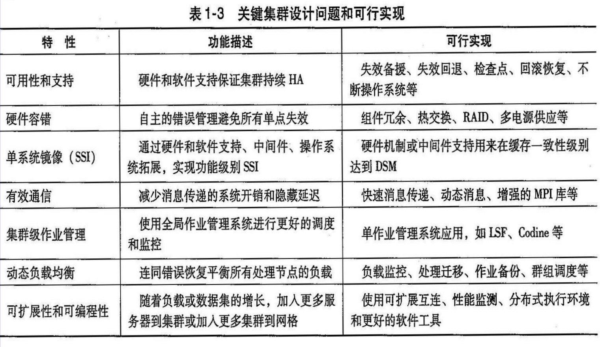
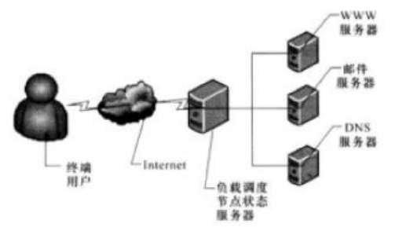
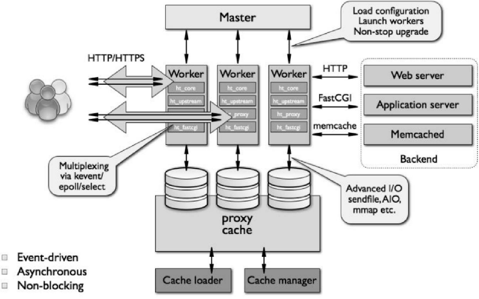

# 2.1-云计算使能技术

云计算：基于互联网的 IT 资源按需服务（可不用自己购买和维护本地 IT 资源，租用 /pay -per -use ）
 互联网与 网络化 计算 /并行与分布式计算模型
-InternetInternetInternetInternet InternetInternet 、Web 技术； 技术；
-集群、 网格P2P 、分布式数据中心 、分布式数据中心 、分布式数据中心 、分布式数据中心
 IT 资源
-计算、存储网络软件资源和 计算、存储网络软件资源和 计算、存储网络软件资源和 计算、存储网络软件资源和 计算、存储网络软件资源和 虚拟化 虚拟化 ；
-分布式数据库、文件系统； 分布式数据库、文件系统； 分布式数据库、文件系统； 分布式数据库、文件系统； 分布式数据库、文件系统；
-云计算数据中心、平台资源管理与调度技术 云计算数据中心、平台资源管理与调度技术 云计算数据中心、平台资源管理与调度技术 云计算数据中心、平台资源管理与调度技术 云计算数据中心、平台资源管理与调度技术 云计算数据中心、平台资源管理与调度技术
 按需 服务
-多租户技术；
-资源（虚拟机、 容器资源（虚拟机、 容器资源（虚拟机、 容器资源（虚拟机、 容器BareMetal BareMetal ）弹性供给；
-服务化 技术（ IaaS/SaaS/PaaSIaaS/SaaS/PaaSIaaS/SaaS/PaaS IaaS/SaaS/PaaS IaaS/SaaS/PaaS IaaS/SaaS/PaaS ）；
-QoS （包括安全）， （包括安全）， （包括安全）， Service Level Agreement Service Level Agreement Service Level Agreement Service Level Agreement Service Level Agreement Service Level Agreement Service Level Agreement Service Level Agreement （SLA ），计费 ），计费
8

## 云计算的使能技术

### 互联网基础

+ 网名规模和互联网普及率不断提高
+ 网速接入能力高
+ WEB的呈现方式十分多样（插件的Web呈现技术【Flash】，浏览器的Web呈现技术【HTML5，CSS3，Ajax】）
  AJAX（Asynchronous JavaScript and XML） 不是新的编程语言，而一种使用现有标准新方法 。

### 网络化计算 /并行与分布式计算模型

**概念**

一个并行的、分布式的计算系统使用大量的计算机解决互联网上的大规模计算问题

**互联网计算时代的不同计算方式：**

- 计算平台的变革:1950年代起大型机、小型机、个人计算机、便携式计算机
- 高性能计算（同构节点，高速传输）: HPC系统强调系统的原生速度和性能
- 高吞吐量计算（异构节点，通过文件共享传输）:HTC主要应用于被百万以上用户同时使用的互联网搜索和Web服务
- 云计算 (AI计算)
- 分布式计算：缺点是①数据敏感（数据敏感性变得更加重要，因为数据可能分布在不同的节点上，需要进行传输和处理）和②网终中心化（中心化可能会导致单点故障，如果中心节点发生故障或遭受攻击，整个分布式系统可能会受到影响）

**不同计算范式的区别**

- 集中式计算 ：这种计算范式是将所有资源集中在一 个物理系统之内。所有资源（处器、存储）是全部共享的，并且紧耦合在一个集成式操作系统中。
- 并行计算 ：在并行计算中 ，所有处理器或是紧耦合于心共享内存或是松耦合于分布式。
- 分布式计算： 一个分布式系统由众多自治的计算机组成， 各自拥有其**私有内存**，通过 计算机网络 通信。
- 云计算:①一个互联网云的资源可以是集中式的也可以是分布式的。②云采用分布式计算或并行计算，或两者兼有。③云可以在集中的或分布式的大规模数据中心之上，④由物理的或虚拟的计算资源构建。
- 普适计算是指在**任何地点和时间**通过有线或者无线**网络**使用**普遍的设备**进行计算。
- 物联网是一个日常生活对象 (包括计算机、传感器、人等网络化的连接。物联网通过互联网云实现任何对象在任何地点和时间的普适计算。
- 互联网计算这一术语几乎涵盖了所有和互联网相关的计算范式。

# 2.2-可扩展并行计算集群

## 计算机集群基本知识和分类

计算机集群（computer cluster）由相互联系的**多个计算机** 聚集组成，通过**高速网络互联**，这些计算机之间**相互联系并且  共同工作**，  并以**单一系统的模式加以管理**（集群管理软件）。

对于用户来说，计算机集群如同一个独立完整的计算资源池，  可实现作业级的大规模并行。

**优点**

1. **可扩展性（Scalability）**：
   - 计算机集群的可扩展性是指它可以根据需要轻松扩展计算和存储资源。当工作负载增加时，您可以简单地添加更多的计算节点来增加性能，而无需更改整个系统的基础架构。这使得集群非常适合处理大规模的计算任务，例如大数据分析和科学计算。

2. **高可用性（High Availability）**：
   - 高可用性是指系统可以持续提供服务而不中断或减少性能的能力。计算机集群通过在多个节点上复制数据和应用程序，以及使用负载均衡技术来确保即使某个节点发生故障，系统仍然可以继续工作。这提供了对故障的容忍性，从而提高了系统的可靠性。

3. **容错（Fault Tolerance）**：
   - 容错是指系统可以检测到并纠正或处理故障，以确保系统的连续运行。计算机集群通常具有内置的容错机制，例如数据冗余和自动故障切换。这意味着即使某个节点发生故障，系统仍然可以保持运行，从而减少了服务中断的风险。

4. **模块化增长（Modular Growth）**：
   - 计算机集群允许模块化增长，这意味着您可以根据需要逐步扩展系统。您可以开始只有少量的节点，并随着业务需求的增长逐渐添加更多的节点。这降低了初始成本，同时也更容易管理和维护。

5. **使用商用组件（Use of Commercial Off-The-Shelf Components）**：
   - 计算机集群通常使用商用组件，包括标准服务器硬件和操作系统。这降低了成本，因为您可以使用市场上可用的常规硬件和软件，而无需定制专用解决方案。此外，商用组件通常具有广泛的支持和可用性，使维护和更新更加容易。

**基础集群设计问题**

1. **可扩展性性能**：
   - 资源扩展（集群节点、内存容量、I/O带宽等）使性能成比例增长

2. **单系统镜像/环境**：
   - 考虑到集群作为一个单一独立的系统，这意味着集群中的各个节点应该具有相似的配置和环境，以确保一致性和可管理性。

3. **节点间通信**：
   - 包括网络拓扑、路由和流量控制。为了确保高性能和低延迟，需要考虑网络布局和拓扑结构，并确保适当的流量控制。集群内节点之间的物理网线长度一般比MPP（大规模并行处理）长

4. **集群资源管理与作业调度**：
   - 实现高系统利用率， 作 业管理调度软件需要提供批量、负载均衡和并行处 理等功能

5. **可用性支持**：
   - 集群能够利用处理器、内存、磁盘、 I/O设备、网络和操 作系统镜像的大量冗余提供低成本、高可用性的性能

6. **容错和恢复**：
   - 机器集群能够消除所有的单点失效。
     集群能在一定程度上容忍出错的情况。故障节点上运行的关键作业可以被转移到正常运行的节点上。回滚恢复机制通过周期性记录检查点 来恢复计算结果。

名词解释：

HA：高可用性

失效备援：通过在系统中引入冗余（冗余硬件、软件或网络组件），以便在主要组件失效时可以迅速切换到备用组件，从而保持系统的运行。

失效回退：是指在计算机系统或网络中，在修复故障后将系统或资源从备用状态切换回主要状态的操作。

回滚恢复：恢复到某一已知的一致性状态。

热交换：用于描述在运行状态下替换或添加硬件组件或模块的能力，而无需关闭整个系统或造成中断。

**单一系统映像（Single System Image）**：在计算机集群和分布式系统中，SSI 是一种概念，指的是将多个计算节点或服务器看作一个单一的虚拟系统，从而使用户无需关心底层的物理服务器或节点。SSI 的目标是提供透明的分布式计算体验。

DSM（分布式共享内存）是一种机制，允许多个计算机节点通过共享内存来进行数据交互，从而使它们可以协同工作。DSM 旨在提供高性能和方便的编程模型，使开发人员能够以类似于单一计算机的方式处理分布式环境中的数据。

**快速消息传递（Fast Message Passing）**：在 MPI 中，消息传递是一种用于在不同计算节点之间交换数据的通信模式。快速消息传递通常指的是一种优化技术，用于提高消息传递的性能和效率。这包括减少消息传输的延迟、提高带宽和降低通信开销。快速消息传递可以通过各种方式实现，例如利用硬件加速、网络拓扑优化、缓存和通信协议优化等。

**动态消息（Dynamic Messages）**：在 MPI 编程中，通常需要在编译时指定消息的大小。这在某些情况下可能会限制灵活性，因为消息大小在运行时可能会变化。动态消息是指在运行时动态分配消息大小的能力。这可以通过 MPI 库的一些功能实现，允许根据需要分配和释放消息内存，从而提供更灵活的消息处理。

**增强的 MPI 库（Enhanced MPI Library）**：增强的 MPI 库是指对标准 MPI 库进行扩展或优化的库或实现。这些扩展可以包括额外的功能、性能优化、更好的可伸缩性或与特定硬件体系结构的集成。增强的 MPI 库旨在提供更高级别的功能或更好的性能，以满足特定应用程序或环境的需求。

-------

**云计算数据中心大规模服务器集群**

1. 高可用和负载均衡集群（Web服务器/电子商务）	 
2. 高性能计算集群（slurm ，torque等）	 
3. 大数据集群（hadoop ，spark等）	
4.  数据库集群（Oracle, SqlServer）

**计算机集群分类**【在本小节需要介绍的】

1. 高可用性集群用于**容错和实现服务的高可用性**。高可用性集群中有很多冗 余节点以容忍故障或失效。（银行关键业务等）	 
2. 负载均衡集群通过使集群中所有节点的负载均衡而达到**更高的资源利用**。可以在不同机器间**平衡负载**，从而达到更高的资源利用或性能。  (Web服务器， Email服务器等）	 
3. 高性能计算集群(HPC)主要用于**单一大规模作业**的集体计算。当单一计算作业需要 集群中节点间的频繁通信，该集群必须共享一个专用网络，因  而这些节点大多是**同构和紧耦合**的。这种类型的集群也被称为  贝奥武夫（beowulf）集群。（科学与工程计算应用等）

## 高可用性集群（High Availability cluster）

功能：保障用户的应用程序持续、不间断 地提供服务

方法：当应用程序出现故障，或者系统硬件、网络出现故障时， 应用可以自动、快速地从一个节点切换到另一个节点，从 而保证应用持续、不间断地对外提供服务

#### 双机热备和双机互备

这类集群一般都由两个或两个以上节点组成。

多机互备是双机热备的技术升级，通过多台及其组 成一个集群，可以在多台机器之间设置灵活地接管 策略。

1. **双机热备（Active-Active）**：
   - 双机热备是一种高可用性配置，其中两台计算机（通常是服务器）都处于活动状态，并可以同时处理请求。
   - 这种配置通常涉及到负载均衡器，它会将请求分发到这两台计算机上，以实现负载分担。
   - 如果其中一台计算机发生故障，负载均衡器可以将流量路由到另一台仍然正常运行的计算机上，从而保持服务的可用性。
   - 双机热备通常用于需要高可用性和负载均衡的应用程序和服务，例如Web服务器、数据库集群等。
2. **双机互备（Active-Standby）**：
   - 双机互备是一种高可用性配置，其中一台计算机处于活动状态，而另一台处于待命状态。
   - 活动状态的计算机处理所有请求，而待命状态的计算机仅在活动状态的计算机发生故障时接管工作。
   - 当活动状态的计算机出现故障或需要维护时，系统会自动将工作切换到待命状态的计算机上，从而实现故障恢复和高可用性。
   - 双机互备通常用于关键应用程序和服务，以确保在主要计算机出现问题时能够快速切换到备用计算机上。

#### 高可用集群软件

在Linux下常用的高可用软件有Heartbeat ，Red Hat提  供的RHCS （Redhat Cluster Suite）,商业软件ROSE ，keepalived等

- Heartbeat：心跳检测、资源接管、监测系统服务，在集群的 节点间转移共享IP地址的所有者等HA软件所需基本功能；
  but：配置麻烦，双机之间的心跳线是一个瓶颈问题；
- keepalived：运行在LVS之上，主要实现故障隔离及负载均衡器之间的失败切换（Fail Over）
  名词解释：LVS（Linux Virtual Server）用于构建高性能和高可用性负载均衡集群的开源软件项目，它运行在 Linux 操作系统上，旨在将传入的网络流量分发到多个后端服务器，以确保负载均衡和高可用性。

## 负载均衡集群/高吞吐率集群（HTC）

负载均衡集群也是由两台或者两台以上的服务器组成。分为

1. 前端负载调度（把客户端的请求按照不同的策略分配给后端服务节点）
2. 后端服务（真正提供应用程序服务的部分。）

**与HA Cluster不同的是，负载均衡集群中， 所有的  后端节点都处于活动动态，它们都对外提供服务，  分摊系统的工作负载。**

| 主要的作用                                                   | 不足                                                         |
| ------------------------------------------------------------ | ------------------------------------------------------------ |
| 可以把一个高负荷的应用分散到多个 节点共同完成，适用于业务繁忙、大负荷访问的应 用系统。 | 当一个节点出现故障时，前端调度系统并不知道 此节点已经不能提供服务，仍然会把客户端的请求调度到故障 节点上来，这样访问会失败。 解决方法：引入了节点监控系统 |

###  节点监控系统

位于前端负载调度机上，负责监控下 面的服务节点。

1. 当某个节点出现故障后，节点监控系统会自动将故障节点  从集群中剔除；
2. 当此节点恢复正常后，节点监控系统又会自动 将其加入集群中，

而这一切，对用户来说是完全透明的。

### Web服务器介绍

LAMP(Linux, Apache, Mysql, Php)

Ng inx：Nginx 是一个高性能的开源 Web 服务器和反向代理服务器。

