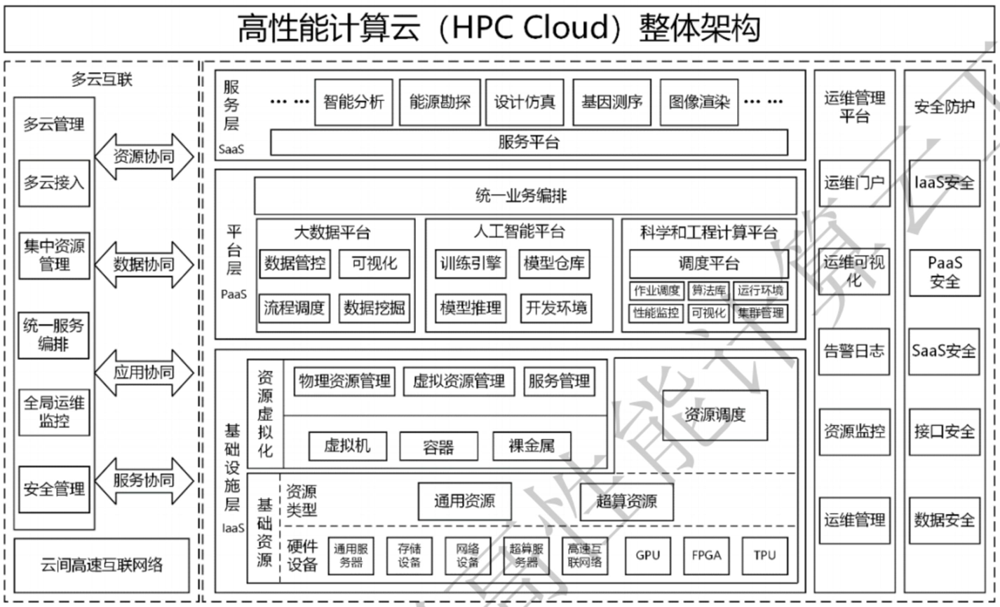
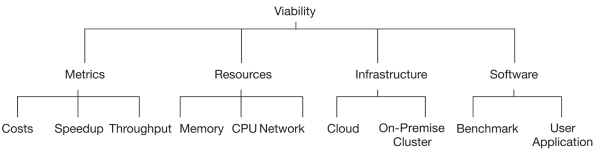
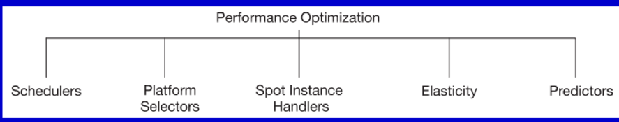
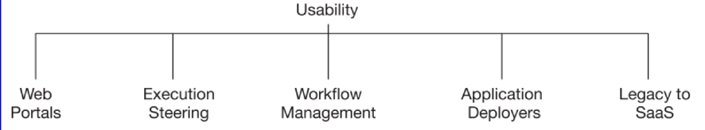
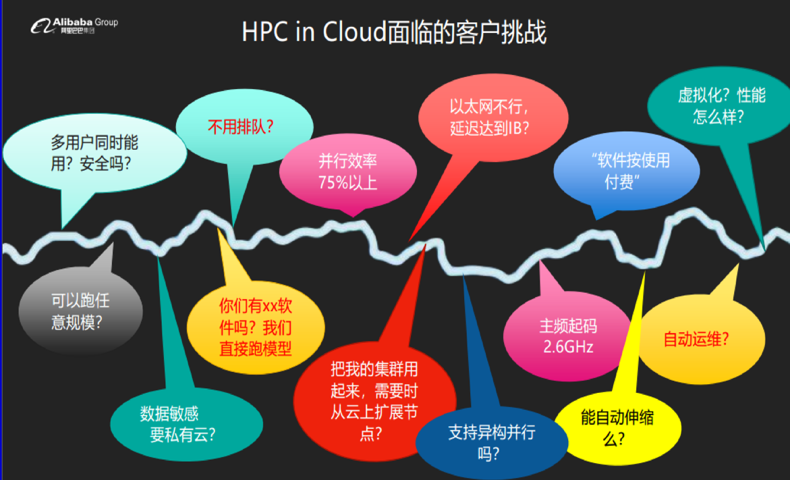
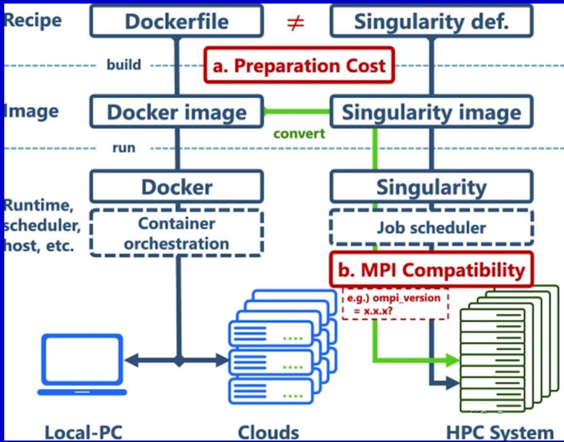
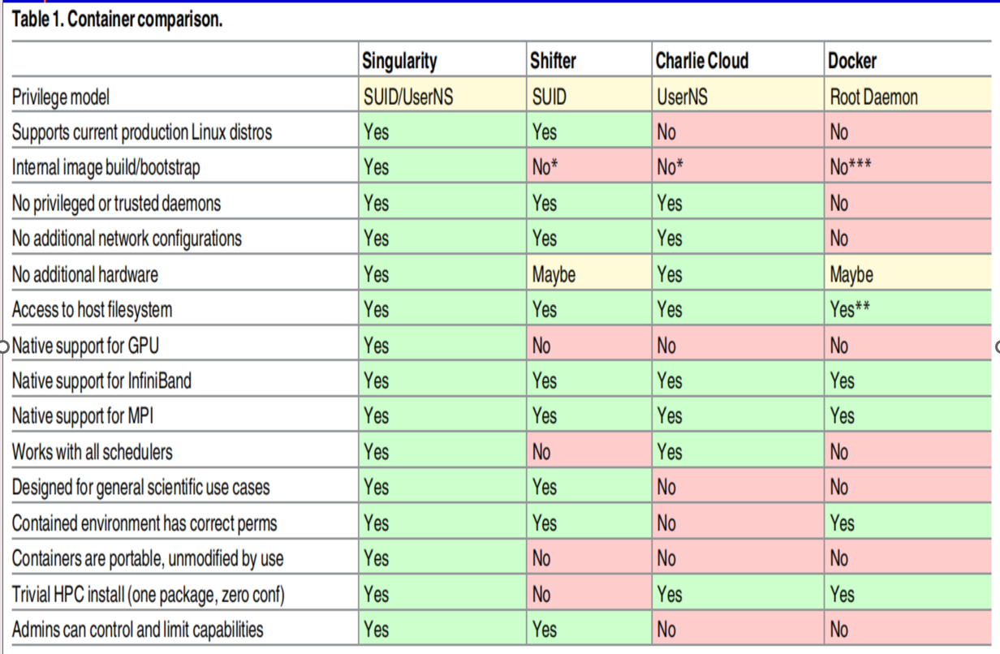
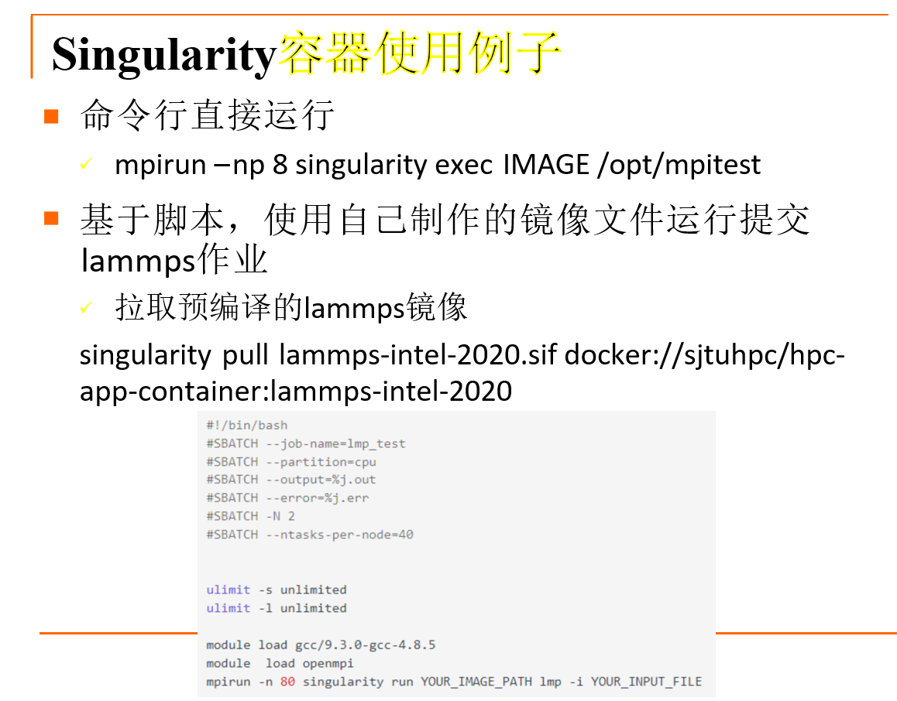
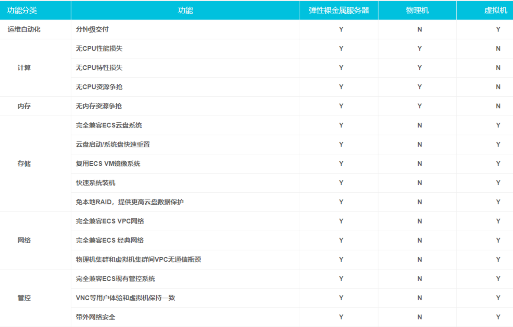

# 5.3-高性能计算**/HPC** 和**AI**云应用

## HPC Cloud（高性能计算云）

### 简介

高性能计算云是一种结合云计算技术的高性能计算服务模式，

- 高性能计算是服务核心
- 云计算是服务模式创新的技术手段
- 多云互联是服务能力的 扩展支撑

### 优点和缺点

**优点：**

1. **可扩展性好**：云计算平台提供了弹性资源，可以根据需要快速扩展或缩减计算资源。这意味着可以轻松地应对工作负载的变化，而无需投入大量资本来购买物理服务器。
2. **灵活性**：云计算允许用户根据需求选择不同类型的虚拟机实例，以满足不同计算要求。这种灵活性使用户能够根据任务的性质进行自定义配置。
3. **减少或消除作业队列的依赖**：在传统的HPC环境中，通常需要排队等待分配计算资源。在云计算中，用户可以独立管理他们的资源，减少了等待时间。
4. **按需付费/降低成本**：云计算采用了按使用量付费的模型，用户只需支付他们实际使用的计算资源，而不必支付固定的硬件成本。这有助于降低总体成本，特别是对于短期或不规则的工作负载。
5. **便捷/无需用户自己运维**：云计算提供了自动化的管理工具，用户无需担心硬件维护、升级或安全性问题，这些任务由云提供商负责。

**局限性：**

1. **性能损耗**：在云计算环境中，虚拟化技术和共享资源可能会导致一定的性能损耗。这意味着对于某些需要极高性能的HPC应用来说，云计算可能不是最佳选择。
2. **不建议运行大规模紧耦合的MPI并行应用**：云计算通常不适合运行大规模且需要紧耦合的MPI并行应用。这是因为在云中，节点之间的通信可能会受到延迟和不稳定性的影响，从而降低了应用程序的性能。

### 高性能计算和云计算、网格计算的区别与联系

#### 区别

**高性能计算 (HPC)**

- 高性能计算通常指的是利用高性能计算机，如集群和MPP系统（Massively Parallel Processing，即大规模并行处理）等，采用**并行计算**方式来提高运算速度。
- HPC用于解决科学、工程和商业领域中的大规模、复杂的计算问题，通常是计算密集型的应用。
- 高性能计算需要超高的计算能力、大量的内存、快速的存储和高网络性能等硬件资源。
- 几乎不用 虚拟化技术

**云计算 (Cloud Computing)**

- 云计算是一种基于互联网的**虚拟化IT资源弹性供给和按需服务**的模型。
- 最初应用于企业IT建设、SaaS服务、社交网络等领域，云计算通过互联网提供计算资源。
- 云计算采用虚拟化技术，使资源能够弹性分配和共享，用户可以根据需要动态获取资源。

| Attribute                                                    | HPC            | Grid                                                         | Cloud                                                    |
| ------------------------------------------------------------ | -------------- | ------------------------------------------------------------ | -------------------------------------------------------- |
| Capacity容量                                                 | fixed          | average to high; growth by aggregating independently managed resources | high; growth by elasticity of commonly managed resources |
| Capability能力                                               | very high      | average to high                                              | low to average                                           |
| Virtual Machine Support虚拟机支持                            | rarely         | sometimes                                                    | always                                                   |
| Resource sharing资源共享                                     | limited        | high                                                         | limited                                                  |
| Resource heterogeneity资源异质性                             | low            | average to high                                              | low to average                                           |
| Built-in Workload Management内置工作负载管理                 | yes            | yes                                                          | no                                                       |
| Distribute Workload Across Multiple Admin Domains在多个管理域中分布工作负载 | not applicable | yes                                                          | no                                                       |
| Interoperability互操作性                                     | not applicable | average                                                      | low                                                      |
| Security安全性                                               | high           | average                                                      | low to average                                           |

#### 联系

两者都使用了分 布式计算、网格计算、集群、高密度计算，其中也有一些特 定的领域利用云计算技术来从事高性能类的应用。例如，工 业仿真云，可以为中小企业提供产品设计模拟服务

#### 现状

两者正在融合发展

### HPC CLOUD的分类

（1）HPC in the cloud（云超算） ，将HPC应用移植到云环境 中，基于通用的云资源，为不同租户提供高性能计算服务

（2）HPC as a Service（超算云） ，将HPC资源通过云计算 的服务模式为用户提供高性能计算服务

（3）HPC+Cloud（多云互联） ，云作为HPC资源的补充，或 者在不同HPC云之间，实现资源、数据、应用、服务等云间协 同与统一的多云管理

### 研究方向

#### 可行性 (Viability) 

#### 性能优化 (Performance Optimization) 

#### 可用性 (Usability) 

### 云超算

#### 典型HPC集群系统

传统的HPC集群系统通常包括登录节点、管理节点、计算节点、IO节点、共享存储、管理网络和专用高速网络等组成部分。这些系统需要支持从少数节点到上万节点的规模，并且包括节点操作系统、通信中间件（如MPI）、集群监控、资源管理和作业调度、并行开发工具链（编译器、数学库、性能分析和调优工具等）以及应用软件。

#### 云超算的概念

云超算的概念是**基于现有的云计算平台基础设施**，构建一个云上的**高性能计算集群**。这意味着将传统的HPC应用迁移到云上运行，从而利用云计算的弹性和自动化特性。

#### 云超算的问题和挑战

1. 虚拟机和容器性能：在云超算中，通常使用虚拟机或容器作为节点，而不是物理服务器。一个关键问题是，虚拟机云服务器是否能够提供与物理机CPU（以及GPU等硬件加速器）具有相当的高性能。这需要在虚拟化环境中实现性能的近似。
2. 网络性能：HPC计算通常需要低延迟和高带宽的网络通信，以保证足够高的并行效率。在云上，网络性能是否能够满足HPC计算的要求是一个重要问题。云服务提供商需要提供优化的网络架构来满足这些需求。
3. 存储性能：并行文件系统通常需要高集聚带宽和响应速度。云上存储是否能够支持这些要求，以满足HPC应用的存储需求也是一个挑战。

## 面向高性能计算的容器（Singularity等）

### Docker容器的不足

**虽然**Docker 的镜像管理机制可以帮助用户将复杂的软件环境打 包，便于管理和维护。容器的轻量级隔离性增强了系统的 安全，而不会降低系统的计算性能。

**但是：**

1. 资源管理与冲突：
   Docker的资源管理功能与HPC集群管理软件的功能有时会重叠。
   而Docker的独立后台管理进程和集群系统的进程管理功能可能会冲突。
   因此，需要将容器的资源消耗和状态控制集成到资源管理系统中，以确保顺畅的协作。
2. 用户权限和安全性：Docker的用户权限提升问题可能会引入不安全的因素，特别是在生产环境中。
3. 镜像体积问题：Docker镜像可能包含多余的文件，导致镜像体积较大，占用系统资源。

### Singularity容器优点、特点

1. Singularity是劳伦斯伯克利国家实验室专门为大规 模、跨节点HPC和DL工作负载而开发的容器化技术

2. 具备轻量级、快速部署、方便迁移等诸多优势

3. 支持从Docker镜像格式转换为Singularity镜像格式

4. 同时支持root用户和非root用户启动，且容器启动 前后，用户上下文保持不变，这使得用户权限在容器内部和 外部都是相同的

5. 强调容器服务的便捷性、可移植性和可扩展性，  而弱化了容器进程的高度隔离性，因此量级更轻，内核namespace更少， 性能损失更小。没有PID namespace 隔离、没有网络虚拟化
   其并不是围绕微服务进程隔离的概念而设 计的。它使用最小数量的namespace来实现其主要 设计目标。

6. 通过封装好的库文件， singularity容器直接与内核 进行交互，同时用户共享使用主机的相关资源，

   直接继承主机相关信息，使得singularity与现有系 统无缝衔接。

但是知名度不如Docker，社区小

### Docker与Singularity、Shifter、Charlie Cloud的比较

Docker与Singularity的比较

| 特性                                                | Docker                                                       | Singularity                                                  |
| --------------------------------------------------- | ------------------------------------------------------------ | ------------------------------------------------------------ |
| 成熟度                                              | Docker比Singularity更成熟，人们对Docker的了解也更多，创建Docker镜像。 | Singularity只有1-2年的历史，可以将Docker镜像转换为Singularity镜像以供使用。 |
| 性能                                                |                                                              | Singularity的性能高于Docker。                                |
| 安全性（即使潜在的安全问题，DGX-1还是在使用docker） |                                                              | Singularity阻止了容器内的权限提升，所以如果你想在容器内成为root，你首先必须在容器外面是root。Docker实例必须由root用户启动，这有安全问题。 |
| 运行工作的容器                                      | Docker和Singularity都支持                                    |                                                              |
| 用于虚拟机的容器（我们目前不需要）                  | Docker实例可以有独立的ip。                                   | Singularity实例共享相同的端口，与宿主操作系统使用相同的网络，因此不能有独立的ip。 |

### 使用例子

## 裸金属（包含与虚拟机、物理机的比较）

1. 第一类裸金属服务器：这类服务器类似于传统的物理服务器租赁，与通用的云主机相比，它们没有虚拟化层、没有虚拟机（VM），也没有多租户共享。这种服务器租赁模式由一些大型提供商如IBM、Oracle、腾讯的"黑石"等提供。
2. 第二类裸金属服务器：这类服务器介于传统虚拟机和物理机之间，代表性的服务包括阿里云的"神龙"服务器和AWS的裸金属服务器。它们通常提供了更多的灵活性和性能控制，允许用户在物理服务器上运行自己的操作系统和虚拟化环境，同时也能够受益于云计算提供的管理和部署优势。

## HPC Cloud应用产品/解决方案

我只能说，看PPT吧！